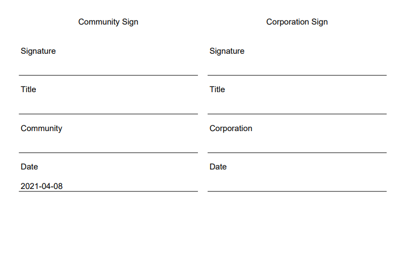
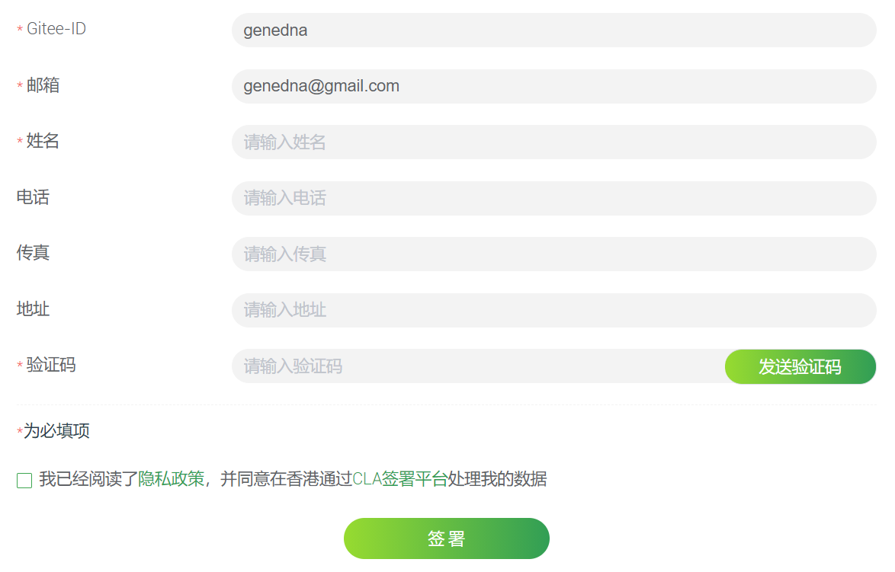
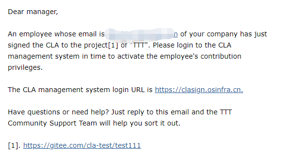
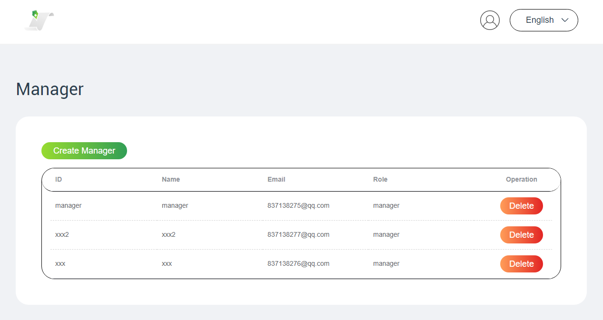
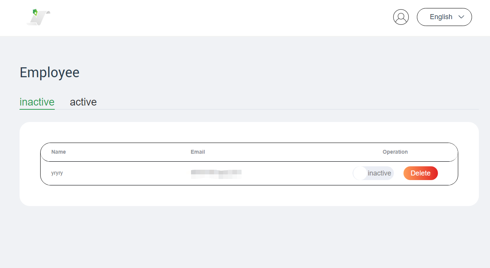
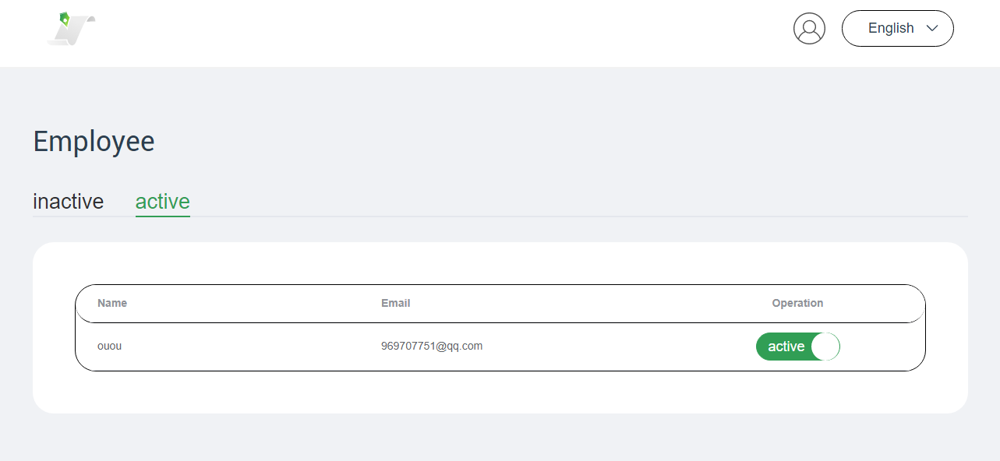

### 企业签署 CLA ，正式加入 openEuler 社区

#### 1. 企业加入 openEuler 社区为什么要签署 CLA ？

CLA 是 Contributor License Agreement 的缩写，一般翻译为贡献者许可协议。开发者向开源项目贡献的时候通常被要求需要签署 CLA 协议，声明对贡献内容拥有所有权（或开发者得到了正确的授权进行贡献），贡献内容在项目的 License 下进行再次分发，同时保留 Copyright ；如果贡献的内容包括了专利，开放这些专利给项目使用。

#### 2. 企业签署 openEuler 社区 CLA 的流程

2.1 openEuler 社区 CLA 签署地址 https://clasign.osinfra.cn/sign/Z2l0ZWUlMkZvcGVuZXVsZXI= 
在页面点击 "签署企业 CLA"（英文页面为 "Sign Corporation CLA" ） 按钮进入签署页面 按钮进入。

 
选择签署不同的CLA-企业签署

2.2 企业签署人在签署页面点击 签署企业 CLA 按钮进入到签署页面填写签署表单，在填写完公司邮箱后，点击获取验证码后，公司邮箱会受到一封包含验证码的邮件，填写在表单后提交完成签署的第一步。

 
企业签署CLA的表单

2.3 公司邮箱会收到一封带有 PDF 附件的邮件，PDF 的内容包含了之前 2.2 步骤签署的 CLA 内容，请打印 PDF 文件并加盖公司公章。

 
企业收到CLA文件签名部分的范本

2.4 将加盖公章以及签好名字和日期的 CLA 协议文件扫描为 PDF 文件，作为附件回复 2.2 步骤收到的邮件完成企业签署 CLA 。

2.4 openEuler 系统的管理员收到邮件后，会对 PDF 进行核对检查。检查通过后会为企业开通企业员工 CLA 贡献管理系统的超级管理员帐号。签署企业 CLA 使用的邮箱会收到一封确认签署成功的邮件，其中包含了超级管理员帐号的用户名及初始密码。使用企业员工 CLA 管理系统的部分请参考章节 2.4 。

 
 签署成功通知邮件

#### 3. 企业员工贡献前需要签署员工 CLA 

3.1 企业员工在该企业完成签署 CLA 后，在正式贡献前，需要签署员工 CLA ，签署地址 https://clasign.osinfra.cn/sign/Z2l0ZWUlMkZvcGVuZXVsZXI= 

在页面点击 "签署员工 CLA" （英文页面为 "Sign Employee CLA"）

 
 选择签署不同的CLA-企业员工签署

3.2 企业员工在签署时应使用企业邮箱签署，在填写完公司邮箱后，点击获取验证码后，公司邮箱会受到一封包含验证码的邮件，填写在表单后提交完成签署。

 
  企业员工签署CLA表单

3.3 签署后会自动通知该企业的 CLA 贡献系统管理员，由系统管理员确定是否容许该员工是否可以进行贡献。系统管理员部分的工作参考 4.3 章节。

 
 企业CLA的管理员收到通知邮件的范本

#### 4. 企业员工 CLA 贡献管理系统使用说明

4.1 企业员工 CLA 管理系统的登录页面地址为 https://clasign.osinfra.cn/index 在此页面点击 "企业管理员" 按钮（英文页面为 "Corporation Manager" ）。

 
企业员工CLA贡献管理系统登录

 

页面会跳转到包含登录用户名和密码输入表单的登录页面，输入后点登录按钮进入到管理员页面

企业员工CLA贡献管理系统登录

4.2 超级管理员进入到系统后，需要创建系统管理员来进行管理。超级管理员在 CLA 系统的主要工作是创建和删除系统管理员，当系统管理员被创建后，他的邮箱将受到一封通知邮件。超级管理员和系统管理员两者之间的区别请参考 ***5.1 openEuler 企业员工 CLA 管理系统的超级管理员和系统管理员的区别***

超级管理员工作界面-创建或者删除系统管理员

4.3 系统管理员登录后会看到当前已经签署 CLA 且未激活的员工列表，根据实际情况选择激活员工向 openEuler 社区贡献的权限或者删除员工的贡献请求。

 企业员工未激活列表页面

在已经激活的员工列表界面，可以通过点击按钮将员工设为未激活的状态。

 企业员工激活列表页面

#### 5. openEuler 社区 CLA 系统相关问题

5.1 openEuler 企业员工 CLA 管理系统的超级管理员和系统管理员的区别

在 openEuler 开源社区的企业员工 CLA 管理系统中存在两种管理员，分别是超级管理员和系统管理员。当企业 CLA 创建完成后，签署 CLA 使用的企业邮箱会收到超级系统管理员的帐号和初始密码，请尽快登录到系统修改初始化密码。

通常签署 CLA 的是公司的管理人员或者法务人员，通常并不进行开发者贡献管理工作。可以通过创建系统管理员来进行实际的管理工作。系统可以创建多名系统管理员，每名系统管理员都有相同的权限管理企业员工的贡献。

5.2 openEuler 社区对于 Issue 和 CVE 解决是否承诺 SLA ？

在 openEuler 开源社区，所有的 Issue 和 CVE 解决都是由社区贡献者完成，是开源社区的贡献者共同解决，不存在商业行为，所以也不承诺 SLA 。

5.3 openEuler 企业 CLA 签署邮箱的使用

对于 126.com、qq.com、gmail.com 之类的通用个人邮箱是无法用于企业 CLA 的签署，但是对于个人开发者签署个人 CLA 是不受影响

5.4 是否需要法人签署企业 CLA ？

签署企业 CLA 的人是公司的授权代表，不必须是法人代表进行签字。

5.5 关于 CLA 的介绍

https://openeuler.feishu.cn/docs/doccnB3yBLtkrCmN5N6WRLFttWg