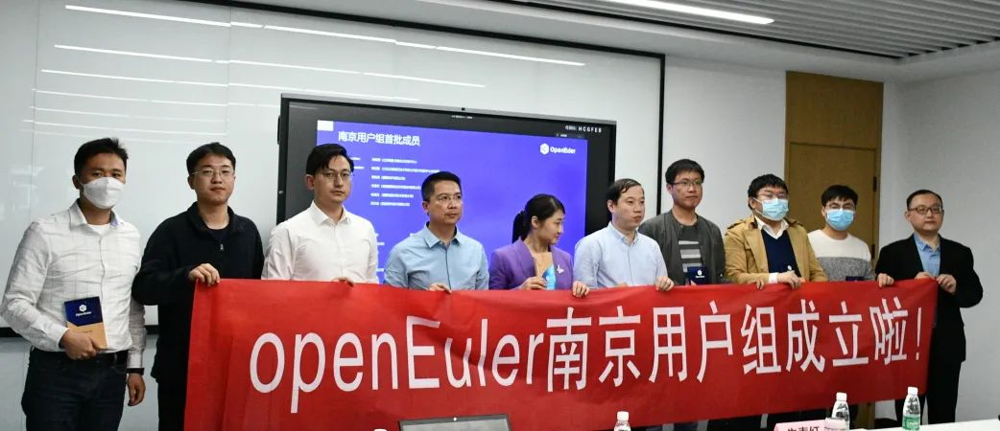
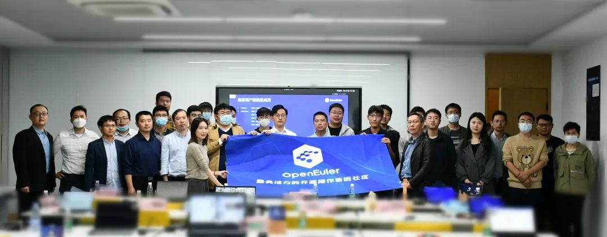
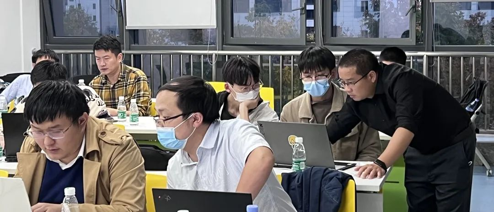
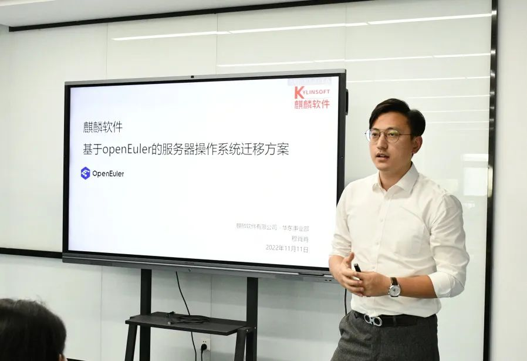
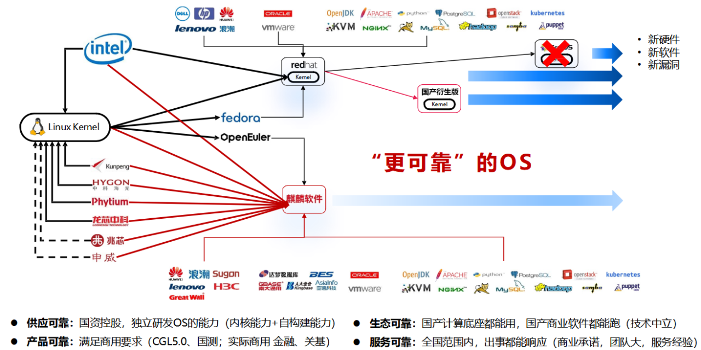

### 活动回顾

022年11月11日，以操作系统迁移为主题的openEuler Meetup 在南京举办，为南京地域的用户赋能如何将OS系统顺滑地迁移到openEuler。社区工程师现场演示，带领用户实操演练，手把手体验迁移全过程。

在本次活动上，openEuler社区南京用户组成立，正式在江苏地域构建一个用户交流圈和本地欧拉生态拓展平台。

想加入南京用户组的朋友可以扫文末二维码申请。

### 做好openEuler兼容性适配，助力原地升级

<video width="100%" controls>
    <source type="video/mp4"  
    src="https://openeuler-website-beijing.obs.cn-north-4.myhuaweicloud.com/Blog_video/openEuler%E5%85%BC%E5%AE%B9%E6%80%A7%E9%80%82%E9%85%8D.mp4">
</video>

要做好操作系统迁移，首先要做好对软、硬件的兼容性适配。对此，openEuler兼容性 SIG Maintainer 从OS兼容性存在问题以及挑战进行分析，并带来了“做好openEuler兼容性适配，助力原地升级”的议题分享，现场为用户讲解常遇到的一些兼容性问题以及兼容性适配方案。

### openEuler迁移服务方案

<video width="100%" controls>
    <source type="video/mp4"  
    src="https://openeuler-website-beijing.obs.cn-north-4.myhuaweicloud.com/Blog_video/%E5%9F%BA%E4%BA%8EopenEuler%E7%9A%84%E6%9C%8D%E5%8A%A1%E5%99%A8%E6%93%8D%E4%BD%9C%E7%B3%BB%E7%BB%9F%E8%BF%81%E7%A7%BB%E6%96%B9%E6%A1%88.mp4">
</video>

对于系统迁移，openEuler提供了完备的迁移方案，openEuler基础软件生态服务小组全爱国为大家详细讲解了openEuler迁移方案，希望大家有帮助。

### CentOS停服应对方案——统信软件

<video width="100%" controls>
    <source type="video/mp4"  
    src="https://openeuler-website-beijing.obs.cn-north-4.myhuaweicloud.com/Blog_video/%E9%BA%92%E9%BA%9F.mp4">
</video>

统信软件积极投入openEuler社区，推动社区蓬勃发展，基于openEuler开发的统信操作系统满足强安全、高可用、高性能、易维护、高可靠及自动化迁移等要求，对党政、金融、电信、能源、交通、电力、制造和教育等涉及国计民生的行业提供强有力的服务支撑。CentOS宣布停服后，企业应该怎么去应对？本次活动，统信软件工程师史书恒老师详细分享了统信CentOS停服后的应对方案。

### 麒麟信安-CentOS原地透明迁移方案技术实践

<video width="100%" controls>
    <source type="video/mp4"  
    src="https://openeuler-website-beijing.obs.cn-north-4.myhuaweicloud.com/Blog_video/%E9%BA%92%E9%BA%9F%E4%BF%A1%E5%AE%89.mp4">
</video>

麒麟信安华东副总经理兼解决方案总监彭治宇老师现场带来了《CentOS原地透明迁移方案技术实践》主题演讲，介绍了可为用户CentOS迁移提供从评估规划、迁移实施到验证上线的成熟搬迁方案，深度解析了原地透明迁移方案的多重优势，并分享了实践案例。

### 麒麟软件-基于openEuler服务器操作系统的迁移方案

CentOS停服等事件导致用户业务系统面临安全问题和维护服务缺位，许多行业开启了操作系统迁移浪潮。麒麟软件分享了“基于openEuler服务器操作系统的迁移方案”内容，通过解析Linux市场，从供应可靠、生态可靠、产品可靠、服务可靠四个方面全面解析CentOS替换本质是寻求更可靠的国产操作系统。

openEuler Meetup，为社区开发者、用户、伙伴创造面对面学习交流的机会，共同繁荣社区生态，我们下期见！

### 相关链接：

欢迎添加小助手微信，备注“迁移”进入openEuler迁移交流群

openEuler迁移专区：

https://www.openeuler.org/zh/migration/guidance/1-summary/

openEuler兼容性列表：

https://www.openeuler.org/zh/compatibility/

