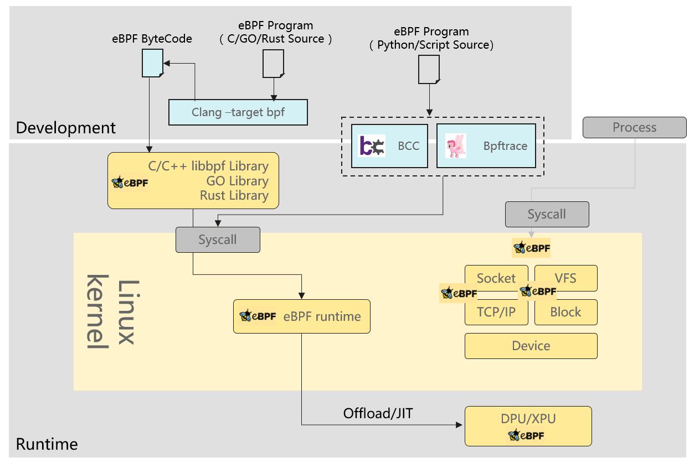
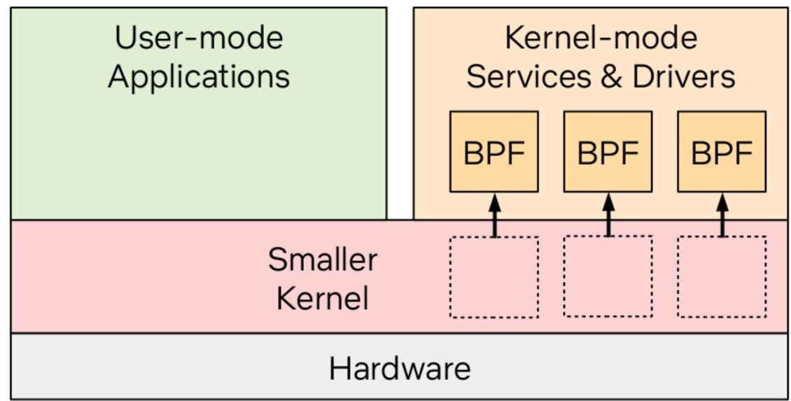
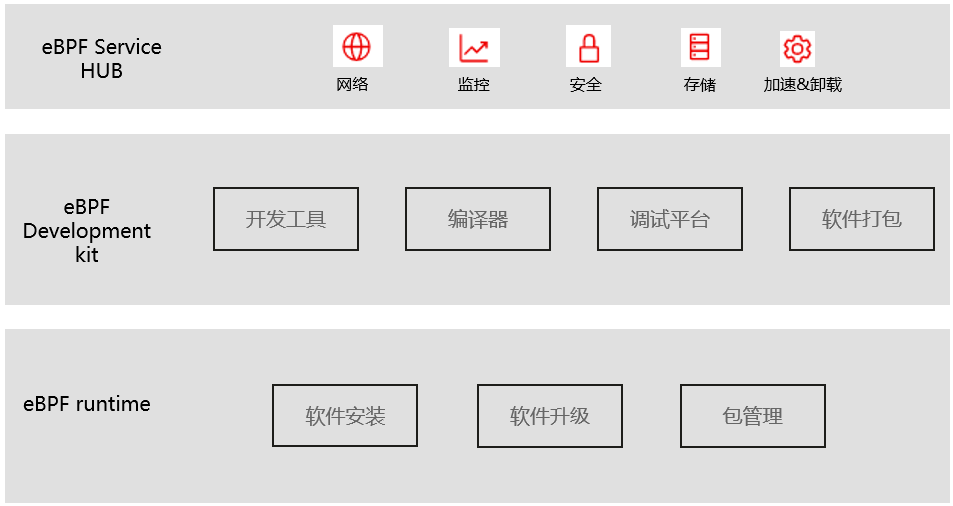

eBPF 是一个能够在内核运行沙箱程序的技术，提供了一种在内核事件和用户程序事件发生时安全注入代码的机制，使得非内核开发人员也可以对内核进行控制。随着内核的发展，eBPF 逐步从最初的数据包过滤扩展到了网络、内核、安全、跟踪等，而且它的功能特性还在快速发展中，早期的 BPF 被称为经典 BPF，简称 cBPF，正是这种功能扩展，使得现在的 BPF 被称为扩展 BPF，简称 eBPF。

如今 eBPF 被广泛应用在云原生、可观测、性能调优、安全、硬件加速等领域，并且其应用场景还在快速扩展，各种场景基于 eBPF 技术的创新 idea 呈现井喷现象，eBPF 的时代已经来临。

#### eBPF 技术现状

虽然 eBPF 技术应用呈现井喷现象，但是开发、发布、安装等相关的基础技术出现碎片化现象，导致技术成果无法快速平移至行业客户生产环境；相似 eBPF 技术应用在重复实践。这些问题阻碍 eBPF 技术的普及与推广。

如下图所示，总结目前 eBPF 的开发、发布方式基本可以划分成 2 种技术路线：

开发态、运行态分离（典型代表 libbpf）

优点：ELF 文件形式（或者链接进应用程序）发布，运行时轻量化，适合生产环境大规模应用。

缺点：应用技术门槛高，且不具备可移植性（比如高内核版本的 eBPF 程序无法移植至低内核版本中）。

开发态、运行态融合（典型代表 BCC）

优点：源码形式发布天然具备可移植性；封装抽象运行时，提供高级语言 API，降低开发难度。

缺点：运行时重型化，对生产环境要求较高（需要安装开发态一系列工具）；高度抽象后，降低使用灵活度，不适合大型应用开发。

这两种技术路线都存在弊端，随着 eBPF 技术的发展，出现 BumbleBee 、eunomia-bpf 等项目致力于综合这两类技术路线的优点，但依旧缺乏对 eBPF 基础技术的整体规划。

#### eBPF 发展展望

eBPF summit 2022 《The future of eBPF in the Linux Kernel》展望了 eBPF 的发展方向，具体的演进方向包括几个方面：

更完备的编程能力：当前 eBPF 的编程能力存在一些局限性（比如不支持变量边界的循环，指令数量受限等），演进目标提供图灵完备的编程能力。

更强的安全性：支持类型安全，增强运行时 Verifier，演进目标是提供媲美 Rust 的安全编程能力。

更广泛的移植能力：增强 CO-RE，加强 Helper 接口可移植能力，实现跨体系、平台的移植能力。

更强的可编程能力：支持访问/修改内核任意参数、返回值，实现更强的内核编程能力。

概括其演进目标是希望将 eBPF 打造成一款针对内核（包括硬件）运行时的安全编程语言，通过该语言构建 eBPF 软件，用来承载内核（或硬件）的能力。演进结果产生一个有趣现象：按照传统软件类型划分方式，我们很难将 eBPF 软件归类成应用软件或是系统软件。所以，干脆将其定义成一种独立软件形态：内核态服务（eBPF as Service）。

#### 建立 eBPF 行业标准的思路

eBPF 软件有别于系统软件、应用软件，从软件自身特点而言，其应具备符合其自身特点的开发、编译、打包、发布、安装、升级等工具系列。

当前 eBPF 的开发框架、发布形式发展迅速，但也存在一些问题，包括跨版本移植能力、多场景支持能力、开发易用性、服务可获得性等问题。openEuler 可编程内核 SIG 希望标准化 eBPF 软件相关基础技术（包括打包、发布、安装、升级等），方便 eBPF 技术在各行业、场景的推广。为此，由多家企业/高校在 openEuler 社区倡议建立行业标准，通过标准化发布将内核定制能力、硬件卸载能力向社区用户提供性能加速、安全加固、智能观测等服务。

预计我们将在 12 月份组织一次线上 meetup，当前参与企业/组织包括天翼云、深信服、华为、西邮、中山大学、中科驭数、信通院、锐捷等，希望国内对 eBPF 技术有诉求、规划的厂商加入本次 meetup，建立 eBPF 技术相关标准，为 eBPF 技术应用、科研提供较好的基础平台。

具体讨论范围划分成三个方向：

eBPF runtime：负责提供具备可移植性的软件安装能力，软件热升级能力，包管理等能力。

eBPF Development Kit：负责提供一站式开发、调试、编译工具，提供具备跨体系、平台移植能力的软件包发布能力。

eBPF Service HUB：负责提供 eBPF Service 集市化管理，提供 eBPF Service 推送、分发等能力。

####  openEuler 可编程内核 SIG 目标

openEuler 可编程内核 SIG 目标之一就是推动 eBPF as Service 标准化工作，将内核能力、硬件加速能力服务化、集市化，惠及更多的社区用户。

与此同时，openEuler 社区会将行业标准内的一些基础软件、技术标准推送至 Linux 上游社区，加强 eBPF 技术生态建设，提升国内 eBPF 技术在上游社区影响力。

希望加入讨论的小伙伴可以通过以下方式申报议题：[https://etherpad.openeuler.org/p/sig-ebpf-meetings](https://etherpad.openeuler.org/p/sig-ebpf-meetings)

参考资料：

[1] https://www.brendangregg.com/blog/2019-12-02/bpf-a-new-type-of-software.html