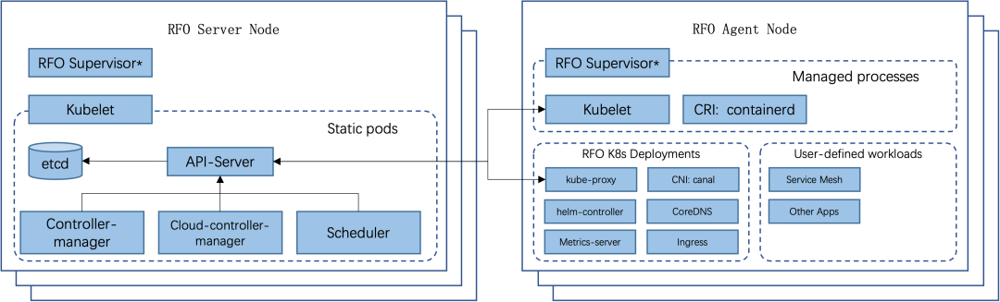
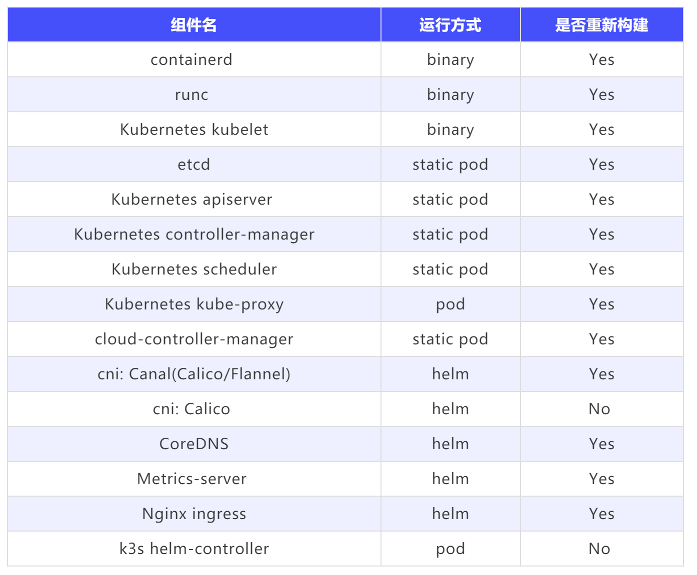

### Rancher RFO GA

RFO 是 Rancher For openEuler 的缩写，旨在面向 openEuler 打造 Rancher 基础平台。其中最核心的工作是打造一款面向 openEuler 生态的 Kubernetes 发行版。它基于上游 RKE2 的技术栈，构建物采用 openEuler base image，致力于满足国内更加注重的安全合规标准，对 openEuler LTS 版本拥有优秀的兼容性。

SUSE 在欧拉开源社区中成立了 RFO SIG（[https://www.openeuler.org/zh/sig/sig-detail/?name=sig-rfo](https://www.openeuler.org/zh/sig/sig-detail/?name=sig-rfo)），以社区协作方式运作产品迭代，并将 RFO 发行版的工作成果进行开源（ [https://gitee.com/rfolabs/rfo](https://gitee.com/rfolabs/rfo) ）。

RFO 发行版的主要愿景如下：

* 完整可溯源的工程化。确保核心组件的构建记录和端到端测试结果均可溯源。

* 产品化开箱即用。确保 RFO 的安装部署可以快速上手，并支持从 Rancher Prime 配置部署。

* 充分依托 openEuler 生态。确保核心组件的构建使用 openEuler 生态体系，依托 openEuler container image 进行最终打包。

* 软件供应链安全与合规。确保核心组件的分发产物不可篡改，并致力于提供等保加固的 Kubernetes 集群环境。

* 多样性算力支持。提供面向 AMD64 和 ARM64 以及 RISC-V 等多样性算力的 Kubernetes 基础设施。

RFO SIG 于 2022 年 9 月初在欧拉开源社区成立，历经 3 个月的工程迭代，我们正式推出 RFO 发行版的 GA 版本，欢迎试用并在 Rancher 社区和欧拉开源社区进行反馈。目前有以下已测试的版本可供使用：v1.23.14+rfor1/v1.24.8+rfor1/v1.25.4+rfor1 ，后续我们也会长期跟踪 Kubernetes 的上游版本演进。

### 快速上手

基于 RFO v1.24.8+rfor1 版本以及 openEuler 22.03-LTS 进行快速上手演示。

#### 安装准备

安装准备步骤需要在所有主机上运行：


1. 查看 OS 版本：

````
cat /etc/os-release
````
输出：
````
NAME="openEuler"
VERSION="22.03 LTS"
ID="openEuler"
VERSION_ID="22.03"
PRETTY_NAME="openEuler 22.03 LTS"
ANSI_COLOR="0;31"
````

2. 配置 NetworkManager 进行忽略 Canal CNI 的 veth 接口

````

touch /etc/NetworkManager/conf.d/rfo-canal.conf
cat >> /etc/NetworkManager/conf.d/rfo-canal.conf << EOF
[keyfile]
unmanaged-devices=interface-name:cali*;interface-name:flannel*
EOF
systemctl disable nm-cloud-setup.service nm-cloud-setup.timer
systemctl reload NetworkManager
````

3. 停止 openEuler 防火墙服务，RFO 中默认的 Canal CNI 与 Firewalld 网络栈有冲突，需要禁用 Firewalld

````
systemctl stop firewalld
systemctl disable firewalld
````

#### 安装Server

1. 使用 install 脚本安装 RFO：

````
curl -sfL https://gitee.com/rfolabs/rfo/raw/rfo-master/install-rfo.sh | INSTALL_RFO_VERSION="v1.24.8+rfor1" sh -
````

该脚本只能通过 root 用户或 sudo 运行

安装结果如下：

````
[INFO]  using v1.24.8+rfor1 as release
[INFO]  downloading checksums at https://rfolabs.oss-cn-shenzhen.aliyuncs.com/rfo/releases/v1.24.8%2Brfor1/sha256sum-amd64.txt
[INFO]  downloading tarball at https://rfolabs.oss-cn-shenzhen.aliyuncs.com/rfo/releases/v1.24.8%2Brfor1/rfo.linux-amd64.tar.gz
[INFO]  verifying tarball
[INFO]  unpacking tarball file to /usr/local
````

2. 启用 rfo-server 服务

````
systemctl enable rfo-server
````

3. 启动 rfo-server 服务

````
systemctl start rfo-server.service
````

4. （可选）查看 rfo-server 服务日志

````
journalctl -u rfo-server -f
````

运行此安装程序后：


* rfo-server 服务将被安装。rfo-server 服务将被配置为在节点重启后或进程崩溃或被杀时自动重启。

* 其他的实用程序将被安装在/var/lib/rancher/rfo/bin/。它们包括 kubectl, crictl, 和 ctr. 注意，这些默认不在你的路径上。

* 还有两个清理脚本会安装到 /usr/local/bin/rfo 的路径上。它们是 rfo-killall.sh和rfo-uninstall.sh。

* 一个 kubeconfig 文件将被写入/etc/rancher/rfo/rfo.yaml。

* 一个可用于注册其他 server 或 agent 节点的令牌将在 /var/lib/rancher/rfo/server/node-token 文件中创建。

注意：如果你要添加额外的 server 节点，则总数必须为奇数。需要奇数来维持选举数。

#### 安装 Agent

1. 运行安装程序

````
curl -sfL https://gitee.com/rfolabs/rfo/raw/rfo-master/install-rfo.sh | INSTALL_RFO_VERSION="v1.24.8+rfor1" INSTALL_RFO_TYPE="agent" sh -
````

2. 启用 rfo-agent 服务

````
systemctl enable rfo-agent.service
````

3. 配置 rfo-agent 服务

````
mkdir -p /etc/rancher/rfo/
vim /etc/rancher/rfo/config.yaml
````
config.yaml 的内容。

````
server: https://<server>:9345
token: <token from server node>
````

其中 token 可以在 server 节点中运行 cat /var/lib/rancher/rfo/server/node-token 命令获取。

rfo server 进程通过端口 9345 监听新节点的注册。正常情况下，Kubernetes API 仍可在端口 6443 上使用。


4. 启动服务

````
systemctl start rfo-agent.service
````

5. （可选）查看 rfo-agent 服务日志

````
journalctl -u rfo-agent -f
````

#### 访问集群

在安装完成 rfo-server 节点后，即可以在 server 节点中使用内置的 kubectl 以及 kubeconfig 配置访问集群：

````
export KUBECONFIG=/etc/rancher/rfo/rfo.yml
export PATH=/var/lib/rancher/rfo/bin:$PATH
kubectl get pods --all-namespaces
helm ls --all-namespaces
````

或在指令中指定 kubeconfig 文件位置：

````
kubectl --kubeconfig /etc/rancher/rfo/rfo.yml get pods --all-namespaces
helm --kubeconfig /etc/rancher/rfo/rfo.yml ls --all-namespaces
````

若希望在集群外部访问集群，则可以复制 /etc/rancher/rfo/rfo.yml 配置文件到你位于集群外部的机器上，作为 ~/.kube/config。然后将文件中 127.0.0.1 替换为你的 RFO 服务器的 IP 或主机名。kubectl 现在可以管理你的 RFO 集群了。

### 功能特点

#### 精简部署

RFO 基于 RKE2 进行重新打包制作而成，具有 RKE2 所有的功能特点，吸取了开发和维护轻量级 Kubernetes 发行版 K3s 的经验教训，并将其应用于构建一个具有 K3s 易用性的企业级发行版。这意味着，RFO 在最简单的情况下是一个单一的二进制文件，需要在所有参与 Kubernetes 集群的节点上安装和配置。一旦启动，RFO 就能够引导和监督每个节点上的角色合适的 agent，同时从网络上获取所需的内容。以下为 RFO 架构示意图：



RFO系统架构


以下组件为 RFO 在项目中使用的 Kubernetes 组件，其中大部分经过重新打包并使用 openEuler base image 进行分发



在使用 install.sh 脚本进行安装时，rfo 将会以 linux system service 的方式安装到系统中，使用 systemd 作为 RFO Supervisor。其余方式（包括下载 rfo binary 直接启动）并不推荐，某些场景下会没有 RFO Supervisor 角色监控 RFO 运行状态，导致 kubelet 等程序常驻后台运行。


一般情况下，RFO 以安装包的方式进行分发，安装包中只包含 rfo 二进制本体、systemd service 配置文件以及卸载脚本。其余组件将在 RFO 启动后，根据启动节点的角色进行拉取并安装启动。

#### 备份恢复

在 RFO 运行的时候，你可以使用 etcd-snapshot 子命令来进行 etcd 快照管理。功能包括：

* 使用本地目录或 s3 作为快照存储后端

* 对当前 etcd 数据建立快照

* 对集群进行重置并从快照中恢复数据到当前或新节点中

* 定时备份

#### Helm 集成


RFO 内置 Helm Controller（https://github.com/k3s-io/helm-controller），它使用 HelmChart 自定义资源定义（CRD）来管理 Helm chart。


HelmChart 资源定义（https://github.com/k3s-io/helm-controller#helm-controller）捕获了你通常传递给helm命令行工具的大部分选项。下面是一个例子，说明你如何从默认的 chart 资源库部署 Grafana，覆盖一些默认的 chart 值。注意，HelmChart 资源本身在kube-system命名空间中，但 chart 的资源将被部署到monitoring命名空间。


````

apiVersion: helm.cattle.io/v1
kind: HelmChart
metadata:
  name: grafana
  namespace: kube-system
spec:
  chart: stable/grafana
  targetNamespace: monitoring
  set:
    adminPassword: "NotVerySafePassword"
  valuesContent: |-
    image:
      tag: master
    env:
      GF_EXPLORE_ENABLED: true
    adminUser: admin
    sidecar:
      datasources:
        enabled: true
````
另外 RFO 支持通过 HelmChartConfig 资源来自定义部署，允许覆盖作为 HelmCharts 部署的打包组件（如 Canal、CoreDNS、Nginx-Ingress 等）的值。HelmChartConfig资源必须与其对应的 HelmChart 的名称和命名空间相匹配，并支持提供额外的valuesContent，作为一个额外的值文件传递给helm命令。

注意：HelmChart spec.set 值覆盖 HelmChart 和 HelmChartConfig spec.valuesContent设置。


例如对上文例子中的 Grafana helm chart 进行自定义 Grafana image 的 tag，可以创建一个 Kubernetes 资源文件，并用以下内容填充它，并使用 kubectl apply -f <manifest filename> 进行应用：

````
apiVersion: helm.cattle.io/v1
kind: HelmChartConfig
metadata:
  name: grafana
  namespace: kube-system
spec:
  valuesContent: |-
    image:
      tag: 9.3.2
````

#### 证书轮换

RFO 中的证书默认在 12 个月后到期。如果证书已经过期或剩余时间少于 90 天，可以使用 certificate 子命令对证书进行轮换，当 RFO 重新启动时，证书将被轮换。

````
systemctl stop rfo-server
rfo certificate rotate
systemctl start rfo-server
````

你也可以通过传递 --service 标志来轮换单个服务，例如：rfo certificate rotate --service api-server。

#### Secret 加密

RFO 支持通过子命令 secrets-encrypt 开启对 Secret 进行静态加密，开启后会自动进行以下操作：

* 生成一个 AES-CBC 密钥

* 用生成的密钥生成一个加密配置文件：

````
{
  "kind": "EncryptionConfiguration",
  "apiVersion": "apiserver.config.Kubernetes.io/v1",
  "resources":
    [
      {
        "resources": ["secrets"],
        "providers":
          [
            {
              "aescbc":
                {
                  "keys":
                    [{ "name": "aescbckey", "secret": "xxxxxxxxxxxxxxxxxxx" }],
                },
            },
            { "identity": {} },
          ],
      },
    ],
}
````

* 将该配置作为 encryption-provider-config 传递给 Kubernetes APIServer


一旦启用，任何创建的 secret 都将用这个密钥进行加密。请注意，如果你禁用加密，那么任何加密的 secret 将无法读取，直到你使用相同的密钥再次启用加密。


#### 安全可信

RFO 设计上与 Openeuler 紧密结合，在安全合规性上与 Openeuler 系统一致；并在持续集成流水线中，基于 Openeuler 容器镜像运行 sonobuoy 测试，保证 RFO 发行版兼容 CNCF 认证的 Kubernetes 发行版功能要求。

### 维护原则与发布周期 


RFO 的维护与发布周期与 RKE2 以及 Kubernetes 版本生命周期一致，并遵循以下原则：

* RKE2 小版本将会根据改动内容，在 RKE2 release 后一周内进行跟进；如出现的改动与 RFO 无关，则跳过小版本发布

* RKE2 大版本目前会跟进 Kubernetes 大版本进行维护，在 RKE2 release 后两周内进行跟进


针对 openEuler OS 的更新，遵循以下原则：

* 只针对 openEuler LTS(long term support)版本发布对应的 RFO 版本，目前经验为 2 年一个新 LTS 版本，在新版本发布后 RFO 会在最近一个 RFO Release 进行跟进

* 当 openEuler 出现致命或高等级系统漏洞的情况下，发布 RFO 小版本进行跟进


RFO 除 RKE2 原生的功能外，目前以测试整合 openEuler 操作系统为目标进行维护，并计划后续添加以下支持：

* ARM64 平台支持

* 内置 iSula 运行时支持

#### 后续规划 


后续规划主要围绕构建物安全可信认证以及扩充构建物分发途径开展。


构建物安全可信认证主要包括以下方面，确保核心组件的分发产物不可篡改，并致力于提供等保加固的 Kubernetes 集群环境：

针对分发的容器镜像，进行镜像签名

针对分发的 RFO charts，进行 helm charts 签名


扩充构建物分发途径主要包括以下方面：

支持离线镜像制作以及离线部署

构建 RFO 以及 kube-explorer（https://github.com/cnrancher/kube-explorer） RPM 包并通过 openEuler 的软件源进行分发

#### About Rancher


Rancher 是一个开源的企业级 Kubernetes 管理平台，实现了 Kubernetes 集群在混合云+本地数据中心的集中部署与管理。Rancher 一向因操作体验的直观、极简备受用户青睐，被 Forrester 评为“ 2020 年多云容器开发平台领导厂商”以及“ 2018 年全球容器管理平台领导厂商”，被 Gartner 评为“2017年全球最酷的云基础设施供应商”。


目前 Rancher 在全球拥有超过三亿的核心镜像下载量，并拥有包括中国联通、中国平安、中国人寿、上汽集团、三星、施耐德电气、西门子、育碧游戏、LINE、WWK 保险集团、澳电讯公司、德国铁路、厦门航空、新东方等全球著名企业在内的共 40000 家企业客户。


2020 年 12 月，SUSE 完成了对 RancherLabs 的收购，Rancher 成为了 SUSE "创新无处不在 (Innovate Everywhere) "企业愿景的关键组成部分。SUSE 和 Rancher 共同为客户提供了无与伦比的自由和所向披靡的创新能力，通过混合云IT基础架构、云原生转型和IT运维解决方案，简化、现代化并加速企业数字化转型，推动创新无处不在。


当前，SUSE 及 Rancher 在中国大陆的业务由数硕软件（北京）有限公司承载。SUSE 在国内拥有优秀的研发团队、技术支持团队和销售团队，将结合Rancher 领先的云原生技术，为中国的企业客户提供更加及时和可信赖的技术支撑及服务保障。
