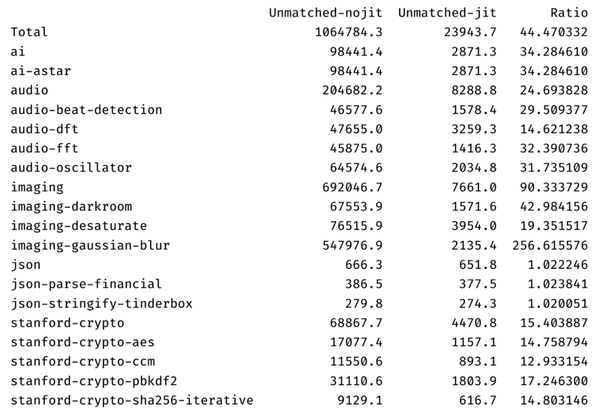
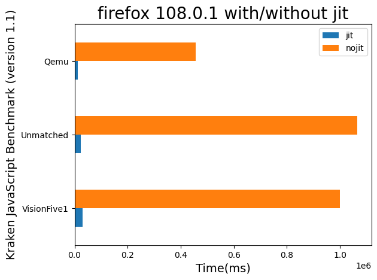

RISC-V SIG 择日即将发布 openEuler RISC-V 22.03 V2版本镜像。本次发版会提供带有 SpiderMonkey JIT 编译支持的 Firefox最新版本和带有 LLVMpipe 优化的 Mesa
最新版本安装源供使用者选装测试，预期图形界面使用性能会获得可观优化。

新版本的 Firefox 开启 JIT 后，经过 Kraken benchmark 测试，JavaScript
程序的运行速度提升最高达到解释执行的 40 倍，是目前 “ RISC-V 领域最快的
Firefox ”。

Firefox RISC-V 开启 SpiderMonkey JIT 优化
-----------------------------------------

Mozilla Firefox 是自由软件领域非常重要的存在。在过去一年，RISC-V SIG
成功将 Firefox 适配在 openEuler RISC-V 上，在目前主要的 RISC-V
开发版和测试环境中，Firefox
可以成功打开图形界面，并且能完成网页浏览，验证登录，收发邮件，播放视频等基础功能，满足用户的基本使用需求。

但是旧版本适配的 Firefox 在打开带有 Javascript
脚本的网站上运行速度十分缓慢。这是由于其中的 Javascript 引擎
SpiderMonkey 是解释器执行。在 Firefox 中，SpiderMonkey 主要依靠 JIT
编译器加速 Javasrcipt 代码的执行速度， 缺少 JIT 的 Firefox 与 Chrome
浏览器 在 Javascript 执行性能上相比还存在着一个数量级的差距。

为了推动 Firefox RISC-V 的发展，软件所 PLCT 实验室于 2022
年下半年着手进行了 SipderMonkey 在 RISC-V 架构的 JIT
移植工作。目前，该补丁已经提交给 Mozilla 社区。

SpiderMonkey JIT 移植的工作如下：

-   Step1: RISCV64 基本框架搭建

    -   移植工作初始化，直接复制 none 文件夹下文件;

    -   在 macro-assembelr-riscv64.h/cc 文件中定义需要的 macro-assembler
        函数;

-   Step2: 完成汇编器的移植

    -   完成汇编器移植，Javascript 成功编译 runtime function (js
        运行时函数)；SpiderMonkey 可以执行 Hello world 程序;

    -   完成 disassembler/Simulator (反汇编器和模拟器)的移植，可以方便在
        x86 的机器上调试 ;

    -   逐一实现 macro-assembler 中定义的函数并通过全部 jittests 测试
        (\[17425| 0| 0| 0\] 100% ===&gt;| 240.6s) ;

-   Step3:提交至上游

    -   提交至上游 https://bugzilla.mozilla.org/show\_bug.cgi?id=1800431

RISC-V SIG 提前将软件所 PLCT 实验室开发的 SpiderMonkey 的 JIT
补丁修复并合并在本次升级的 108.0.1 版本 Firefox 中，并且在
Qemu、Visionfive1 和 Unmatched 等设备上进行了 Kraken benchmark
测试工作：

经过测试，开启 JIT 之后，JavaScript
程序的运行速度提升最高达到解释执行的近 40
倍，其中以图片渲染模块提升最为显著, 高斯模糊算法的执行速率提升在
170%\~270%之间。相对于其他发行版，openEuler RISC-V 率先拥有了 RISC-V
领域最快的 Firefox。

目前实现的 JIT 补丁基本包含了全部相关功能，并且开启 JIT 的 Firefox 在
openEuler RISC-V 运行流畅。

与此同时，RISC-V SIG 将持续跟进 PLCT 实验室对于实现 wasm 的 memory64
特性和调研 SpiderMonkey 是否需要支持 riscv32
等相关工作，并且进行性能观测。

Mesa 引入 LLVMpipe JIT 支持
---------------------------

常用的 RISC-V 开发环境 QEMU
与市面上各种开发板自身很少具备图形设备或能力，经常需要依靠 LLVMpipe
进行软件渲染。缺失 JIT 加持的 LLVMpipe 性能乏善可陈，QEMU 上使用
glxgears 齿轮测试经常只有每秒 5
帧。桌面的整体流畅度也受图形性能掣肘停留在一个比较低的水准。

为解决这个长期的性能短板，RISC-V SIG 为新升级的 22.3.2 版本 Mesa
引入了软件所基于 LLVM Orcjit 为 LLVMpipe 添加新的 JIT 引擎并支持 RISC-V
的优化补丁。

与每秒 5 帧的 glxgears 齿轮测试对比，添加补丁的 LLVMpipe
能够输出大致与测试机显示器同步的 60 帧左右。对于 QEMU 和没有 GPU
的开发板硬件，Firefox 网页浏览和视频播放更加流畅，可见性能得到明显改善。

目前带有 JIT 的 Firefox 和 Mesa
已经进入测试阶段，感兴趣的伙伴可以在最新的镜像中更新体验，欢迎大家提供测试评论，共同助力提升
RISC-V 桌面生态体验。

-   openEuler RISC-V 22.03 V2
    版本镜像：https://mirror.iscas.ac.cn/openeuler-sig-riscv/openEuler-RISC-V/preview/openEuler-22.03-V2-riscv64/

RISC-V SIG 不断推动 RISC-V 桌面软件环境的完善和优化，如果你对 RISC-V
前景看好并且想贡献自己的一份力量，这里总会有你的位置，快点加入我们吧！
