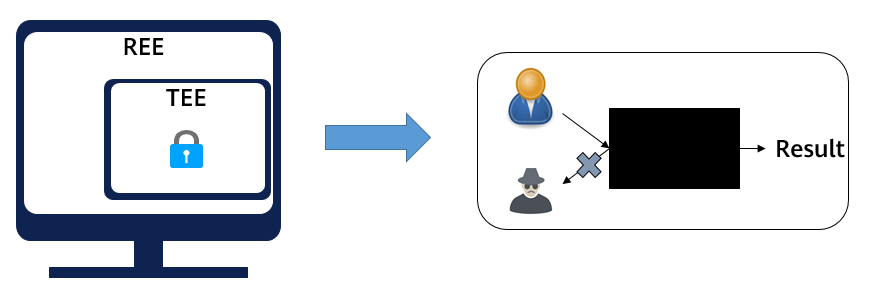
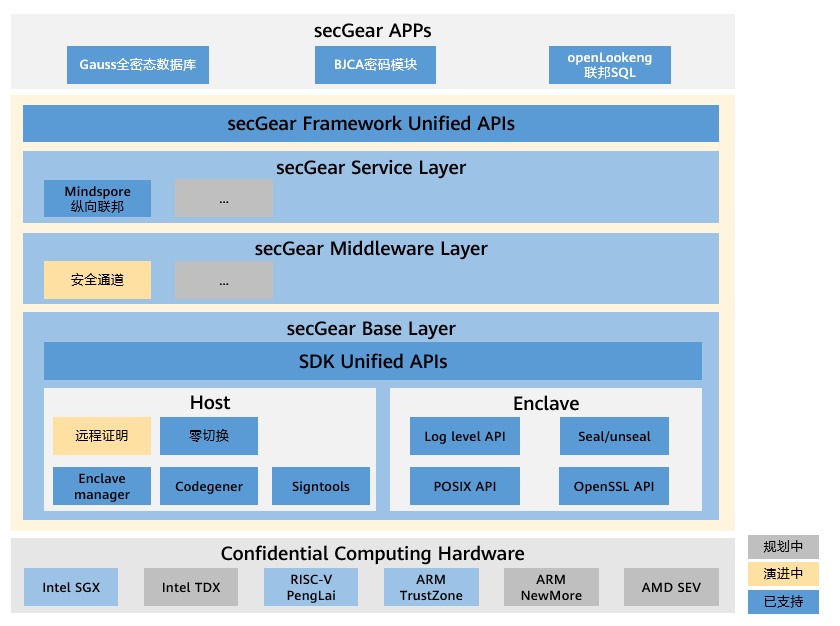
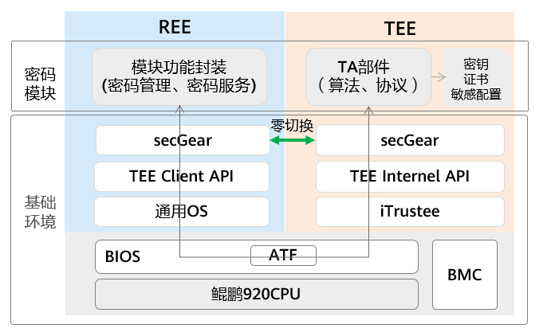
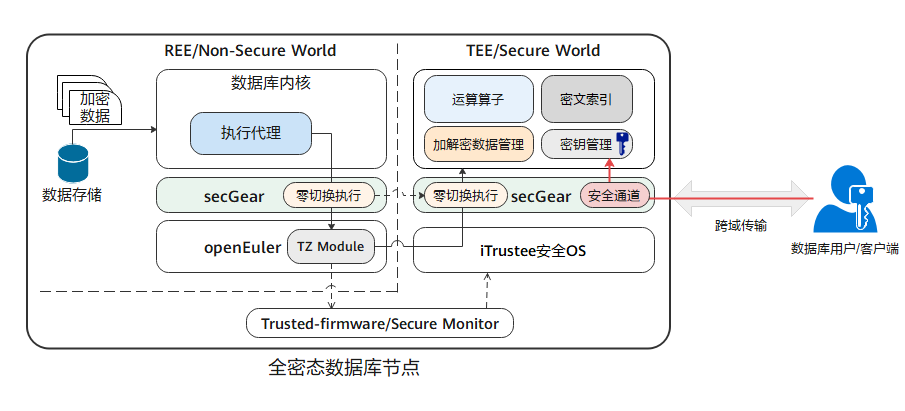
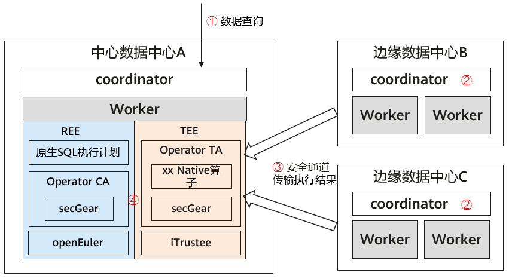
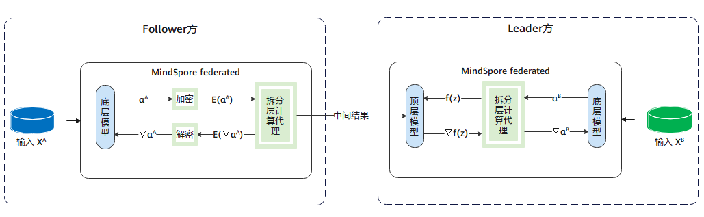
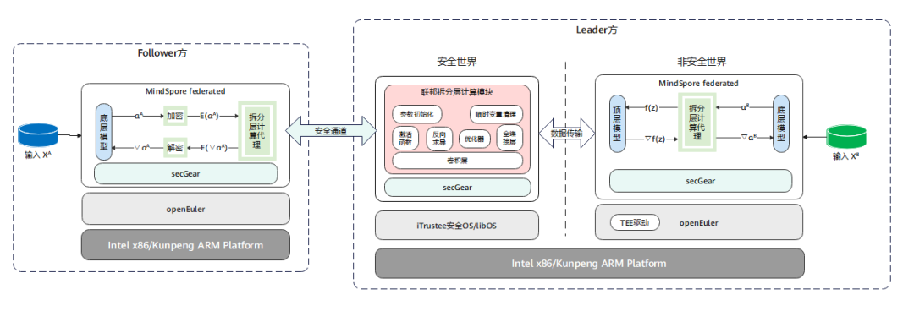

随着网络与计算业务的快速发展，数据成为数字经济的关键生产要素，如何高质量挖掘数据价值，构建安全、合规、可信的数据流通，成为推动数字经济健康发展的关键。此外，根据我国个人信息保护法、欧盟通用数据保护条例
GDPR
等的要求可以看出，数据隐私监管保护的范围在扩大，保护力度日益增强。因此，对关键数据和业务进行安全保护，不仅是技术挑战，也是满足安全合规的必要条件。

当前保护数据的通行方案通常作用于静态存储或网络传输状态的数据，难以有效保护正在被使用的数据，因此，隐私计算技术应运而生。

作为隐私计算的重要分支，机密计算是一种利用硬件可信执行环境 (Trusted
Execution Environment, TEE) 保护使用中数据的技术
\[1\]。如下图所示，在非安全世界（Rich Execution Environment,
REE）中，基于硬件隔离出的 TEE
环境就像是一个黑盒子，可防止外部（包括操作系统、特权用户、恶意程序等）对
TEE
内使用中的应用程序和数据进行未经授权的访问或篡改，从而实现数据在第三方平台的
“可用而不可见”，消除数据上云的安全顾虑，推动数据安全流通。

机密计算痛点
------------

当前业界主流处理器/芯片均实现了各自的机密计算技术，例如 ARM
TrustZone、CCA，Intel SGX、TDX， AMD SEV 等；此外，基于 PCIe TDISP
特性，GPU、DPU 等芯片也在积极构建机密计算环境，如 Nvidia H100
GPU，Nvidia Bluefield、AMD smartNIC 系列 DPU 等。综合来看，各种 TEE
技术的核心要素是提供硬件隔离运行环境，并依托信任根提供度量、内存加密等安全能力。

由于各处理器架构的 TEE 设计思路、实现方式不同，导致各家 SDK
接口迥异、开发流程复杂，造成开发机密计算应用开发难度高、可移植性差、生态隔离。对于应用开发者来说，其开发的安全应用与体系结构强绑定，例如基于
SGX SDK 开发的应用就很难移植到 ARM TrustZone 上，因为安全 OS SDK
提供的接口和 SGX SDK 存在很大差异。

secGear 机密计算统一开发框架
----------------------------

综上可知，业界机密计算技术种类繁多，SDK
也各不相同，接口复杂，开发困难，不同 TEE
间应用生态隔离，给机密计算应用开发者带来了较高的开发、维护成本，影响机密计算生态的发展。openEuler
secGear 机密计算统一开发框架，致力于兼容业界主流 TEE，屏蔽 TEE
差异，对开发者提供统一、简易的开发接口，实现不同架构共源码，使开发者聚焦业务，降低机密计算应用开发维护成本，打通各
TEE 应用生态，助力机密计算生态建设。

secGear 从逻辑上分为三层，如下图所示。

-   Base Layer：机密计算 SDK 统一层，屏蔽 TEE 及 SDK
    差异，实现不同架构共源码。

-   Middleware
    Layer：通用组件层，机密计算软件货架，无需从头造轮子，帮助用户快速构建机密计算解决方案。

-   Server Layer：机密计算服务层，提供典型场景机密计算解决方案。

secGear 遵循木兰宽松许可证（MulanPSL-2.0 License）\[2\]， 开发者可基于
secGear 贡献开源中间件或解决方案，也可以基于 secGear
构建商用解决方案。目前除了社区开源的 MindSpore
纵向联邦机密计算解决方案，也不乏基于 secGear 的客户解决方案，如 GaussDB
全密态数据库，BJCA 密码模块、openLookeng 联邦 SQL 等。

典型应用场景
------------

本章节介绍几个基于 secGear
的实际业务场景解决方案，便于大家学习理解、借鉴，进而结合自身业务构建对应的机密计算解决方案。

### BJCA 基于 TEE 的密码模块

在政策和业务的双驱动下，密码应用保障基础设施一直在向虚拟化演进，随着业务上云，密码服务支撑也需要构建全新的密码交付模式，实现密码、云服务与业务应用的融合，因此数字认证（BJCA）推出基于
TEE 的密码模块，数字认证既可以利用鲲鹏 TEE
环境构建合规的密码计算模块，支撑密码云服务平台，同时也可以基于鲲鹏主机构建
“机密计算平台”，为云计算、隐私计算、边缘计算等各类场景提供
“高速泛在、弹性部署、灵活调度”
的密码服务支撑。基于鲲鹏处理器的内生式密码模块已经成为密码行业变革型的创新方案，并作为内生可信密码计算新起点\[3\]。

传统密码模块中算法协议以及处理的数据是隐私数据，可基于 TEE
保护。如图所示，基于 secGear
机密计算开发框架将密码模块拆分成两部分：管理服务、算法协议。

-   管理服务：运行在 REE 侧，负责对外提供密码服务，转发请求到 TEE
    中处理。

-   算法协议：运行在 TEE 侧，负责用户数据加解密等处理。

由于密码服务可能存在高并发、大数据请求，此时 REE 与 TEE
存在频繁交互以及大数据拷贝，会导致性能直线下降，针对类似场景可使用
secGear 零切换特性优化，减少调用切换及数据拷贝次数，实现性能倍增。

### GaussDB 基于 TEE 的全密态数据库

云数据库俨然已成为数据库业务未来重要的增长点，绝大多数的传统数据库服务厂商正在加速提供更优质的云数据库服务。然而云数据库所面临的风险相较于传统数据库更复杂多样，无论是应用程序漏洞、系统配置错误，还是恶意管理员都可能对数据安全与隐私保护造成巨大风险。

云数据库的部署网络由 “私有环境”向“
开放环境”转变，系统运维管理角色被拆分为业务管理员和运维管理员。业务管理员拥有业务管理的权限，属于企业业务方，而运维管理员属于云服务提供商。数据库运维管理员虽然被定义成系统运维管理，其实际依旧享有对数据的完全使用权限，通过运维管理权限或提权来访问数据甚至篡改数据；再者，由于开放式的环境和网络边界的模糊化，用户数据在整个业务流程中被更充分的暴露给攻击者，无论是传输、存储、运维还是运行态，都有可能遭受来自攻击者的攻击。因此对于云数据库场景，如何解决第三方可信问题，如何更加可靠的保护数据安全相比传统数据库面临着更大挑战，其中数据安全、隐私不泄露是整个云数据库面临的首要安全挑战。

面对上述挑战，基于 TEE 的 GaussDB
全密态数据库的设计思路是：用户自己持有数据加解密密钥，数据以密文形态存在于数据库服务侧的整个生命周期过程中，并在数据库服务端
TEE 内完成查询运算。

如图所示，全密态数据库的特点如下：

1.  数据文件以密文形式存储，不存储密钥明文信息。

2.  DB 数据密钥保存在客户端。

3.  客户端发起查询请求时，在服务端 REE 侧执行密态 SQL
    语法得到相关密文记录，送入 TEE 中。

4.  客户端通过 secGear 安全通道将 DB 数据密钥加密传输到服务端 TEE 中，在
    TEE 中解密得到 DB 数据密钥，用 DB
    数据密钥将密文记录解密得到明文记录，执行 SQL
    语句，得到查询结果，再将 DB 数据密钥加密后的查询结果发送给客户端。

其中步骤 3 在数据库高并发请求场景下，会频繁触发 REE-TEE
之间调用以及大量的数据传输，导致性能直线下降，通过 secGear
零切换特性优化，减少调用切换及数据拷贝次数，实现性能倍增。

### openLooKeng 基于 TEE 的联邦 SQL

openLooKeng 联邦 SQL
是跨数据中心查询的一种，典型场景如下，有三个数据中心：中心数据中心
A，边缘数据中心 B 和边缘数据中心 C。openLooKeng
集群部署在三个数据中心中，当数据中心 A
收到一次跨域查询请求时，会下发执行计划到各数据中心，在边缘数据中心 B 和
C 的 openLookeng 集群完成计算后，通过网络将结果传递给数据中心 A 中的
openLookeng 集群完成聚合计算。在以上方案中，计算结果在不同数据中心的
openLookeng
集群之间传递，避免了网络带宽不足，一定程度上解决了跨域查询问题。但是计算结果是从原始数据计算得到的，可能带有敏感信息，导致数据出域存在一定安全和合规风险。怎么保护聚合计算过程中边缘数据中心的计算结果，在中心数据中心实现
“可用而不可见”
呢？这里我们一起看看与机密计算结合的解决方案。其基本思想是：数据中心 A
中，openLookeng 集群将聚合计算逻辑及算子拆分出独立的模块，部署到鲲鹏 TEE
环境上中；其他边缘数据中心的计算结果通过安全通道传输到数据中心 A 的 TEE
中；所有数据最终在 TEE
中完成聚合计算，从而保护聚合计算过程中边缘数据中心的计算结果不会被数据中心
A 上 REE 侧特权程序或恶意程序获取、篡改。

如图所示，具体查询流程如下：

1.  用户在数据中心 A 下发跨域查询请求，openLooKeng 的 Coordinator
    根据查询 SQL
    及数据源分布，拆解下发执行计划到本地工作节点以及边缘数据中心的
    coordinator，边缘数据中心的 coordinator 再下发到本地工作节点。

2.  各工作节点执行计划，得到本地计算结果。

3.  边缘数据中心通过 secGear
    安全通道将本地计算结果加密后经网络传到数据中心 A 的 REE 侧，并中转到
    TEE 中，在 TEE 中解密计算结果。

4.  数据中心 A 在 TEE 中对数据中心 A、B、C
    的计算结果执行聚合计算，得到最终执行结果，并返回给用户。

其中步骤 4，在存在大量查询请求时，会频繁触发 REE-TEE
调用，并且有大量数据的拷贝，导致性能直线下降。通过 secGear
零切换特性优化，减少调用切换及数据拷贝次数，实现性能倍增。

### MindSpore 基于 TEE 的纵向联邦特征保护

纵向联邦学习是联邦学习的一个重要分支，当不同的参与方拥有来自相同一批用户但属性不同的数据时，可以利用纵向联邦学习进行协同训练，方案流程如图所示。

1.  拥有属性的参与方（Follower
    方）都会持有一个底层网络，参与方属性输入底层网络得到中间结果，再将中间结果发送给拥有标签的参与方（Leader
    方）。

2.  Leader
    方使用各参与方的中间结果和标签来训练顶层网络，再将计算得到的梯度回传给各参与方来训练底层网络。

此方案避免了 Follower
方直接上传自己的原始数据，保护原始数据不出域，一定程度上保护了隐私安全。然而，攻击者还是有可能从上传的中间结果反推出用户信息，导致存在隐私泄露风险。因此我们需要对训练时出域的中间结果和梯度提供更强的隐私保护方案，来满足安全合规要求。

借鉴之前三个场景的安全风险及解决方案可以发现，想要达到中间结果出域后的
“可用不可见”，正是机密计算的 “拿手好戏”。基于 TEE
的纵向联邦特征保护方案如图所示\[4\]。

1.  Follower 方的中间结果通过 secGear 的安全通道加密后传输到 Leader
    方，Leader
    方非安全世界接收到加密的中间结果后中转到安全世界，在安全世界通过安全通道接口解密。

2.  在安全世界中将中间结果输入到联邦拆分层计算模块，完成结果计算。

以上过程中 Follower 方的中间结果明文只存在于安全世界内存中，对 Leader
方来说就是黑盒子，无法访问。

展望
----

2023 年 openEuler secGear
将持续演进，并发布支持零切换、安全通道、远程证明等功能的稳定版本，可用于构建商用的端到端机密计算解决方案。同时，openEuler
也会持续构建通用的中间件或服务，也期待您的参与贡献，共同推动机密计算应用生态的发展。secGear
将一如既往地持续关注 AMD SEV、Intel TDX、ARM CCA
等技术，为打造安全易用的机密计算统一开发框架而不懈努力。

引用
----

  **序号**   **引用链接**
  ---------- -------------------------------------------------------------------------------------------------------------------------------------------------------------------------------------------------------------------------
  \[1\]      Confidential Computing Consortium, “A Technical Analysis of Confidential Computing,”: https://confidentialcomputing.io/wp-content/uploads/sites/85/2022/01/CCC-A-Technical-Analysis-of-Confidential-Computing-v1.2.pdf.

  \[2\]      木兰宽松许可证: http://license.coscl.org.cn/

  \[3\]      数字认证: https://mp.weixin.qq.com/s?\_\_biz=MzA4NDUzMzY2Mw==&chksm=87ed5619b09adf0fe8a509dcee9d7413f3dbd1ec6f39d0d247272c1caf6d754d943be18133af&idx=1&mid=2650554089&sn=5725062bb6a1712c224a2f31d4558d32

  
  \[4\]      Mindspore: https://www.mindspore.cn/federated/docs/zh-CN/master/secure\_vertical\_federated\_learning\_with\_TEE.html

