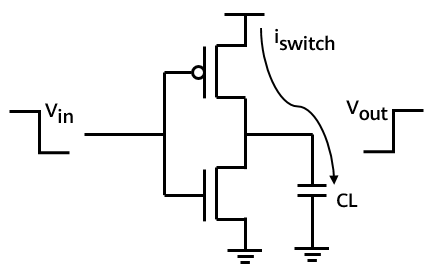
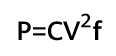

随着云计算市场规模的快速增长，各云厂商基础设施投入也不断增加，但行业普遍存在资源利用率低的问题，在上述背景下，提升资源利用率已经成为了一个重要的技术课题。

将业务区分优先级混合部署（下文简称混部）是典型有效的资源利用率提升手段。业务可根据时延敏感性分为高优先级业务和低优先级业务。当高优先级业务和低优先级业务发生资源竞争时，需优先保障高优先级业务的资源供给。

业务混部的核心技术是资源隔离控制，主要涉及内核态基础资源隔离技术及用户态
QoS 控制技术。Skylark 是一种虚拟机混部场景下的 QoS 感知的资源调度器，由
openEuler Skylark 组件承载，在 Skylark
视角下，优先级粒度为虚拟机级别，即给虚拟机新增高低优先级属性，以虚拟机为粒度进行资源的隔离和控制，在保障高优先级虚拟机
QoS
前提下提升物理机资源利用率。内核层提供了一些基础资源干扰隔离机制，比如
CPU 调度硬优先级机制以及
SMT（硬件超线程）干扰隔离机制等。此外集群管理系统软件 OpenStack
也需要感知虚拟机优先级，设计实现一套混部资源模型。

虚拟机混部由 openEuler 社区 OpenStack SIG、Virt SIG 以及 Kernel SIG
联合开发。本文主要介绍 Skylark 组件的功耗管理技术。

为什么需要管理功耗
------------------

随着各种混部方案的提出，服务器利用率有了明显的提升。但是平均利用率的提高伴随着的是瞬时利用率冲到
100%的概率大幅增加。服务器一般是以睿频频率运行，当 CPU
以满负荷运行一段时间后，功耗的持续增加会大幅超过 TDP 触发 CPU
降频。由于服务器是以整颗 CPU 供电，所以同一颗 CPU 上的所有 core
将会同时降频，将会影响该 CPU 上运行的所有虚拟机对应的客户业务
QoS。当利用率降低后，功耗也降低到一定值时，频率将再次升高到睿频。因此，高的资源利用率会间接导致
CPU QoS 下降，在虚拟机混部后需要在提高资源利用率的同时保证 CPU QoS
或者说客户业务不受到影响。

本文详细介绍并分享了功耗相关的基础概念以及虚拟机混部技术中功耗管理的技术细节。

CPU 功耗来源
------------

CPU
的功耗主要是由晶体管工作产生，其功耗主要分为开关功耗、短路功耗和漏电功耗三类。下图为
CMOS 反向示意图。

其中，开关功耗主要是电容的充放电。例如当输入低电平时，输出端负载电容会进行一次充电。当输入变成高电平时，电容中储存的电能会以热量的形式被释放。当
CPU 中几十亿个晶体管同时释放时，将会产生大量的热能。短路功耗则是 P 管和
N 管短路时产生的功耗。漏电功耗是 CMOS
管不能严格关闭时发生漏电所产生的功耗，与制程和温度有关。

CPU 功耗关系公式：

公式中，C 代表电容率（Capacitance），是个常数，和 CPU 的工艺相关，在 CPU
出厂时确定。P 是功耗（Power），F 是 CPU 运行的频率（Frequency），V
是电压（Voltage）。可以看出 CPU 的功耗和 CPU
运行的电压以及运行的频率成正比。而其中，电压 V
和频率有一定的对应关系，这是因为当 CPU
的场效应管进行一次充放电需要一定时间，只有充放电完成后采样才能保证信号的完整性。电压越高，充电的时间越短，即翻转的频率就越大。

TDP 是什么
----------

TDP（Thermal Design Power）即热设计功耗，简称热功耗。它是用来指示 CPU
或者 GPU 在满负荷运行时，散热器需要达到的散热热量。根据能量守恒原理，CPU
运行需要输入能量，即电源的功率。输入的电流经过电容产生热量，以热能以及其他形式的能量散发出来，这些热能如果没有耗散掉，那么
CPU 的温度则会越来越高，影响 CPU 的运行，TDP 代表了按照 CPU
设计运行的温度范围内需要耗散的热能，是散热系统的重要参考指标。TDP
越大，表示 CPU 在满负荷工作产生的热量就越大。

随着睿频 2.0 技术引入，TDP 已经不是 CPU 能够排除的最大热量了。在睿频 2.0
中，引入了 PL1、PL2、PL3、PL4、和 Tau。

PL1 是 CPU 运行在默认主频不含睿频和 AVX 的功耗，大多数情况等于 TDP。PL2
是 CPU 可以达到超过 TDP 工作的最大功率限制。可以看出在 Tau 时间内 CPU
是可以超过 TDP 阈值运行的。PL3/PL4 一般厂家不设置，这里略过。Tau 是 CPU
能在 PL2 运行的最长时间。

在实际生产中，由于需要考虑到各种冗余以及生产安全，服务器并不能一直在最高功率下运行，而且为了保护
CPU，甚至会设置"功耗墙"，当功耗大于一定阈值时，CPU
会自动调用调频接口通过降低 CPU 的频率来降低功耗。当功耗降低，CPU
温度回复正常时，CPU 频率会逐渐回复到原先频率。

混部功耗管理技术
----------------

在 Skylark 虚拟机混部方案中，我们有数据采集，QoS 实时分析，QoS
实时控制，三个核心模块。在这三个模块中，通过以下算法实现功耗管理：

-   **「功耗相关数据采集」**：根据 host 上的 topo 关系，通过 MSR
    寄存器，准确采集计算 CPU 每个核的频率，以及每个 package 的功耗。

-   **「功耗及利用率实时分析」**：在每个定时周期中，根据设定的 TDP
    阈值，标记功耗热点 package，以及降频 CPU 核，对降频核上运行的虚拟机
    CPU 利用率进行排序。由于我们要尽量保证高优先级虚拟机的
    QoS，所以利用率最高的若干个低优先级虚拟机将被放入 QoS 调整队列。

-   **「QoS 实时控制」**：在每个 QoS 调整周期，根据 CPU 核状态，功耗热点
    package，限制或恢复 QoS 调整队列中虚拟机 vCPU 的 CPU 带宽，通过降低
    CPU 带宽，将减小降频核的 CPU 利用率，来达到降低功耗的目的。

总结
----

在使用了高低优先级虚拟机混部方案之后，平均资源利用率的提高对应着 QoS
降低的风险也随之增加。在 CPU
突发满负载运行时，可能会因功耗升高触发降频而导致 CPU QoS 下降。我们在
Skylark 中提出了功耗管理技术，通过调整热点低优先级虚拟机 vCPU 的 CPU
带宽来间接调整功耗，保障 CPU QoS。

系列文章回顾
------------

\[1\] openEuler  资源利用率提升之道  01  ：概论
：https://mp.weixin.qq.com/s/x9sdogEslRJJ5mDbs5bxgQ

\[2\] openEuler  资源利用率提升之道  02  ：典型应用下的效果
：https://mp.weixin.qq.com/s/anOTdRIufYaj5pl4hy1e\_A

\[3\] openEuler  资源利用率提升之道  03  ：rubik 混部引擎
：https://mp.weixin.qq.com/s/jJXeBCRM2k92rPqyA6SL-Q

\[4\] openEuler 资源利用率提升之道 04 ：CPU 抢占和 SMT 隔离控制
：https://mp.weixin.qq.com/s/8Odi24WjKAho8SYsYd7a1A
