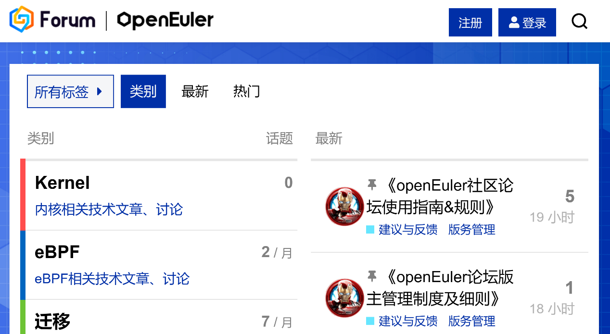
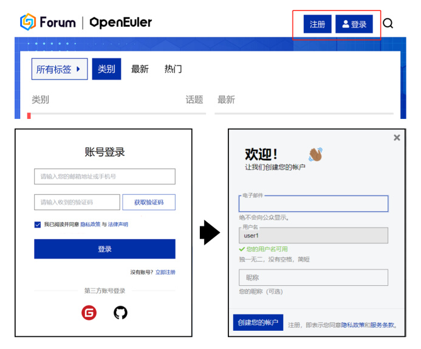
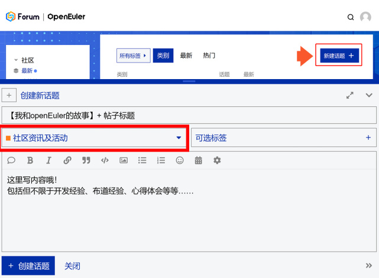

应广大社区朋友的要求

**openEuler 社区论坛来啦**

这是一个由社区开发者、用户与合作伙伴

共同建立的分享、学习、交流平台

[*https://forum.openeuler.org/*](https://forum.openeuler.org/)

大家可以在上面发表技术话题、专栏文章、社区活动、文档资源等等。感兴趣的朋友可以在相关的帖子下发表意见与看法，参与话题讨论。

在刚结束 openEuler 3 周年云生日会上，

大家是不是还没玩够？

兔年新春，入驻 openEuler 社区论坛，

分享您与 openEuler 的故事，

就有机会赢取社区超级好礼！

活动好礼
--------

活动时间
--------

参与时间：即日起-2023 年 2 月 20 日

获奖公布时间：2023 年 2 月 25日

参与方式
--------

即日起至 2023 年 2 月 20 日，按照以下步骤进行投稿，即成功参与本活动！

1\. 打开论坛链接
[*https://forum.openeuler.org/*](https://forum.openeuler.org/) ，注册/登录社区账号（可选择已有的 Gitee
或GitHub 账号登录）；

2\. 登陆成功中，点击“创建话题”发帖投稿，标题要求：**【我和 openEuler
的故事】+ 帖子主题**，并选择**社区资讯与活动板块**,示例图如下；

3\. 发帖内容包括但不限于开发经验、布道经验、心得体会等等。

示例图:

评优方式
--------

活动结束后，组委会将对符合投稿要求的帖子进行评审，根据其内容质量(一、二等奖)、在openEuler
社区论坛的点赞量(三等奖)进行排名。

注意事项
--------

1.  活动期间内，参与用户需按本文投稿要求进行发帖；

2.  获奖名单将于 2023 年 2 月 25
    日在本活动帖子公示，并邮件提示中奖者。获奖用户请及时关注站内论坛平台的通知，若在收到获奖通知的
    5 个工作日内未联系 openEuler
    小助手反馈信息，则视为自动放弃获奖资格；

3.  请勿出现以下情况，一经发现，删帖处理，并取消获奖资格，包括：评论内容与本帖无关，同一内容发布多次，情节严重可做禁言处理；

4.  内容禁止带有色情、正值、人身攻击等，一经发现，封禁处理；

5.  禁止抄袭、复制他人内容，一经发现取消获奖资格。

**openEuler小助手**

欢迎大家踊跃参加，

成为社区论坛内最亮的崽！

