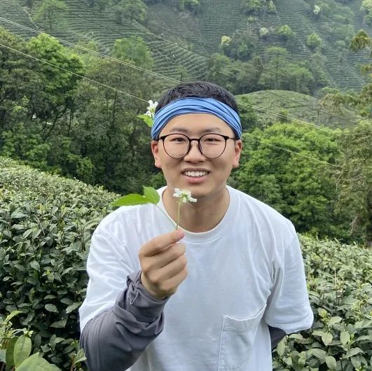

openEuler社区已经成立三周年了，这三年在众多用户和开发者的支持下，社区发展茁壮。

近期，openEuler Summit
2022会上社区向突出贡献者及团队颁发2022年度“欧拉之星”个人奖，团队奖。一共有10位贡献突出的开发者入选，被评为“开源贡献之星”。

我们很荣幸邀请到获得“欧拉之星”个人奖的夏森林老师，分享他在社区的工作与成长，为我们介绍如何更深入地参加到社区贡献当中。

请简单的介绍一下自己
====================

openEuler社区开发者

夏森林

大家好，我是small\_leek，Application、ruby、epol、Desktop SIG
的Maintainer，目前的研究方向是软件工程能力建设。

平常主要在社区的cicd、release、Application、Desktop等SIG保持活跃。

openEuler社区
-----------------

对您来讲，openEuler有哪些吸引力？

于我来说，openEuler是国内为数不多的真正做开源OS的社区。openEuler对于广大开发者来说，**参与门槛低，兴趣小组丰富，TC技术委员会从一开始就汇聚了OS领域有话语权，有技术的大牛，并且有一股很强的向心力，不断吸引细分领域的专家一起加入进来**。开发者在这里不再是单纯的自取自用，还能与各位大牛有技术的交流和碰撞。

也欢迎大家参与openEuler社区，借助这个平台得到更好的提升和自我成长。

这次您被openEuler社区评选为“欧拉之星“，意味着您对openEuler做出了杰出的贡献，请问您今年在openEuler社区做出了哪些贡献呢？

今年在社区主要做了这些事情：

（1）  
基于现有的OBS构建系统做了服务集群扩展和分层构建，将多版本project并行构建的效率大大提升；

（2）   优化release
sig版本基线管控的流程，增加、删除、移动软件包场景归一为1个PR完成；

（3）  
深入参与社区自研OS构建系统的研发，并推动持续应用于openEuler-22.03-LTS-SP1版本的构建、转测和发布；

我在openEuler社区主要投入社区软件工程能力建设，大家对于社区工程能力有任何建议的话，也欢迎大家和我交流。

请问您是怎么参与到社区工作当中的，有没有什么经验可以分享给大家？

一开始参与社区是部门的安排，那时是全员参与，大家都是从零开始了解OS社区的玩法。从rpm编译，到bugfix，到修复CVE，再到接触OS社区的基础设施——rpm构建系统+门禁，我慢慢找到看自己真正感兴趣的领域，从此开始主要投入社区软件工程能力建设，并不断的优化。

在过去的一年中，我通过与其他OS厂商和suse专家的友好交流，了解主流OS构建系统的不同的架构和技术特点，同时向使用OBS构建系统的其他团队取经，汲取提升单包构建效率的经验，设计适用于openEuler社区实际构建需求的优化方案。此外，也要感谢社区cicd
sig组其他开发者的协助，愿意提供更多的测试机器来迭代测试。

**对我来说，找到自己感兴趣的领域是一个重要的因素，因为只有自己真正感兴趣才会愿意投入更多时间，对一件事情进行持续性的投入。**

您在社区工作上比较关注什么？后续会有哪些规划吗？

我在社区工作上比较关注开发者对于社区工程能力的好的建议或者不好的反馈，因为他们才是更广大的用户，实际的痛点来自于他们的体验。

短期内，我会继续投入优化社区自研构建系统，并进行长稳测试，争取在630的时候让它与所有开发者见面，与之相关的门禁也会支撑更强的测试能力，请大家再等一等。

寄语
====================

很荣幸获得“欧拉之星”个人奖，这是openEuler社区对我这一年来的贡献的肯定。

衷心祝愿openEuler社区一步一个脚印，万物生长！
