# RocksDB  3.76 for openEuler 22.03 LTS移植案例

## 介绍

RocksDB 是一个来自Facebook 的可嵌入的支持持久化的 key-value存储系统，也可作为 C/S 模式下的存储数据库。RocksDB 基于LevelDB 构建。

关于RocksDB的更多信息请访问[RocksDB官网](http://rocksdb.org/)。

**语言**：C++

**一句话描述**：用于快速存储的嵌入式持久键值存储。

**开源协议**：Apache+GPLv2

建议使用版本为：RocksDB 6.10.2

系统版本为：openEuler 22.03 LTS 


## 配置安装环境

### yum安装依赖包

```
yum install -y vim gcc-c++ snappy snappy-devel zlib zlib-devel bzip2 bzip2-devel lz4 lz4-devel
```


### 源码安装zstd

**操作步骤**

- 进入"/home"目录。

```
cd /home
```

获取zstd源码包并修改包名。

```
wget https://codeload.github.com/facebook/zstd/tar.gz/refs/tags/v1.1.3

mv v1.1.3 zstd-1.1.3.tar.gz
```

- 解压源码包。

```
tar -zxvf zstd-1.1.3.tar.gz
```

- 进入解压目录。

```
cd zstd-1.1.3/
```

- 编译。

```
make -j8
```

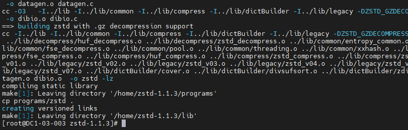

- 安装。

```
make install
```

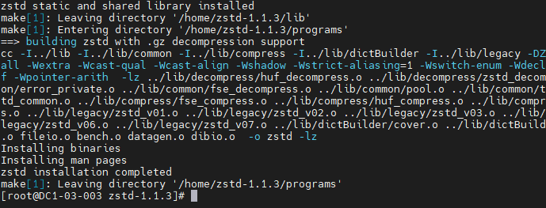

- 环境变量配置。

```
export LD_LIBRARY_PATH=$LD_LIBRARY_PATH:/usr/local/lib

export CPLUS_INCLUDE_PATH=$CPLUS_INCLUDE_PATH:/usr/local/include
```


### 源码安装cmake

说明：cmake版本最低要求为3.5.1，建议安装3.10.0版本。

操作步骤

- 进入"/home"目录。

```
cd /home
```

- 获取源码。

```
wget https://github.com/Kitware/CMake/releases/download/v3.10.0/cmake-3.10.0.tar.gz
```

- 解压源码包。

```
tar -zxvf cmake-3.10.0.tar.gz
```

- 进入解压包。

```
cd cmake-3.10.0
```

- 编译配置。

```
./bootstrap --prefix=/usr/local/cmake
```

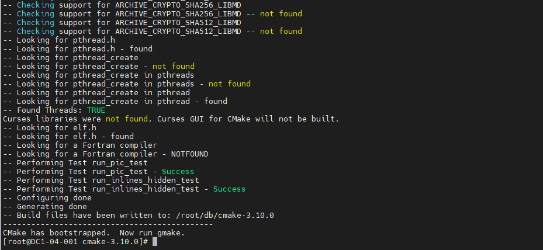

- 编译。

```
make -j8
```

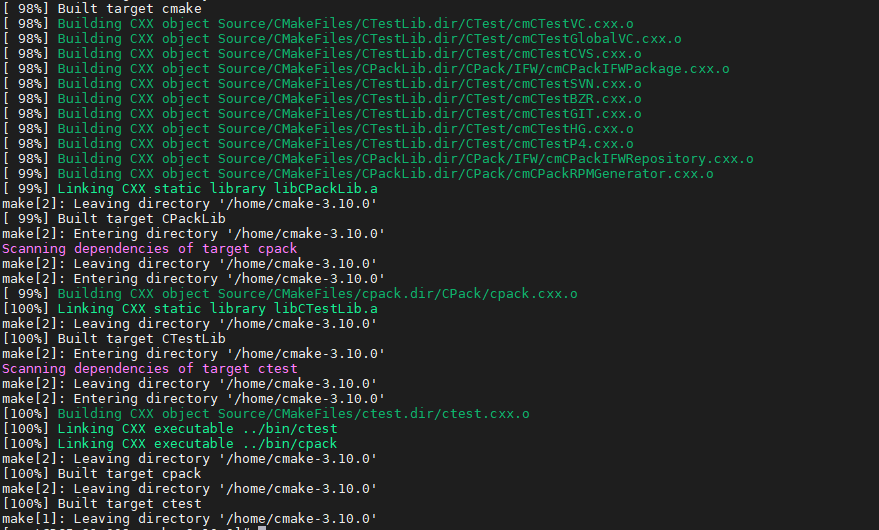

- 安装。

```
make install
```

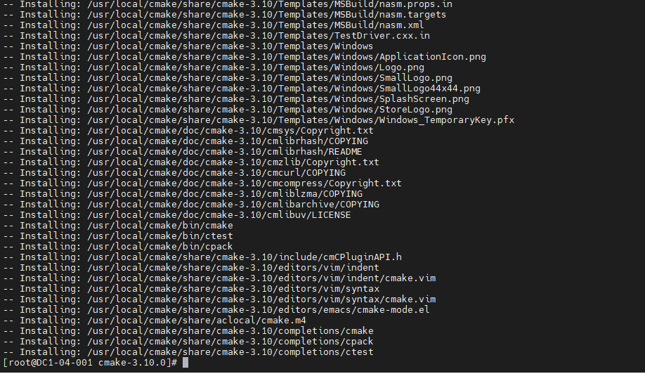

- 执行以下命令设置cmake的环境变量。

```
export PATH=$PATH:/usr/local/cmake/bin
```

- 查看版本验证是否安装成功。

```
cmake --version
```

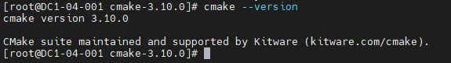

如果查看的版本不是3.10.0，参考 故障排除-cmake 版本未生效。


### 源码安装gflags

**操作步骤**

- 进入"/home"目录。

```
cd /home
```

- 获取源码包并修改包名。

```
wget https://github.com/gflags/gflags/archive/v2.2.2.tar.gz
mv v2.2.2.tar.gz gflags-2.2.2.tar.gz
```

- 解压源码包。

```
tar -zxvf gflags-2.2.2.tar.gz
```

- 进入解压包。

```
cd gflags-2.2.2
```

- 新建目录。

```
mkdir build/
```

- 进入新建目录。

```
cd build/
```

- 编译配置。

```
cmake -DBUILD_SHARED_LIBS=ON -DBUILD_STATIC_LIBS=ON -DINSTALL_HEADERS=ON -DINSTALL_SHARED_LIBS=ON -DINSTALL_STATIC_LIBS=ON ..
```

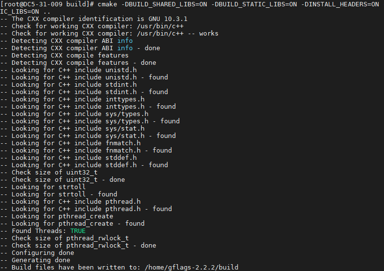

- 编译。

```
make -j8
```

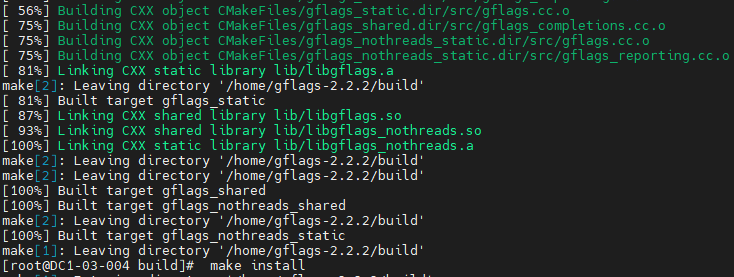

- 安装。

```
make install
```

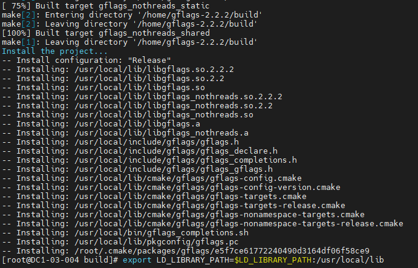

- 执行以下命令设置gflags的环境变量。

```
export LD_LIBRARY_PATH=$LD_LIBRARY_PATH:/usr/local/lib
export CPLUS_INCLUDE_PATH=$CPLUS_INCLUDE_PATH:/usr/local/include/gflags
```


## 源码编译安装

操作步骤

- 进入"/home"目录。

```
cd /home/
```

- 获取源码包并修改包名。

```
wget https://github.com/facebook/rocksdb/archive/refs/tags/v6.10.2.tar.gz
mv v6.10.2.tar.gz rocksdb-6.10.2.tar.gz
```

- 解压RocksDB安装包。

```
tar -zxvf rocksdb-6.10.2.tar.gz
```

- 进入解压目录。

```
cd rocksdb-6.10.2/
```

- 修改cmake编译配置文件。

```
vim CMakeLists.txt
```

说明：按照源码包中的配置文件进行编译，会在生成benchmark工具时，出现所需静态库找不到的错
误。需修改CMakeList.txt配置文件可解决该问题。具体操作如下。

在1186行添加如下代码段：

```
add_subdirectory(third-party/gtest-1.8.1/fused-src/gtest)
add_library(testharness STATIC
test_util/testharness.cc)
target_link_libraries(testharness gtest)
```

编辑前：

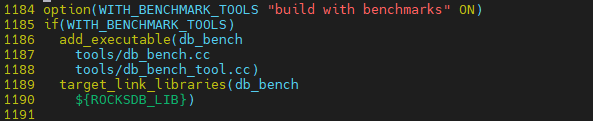

编辑后：

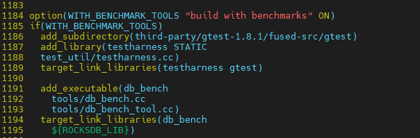

- 创建目录。

```
mkdir build
```

- 进入创建的目录。

```
cd build
```

- 编译配置。

```
cmake -DCMAKE_INSTALL_PREFIX=/usr/local/rocksdb -DWITH_SNAPPY=1 -DWITH_ZLIB=1 -DWITH_LZ4=1 -DWITH_ZSTD=1 -DWITH_BZ2=1 ..
```

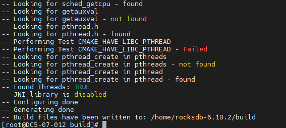

9.  执行编译命令。

```
make -j8
```

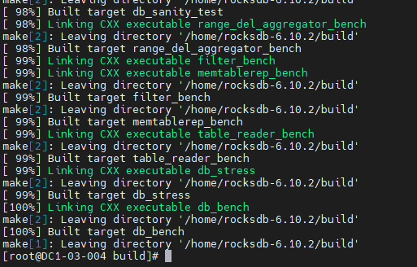


如果编译报错提示"Cannot allocate memory"，参考 故障排除-编译rocksdb提示Cannot allocate memory。

- 执行安装命令。

```
make install
```

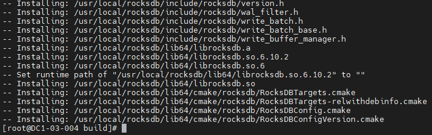

- 将工具移动到安装目录。

```
cp ../utilities/merge_operators.h
/usr/local/rocksdb/include/rocksdb/utilities/
mkdir -p /usr/local/rocksdb/tools
cp -p ./tools/ldb /usr/local/rocksdb/tools
cp -p ./tools/sst_dump /usr/local/rocksdb/tools
```

- 查看安装目录。

```
ls /usr/local/rocksdb
```

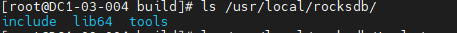

- 环境变量设置。

```
export CPLUS_INCLUDE_PATH=$CPLUS_INCLUDE_PATH:/usr/local/rocksdb/include
export LD_LIBRARY_PATH=$LD_LIBRARY_PATH:/usr/local/rocksdb/lib64
export LIBRARY_PATH=$LIBRARY_PATH:/usr/local/rocksdb/lib64
export PATH=$PATH:/usr/local/rocksdb/tools
```


## 接口Get、Put、Delete、Merge验证

说明：

1.  通过ldb工具验证put、get、delete三个接口的正常操作。

2.  通过代码简单验证merge接口的正常操作。

### put接口

- 创建数据库存储目录。

```
mkdir -p /home/rocksdb/rkdb1
```

- 添加数据。

```
ldb --db=/home/rocksdb/rkdb1 --create_if_missing put k1 v1
ldb --db=/home/rocksdb/rkdb1 put k2 v2
```


- 查看结果。

```
ldb --db=/home/rocksdb/rkdb1 scan
```


### Get接口

- 读取数据。

```
ldb --db=/home/rocksdb/rkdb1 get k1
ldb --db=/home/rocksdb/rkdb1 get k2
```


- 查看结果。

```
ldb --db=/home/rocksdb/rkdb1 scan
```

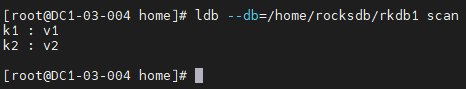


### Delete接口

- 删除数据。

```
ldb --db=/home/rocksdb/rkdb1 scan
ldb --db=/home/rocksdb/rkdb1 delete k2
```


- 查看结果。

```
ldb --db=/home/rocksdb/rkdb1 scan
```


### Merge接口

- 进入"/home"目录。

```
cd /home/
```

- 创建如下源代码。

```
vim rocksdb_test_merge.cpp
```

- 添加代码内容。

```cpp
#include <iostream>

#include <vector>

#include <rocksdb/db.h>

#include <rocksdb/options.h>

#include <rocksdb/table.h>

#include <rocksdb/merge_operator.h>

#include <rocksdb/filter_policy.h>

#include <rocksdb/perf_context.h>

#include <rocksdb/iostats_context.h>

#include <rocksdb/trace_reader_writer.h>

#include "rocksdb/utilities/merge_operators.h"

using namespace rocksdb;

using namespace std;

int main()

{

DB* db;

Options options;

options.create_if_missing = true;

//no compression

options.compression = kNoCompression;

BlockBasedTableOptions table_options;

table_options.no_block_cache = true;

table_options.cache_index_and_filter_blocks = false;

options.table_factory.reset(NewBlockBasedTableFactory(table_options));

options.merge_operator =
MergeOperators::CreateStringAppendOperator();

Status s=rocksdb::DB:: Open(options,"/home/rocksdb/rkdb2",&db);

if(!s.ok()){

cout<<"open rocksdb failed:"<<s.ToString()<<endl;

delete db;

exit(-1);

}

cout<<"open rocksdb success!"<<endl;

//Merge operator

int j = 0;

string key = to_string(j);

string value;

char buf[8];

//EncodeFixed64(buf,2);

s = db->Merge(WriteOptions(),key,"1");

//need change

if(!s.ok()){

cout << "Merge value failed:" << s.ToString()<<endl;

delete db;

exit(-1);

}

s = db->Merge(WriteOptions(),key,"2");

db->Flush(FlushOptions());

if(!s.ok()){

cout << "Merge value failed:" << s.ToString()<<endl;

delete db;

exit(-1);

}

s = db->Get(ReadOptions(),key,&value);

if(!s.ok()){

cout << "Merge value failed:" << s.ToString()<<endl;

delete db;

exit(-1);

}

cout << "Get merge value: " << value << "\n value of size:" << value.size() << endl;
}
```


- 创建数据库目录。

```
mkdir -p /home/rocksdb/rkdb2
```

- 执行以下命令编译代码。

```
g++ -o rocksdb_test_merge --std=c++11 rocksdb_test_merge.cpp -lrocksdb -ldl
```

- 执行可执行文件。

```
./rocksdb_test_merge
```


10. 查询库中的数据。

```
ldb --db=/home/rocksdb/rkdb2 scan
```

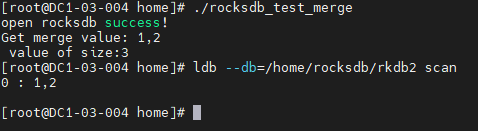


## 故障排除


### cmake 版本未生效

- 问题现象描述

 cmake-3.10.0编译安装成功后，查看版本号，该版本未生效。显示为其他版本号。

- 关键过程、根本原因分析

环境中已存在其它cmake版本，优先级比编译安装的cmake-3.10.0高。

- 结论、解决方案及效果

  查看环境中所有的cmake。

```
find / -name cmake | grep bin
```

​		查看cmake版本。

```
/usr/bin/cmake --version
/usr/local/cmake/bin/cmake --version
```

- 让cmake-3.10.0生效。

```
cd /usr/bin/
mv cmake cmake-3.12.1
hash -r
cmake --version
```


### 编译RocksDB提示Cannot allocate memory

- 问题现象描述

编译过程中报错：Cannot allocate memory

- 关键过程、根本原因分析

执行make -j编译会使用所有cpu核数，导致内存不够。

- 结论、解决方案及效果

  重新编译配置。

```
rm -rf *
cmake -DCMAKE_INSTALL_PREFIX=/usr/local/rocksdb -DWITH_SNAPPY=1 -DWITH_ZLIB=1 -DWITH_LZ4=1 -DWITH_ZSTD=1 -DWITH_BZ2=1 ..
```

- 查看cpu核数。

```
lscpu
```

- 再次执行编译命令（减少cpu核数）。

```
make -j8
```


