# Fastdb 3.76 for openEuler 20.03 移植案例

## 介绍

FastDB 是高效的内存数据库系统，具备实时能力及便利的C++接口。

## 环境要求

### 硬件要求

-----------------------------------------------------------------------
  项目                 说明
-------------------- --------------------------------------------------
  服务器名称           TaiShan 200服务器（型号2280）

  处理器                   鲲鹏920处理器

  核数                       2\*48核

  主频                       2600MHz

  内存大小               128GB（4 \* 32GB）

  网卡                       Hi1822 网卡 4\*25G

  环境版本               openEuler 20.03 LTS

## 源码编译安装和卸载

### 配置yum源

如果环境上当前yum源已配置，则忽略本步骤。

本次测试环境操作系统为openEuler 22.03 (LTS)，使用yum list查询默认已配置。


### 安装依赖包

- 执行以下命令安装基础依赖包。

```
yum install -y gcc gcc-c++ wget tar
```


### 关闭防火墙

测试环境下通常会关闭防火墙以避免部分网络因素影响，视实际需求做配置。

- 停止防火墙。

```
systemctl stop firewalld.service
```

- 关闭防火墙。

```
systemctl disable firewalld.service
```

- 查看防火墙。

```
systemctl status firewalld.service
```


### 修改SELinux

- 修改配置文件。

```
sed -i 's/SELINUX=enforcing/SELINUX=disabled/g'  /etc/selinux/config
```

- 查看SELinux状态，**disabled**即为设置成功。

```
cat /etc/selinux/config
```

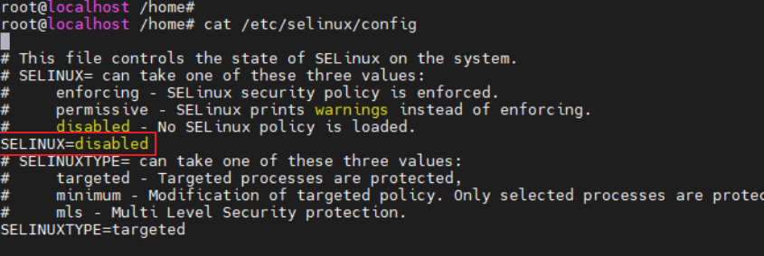


### 源码编译安装

- 获取FastDB源码。

- 在本地浏览器下载FastDB 3.76源码。

下载地址：<http://www.garret.ru/fastdb-3.76.tar.gz>

- 将源码复制至服务器"/home"目录。

说明：若服务器可以访问网络，则可以直接在服务器上使用wget命令下载源码。

```
cd /home
wget http://www.garret.ru/fastdb-3.76.tar.gz
```

- 进入"/home"目录。

```
cd /home/
```

- 解压FastDB安装包。

```
tar -xvf fastdb-3.76.tar.gz
```

- 进入"fastdb"目录。

```
cd fastdb
```

- 执行以下命令执行编译。

```
./configure \--prefix=/opt/fastdb \--build=arm-linux
```

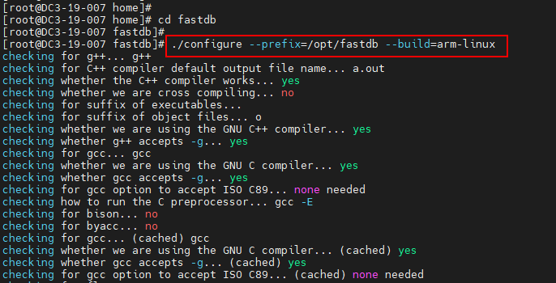

说明：PREFIX=PATH：指定fastdb的安装目录。

- 执行以下命令执行编译安装。

```
make -j64
```

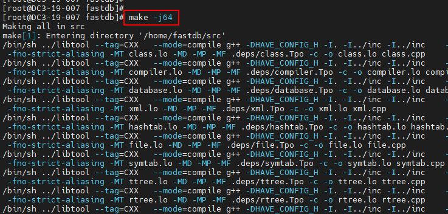


说明：如果编译安装过程中出现testtimeseries.cpp:70:53: error: call of overloaded 'fmin(float&, float&)' is ambiguous报错信息，请参考[故障排除-Make失败报错](#make失败报错)。

- 执行以下命令执行安装。

```
make install
```

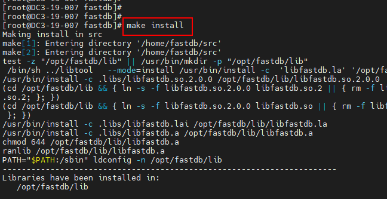

- 查看安装目录。

```
ll /opt/fastdb
ll /opt/fastdb/bin
```

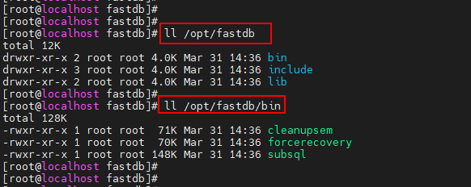


### 配置FastDB

说明：如果操作过程中发现找不到fastdb相关库文件，需要按照以下操作配置库的路径。

- 添加fastdb动态库路径并使得立即生效。

```
echo /opt/fastdb/lib/ >> /etc/ld.so.conf
ldconfig
```

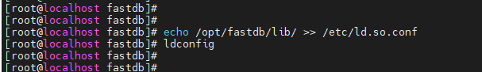

- 查看是否生效。

```
ldconfig -v | grep "fastdb"
```

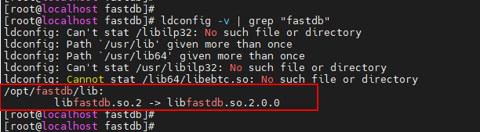


### 验证FastDB

- 执行以下命令初始化数据库并登录。

```
cd /opt/fastdb/bin/
./subsql
```


- 执行以下命令查看数据库常用操作。

```
help
```

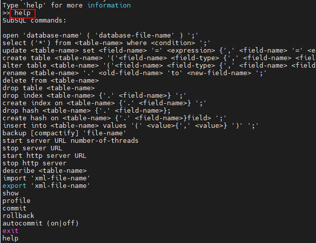

- 打开数据库\'testddl\'并查询当前数据库中表及其相关信息。

**\# 打开数据库testddl**

```sql
open 'testddl';
```

**\# 显示当前数据库的相关信息**

```sql
show
```

**\# 查询表Metatable**

```sql
select * from Metatable;
```

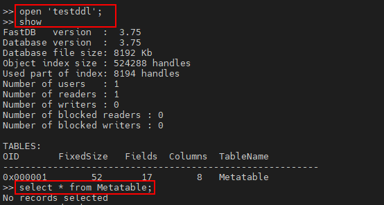

- 创建表Persons和表Animals并查看其表结构。

**\# 创建表Persons**

```sql
create table Persons(identityID int4, name string, age int2);
```

**\# 查看表Persons结构**

```sql
describe Persons;
```

**\# 创建表Animals**

```sql
create table Animals(name string, age int2, voice string);
```

**\# 查看表Animals结构**

```sql
describe Animals;
```

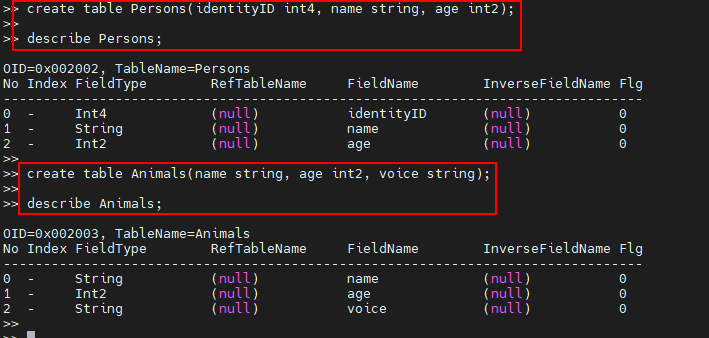

**\# 显示当前数据库的相关信息**

```sql
show
```

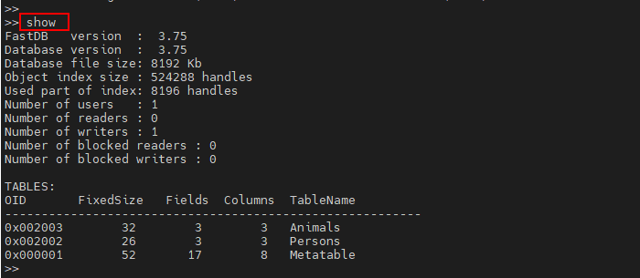

- 插入表Persons和表Animals中相关数据。

**\# 插入表Persons**

```sql
insert into Persons values(100001, 'andy', 22);

insert into Persons values(100002, 'swen', 25);

insert into Persons values(100003, 'tnia', 26);
```

**\# 插入表Animals**

```sql
insert into Animals values( 'dog', 2, '汪汪');

insert into Animals values( 'sheep', 2, '咩咩');

insert into Animals values( 'duck', 2, '嘎嘎');
```

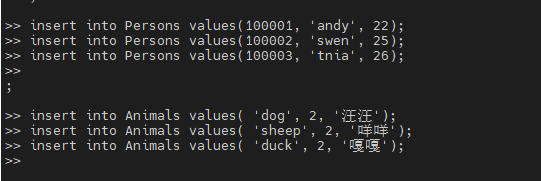

- 查询当前表相关信息。

**\# 查询表Persons**

```sql
select * from Persons;

select * from Persons where name='andy';
```

**\# 查询表Animals**

```sql
select * from Animals;

select * from Animals where voice='咩咩';
```

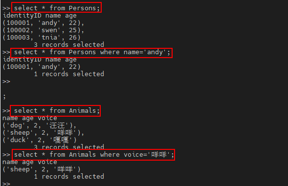

- 更新当前表相关信息。

**\# 更新表Persons**

```sql
update Persons set identityID=100005 where name='andy';

select * from Persons;
```

**\# 更新表Animals**

```sql
update Animals set age=3 where name='duck';
```

```sql
select * from Animals;
```

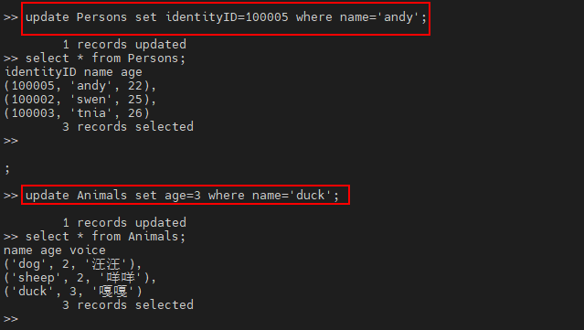

- 删除表相关信息并查看。

**\# 删除表Persons**

```sql
drop table Persons;
```

**\# 删除表Animals**

```sql
delete from Animals;
```

**\# 显示当前数据库的相关信息**

```sql
show
```

**\# 查看表Persons结构**

```sql
describe Persons;
```

**\# 查看表Animals结构**

```sql
describe Animals;
```

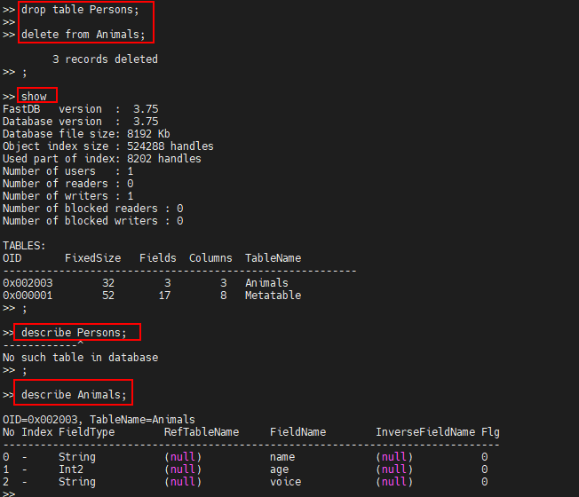


drop: 主要用于删除数据结构，包括内部的数据内容。

delete：主要用于删除数据内容，不删除数据结构。

- 执行以下命令退出数据库。

```sql
exit
```


### 卸载

13. 关闭数据库进程（可选）。

```
ps -ef | grep subsql

pkill subsql
```

14. 源码编译安装只是生成对应的文件，所以直接删除对应的目录即可。

```
rm -rf /opt/fastdb

ll /opt/fastdb
```

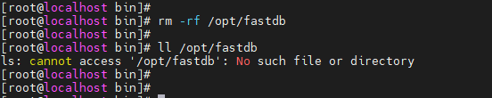


## 故障排除

### Make失败报错

问题现象描述

fastdb执行make命令编译安装时报错。

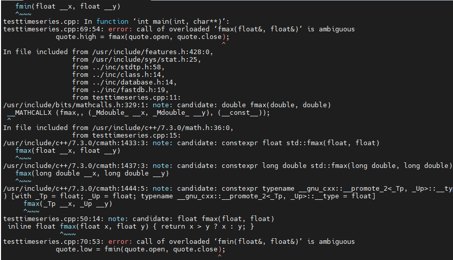

关键过程、根本原因分析

分析原因是testtimeseries.cpp文件中的fmax函数和fmin函数与cmath中的函数名同名导致的报错，只需改变testtimeseries.cpp中函数名即可。

结论、解决方案及效果

- 执行vi命令打开examples/testtimeseries.cpp文件。

```
vi examples/testtimeseries.cpp
```

- 在vi命令模式下，输入如下命令并保存。

```
:%s/fmax/fmax_t/g
:%s/fmin/fmin_t/g
:wq
```

- 重新执行make编译即可。

-----------------------------------------------------------------------
