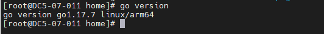
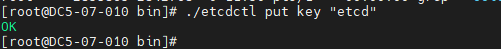
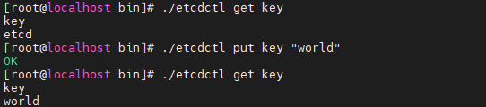
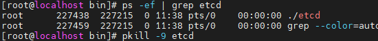
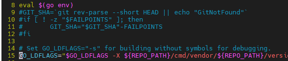

# 介绍

Etcd是一个高度一致的分布式键值存储，它提供了一种可靠的方式来存储需 要由分布式 系统或机器集群访问的数据。它可以优雅地处理网络分区期间的领导者选举，即使在领导  者节点中也可以容忍机器故障。

开发语言：C++ 

一句话描述：共享配置和服务发现的分布式存储。

建议的版本：Etcd-3.76

# 环境要求

## 硬件要求

| 项目       | 说明                                        |
| ---------- | ------------------------------------------- |
| 服务器名称 | TaiShan 200服务器（型号2280）               |
| 处理器     | Kunpeng 920 5250                            |
| 内存大小   | 32GB 2666MHz * 16                           |
| 网卡       | 1*10GE                                      |
| 硬盘       | OS：900GB SAS * 2  DATA：3.2T ES3000 V3 * 1 |

 

## 操作系统和软件要求

| 项目          | 版本                    |
| ------------- | ----------------------- |
| **OpenEuler** | **OpenEuler 22.03 LTS** |


# 源码编译安装和卸载

[ 关闭防火墙](#关闭防火墙)

[安装依赖包](#_安装依赖包)

[安装go环境](#_安装go环境)

[源码编译安装](#源码编译安装)

[验证Etcd](#_验证Etcd)

[源码编译安装方式卸载](#源码编译安装卸载)

## 关闭防火墙

说明：测试环境下通常会关闭防火墙以避免部分网络因素影响，视实际需求做配置。

- 停止防火墙。

```
systemctl stop firewalld.service
```

- 关闭防火墙。

```
systemctl disable firewalld.service
```

- 查看防火墙。

```
systemctl status firewalld.service
```

## 安装依赖包

- 配置yum源及安装基础依赖包。

```
yum -y install git gcc gcc-c++ vim*
```

## 安装go环境

- 下载go源码，本例将源码报放在/home路径。

```
wget https://dl.google.com/go/go1.17.7.linux-arm64.tar.gz
```

- 解压压缩包。

```
tar -zxvf go1.17.7.linux-arm64.tar.gz -C /usr/local
```

- 配置环境变量。

```
vim /etc/profile
```

在/etc/profile文件末尾添加以下配置，输入 :wq保存

```
export GOROOT=/usr/local/go
export PATH=$PATH:$GOROOT/bin
```

- 使环境变量生效。

```
source /etc/profile
```

- 查看安装路径。

```
ls /usr/local/go
```


- 查看版本号。

```
go version
```



## 源码编译安装

- 下载etcd源码，本例将源码报放在/home路径。

```
wget https://codeload.github.com/etcd-io/etcd/tar.gz/refs/tags/v3.1.20
mv v3.1.20 etcd-3.1.20.tar.gz
```

- 解压文件。

```
tar -zxvf etcd-3.1.20.tar.gz
```

- 配置环境变量。

```
vim /etc/profile
```

在/etc/profile文件末尾加入以下配置，输入:wq保存，因为etcd默认使用V2版本，这里需要V3版本的API。

```
export ETCDCTL_API=3
export ETCD_UNSUPPORTED_ARCH=arm64
```

- 使环境变量生效。

```
source /etc/profile
```

- 执行编译。

```
cd etcd-3.1.20
./build
```


编译过程中如出现报错：请参考[Not a git repository报错](#_Not a git repository 报错)和[no required module provides package报错](#_no required module provides package报错)和[Needed a single revision报错](#_Needed a single revision报错)。

- 查找安装路径，编译成功后，会在etcd-3.1.20/bin目录生成两个可执行文件etcd和etcdctl。

  

- 修改安装路径。将etcd-3.1.20文件夹的bin目录及etcd.conf.yml.sample文件，放到/usr/loca/etcd目录下，并查看路径。

```
mkdir -p /usr/local/etcd/conf
cp -r /home/etcd-3.1.20/bin /usr/local/etcd
cp -r /home/etcd-3.1.20/etcd.conf.yml.sample /usr/local/etcd/conf/etcd.conf
ls /usr/local/etcd
```


## 验证Etcd

- 启动Etcd。

  前台运行：

```
cd /usr/local/etcd/bin
./etcd
```


- 后台运行：


```
cd /usr/local/etcd/bin
nohup ./etcd >./nohup.out 2>&1 &
```


- 验证插入数据。

```
./etcdctl put key "etcd"
```



- 删除数据。

```
./etcdctl del key
```


- 查找数据。

```
./etcdctl get key
```


- 更改数据。更改命令用put即可。

```
./etcdctl put key "world"
```



- 退出数据。

  前台运行退出：

```
Ctrl+c
```

后台运行退出：查找etcd进程号结束进程,或者直接结束etcd进程。

```
ps -ef | grep etcd
kill -9 197152
```

或者：

```
pkill -9 etcd
```




## 卸载

- 卸载Etcd，如果正在运行，直接停止进程。

```
pkill -9 etcd
```


- 删除目录。源码编译安装只是生成对应的文件，所以直接删除对应的目录即可。

```
cd /usr/local
rm -rf etcd/
ls /usr/local/etcd
```


# 故障排除

## Not a git repository 报错

- 问题现象描述


​	编译过程中报错Not a git repository：提示不是git仓库。

- 关键过程、根本原因分析


​	git未初始化。

- 结论、解决方案及效果


通过初始化git，再重新编译。

```
git init
./build
```

## no required module provides package报错

- 问题现象描述


编译过程中报错：no required module provides package github.com/coreos/etcd/cmd/etcd: go.mod file not found


- 关键过程、根本原因分析


GO111MODULE模块未打开。

- 结论、解决方案及效果


执行命令：

```
go env -w GO111MODULE=auto
```

## Needed a single revision报错

- 问题现象描述


编译过程中报错fatal: Needed a single revision：提示需要校对。

- 关键过程、根本原因分析


etcd在编译过程中会将本地代码与远程代码进行比较（校对），执行build时脚本会停止。

- 结论、解决方案及效果


修改build脚本，将第9-12行代码注释掉，按:wq保存退出。

```
cd etcd-3.1.20
vim build
```



3.  重新执行编译。

```
./build
```

# 修订记录

| 发布日期 | 修订记录       |
| -------- | -------------- |
| 2023-2-9 | 第一次正式发布 |

-----------------------------------------------------------------------
