# Greenplum 6.12.1 for openEuler 20.03 SP1 LTS编译指南

##  介绍

Greenplum是一个面向数据仓库应用的关系型数据库，因为有良好的体系结构，所以在数据存储、高并发、高可用、线性扩展、反应速度、易用性和性价比等方面有非常明显的优势。Greenplum是一种基于PostgreSQL的分布式数据库，其采用shared nothing架构，主机、操作系统、内存、存储都是自我控制的，不存在共享。本质上讲Greenplum是一个关系型数据库集群，它实际上是由数个独立的数据库服务组合成的逻辑数据库。与RAC不同，这种数据库集群采取的是MPP（Massively Parallel Processing）架构。关于Greenplum的更多信息请访问Greenplum官网。

一句话描述：分布式关系型数据库。

**建议的版本**

建议使用的版本为"Greenplum 6.12.1"。

**说明**

本文档适用于Greenplum 6.12.1，其他版本的Greenplum编译步骤可参考本文档。

##  环境要求

### 硬件要求

| **项目** | **说明**                                                     |
| -------- | ------------------------------------------------------------ |
| 服务器   | TaiShan 200 服务器（型号2280）                               |
| CPU      | 华为鲲鹏920处理器                                            |
| 硬盘     | 进行性能测试时，数据目录需使用单独硬盘，即一个系统盘，一个数据盘，至少两块硬盘。  非性能测试时，直接在系统盘上建数据目录即可。  具体硬盘数量根据实际需求配置。 |

### 操作系统要求

| **项目**  | **版本**              |
| --------- | --------------------- |
| openEuler | 20.03 SP1 LTS for ARM |

**说明**

如果是全新安装操作系统，可选择"Minimal Install"安装方式并勾选Development Tools套件，否则很多软件包需要手动安装。

### 软件要求

| **项目**  | **下载地址**                                                 | **版本** |
| --------- | ------------------------------------------------------------ | -------- |
| Greenplum | https://codeload.github.com/greenplum-db/gpdb/tar.gz/refs/tags/6.12.1 | 6.12.1   |

------------- ----------------------------------------------------------------------- ------------------

##  配置安装环境

### 关闭防火墙并取消开机自启动

**说明**

测试环境下通常会关闭防火墙以避免部分网络因素影响，视实际需求做配置。

**步骤1 停止防火墙。**

-----------------------------------------------------------------------
```
  systemctl stop firewalld.service
```

-----------------------------------------------------------------------

**步骤2 关闭防火墙。**

-----------------------------------------------------------------------
```
  systemctl disable firewalld.service
```

-----------------------------------------------------------------------

**说明**

执行disable命令关闭防火墙的同时，也取消了开机自启动。

**步骤3 查看防火墙。**

```
systemctl status firewalld.service
```

> 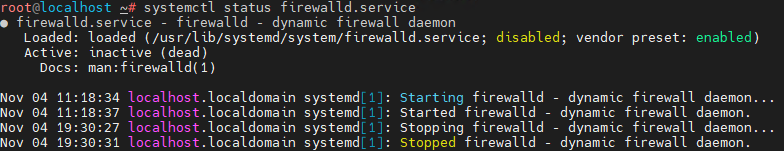 

### 修改SELINUX 为disabled

**步骤1 修改配置文件。**

```
 sed -i 's/SELINUX=enforcing/SELINUX=disabled/g' /etc/selinux/config 
 cat /etc/selinux/config                                               
```

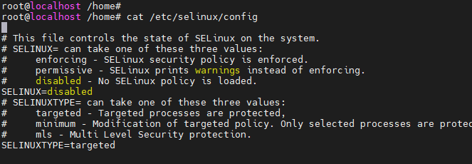


###  修改系统配置

**步骤1 编辑/etc/security/limits.conf配置文件，增加配置。**

```
 vi /etc/security/limits.conf   
 
 * soft nofile 65536                                                  
 * hard nofile 65536                                                 
 * soft nproc 131072                                                  
 * hard nproc 131072         
```

​                                         

###  优化内核参数

**步骤1 编辑/etc/sysctl.conf配置文件，增加配置。**

```
 vi /etc/sysctl.conf                                                
 kernel.shmmax = 500000000                                          
 kernel.shmmni = 4096                                                  
 kernel.shmall = 4000000000                                           
 kernel.sem = 250 512000 100 2048                                     
 kernel.sysrq = 1                                                      
 kernel.core_uses_pid = 1                                              
 kernel.msgmnb = 65536                                                 
 kernel.msgmax = 65536                                                 
 kernel.msgmni = 2048                                                 
 net.ipv4.tcp_max_syn_backlog = 4096                                   
 net.ipv4.ip_local_port_range = 1025 65535                             
 net.core.netdev_max_backlog = 10000                                   
 net.core.rmem_max = 2097152                                          
 net.core.wmem_max = 2097152                                           
 vm.overcommit_memory = 2                                              
```

**步骤2 配置生效。**

```
  sysctl -p
```

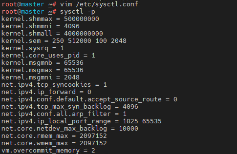


### 搭建数据盘 

**步骤1 创建分区（以/dev/sda为例，根据实际情况创建）。**

```
fdisk /dev/sda
```

1.输入字母p打印分区表，按回车可以打印出当前的分区。

2.输入字母n添加一个新的分区，按回车确认。

3.输入数字1（作为第一块主分区）创建新的分区，按回车确认。

4.设置选择分区start值，采用默认配置，按回车确认。

5.设置选择分区end值，采用默认配置，按回车确认。

6.输入字母p查看最新分区表，按回车可以打印出当前的分区。

7.输入w将最新分区表保存至磁盘中，按回车保存。

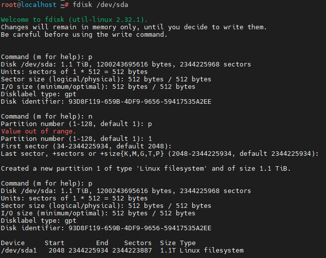


**步骤2 针对新创建的分区创建文件系统（以xfs为例，根据实际需求创建文件系统)。**

```
  mkfs.xfs -f /dev/sda1
```

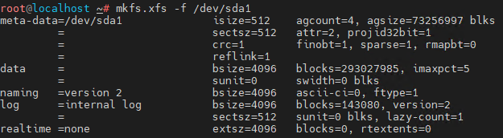

**步骤3 挂载分区到"/data"。**

```
 mkdir /data                                                           
 mount /dev/sda1 /data                                                 
```

**步骤4 编辑"/etc/fstab"使重启后自动挂载数据盘。**

```
 vi /etc/fstab                                                         
 /dev/sda1 /data xfs defaults 1 2                                      
```

**说明**

如下图中，添加最后一行内容。其中，/dev/sda1为示例，具体名称以实际情况为准。

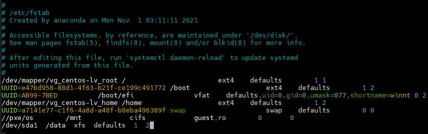


###  创建组和用户 

**说明**

服务器环境下，为了系统安全，通常会为进程分配单独的用户，以实现权限隔离。创建的组和用户都是操作系统层面的，不是数据库层面的。

**步骤1 创建mysql用户（组）。**

```
 groupadd gpadmin                                                      
 useradd -g gpadmin gpadmin                                           
```

**步骤2 设置mysql用户密码。**

```
  passwd gpadmin
```

重复输入密码（根据实际需求设置密码）。

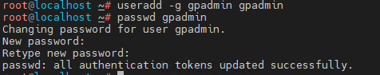


### 创建数据库目录并且授权  

**步骤1 创建数据目录/data和进程所需的相关目录。**

```
 mkdir -p /data/gpdb/segdata                                          
 mkdir -p /data/gpdb/master                                           
```

**步骤2** 数据目录授权gpadmin用户和组。

```
 chown -R gpadmin:gpadmin /data/gpdb/segdata                           
 chown -R gpadmin:gpadmin /data/gpdb/master                           
```

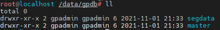


##  配置编译环境

**安装依赖包**

-----------------------------------------------------------------------
```
yum -y install cmake gcc gcc-c++ curl-devel bzip2-devel python python-devel openssl-devel readline-devel perl-ExtUtils-Embed libxml2-devel openldap-devel pam pam-devel perl-devel apr-devel libevent-devel libyaml libffi-devel libzstd-devel bison flex libyaml-devel libedit-devel flex-devel git autoconf automake libtool
```


##  安装python依赖包

### 安装 setuptools

**步骤1 下载setuptools依赖包。**

```
 cd /opt                                                               
 wget https://codeload.github.com/pypa/setuptools/tar.gz/refs/tags/v29.0.1  
```

**步骤2 将软件包上传至服务器"/opt"目录中并解压。**

```
 tar -xvf v29.0.1
```

**步骤3 安装setuptools。**

```
 cd setuptools-29.0.1                                                  
 python bootstrap.py                                                   
 python setup.py install                                               
```

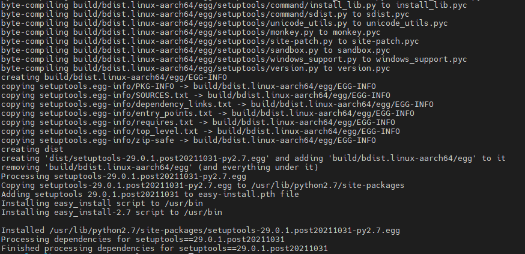


### 安装 psutil

**步骤1 下载psutil依赖包。**

```
cd /opt                                                               
wget https://files.pythonhosted.org/packages/e1/b0/7276de53321c12981717490516b7e612364f2cb372ee8901bd4a66a000d7/psutil-5.8.0.tar.gz 
```

**步骤2 将软件包上传至服务器"/opt"目录中并解压。**

```
 tar -xvf psutil-5.8.0.tar.gz
```

**步骤3 安装psutil。**

```
 cd psutil-5.8.0                                                       
 python setup.py install                                               
```

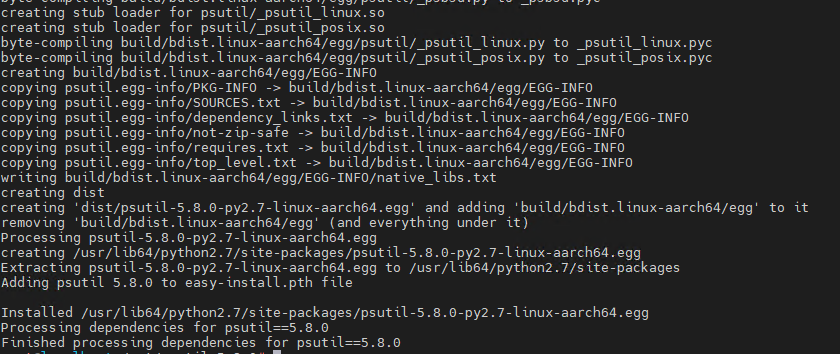


### 安装 pbr

**步骤1 下载pbr依赖包。**

```
cd /opt                                                               
wget https://files.pythonhosted.org/packages/35/8c/69ed04ae31ad498c9bdea55766ed4c0c72de596e75ac0d70b58aa25e0acf/pbr-5.6.0.tar.gz 
```

**步骤2 将软件包上传至服务器"/opt"目录中并解压。**

```
 tar -xvf pbr-5.6.0.tar.gz
```

**步骤3 安装pbr。**

```
 cd pbr-5.6.0                                                          
 python setup.py install                                              
```

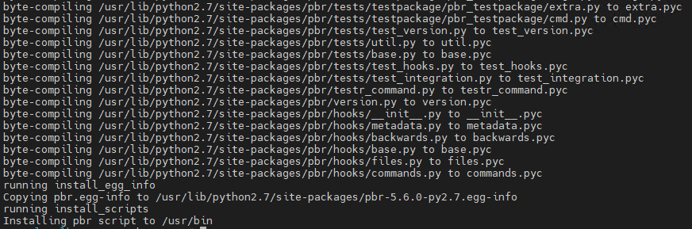


### 安装lockfile

**步骤1 下载lockfile依赖包。**

```
cd /opt                                                              
wget https://files.pythonhosted.org/packages/17/47/72cb04a58a35ec495f96984dddb48232b551aafb95bde614605b754fe6f7/lockfile-0.12.2.tar.gz 
```

**步骤2 将软件包上传至服务器"/opt"目录中并解压。**

```
 tar -xvf lockfile-0.12.2.tar.gz
```

**步骤3 安装lockfile。**

```
 cd lockfile-0.12.2                                                    
 python setup.py install                                               
```

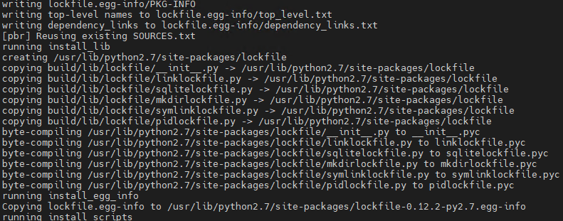


### 安装pycparser

**步骤1 下载pycparser依赖包。**

```
cd /opt                                                               
wget https://files.pythonhosted.org/packages/0f/86/e19659527668d70be91d0369aeaa055b4eb396b0f387a4f92293a20035bd/pycparser-2.20.tar.gz 
```

**步骤2 将软件包上传至服务器"/opt"目录中并解压。**

```
 tar -xvf pycparser-2.20.tar.gz
```

**步骤3 安装pycparser。**

```
 cd pycparser-2.20                                                     
 python setup.py install                                              
```

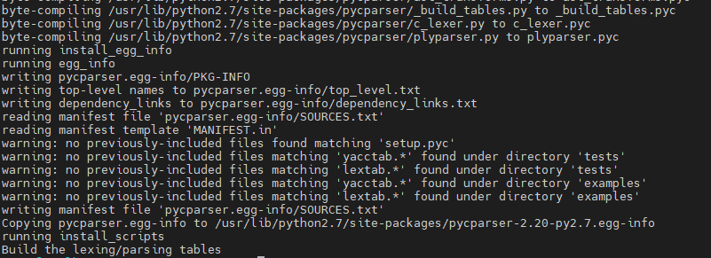


###  安装cffi

**步骤1 下载cffi依赖包。**

```
cd /opt                                                               
wget https://files.pythonhosted.org/packages/00/9e/92de7e1217ccc3d5f352ba21e52398372525765b2e0c4530e6eb2ba9282a/cffi-1.15.0.tar.gz 
```

**步骤2 将软件包上传至服务器"/opt"目录中并解压。**

```
 tar -xvf cffi-1.15.0.tar.gz
```

**步骤3 安装cffi。**

```
 cd cffi-1.15.0                                                       
 python setup.py install                                               
```

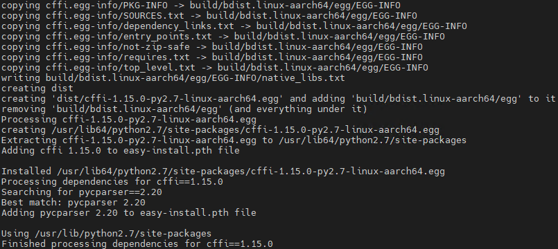


### 安装six

**步骤1 下载six依赖包。**

```
cd /opt                                                               
wget https://files.pythonhosted.org/packages/71/39/171f1c67cd00715f190ba0b100d606d440a28c93c7714febeca8b79af85e/six-1.16.0.tar.gz 
```

**步骤2 将软件包上传至服务器"/opt"目录中并解压。**

```
 tar -xvf six-1.16.0.tar.gz
```

**步骤3 安装six。**

```
cd six-1.16.0                                                        
python setup.py install                                               
```

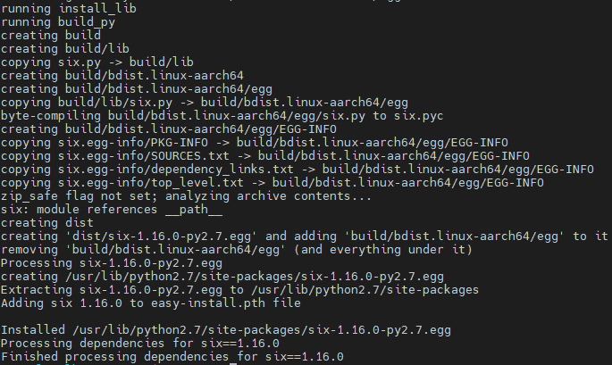


### 安装bcrypt

**步骤1 下载bcrypt依赖包。**

```
cd /opt                                                            
wget https://files.pythonhosted.org/packages/d8/ba/21c475ead997ee21502d30f76fd93ad8d5858d19a3fad7cd153de698c4dd/bcrypt-3.2.0.tar.gz 
```

**步骤2 将软件包上传至服务器"/opt"目录中并解压。**

```
tar -xvf bcrypt-3.2.0.tar.gz
```

**步骤3 安装bcrypt。**

```
cd bcrypt-3.2.0  
python setup.py install  
```


### 安装PyNaCl

**步骤1 下载PyNaCl依赖包。**

```
cd /opt             
wget https://files.pythonhosted.org/packages/cf/5a/25aeb636baeceab15c8e57e66b8aa930c011ec1c035f284170cacb05025e/PyNaCl-1.4.0.tar.gz 
```

**步骤2 将软件包上传至服务器"/opt"目录中并解压。**

```
tar -xvf PyNaCl-1.4.0.tar.gz
```

**步骤3 安装PyNaCl。**

```
cd PyNaCl-1.4.0                       
python setup.py install                   
```

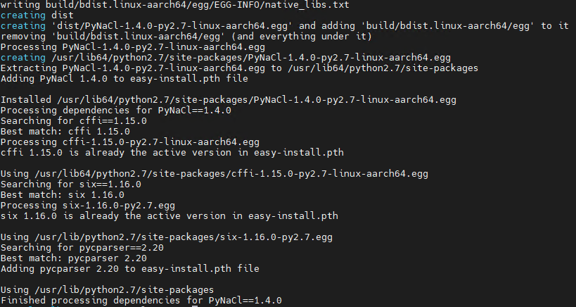


### 安装ipaddress

**步骤1 下载ipaddress依赖包。**

```
cd /opt  
wget https://files.pythonhosted.org/packages/b9/9a/3e9da40ea28b8210dd6504d3fe9fe7e013b62bf45902b458d1cdc3c34ed9/ipaddress-1.0.23.tar.gz 
```

**步骤2 将软件包上传至服务器"/opt"目录中并解压。**

```
 tar -xvf ipaddress-1.0.23.tar.gz
```

**步骤3 安装ipaddress。**

```
 cd ipaddress-1.0.23                                                  
 python setup.py install                                              
```

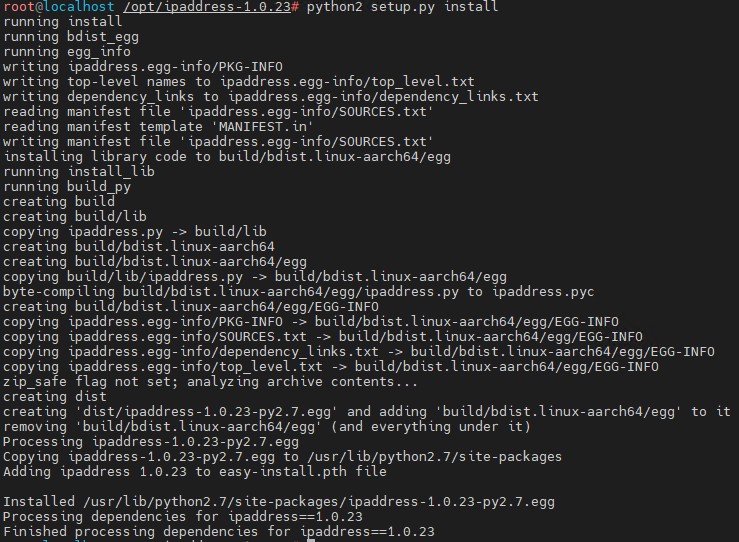


### 安装enum34

**步骤1 下载enum34依赖包。**

```
cd /opt                                                              
wget https://files.pythonhosted.org/packages/11/c4/2da1f4952ba476677a42f25cd32ab8aaf0e1c0d0e00b89822b835c7e654c/enum34-1.1.10.tar.gz 
```

**步骤2 将软件包上传至服务器"/opt"目录中并解压。**

```
 tar -xvf enum34-1.1.10.tar.gz
```

**步骤3 安装enum34。**

```
 cd enum34-1.1.10                                                  
 python setup.py install                                               
```

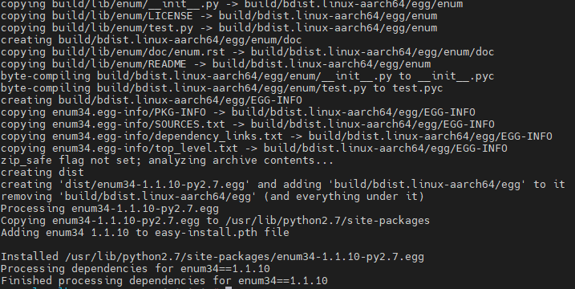


###  安装cryptography

**步骤1 下载cryptography依赖包。**

```
cd /opt   
wget https://files.pythonhosted.org/packages/be/60/da377e1bed002716fb2d5d1d1cab720f298cb33ecff7bf7adea72788e4e4/cryptography-2.8.tar.gz 
```

**步骤2 将软件包上传至服务器"/opt"目录中并解压。**

```
tar -xvf cryptography-2.8.tar.gz
```

**步骤3 安装cryptography。**

```
cd cryptography-2.8                                              
python setup.py install                                             
```

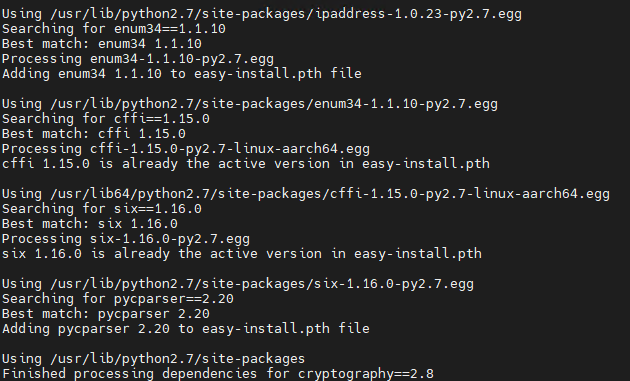


###  安装paramiko

**步骤1 下载paramiko依赖包。**

```
cd /opt                                                              
wget https://files.pythonhosted.org/packages/dd/67/6b3a5f3d730b15b5ff77d13e6f05f9189ae44d8a8bad4967d16694eaac8b/paramiko-2.8.0.tar.gz 
```

**步骤2 将软件包上传至服务器"/opt"目录中并解压。**

```
 tar -xvf paramiko-2.8.0.tar.gz
```

**步骤3 安装paramiko。**

```
 cd paramiko-2.8.0  
 python setup.py install                                            
```

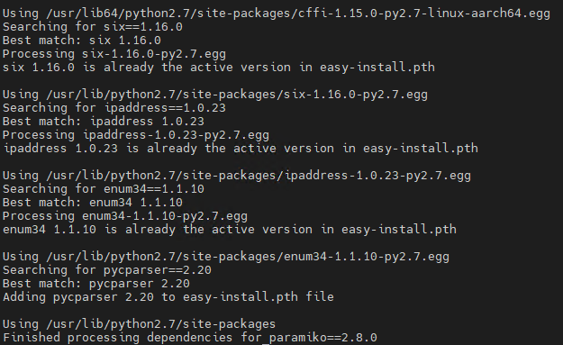


### 安装epydoc

**步骤1 下载epydoc依赖包。**

```
cd /opt                                                
wget https://files.pythonhosted.org/packages/60/a7/666cb415b0f5d8d5c99f145e03a6005220090d7b77637871ac52c2cabcba/epydoc-3.0.1.tar.gz 
```

**步骤2 将软件包上传至服务器"/opt"目录中并解压。**

```
 tar -xvf epydoc-3.0.1.tar.gz
```

**步骤3 安装epydoc。**

```
 cd epydoc-3.0.1  
 python setup.py install          
```

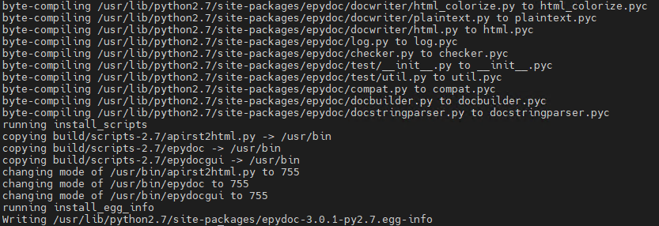


###  安装xerces

**步骤1 下载xerces依赖包。**

```
 cd /opt                                                            
 wget https://codeload.github.com/greenplum-db/gp-xerces/tar.gz/refs/tags/v3.1.2-p1 
```

**步骤2 将软件包上传至服务器"/opt"目录中并解压。**

```
tar -xvf v3.1.2-p1
```

**步骤3 编译安装xerces。**

```
 cd gp-xerces-3.1.2-p1       
 ./configure                                                          
```

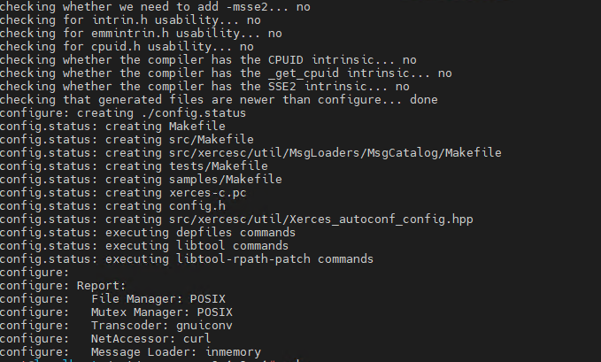


```
 make -j `nproc`
```

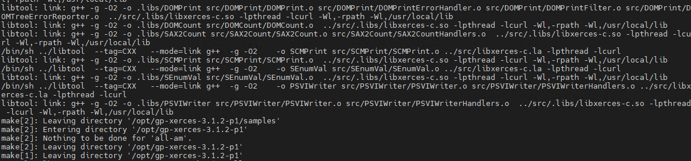

  make install

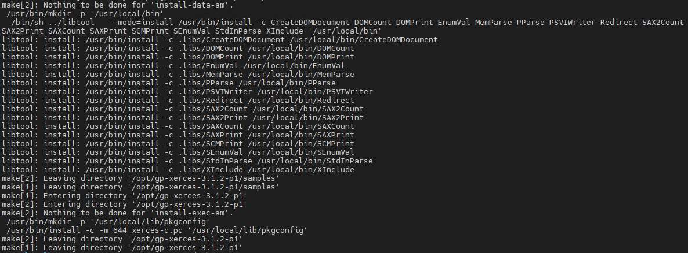

**步骤4 设置环境变量，加载动态库**。

```
 vi /etc/profile   
```

 #在文件末尾追加下面的内容                                           

```
 export LD_LIBRARY_PATH=${LD_LIBRARY_PATH}:/usr/local/lib            
```

 #使环境变量生效                                                      

```
 source /etc/profile                                      
```


###  安装re2c

**步骤1 下载re2c依赖包。**

```
 cd /opt                                                              
 wget https://codeload.github.com/skvadrik/re2c/tar.gz/refs/tags/2.0.3 
```

**步骤2 将软件包上传至服务器"/opt"目录中并解压。**

```
 tar -xvf 2.0.3
```

**步骤3 编译安装re2c。**

```
 cd re2c-2.0.3          
 ./autogen.sh                                                   
 ./configure                                                          
 make -j `nproc`                                                     
```

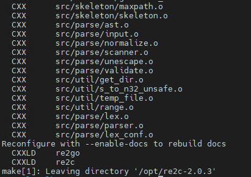

```
 make install
```

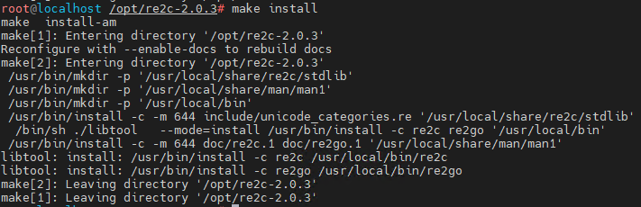


##  编译安装

### 源码安装

**步骤1 获取Greenplum源码包。**

```
 cd /home/                                                             
 wget https://codeload.github.com/greenplum-db/gpdb/tar.gz/refs/tags/6.12.1 
 tar -xvf 6.12.1                                                       
 cd gpdb-6.12.1                                                       
```

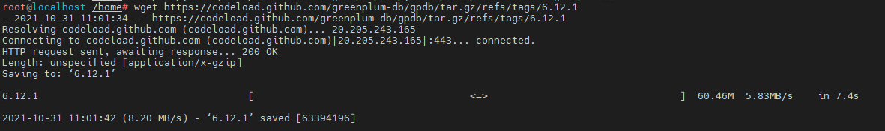

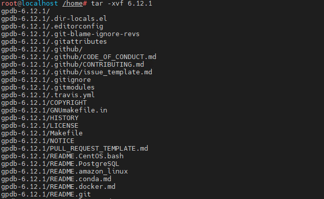

**步骤2 编译安装Greenplum**

**说明**

编辑/home/gpdb-6.12.1/src/backend/gporca/libgpos/include/gpos/utils.h，修改部分内容如下：

将23行和24行的movq指令进行替换。

```
vi /home/gpdb-6.12.1/src/backend/gporca/libgpos/include/gpos/utils.h
#define GPOS_ASMFP __asm__( \
                      "mov x0, xzr\n\t" \
                      "mov x1, %[ARG0_64]\n\t" \
                      "b .Lfunc_end_kpt_1\n\t" \
                      ".Lfunc_end_kpt_1:\n\t" \
                      : \
                      :[ARG0_64]"r"(&ulp) \
                      :"x0", "x1" \
                      );
#define GPOS_ASMSP __asm__( \
                      "mov x0, xzr\n\t" \
                      "mov x1,%[ARG0_64]\n\t" \
                      "sub x8, sp, #1024\n\t" \
                      "str x8, [x1]\n\t" \
                      "b .Lfunc_end_kpt_2\n\t" \
                      ".Lfunc_end_kpt_2:\n\t" \
                      : \
                      :[ARG0_64]"r"(&ulp) \
                      :"x0", "x1" \
                      );

```


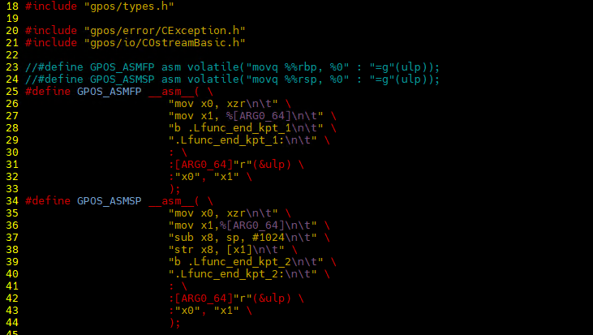

```
./configure --with-perl --with-python --with-libxml --prefix=/usr/local/gpdb
```

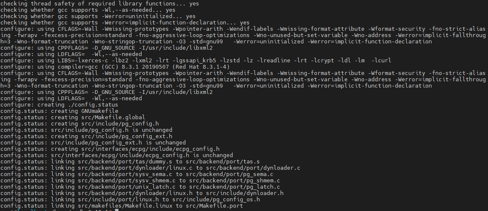

```
make -j `nproc`
```

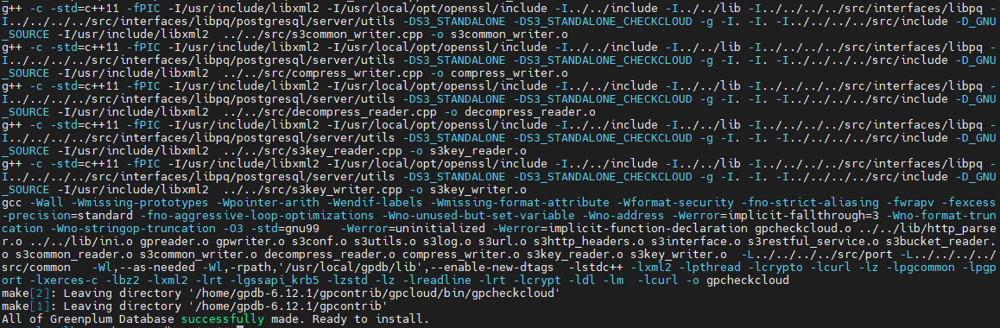{width="6.38125in" height="2.09375in"}

```
 make install
```

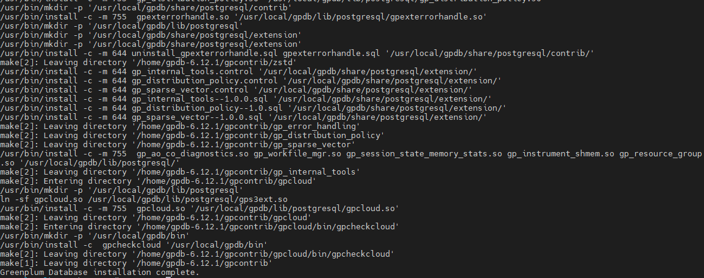


##  运行

**步骤1 进行数据库基础准备。**

1.安装net-tools工具。

```
 yum install -y net-tools
```

2.加载动态库。

```
echo /usr/local/lib >/etc/ld.so.conf
ldconfig
```

3.修改主机名为master，如果已修改，不需要重复修改。

```
hostname master
echo master > /etc/hostname
```

logout退出登录，重新连接后生效。

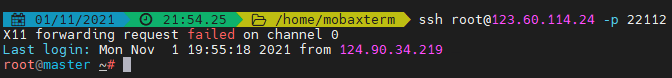

4.将主机名的map写入到"/etc/hosts"中，具体IP地址和主机名以实际情况为准。

```
echo 192.18.10.4 master >>/etc/hosts
```

5.创建集群主机配置文件。

```
echo master >> /data/gpdb/hostfile
```

**步骤2 进行数据库初始化。**

1.切换至gpadmin用户。

```
 su - gpadmin
```

2.配置环境变量。

```
source /usr/local/gpdb/greenplum_path.sh
export PGPORT=5432
export MASTER_DATA_DIRECTORY=/data/gpdb/master/gpseg-1
```

3.配置集群节点间互信。

```
gpssh-exkeys -h 'master'
```

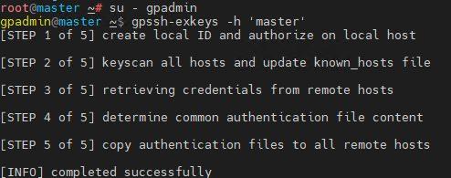

4.创建初始化配置文件init.config。

```
vi init.config
添加如下内容：
ARRAY_NAME="Greenplum Cluster"
SEG_PREFIX=gpseg
PORT_BASE=40000
declare -a DATA_DIRECTORY=(/data/gpdb/segdata /data/gpdb/segdata)
MASTER_HOSTNAME=master
MASTER_DIRECTORY=/data/gpdb/master
MASTER_PORT=5432
TRUSTED_SHELL=ssh
CHECK_POINT_SEGMENTS=8
ENCODING=UNICODE
DATABASE_NAME=gpdb
MACHINE_LIST_FILE=/data/gpdb/hostfile
```

5.执行初始化命令。

```
gpinitsystem -c init.config -a
```

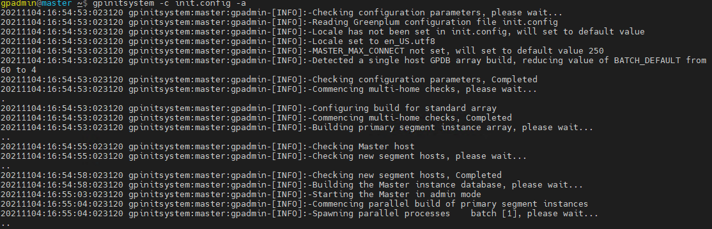

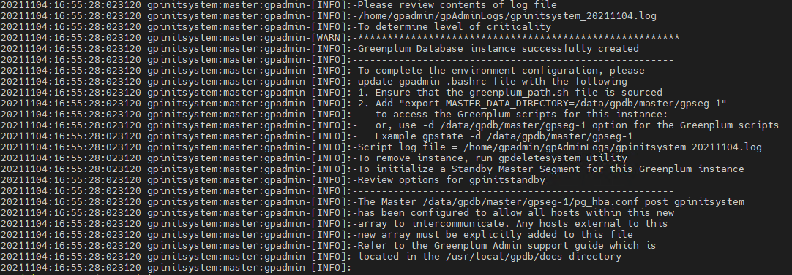

6.查看postgres

```
ps -ef | grep postgres
```

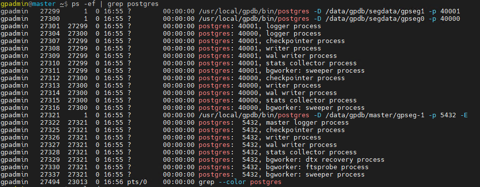

7.停止postgres进程。

```
pkill postgres
```

**步骤3 gp基本功能验证。**

1.启动Greenplum数据库。

```
gpstart -a
```

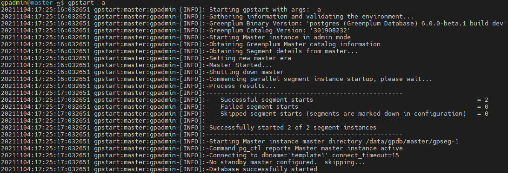

2.查看mirror的状态。

```
gpstate -e
```

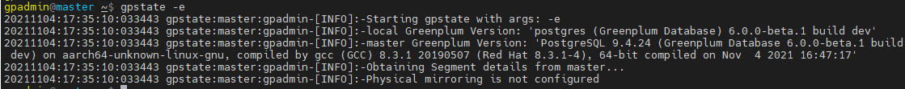

3.查看standby master的状态。

```
gpstate -f
```

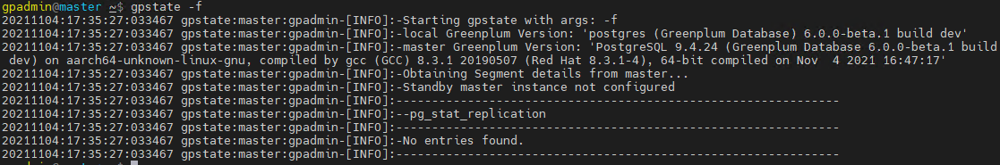

4.查看整个GP的版本。

```
gpstate -i
```

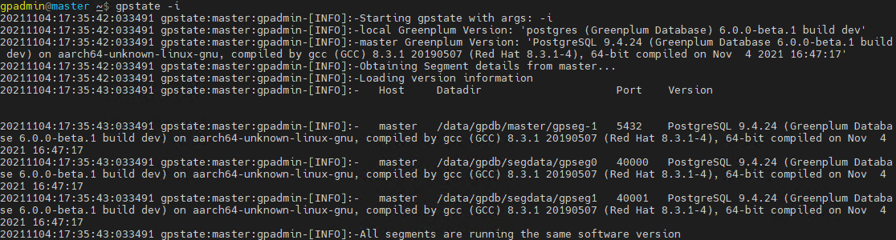

5.关闭Greenplum数据库。

```
 gpstop -a
```

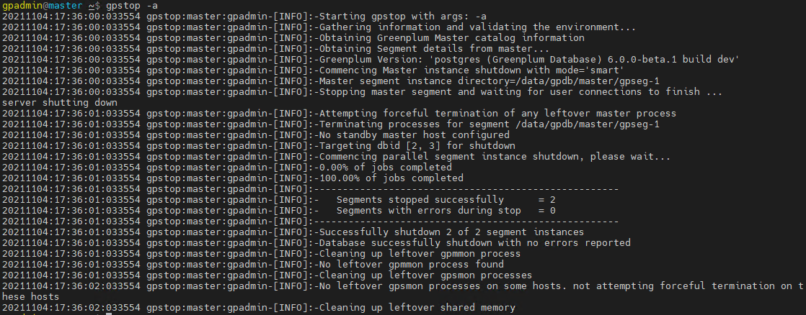

**步骤4 psql基本操作验证。**

1.启动Greenplum数据库。

```
gpstart -a
```


2.连接数据库。

```
psql -d postgres
```

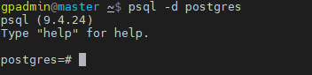

postgres是gp默认创建的数据库。

**说明**

可以使用psql -d \<数据库\>连接已经创建好的数据库。

3.创建greenplum database。

```
create database greenplum;
```

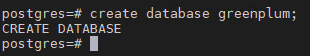

4.切换数据库greenplum。

```
\c greenplum;
```

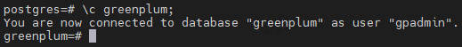

5.创建数据表。

```
CREATE TABLE tab_gp (id integer PRIMARY KEY,name varchar,age integer,version varchar) DISTRIBUTED BY (id);
```

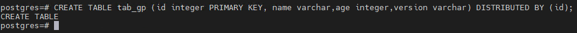

6.插入数据。

```
insert into tab_gp (id,name,age,version) values (1,'gp',5,'6.12.1');
```

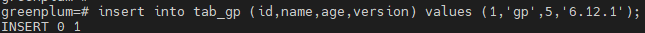

7.查看tab_gp表。

```
select * from tab_gp;
```

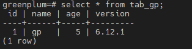

8.删除数据。

```
delete from tab_gp where name='gp';
```

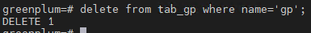

9.查看tab_gp表。

```
select * from tab_gp;
```

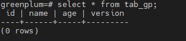

10.删除表格。

```
drop table tab_gp;
```

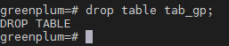

11.退出数据库。

```
\q
```


12.关闭数据库。

```
gpstop -a
```

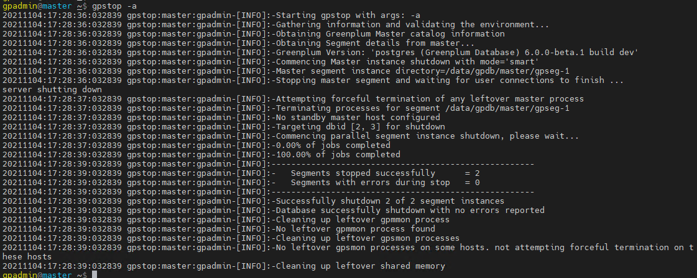

