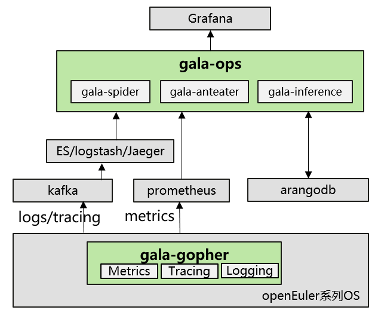
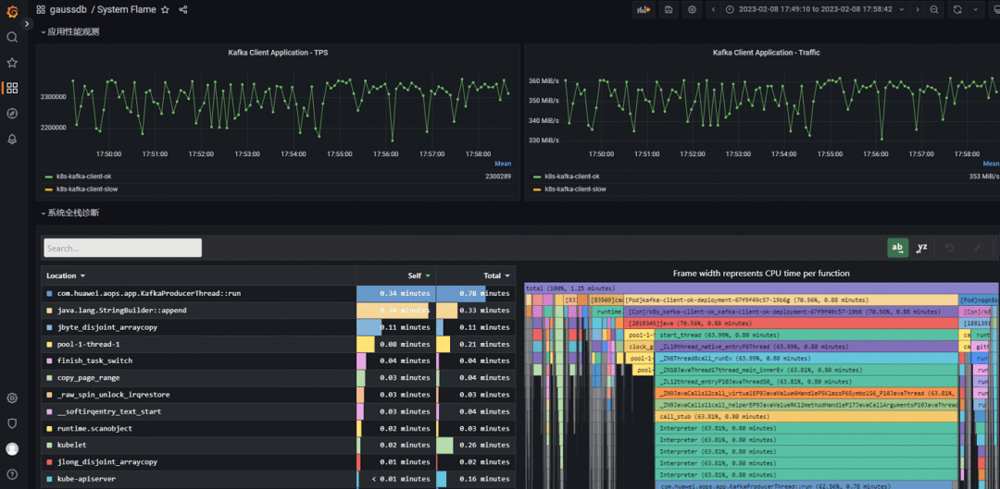
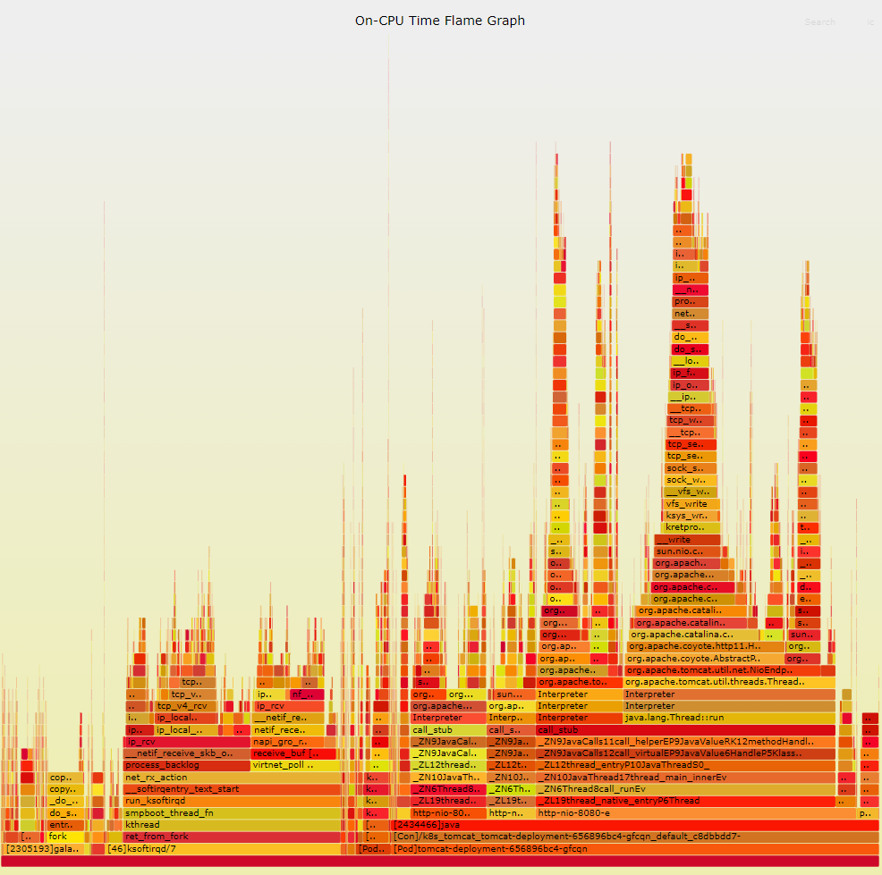
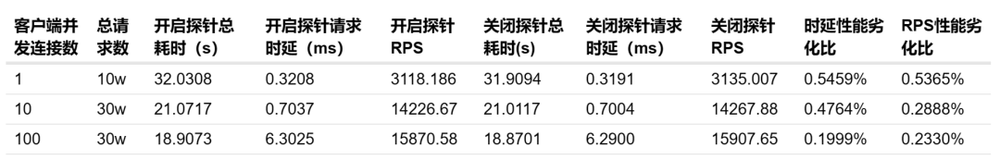
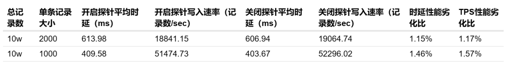

对于开发及运维人员来讲，火焰图是一个经典的定位性能问题的方法。利用火焰图可以可视化系统资源（cpu占用、内存占用、调度、IO等）的占用情况，从而帮助技术人员快速定位资源异常使用的代码级根因，或者观察潜在性能劣化趋势，进而优化系统和应用的性能。

然而，现有流行的火焰图工具往往存在一个或多个局限性，实际应用场景比较有限。因此，openEuler上的开源项目A-Ops中的gala-ops系列组件提供了**适用于云原生的全栈持续性能监测火焰图**。

# 传统火焰图在实际应用中的痛点

1.传统火焰图工具相对独立，难以对接第三方插件或集成到运维系统，在应用中需要有经验的开发人员手动结合其他调试工具分析定位。

2.由于开销较大，火焰图大多仅仅作为工具在开发和调试阶段被使用，不能在生产环境中常态化部署。所以对于更常见的场景------即实际生产环境中的突发性的性能问题，火焰图并不是定位问题的有效手段。

3.生产环境上中部署的应用类型错综复杂，语言纷繁多样，而且很多应用是会调用不同语言的模块。但是每种火焰图工具往往只针对单一类型的语言。即使同时部署了不同语言的火焰图观测工具，所生成的火焰图数据又难以统一，从系统角度难以观测不同语言应用的性能占比。

4.传统火焰图往往只能观测进程，线程粒度，是host时代的工具。对于云原生系统更关注的容器粒度，传统火焰图无法直观区分。

# gala-ops火焰图的四大特性

## 

## 1.易于部署和集成

[gala-ops 14](https://gitee.com/openeuler/gala-docs)是针对云基础设施灰度故障的应用级/系统级在线诊断工具，[火焰图探针stackprobe 7](https://gitee.com/openeuler/gala-gopher/tree/master/src/probes/extends/ebpf.probe/src/stackprobe)集成在其中的gala-gopher组件内。用户只需一键安装gala-gopher后，在配置文件中开启或关闭火焰图探针即可使用。具体的安装部署说明可参考[gala-gopher文档 4](https://gitee.com/openeuler/gala-gopher#%E5%BF%AB%E9%80%9F%E5%BC%80%E5%A7%8B)。

gala-ops火焰图默认会在本地生成svg格式的火焰图。另外它也支持pyroscope和grafana等第三方运维平台，仅需在配置文件中填上第三方插件的地址，火焰图探针程序就会定期自动将火焰图数据上传到远端以方便后续分析和实时监测。

以下是gala-ops
cpu火焰图对接pyroscope和grafana的示例。通过选择特定时间段，可以查看到该时间段的火焰图，函数cpu占比排序，配合其他系统或应用指标可以很方便地发现和定位问题。

## 2.容器支持

云原生系统中，应用以容器形式部署。传统火焰图中在进行系统级观测时，最多体现线程名称，若不同容器示例内线程名相同，则调用栈会合并在一起无法区分，影响后续定位定界。gala-ops火焰图探针能够自动识别本机中的pod和container，并在图里增加工作负载，容器和进程号信息。若进程为工作负载/容器内进程，则分别以\[Pod\]和\[Con\]前缀标记pod和container，进程以\[\<pid\>\]前缀标记。

效果图参见下一段附图，可见通过查看调用栈底部第一层，可以明显区分主机进程和容器进程。

## 3.全栈支持

gala-ops火焰图支持编译型和解释型语言的混合代码调用栈解析。目前已支持的语言包括C，C++，GO，Rust，JAVA。不同语言的应用，同一调用栈中不同语言的函数/方法，用户态和内核态，均可在同一火焰图中统一显示。而且使用gala-ops火焰图前不需要针对不同的语言做额外配置或重新部署应用，即开即用。

下图显示了一个实测生成的gala-ops
cpu火焰图，以右侧的一个tomcat容器调用栈为例，从底层往顶层看调用关系：tomcat
pod内包含一个container，containter中有一个pid为2434466的java进程，进程内cpu占用最多的是名为http-nio-8080-e的JVM线程，JVM调用了C库函数thread_native_entry，再往上进入了Java方法java.lang.Thread::run，然后经过一系列的Java方法调用，最终走到了ksys_write系统调用，然后进入内核态函数。这样一个Java进程**从k8s层-\>OS层-\>JVM底层实现-\>Java方法-\>内核态函数**------完整的调用过程就可以通过gala-ops火焰图追溯到。

## 4.低开销

gala-ops火焰图基于ebpf技术，精简堆栈采样逻辑，**实现保持采样精度（cpu采样频率10ms）的同时对被观测应用性能影响很小（一般在1%左右）**。因此，大规模生产环境中也可以持续开启gala-ops火焰图以实时观测应用性能，这样即使出现应用或系统故障，无需事后重现问题，通过gala-ops火焰图可以回溯以往任意时刻的系统状态。

我们测试了开关cpu火焰图对不同应用的性能影响：对于本身性能中等，吞吐量中等的应用，例如tomcat，tps劣化在1%以下；对于本身性能较高，吞吐量大的应用，例如kafka，tps劣化在2%以下。结果如下：

对比开关cpu火焰图探针对tomcat性能的影响：

对比开关cpu火焰图探针对kafka写入MQ消息性能的影响：

gala-ops火焰图具有**易于部署和集成，容器支持，全栈支持，低开销**等特性，使得开发者和维护者无论在开发环境还是生产环境均可通过火焰图的形式预测潜在问题和定位已发生问题。

# 功能的持续完善

目前gala-ops火焰图已经支持cpu占用，内存泄漏两种类型火焰图，后续还会加入对其他系统资源的观测，例如调度、网络IO、磁盘IO等。此外，对其他语言应用的支持也在持续开发中。

欢迎大家使用gala-ops火焰图，也欢迎大家交流和反馈意见，[点击链接](https://forum.openeuler.org/t/topic/464)，即可到openEuler论坛参与讨论！
