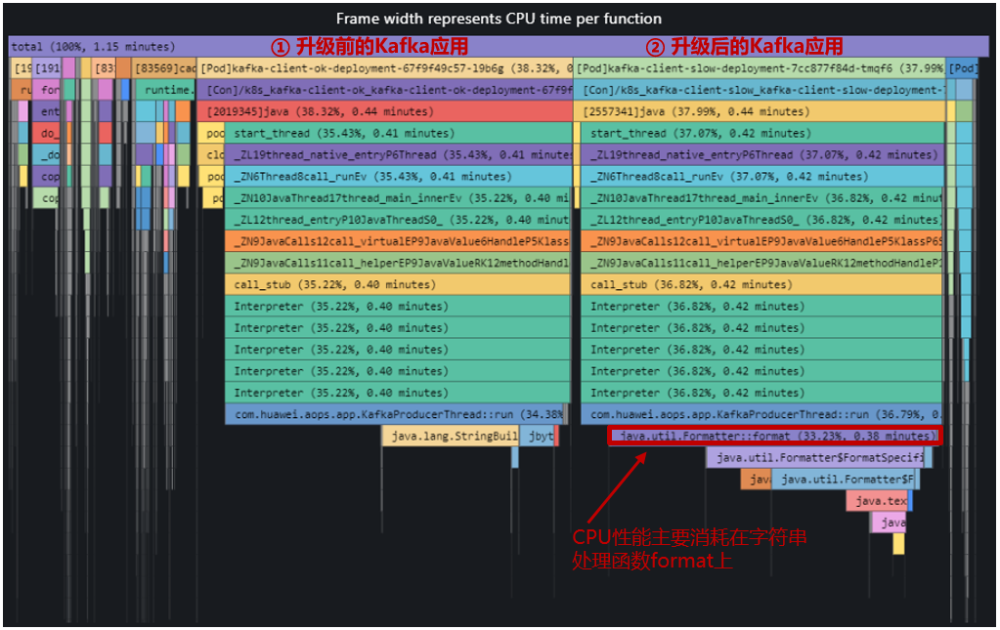
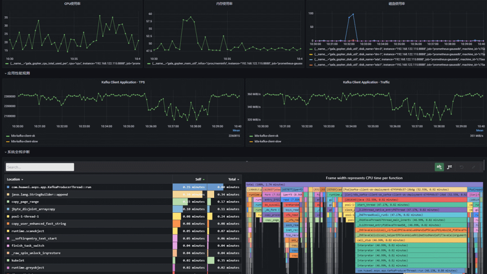
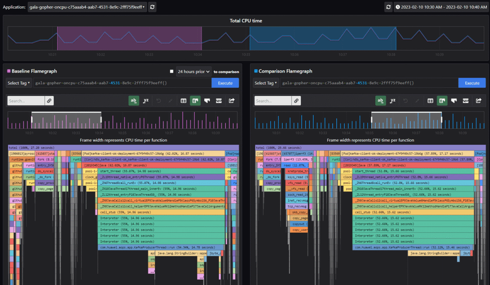
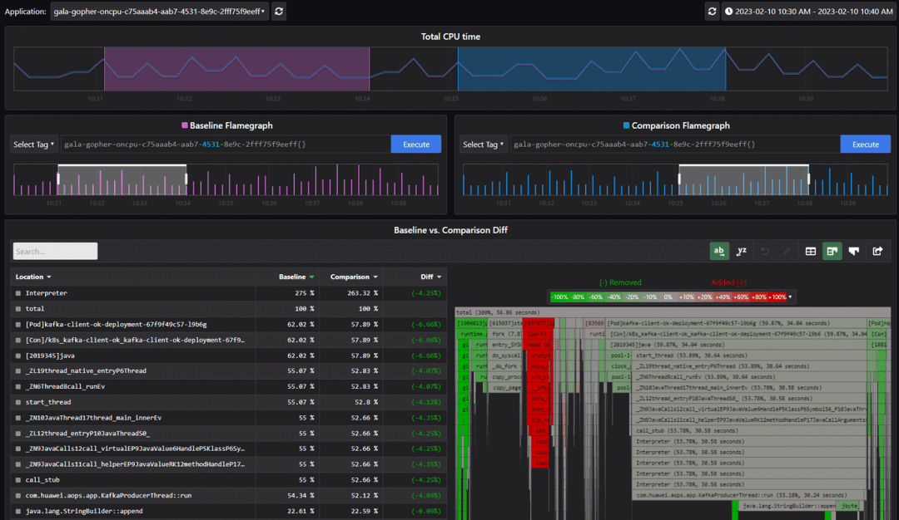

上篇文章[[A-Ops性能火焰图------适用于云原生的全栈持续性能监测工具]{.underline}](http://mp.weixin.qq.com/s?__biz=MzI2NDE4OTE2Mg==&mid=2247501171&idx=1&sn=919ffdc975ec8557854bc16656f81f35&chksm=eab2e0f6ddc569e0ae51c8fd0e00f38c6363d175452fc6a0f31ba4b5fd601c3de3d0a8c1e764&scene=21#wechat_redirect)分享了A-Ops性能火焰图的特性。

本文将分享基于A-Ops性能热点火焰图进行性能诊断的2个实际案例，介绍如何使用火焰图快速定位系统或者应用的性能问题，加深大家对A-Ops火焰图特性的理解。

**案例1**

**云原生场景下Java类应用性能问题诊断**

**1. 场景及案例介绍**

某Kafka producer客户端Java应用版本升级后性能出现下降，性能从222W
TPS下降到65W
TPS，吞吐量从337MB/s下降到95.9MB/s，如下图所示（为了便于比较，在不同POD里同时启动升级前后的两个应用）：

可见，Kafka
客户端应用的性能出现了明显的下降，但此时Kafka服务端较轻载，CPU
0.7%，内存16.8%，说明性能劣化是由于客户端应用的问题导致。Kafka服务端资源情况如下：

**2. 性能问题诊断**

通过升级前后的火焰图比较可以看出，升级后的CPU性能主要消耗在字符串format处理函数上。对于Kafka生成端应用，一般存在大量字符串操作，而字符串处理函数format性能较低，与StringBuilder方法相比有几倍甚至几十倍的性能差距，可见字符串format函数是导致性能降低的主要原因。

**案例2**

**CPU抖动类性能故障诊断案例**

**1. 场景及案例介绍**

在生产环境中经常会遇到一些偶发性的CPU抖动问题，这会对应用的性能造成一定的影响，但由于没有必然的规律，故障发现及问题定位比较难。

**2. 性能问题诊断**

为了模拟上述偶发性的故障，我们通过iperf打流注入2分钟的故障，然后从多个角度分析故障注入前后火焰图的数据，进而对CPU抖动类性能故障进行诊断。

在10:36-10:38通过 iperf3注入2分钟的流量，命令如下：

-   

iperf3 -c 192.168.122.115 -p 5201 -i 10 -t 120 -P 100 -N -M 100 -b
10000M

流量注入前后，系统应用指标及火焰图如下图所示：

从上图可见，流量注入期间，CPU使用率从平均22%升高到33%，应用性能从232w
tps下降到215w tps，火焰图中iperf3进程对CPU的占用为8.96%。

我们可以通过火焰图比较视图进一步分析这个问题，下图左边的火焰图是注入故障前的火焰图，右边为注入故障期间的火焰图，对比可以看到故障注入期间多个iperf3这个进程。

另外，我们还可以通过火焰图diff视图来分析这个问题，参考下图，火焰图红色部分为故障注入期间新增加的进程，进而可以定位到iperf3是造成这次CPU抖动以及应用性能劣化的根因。

通过A-Ops性能热点火焰图，开发者和维护者可以很方便地预测潜在问题和定位已发生问题。

**安装A-Ops性能热点火焰图**

gala-ops是针对云基础设施灰度故障的应用级/系统级在线诊断工具，火焰图探针stackprobe集成在其中的gala-gopher组件内，用户只需一键安装gala-gopher后，在配置文件中开启或关闭火焰图探针即可使用。

A-Ops安装部署手册：

https://gitee.com/Vchanger/a-ops-tools#a-ops-tools

gala-gophe组件安装部署说明：

https://gitee.com/openeuler/gala-gopher

欢迎大家使用A-Ops性能热点火焰图，也欢迎大家交流和反馈意见。
