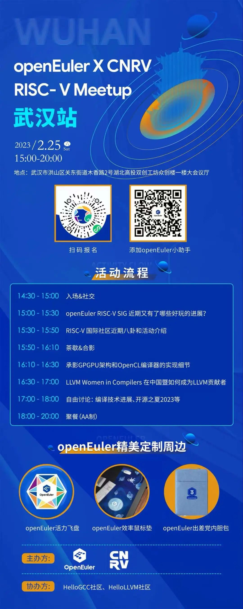

各位社区开发者朋友们，openEuler社区2023年第一场线下Meetup来啦，是不是一整个期待住了呢！

 

想知道openEuler RISC-V SIG 近期又有了哪些好玩的进展吗？

 

想知道RISC-V 国际社区近期八卦和活动介绍吗？

 

想参与讨论编译技术进展、开源之夏2023等有趣的事儿吗？

一切尽在openEuler X CNRV  RISC- V
Meetup 武汉站！本期Meetup由openEuler社区、CNRV社区（中国的RISC-V开发者社区）联合主办，HelloGCC社区、HelloLLVM社区倾情参与。

---

openEuler每期Meetup都将围绕不同的技术领域和行业方向，打造聚集开发者的分享交流平台。

如果你也想要结识志同道合的小伙伴，想要在线下畅所欲言与技术大牛们交流开源贡献，这个初春，来和我们一起在武汉赏赏春色、聊聊openEuler&RISC-V吧！

---

**时间：2023/2/25   15:00-20:00**

**地点：湖北省武汉市 洪山区关东街道木香路2号 湖北高投双创工坊创业资本汇
众创楼一楼大会议厅（路演厅）**

现在**扫描上方海报二维码即可报名**。现场还准备了
活力运动飞盘、让开发者效率满满的鼠标垫、出差党必备电脑内胆包等精美的openEuler主题周边，期待你的参与！

开年第一场线下Meetup，久别之后的重逢，2 月 25
日，我们在武汉等你，赶快报名参加吧！
