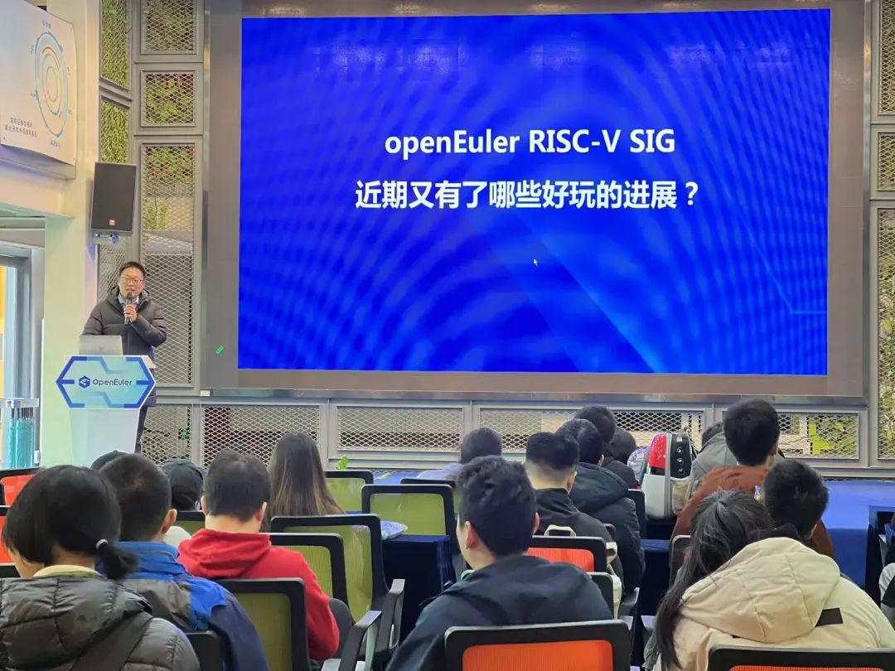
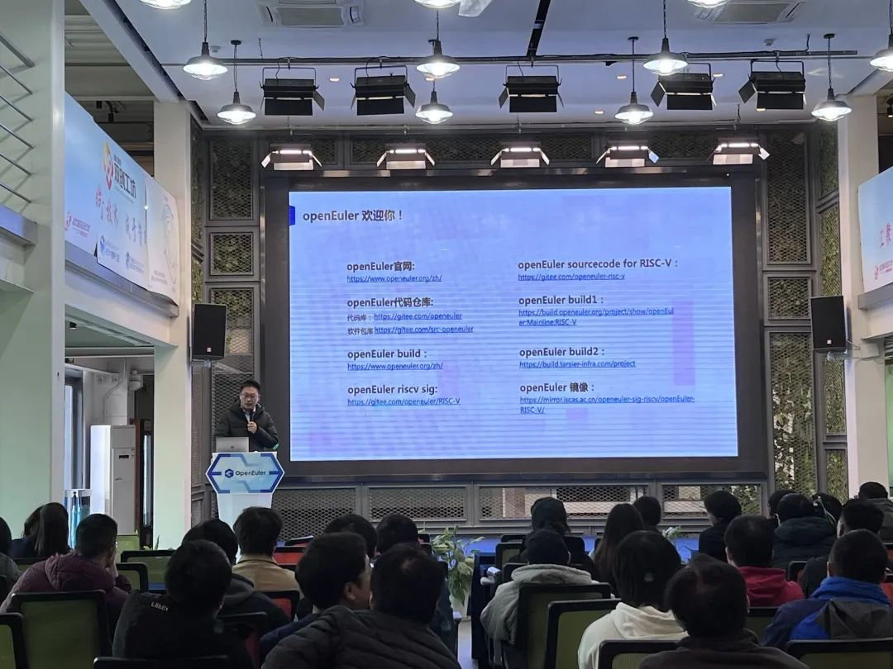
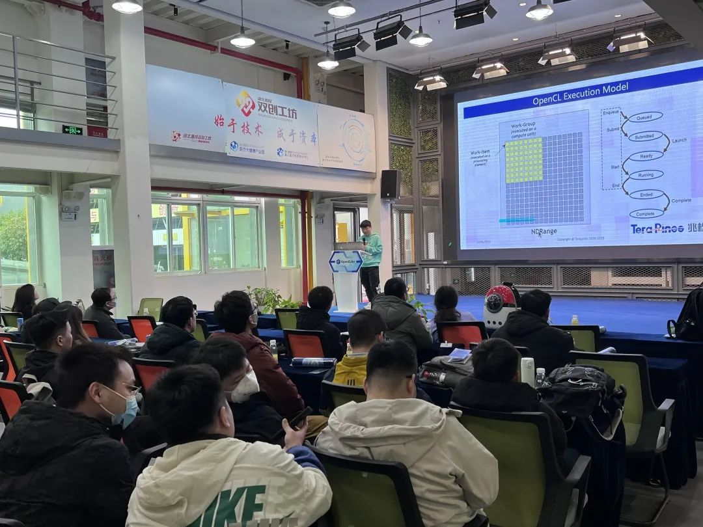
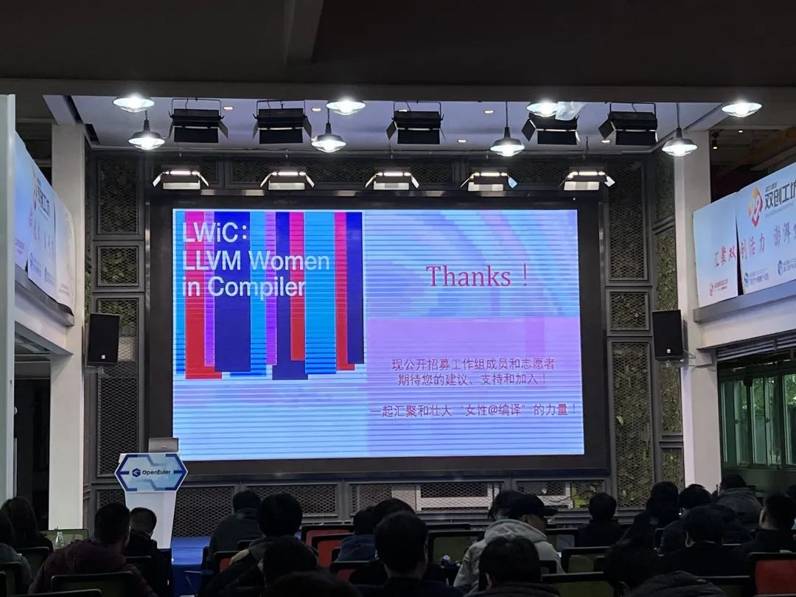

2023年2月25日，openEuler社区联合CNRV社区在武汉举办的RISC-V
Meetup圆满结束，这也是国内RISC-V领域时隔3年首次举办线下活动。

在本次活动中openEuler RISC-V SIG
Maintainer为与会者带来了openEuler在RISC-V架构上的适配和优化的最新进展以及后续规划，展示了openEuler在多样性算力架构支持方面的优越性，活动吸引40多位来自武汉当地的企业及学生开发者参与。

这次，志同道合的开发者们终于可以在线下畅所欲言地交流学习，也有更多关注RISC-V架构的开发者及使用者可以体验到openEuler的强大功能及可靠性。

openEuler RISC-V SIG Maintainer
吴伟不仅介绍了openEuler在RISC-V架构上的适配进展，还分享了RISC-V
国际社区近期的八卦和活动介绍。通过他的分享，现场的开发者们也更好地了解到openEuler
RISC-V SIG主要工作，以及如何获取更多开源内容。

RISC-V
SIG是openEuler操作系统在多架构支持上的重要组成部分，希望感兴趣的开发者们热情加入贡献～

来自兆松科技（武汉）有限公司的周晶与大家探讨了GPGPU架构和OpenCL编译器的实现细节，让大家能够更深入地理解GPGPU架构和OpenCL编译器的实现原理，为今后的开发工作提供必要的建议和技术支持。

LLVM社区主席邱吉远程接入分享的《LLVM Women in Compilers
在中国暨如何成为LLVM贡献者》，号召大家加入LLVM Women in
Compilers，为编译技术世界的多样化、包容性和平等性增加一份力量。

在自由交流环节大家畅所欲言，很多开发者也分享了个人在openEuler&RISC-V开发方面的体验和收获，更有社区月度生日会嗨翻全场。欢乐齐聚一堂，共享好时光。

openEuler Meetup
城市站，为社区开发者、用户、伙伴创造面对面学习交流的机会，共建开源、共同繁荣的社区生态。下期活动将哪个城市相约呢？更多近期活动请访问openEuler社区活动页面查看：

https://www.openeuler.org/zh/interaction/event-list/

如果您对openEuler RISC-V SIG感兴趣

欢迎添加小助手微信

备注"RISC-V"进入openEuler RISC-V SIG交流群
