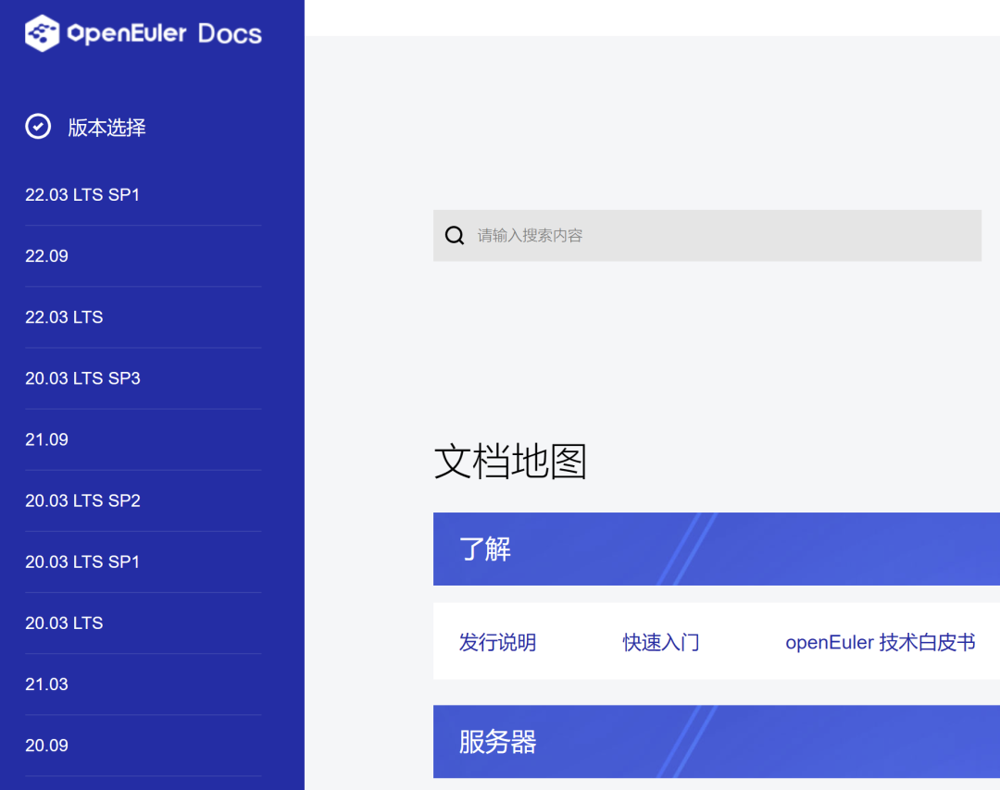
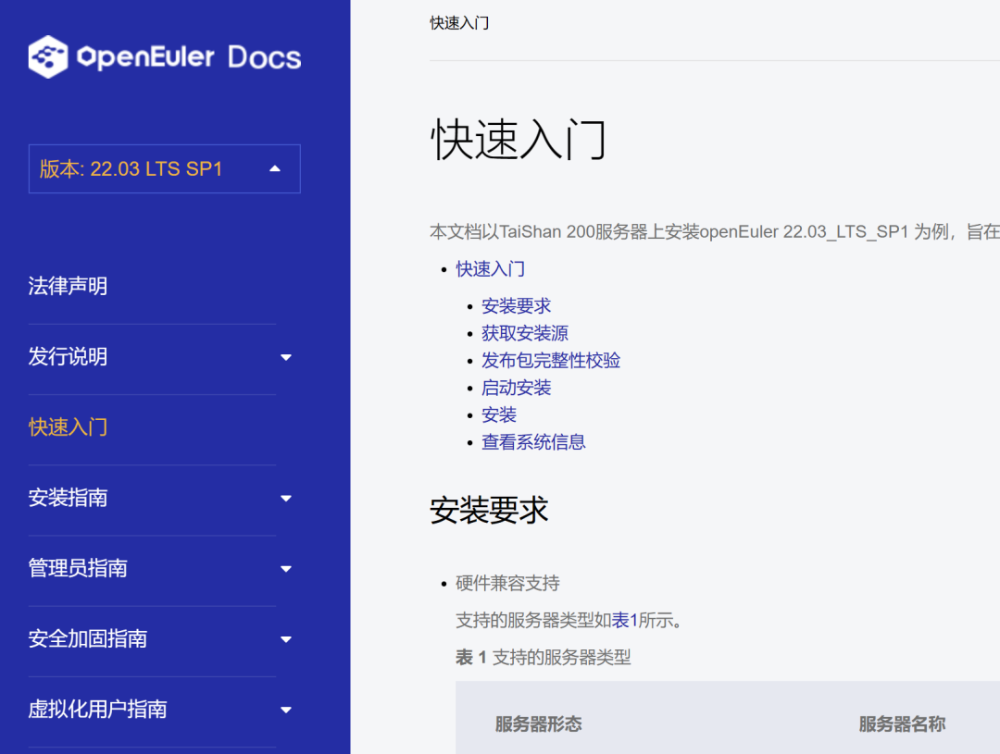
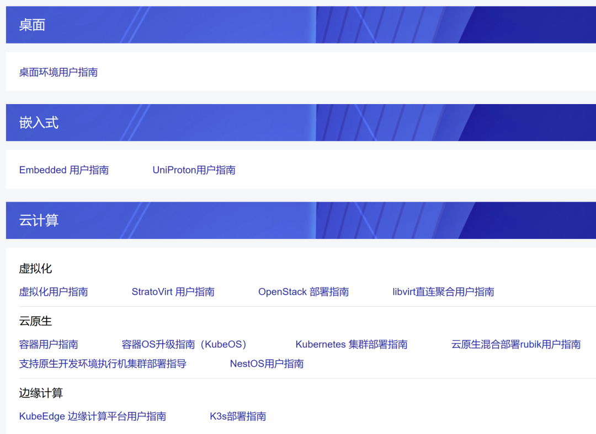
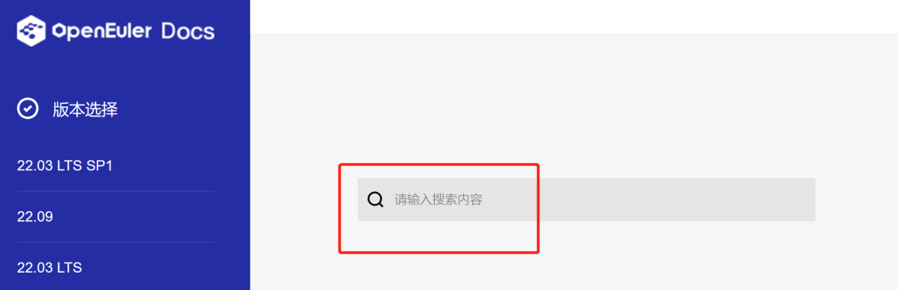

# **前言**

文档是开发者贡献代码的钥匙，
openEuler社区的文档包括发行说明、操作系统安装、虚拟化和容器的使用指导等内容。为方便开发者快速找到所需要的文档资料，openEuler社区上线了文档地图，欢迎大家查阅。

地址：https://docs.openeuler.org

# **使用指南**

左侧主目录以「openEuler的版本选择」为主，当开发者选择所需的版本时，便可查看该版本的详细内容。

文档地图根据使用场景，将资料进行分类，覆盖服务器、桌面、嵌入式、云计算等主要场景，优化整体的视觉，方便开发者快速查阅，一键直达重点。

为支持社区开发者找到所需工具，文档地图将常见工具进行整理，以便开发者可以获取不同工具的操作指南，源码。

文档地图还提供搜索功能，开发者通过关键字筛查就可以找到相关的资料。

# **访问地址**

地址：https://docs.openeuler.org

# **联系我们**

如果您在使用过程中有任何建议，可以通过以下方式联系我们：

1.  邮件列表：doc@openeuler.org

2.  doc仓：https://gitee.com/openeuler/docs

3.  社区论坛：https://forum.openeuler.org

欢迎一起交流讨论。
