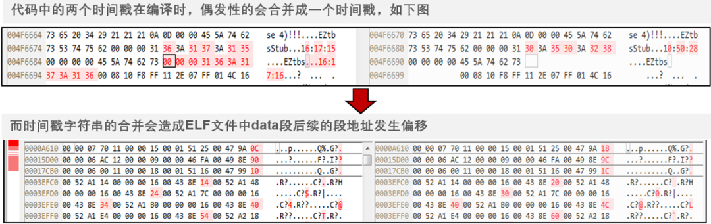
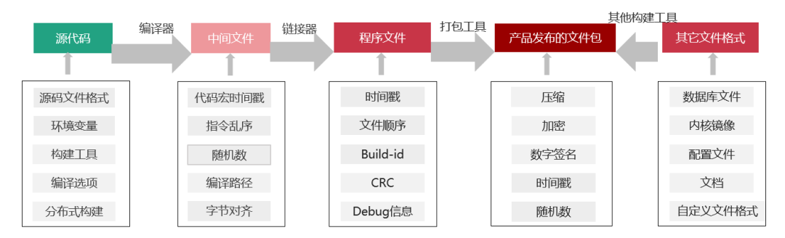
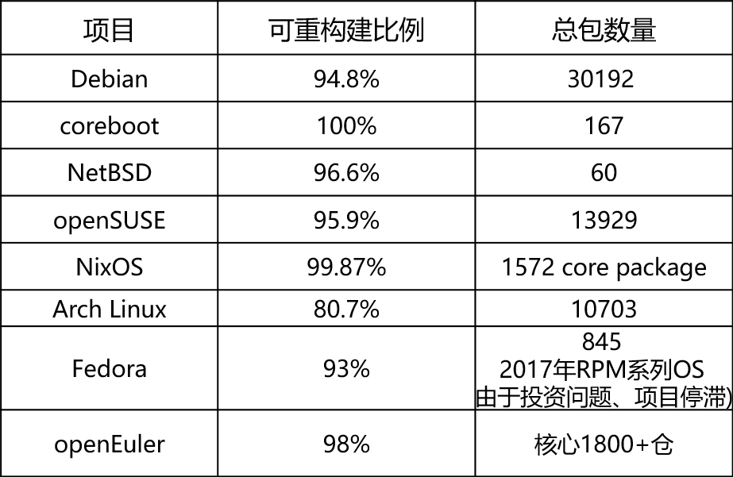
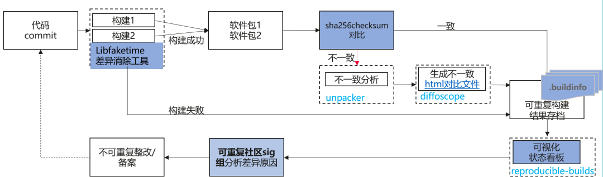
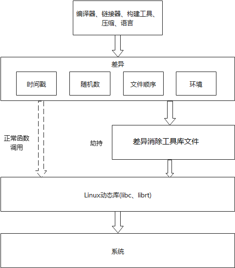
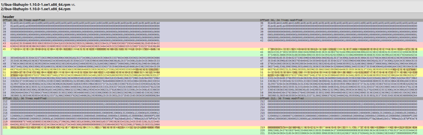

可重复构建（ Reproducible
Builds）是证明软件供应链安全的必要手段，2022已被纳入SupplyChainSecurityCon的topics以及微软的S2C2F（Secure
Supply Chain Consumption
Framework）当中，并受到了Google开源安全团队的支持赞助。OpenSSF/SLSA在软件供应链完整性与包管理最佳实践中也对可重复构建有所要求。

2022年openEuler已初步建设可重复构建能力。

# 什么是可重复构建

对于可重复的构建，给定相同的源代码、构建环境和构建指令，任何人均可重建出Bit
to Bit完全相同的指定制品。

# 可重复构建的目的与意义

可重复构建可以验证二进制是否被植入后门，避免潜在安全风险，从而保障二进制的质量。构建环境和构建工程能够被还原，使依赖变化范围最小化、测试最小化，方便问题定位、提高开发效率。

通过可重复构建可以创建从代码到制品的可独立验证路径，结合已有的代码发布签名、软件仓库签名、安全启动等技术，使开源代码从生产到使用的全过程可追溯成为可能。

**构建差异产生的原因**

在代码构建期间，从源代码到产品发布的二进制包，中间每一个步骤、每一个构建工具都有可能引入二进制差异，而这些差异经过逐步放大，导致最终发布的二进制包每次编译都不相同，而且差异非常巨大。

二进制差异案例（差异放大）

导致构建差异的因素有很多，包含环境、时间戳、随机数、文件乱序等等，这些差异都是在构建过程中生成的。数字签名可以证明源码和二进制的唯一性，但是无法证明源码与二进制之间对应关系的一致性。证明源码与二进制一致性的工作量非常大、技术难度高。例如下图在各编译过程中可能会产生差异的因素：

# 可重复构建社区

可重复构建并非新生事物，早在1992年GNU工具链已有工具对此提供初步支持；Debian开发者在2000年提出了关于内嵌时间戳影响可重复性的技术讨论，并在2007年Debian
项目开始了全面支持可重复构建的思考；直到2022年发布的Debian
11中，Debian全仓库达成率94.8%(amd64, 31500 packages)。

当前，已有相当多的社区加入到可重复构建社区的建设中来。其中，主要支持社区包括Debian、Arch
Linux、coreboot、FreeBSD、NetBSD、OpenWrt。

合作社区包括openSUSE、Yocto
Project等多个社区，openEuler社区也在2022年加入到可重复构建的合作社区当中。

当前各社区可重复构建现状如下表：

社区中目前也有一些工具可以帮助开发者们达成可重复构建的目标。

除了以上工具以外，Reproducible
Builds社区还推动其他开源软件社区支持可重复构建。例如，推动GNU增加编译选项，消除文件路径差异；推动一系列打包软件消除文件顺序差异等等。包括各语言构建框架包管理器如npn/yarn、pipenv/poetry、Go
Module、Cargo、bazel以及微软的.NET框架当中也预制了可重复构建能力。

# openEuler可重复构建方案

openEuler当前的可重复构建是将rpm包构建两次，再进行对比。在构建过程中利用开源工具libfaketime进行差异消除，构建结束后将两次构建出的rpm包进行对比，若rpm不一致，则进行解压继续对比，将差异粒度精确到文件，并输出差异报告。

为了达到构建可重复的目的，通常要满足两个条件：

1、构建系统的完全确定性，保证两次构建的日期、时间完全相同（或者去除掉时间信息），文件顺序一致；

2、是用的构建工具集及构建工具需要一致或被记录。\
主要措施有以下三步：

1、
openEuler的可重复构建使用了libfaketime工具消除差异。此工具主要是利用LD_PRELOAD环境变量进行差异消除。LD_PRELOAD
是 Linux 系统的一个环境变量，它可以影响程序的运行时的链接（Runtime
linker），通过此变量将 Linux 系统自带的动态库.so
替换我们自己动态库中自定义的函数，例如：time()、gethostname()、random()、rand()等函数，确保编译过程中获取的时间、主机名、随机数能够保持一致。

差异消除工具原理

通过使用此工具，产品源代码不需要修改，从而减少了产品在代码纠正方面的投资，商业和开放源代码工具所产生的差异也将得到消除，也无需进行任何代码修改，而且时间戳的语义被最大程度地保存。并且可以通过"
unset LD_PRELOAD"格式的命令禁用该工具。

除了libfaketime原有的功能以外，我们在此基础上进行扩展，增加了精准黑白名单的机制可以有效解决因使用libfaketime而导致的构建失败问题；并完善了消除随机数差异功能，增加了对random()、rand()、/dev/random、/dev/urandom获取随机数方法的替换。

2、
openEuler的可重复构建还用到了unpacker自动化解包对比工具，可以精准分析文件级差异，输出可视化差异报告。对比两次构建出rpm的校验值，若校验值一致则认为构建可重复；若校验值不一致，则进行解包对比，若两个rpm包解压后所有文件的校验值均一致，同样认为构建可重复，若出现不一致文件则使用diffoscope进行对比并输出差异报告。此外，工具会将RSA、PGP签名文件从rpm包中拆分出来，不会将签名文件差异当作是rpm差异。

解包对比工具原理

差异报告样例

3、将rpm包对比结束后，我们会将对比结果以及差异报告归档，并在openEuler的可重复构建网站展示并进行治理。

2022年我们已经对openEuler核心1800+个代码仓分别在arm及x86环境下进行了可重复构建的比对，涉及软件包6000+，可重复率达到了98%。今年我们把可重复构建范围扩大到了openEuler
22.09的Everything版本，构建成功了4130个代码仓，涉及软件包14000+，可重复率达到94%左右。经过初步的分析，当前大部分不可重复代码仓是因为构建出的rpm包存在html文件差异。

# openEuler可重复构建规划

1、 针对不可重复代码仓分析原因、提出解决建议，并回合到上游社区。

2、使用EulerMaker替换OBS进行构建，解决由于libfaketime导致的构建失败问题，并实现通过"元数据"随时复现构建过程的能力。

3、
逐步提高openEuler代码仓可重复率，达成Everything版本代码仓可重复率98%以上，领先业界水平。

4、
复制可重复构建能力，帮助合作伙伴达成可重复构建目标。
