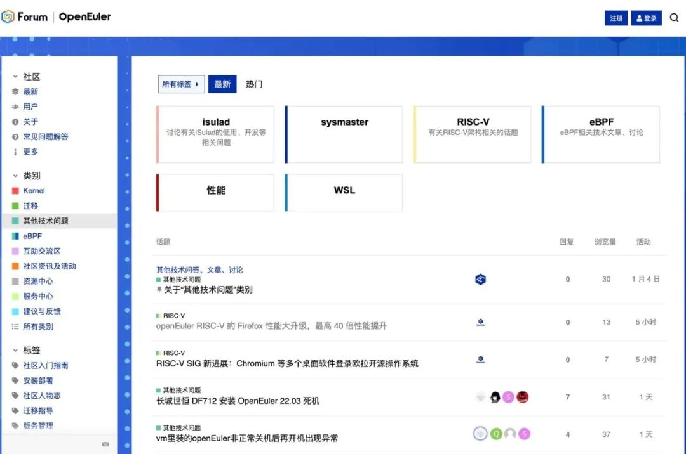
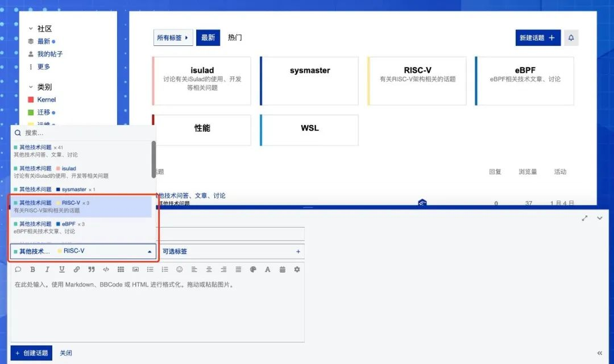
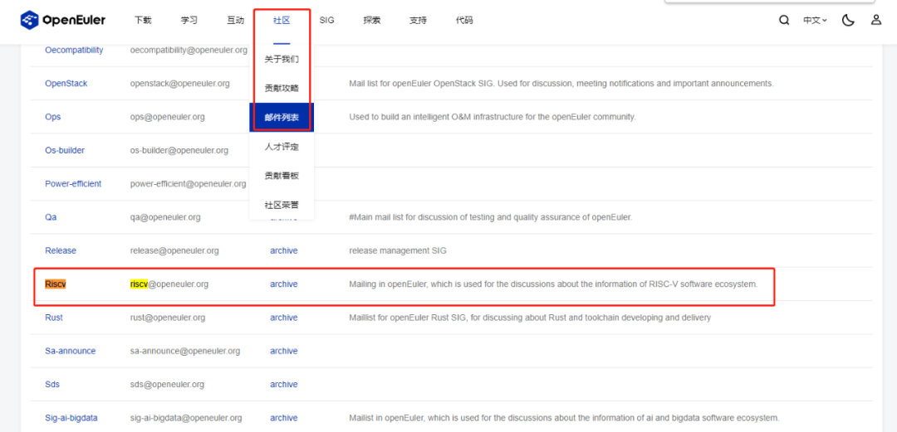
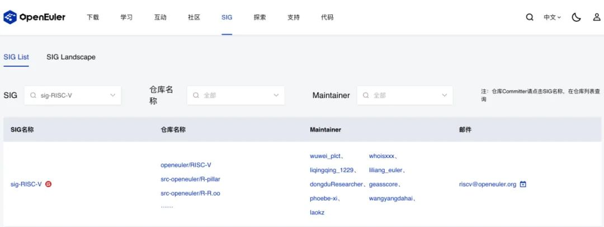

---
title：RISC-V SIG 创建专属邮件列表和论坛板块
date: 2023-03-07
tags:
  - RISC-V
archives: 2023-03
author:
  - openEuler
summary: RISC-V SIG 分别向社区申请并创建了 RISC-V
专属的邮件列表和社区论坛中相对应的模块，目前已经正式投入使用。
---

近日，为了适应 RISC-V 架构在 openEuler
社区的快速发展，同时为相关开发人员和技术爱好者们提供一个专注的 RISC-V
相关问题的交流环境，RISC-V SIG 分别向社区申请并创建了 RISC-V
专属的邮件列表和社区论坛中相对应的模块，目前已经正式投入使用。

## 独立的 RISC-V SIG 邮件列表

RISC-V SIG 向 openEuler 社区申请创建 RISC-V 专属的邮箱列表
riscv@openeuler.org，以专门用作讨论 openEuler 系统中关于 RISC-V
软件生态的技术信息。

openEuler 为不同领域提供了邮件列表服务，在此界面你也可以找到除了 RISC-V
SIG 之外其他领域的邮件列表订阅地址。

详细信息和相关订阅方法可以参考
https://www.openeuler.org/zh/community/mailing-list/

邮件列表的订阅入口有两个：

1.  官网 → 社区 → 邮件列表 → 在列表中 RISC-V SIG 栏点击 SIG
    名进入订阅页面

2.官网 → SIG → 查看 SIG → 搜索 RISC-V SIG →
在搜索结果邮件列表处点订阅按钮

RISC-V SIG 邮件列表的订阅入口在

https://mailweb.openeuler.org/postorius/lists/riscv@openeuler.org/

欢迎感兴趣的伙伴来这里进行订阅和交流！

## RISC-V 的 openEuler 论坛板块

与此同时，继 openEuler 社区论坛上线后，为了方便对 RISC-V
架构相关的话题进行更好的分类和标记，RISC-V SIG 申请在论坛中为 RISC-V
架构添加对应的标签和分组。

openEuler 社区论坛使用 discourse 技术搭建，Fedora，Gnome 和 LLVM
等大型开源社区也都基于这种新技术构建论坛。论坛参与者可以获得现代化的讨论体验和舒适的展示界面。

目前， openEuler 社区论坛已在"其他技术问题"类别下创建" RISC-V "子类别

如需在论坛内发表与 RISC-V
架构相关的技术话题、分享相关技术博客等，可以点击右上方的新建话题，在类别分组选择"其他技术问题"-"
RISC-V "；也可以直接进入该子类别后再新建话题。

后续对于论坛相关的使用和治理诉求，可以参考《openEuler
社区论坛使用指南&规则》

https://forum.openeuler.org/t/topic/197

欢迎大家来讨论交流！

## 联系我们

如果您对 RISC-V 感兴趣，欢迎加入 RISC-V SIG 交流群，讨论更多关于 RISC-V
的更多内容，为推动 openEuler & RISC-V 生态贡献力量！

**添加请备注 oerv**

## 关于作者

杨延玲，中科院软件所 PLCT 实验室实习生，欧拉开源社区 RISC-V SIG
成员，目前在温州大学读研一，负责协助 RISC-V SIG 和 ROS SIG 的日常运营。
