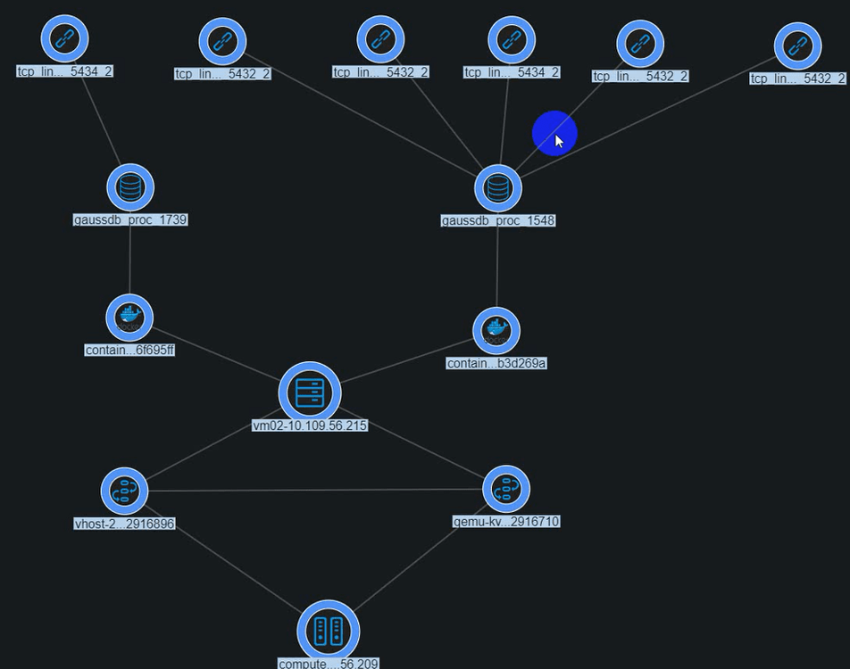
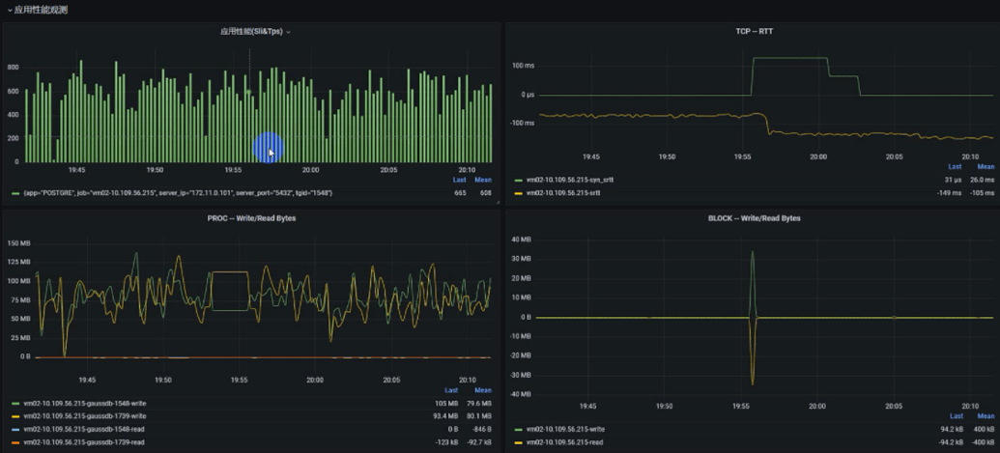
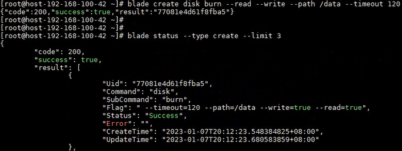
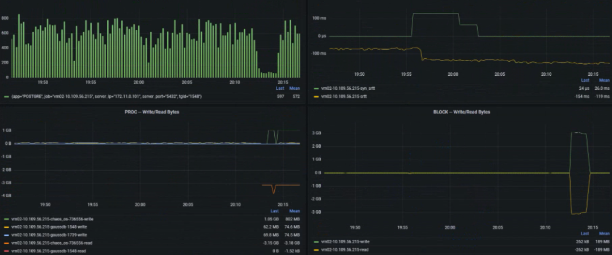
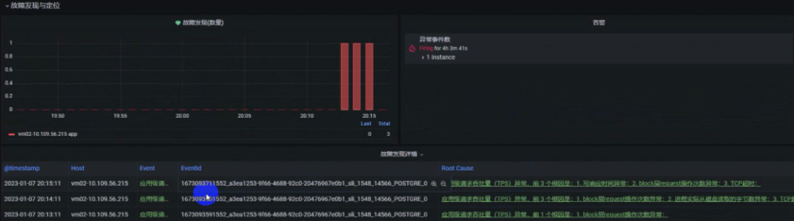
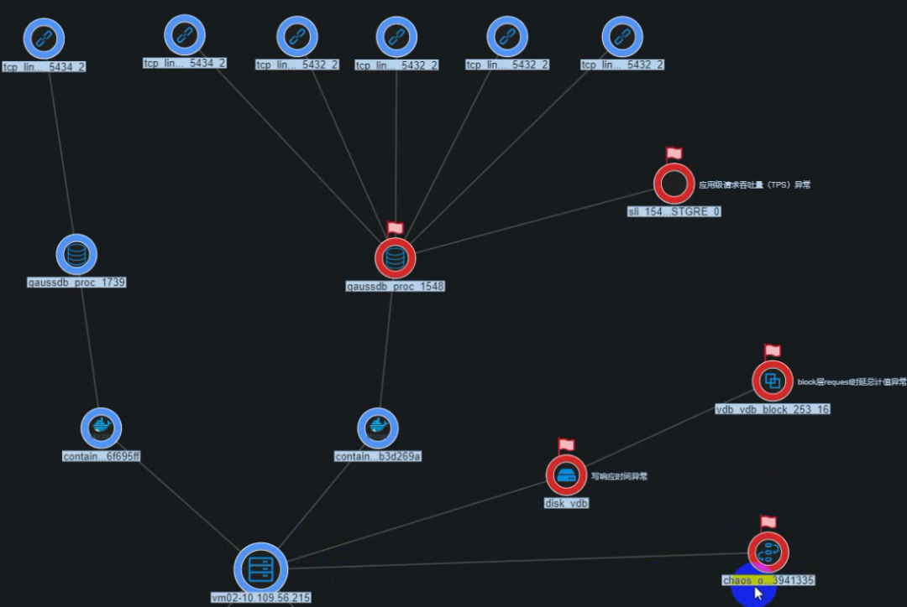
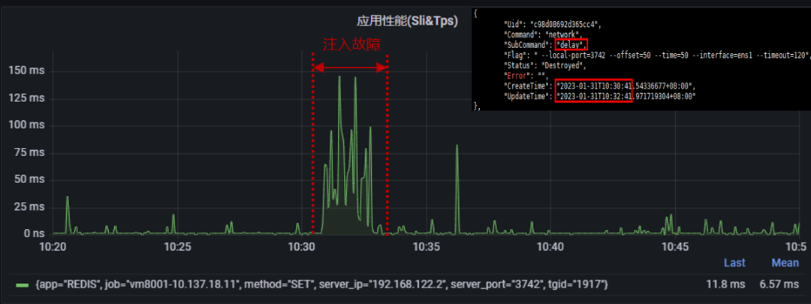
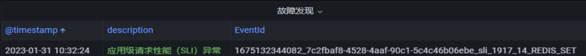
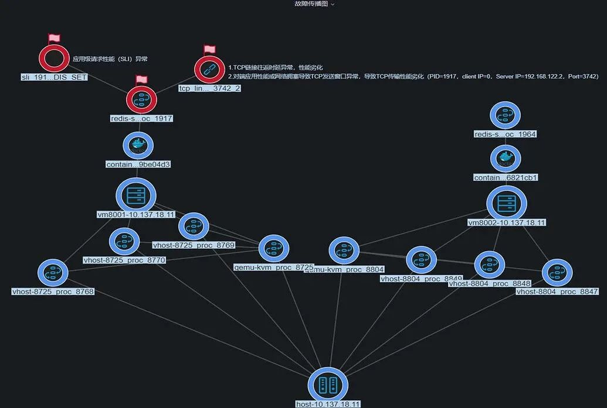

数据库场景下，由于操作系统某些进程操作（比如磁盘、网络等）占用I/O带宽过高，造成应用因为I/O带宽不足产生性能劣化的问题，如何快速、准确地诊断应用性能问题，并对问题进行定界定位是运维人员的重要挑战。

# 案例一 GaussDB应用磁盘IO类故障在线诊断

该案例通过对Gaussdb应用注入磁盘IO故障来模拟。

## 故障注入前

应用实时拓扑关系如下图所示，gaussdb应用包含1个master(进程id：1548)和1个slaver（进程id：1739），运行在虚拟机vm02上，gaussdb
master有5个客户端TCP连接。

此时，gaussdb的应用性能如下图所示，平均600 TPS。

## 注入故障

在gaussdb的数据目录注入磁盘读写故障，命令如下：blade create disk burn
\--read \--write \--path /data \--timeout 120

## 应用性能诊断

此时应用性能出现劣化，从大概600 TPS → 60 TPS，下降了近10倍，如下图所示：

故障发现与定位结果如下图所示，可以看出已产生应用性能劣化事件，原因是磁盘读写响应异常。

具体的故障传播关系如下图所示，可见应用性能劣化是因为磁盘写响应异常以及block层request时延异常，进一步的磁盘类异常是由于故障注入工具chaos（进程id：3941335）导致。

# 案例二 Redis应用网络时延类故障在线诊断

## 注入故障

通过故障注入工具ChaosBlade注入2分钟网络时延故障，具体命令：blade create
network delay \--time 50 \--offset 50 \--interface ens1 \--local-port
3742 \--timeout 120

故障注入期间redis sli指标出现明显劣化，大概从10ms → 80ms

## 应用性能诊断

故障发现与定位结果如下图所示，可以看出已产生应用性能劣化事件，原因是网络时延异常。

具体的故障传播关系如下图所示，可见应用性能劣化是因为网络时延异常导致。

