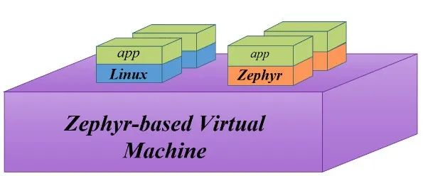
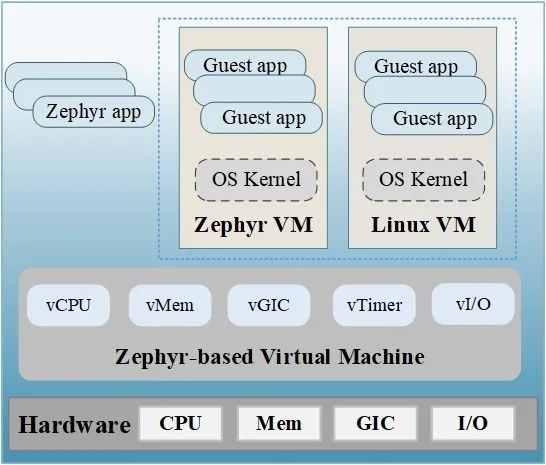

**嵌入式实时虚拟机ZVM（Zephyr-based Virtual
Machine）是由湖南大学嵌入式与网络计算湖南省重点实验室（以下简称"湖大嵌入式实验室"）主任谢国琪教授主导设计并开发的虚拟化软件**。该软件基于实时操作系统（RTOS）Zephyr开发，可同时启动Linux与Zephyr
2个Guest OS，从而在同一硬件平台上实现混合内核部署。

2023年2月，湖大嵌入式实验室正式将该项目开源至openEuler社区。

# 1. 背景介绍

嵌入式实时虚拟化技术是一种允许在单个硬件平台上同时运行多个操作系统、并保持确定性和时间关键性能的技术，该技术可为嵌入式系统开发带来许多好处，例如硬件整合、系统隔离、系统灵活可靠性、安全性和可扩展性等。嵌入式实时虚拟化可支持智能汽车、数控机床及5G设备等高级应用。

开发嵌入式实时虚拟化软件面临着一些挑战。第一个挑战是如何确保不同Guest
OS间的隔离和安全性，尤其是当它们具有不同级别的关键性和可信度时。第二个挑战是如何在不同Guest
OS间有效地共享或分配 I/O
设备，这可能需要设备模拟或直通机制。第三个挑战是如何确保作为Guest
OS运行的RTOS具备低延迟和高吞吐量。

嵌入式实时虚拟化软件需要通过提供强制的隔离和安全、高效的中断处理、灵活的
I/O
设备管理机制及硬件支持来应对这些挑战。基于架构硬件虚拟化支持与虚拟化主机拓展支持，湖大嵌入式实验室开发了基于Zephyr
RTOS的虚拟化软件ZVM，实现了Guest
OS间的隔离、设备分配及中断处理，保证了系统的安全与实时。

# 2. 技术路线

ZVM总体功能需要关注三个部分：安全隔离、设备管理和系统性能提升。

**（1）安全隔离**：利用虚拟化技术实现不同特权级的应用支持，确保不同Guest
OS间的隔离和安全，尤其是当它们具有不同级别的关键级时。为每个Guest
OS分配不同的虚拟地址空间和虚拟设备，实现虚拟机间的隔离以保证系统安全。

**（2）设备管理**：使用支持设备模拟和直通机制的管理程序，在不同Guest
OS之间有效共享或分配I/O设备。对于中断控制器需独占的设备，用完全虚拟化的方式进行分配，对于UART等非独占的设备，使用设备直通的方式进行分配。

**（3）系统性能提升**：在处理器方面，使用支持ARM64硬件辅助虚拟化拓展技术来减少上下文开销；在内存管理方面，使用基于硬件的两阶段地址转换地址转换性能开销；在中断方面，使用基于硬件的中断注入机制来减少上下文开销和中断时延。

# 3. 系统架构

ZVM整体系统架构如下图所示，通过在Zephyr
RTOS中加入虚拟化模块，实现CPU虚拟化、内存虚拟化、中断虚拟化、定时器虚拟化和I/O虚拟化。ZVM支持两种类型的Guest
OS，即通用的Linux操作系统和Zephyr RTOS。

**（1）CPU虚拟化**。CPU虚拟化模块的主要功能是为每个Guest
OS的vCPU虚拟出一个单独的隔离上下文。每个vCPU均作为一个线程存在，由ZVM统一调度。为了提高vCPU的性能，ARM64架构为ZVM提供了VHE支持，VHE可以使Host
OS迁移到EL2特权模式，而无需改变操作系统原有代码。VHE主要实现了ARM寄存器重定向，可以在不修改Zephyr
RTOS内核代码的情况下，将其迁移EL2层开发ZVM，既降低了系统冗余，又提高了系统性能。

**（2）内存虚拟化**。内存虚拟化模块的主要作用是实现Guest
OS间内存地址的隔离。系统需要隔离不同Guest OS的内存空间，监控Guest
OS对实际物理内存的访问，以保护物理内存。为了实现该功能，ARM64提供了两阶段的地址查找策略。第一阶段是从Guest
OS的虚拟地址到Guest OS的物理地址转换，第二阶段是从Guest
OS的物理地址到Host
OS的物理地址转化。ARM专门为第二阶段转换提供单独的硬件，以提高地址翻译性能。

**（3）中断虚拟化模块**。中断虚拟化使用ARM的通用中断控制器（GIC）设备，并基于该设备实现虚拟中断配置。Guest
OS的中断统一路由到ZVM，然后ZVM会将它们分配给不同的vCPU。虚拟中断的注入通过GIC中的Virtual
CPU接口或List Register具体实现。

**（4）定时器虚拟化**。定时器虚拟化为每个CPU定义了一组虚拟定时器寄存器，它们在预定时间后单独计数并抛出中断，由Host
OS转发给Guest OS。同时，在Guest OS切换过程中，虚拟定时器会计算Guest
OS的实际运行时间，并对Guest OS退出的时间进行补偿，为Guest
OS提供定时器服务。

**（5）设备虚拟化**。在设备虚拟化方面，ZVM采用ARM中的Memory-Mapped I/O
(MMIO)方法将设备地址映射到虚拟内存地址，构建虚拟设备空间，实现Guest
OS对设备地址的访问。在具体实现上，ZVM统一构建一个虚拟的MMIO设备，在Guest
OS创建过程中将该设备分配给指定的Guest
OS，实现I/O虚拟化。此外，对一些非独占设备，ZVM使用设备直通的方式实现设备的访问。

# 4. 未来规划

ZVM由Sig-Zephyr进行维护，并计划在2023年5月推出第一个支持Zephyr最新LTS的基础版本，7月实现openEuler
Embedded和ZVM整合，并将完善各项其它高级功能，如IO设备框架支持、虚拟机动态资源管理及实时性支持等。

**项目地址：**

[https://gitee.com/openeuler/zvm](https://gitee.com/openeuler/zvm)

# 关于团队

湖南大学嵌入式与网络计算湖南省重点实验室（以下简称"实验室"）长期从事嵌入式计算与系统方面的研究，现任实验室主任为谢国琪教授，首席科学家为常万里教授。实验室秉承"人本、智慧、速度、计算"之建室宗旨，倡导敬业与奉献之精神，努力营造学术自由之氛围，努力使本室成为有一定影响和学术地位的、凝聚和培养优秀人才的研究实验室，实现"培养人才、创新知识、交流学术、服务社会"的工作目标。

结合产学研合作项目，实验室拥有嵌入式实时虚拟化软件、车载网络综合验证平台、汽车软件工具链等系列产品，并聚焦世界前沿与顶尖科研成果发表，按照csrankings.org统计，实验室近5年（2018～2022）在嵌入式与实时系统领域国际顶级学术会议论文发表数世界排名第17、国内排名第1。实验室凝聚了多名在国内有较大影响、国际上有一定影响的学术带头人和一批年轻有活力的学术和技术骨干，实验室首席科学家常万里教授现任国际计算机学会（ACM）嵌入式系统专业委员会（SIGBED）秘书长。实验室现有固定研究人员36人，均具有博士学位，其中教授16人，国家级人才计划获得者1人，国家级青年人才计划获得者3人。
