## radiaTest使用指南

radiaTest是孵化于openEuler社区的基于openEuler操作系统环境开发的测试管理平台。

其涵盖测试资产管理、测试任务管理、测试资源调度与执行等功能，以更深远的覆盖社区测试需求为目标，意在一体化承载社区测试流程。

用户基于Gitee Oauth2服务进行身份鉴权（注），测试资源调度与执行能力可基于Compass-CI与openQA，平台版本测试作业流可对接外部版本发布工程。

将分散测试资产统一管理，将离散基础设施归一入口，将低门槛作业平台向广大社区测试团队/测试人员开放公共服务，以此使能社区可靠可追溯的高效测试。

*注：1.0.0版本仅支持基于Gitee Oauth2鉴权；1.1.0版本（4月上线）将支持基于openEuler社区鉴权服务鉴权*

### 1. 从这开始

#### 1.1 组织选择

一般而言，radiaTest定义的组织与社区一一对应，当然也可以仅简单作为更高一级的用户组。其具备两个属性：1.是否要求成员加入gitee企业仓；2.是否要求成员签署CLA。

当组织具备gitee企业仓信息时（注），用户登入该组织则需要经过该企业仓应用的OAuth鉴权，这意味着用户的Gitee帐户需要已加入相应企业仓才能登入。具备企业仓的组织的里程碑可与企业仓里程碑同步，支持同步创建、修改、以及相关Issue查询。

当组织需要签署CLA时，用户登入过程会检查是否签署CLA，并提供签署指引。若用户未签署CLA也未按指印签署，将无法登入。

组织的创建需要联系平台管理员进行创建。创建后用户只需要登入过此组织就会存在于该组织的用户名单中，而后可以联系管理员调整用户组织角色，调整权限。

*注：1.0.0版本登陆openEuler组织需要已加入openEuler gitee企业仓；1.1.0版本（4月上线）后，openEuler社区登陆将基于社区鉴权服务，开放使用*

##### 1.1.1 CLA签署引导

1. 登陆过程中点击图标跳转CLA签署页面（组织信息定义），签署完成后点击下一步，若CLA已签署则可登入

2. 同时也可以在登陆页选择组织后点击下方CLA标识，然后自行签署

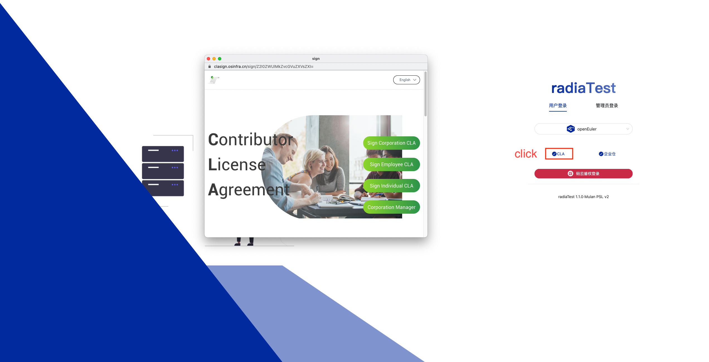

##### 1.1.2 企业仓加入申请

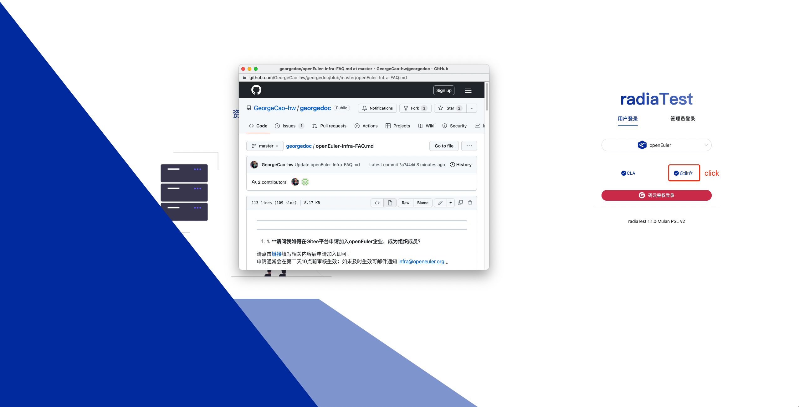

#### 1.2 用户组

若组织与社区等价，则用户组意味着参与此社区的各个不同SIG组或各团队（如企业/高校等）。不同团队间团队归属的事务不共享，但共享同一组织归属的事务。

场景: 资源池页面，用户A可以看到个人机器组、组织机器组、自身所属团队的机器组

##### 1.2.1 加入团队

用户可以通过主页的右上角进入用户中心的用户组管理页面，并主动申请加入团队，等待用户组管理员通过

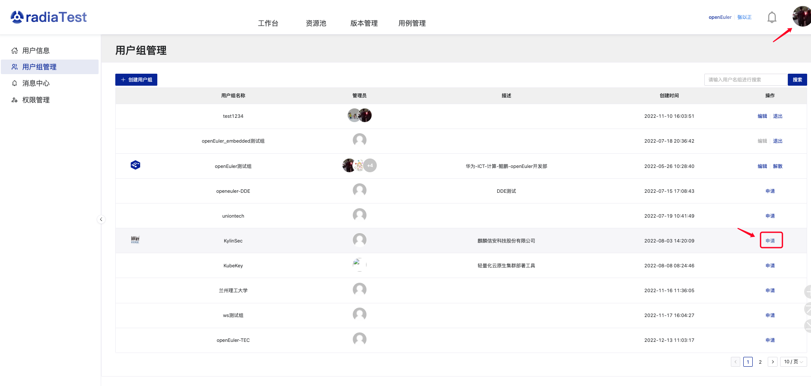

用户组管理员也可以手动邀请用户（被邀请人需要已经登陆过该组织），接到通知后在消息中心选择接受邀请

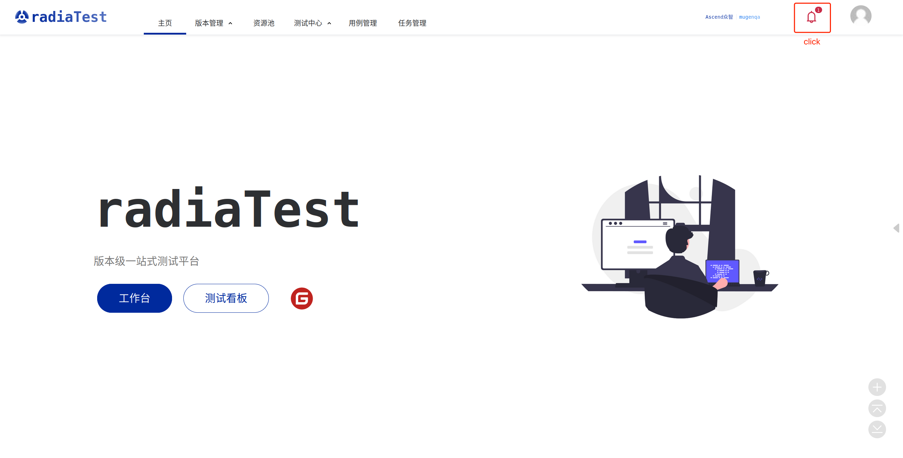

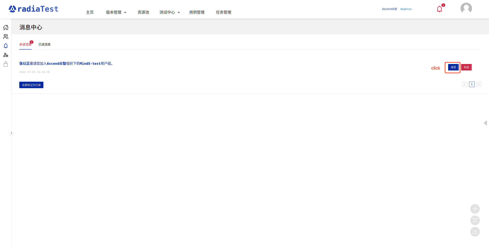

##### 1.2.2 查看团队

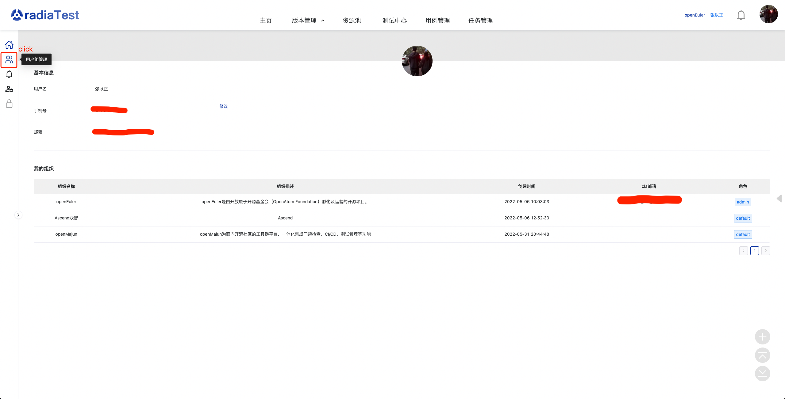

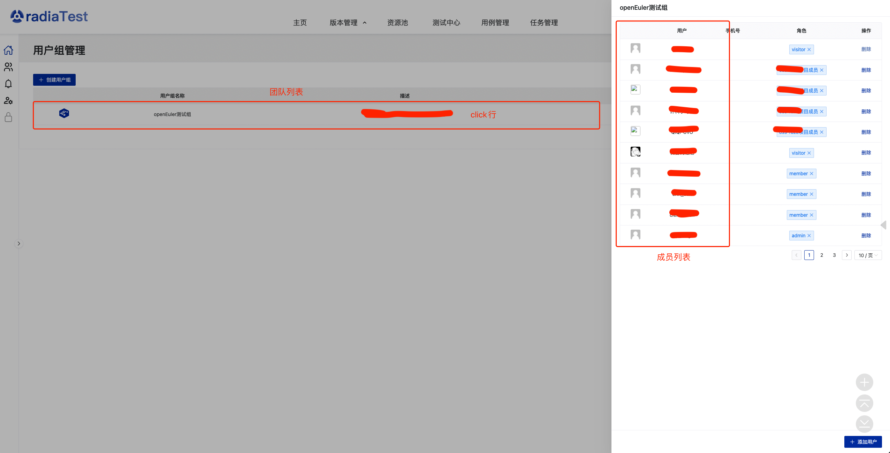

##### 1.2.3 离开团队

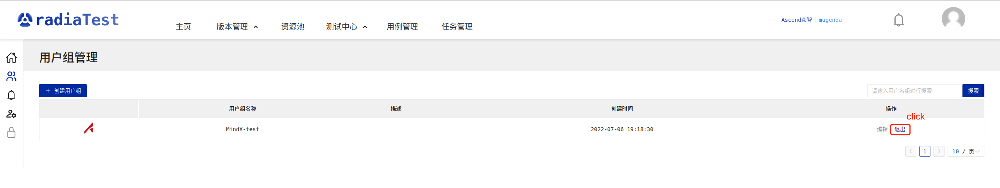

#### 1.3 权限

##### 1.3.1 查询拥有的角色

组内角色通过用户组抽屉中查看，默认角色为default

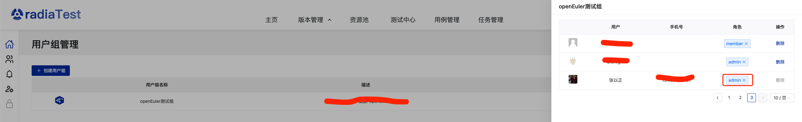

##### 1.3.1 查询角色访问规则（确保拥有相应权限，默认无权）

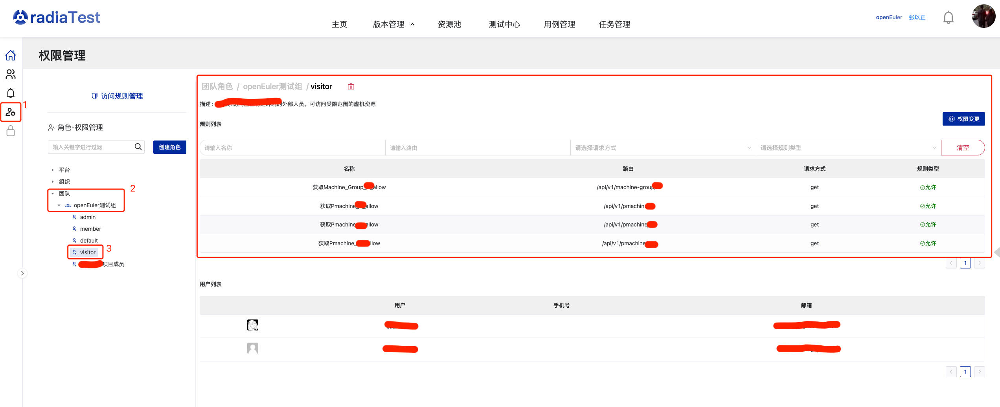

### 3. 作为组织管理员

#### 3.1 如何申请创建组织，并成为新组织的管理员

若相应组织为开源社区，如openEuler，且要求用户必须签署CLA才可以进入，则创建组织时需要提供CLA相关6项信息；若组织需要对接gitee企业仓，则创建时需要提供gitee企业仓信息。

若组织已创建，需添加新管理员，直接联系平台管理员即可。

联系平台管理员创建新组织，编写邮件发往ethanzhang55@outlook.com（暂），如下图格式：

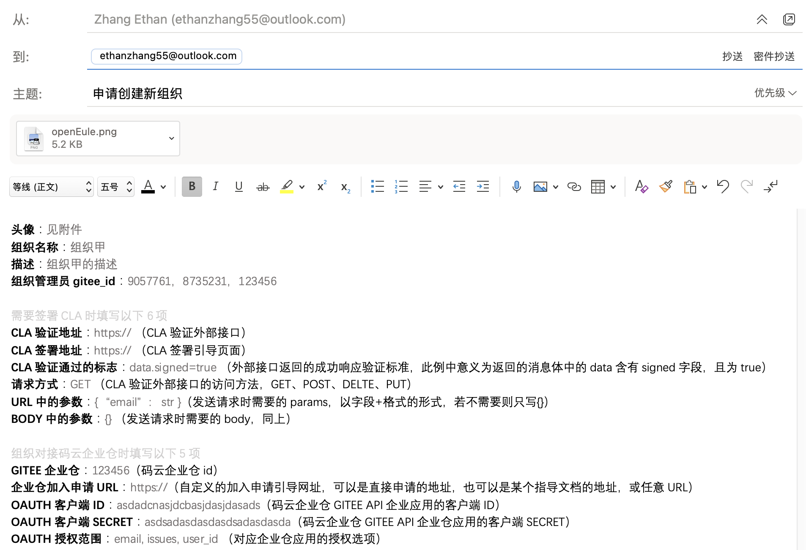

*注：之后会将联系人页面、内容格式等相关信息添加前端页面，也可能会考虑将申请邮件自动化读取，通过平台消息发于平台管理员*

#### 3.2 权限管理

与下文团队管理中的大同小异，**参考4.3章节**

### 4. 作为团队管理员

#### 4.1 创建团队

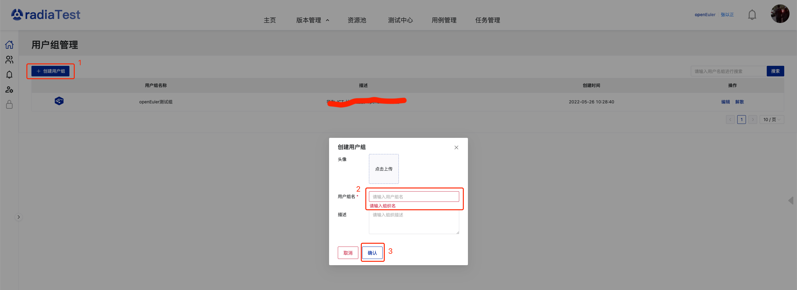

#### 4.2 邀请成员

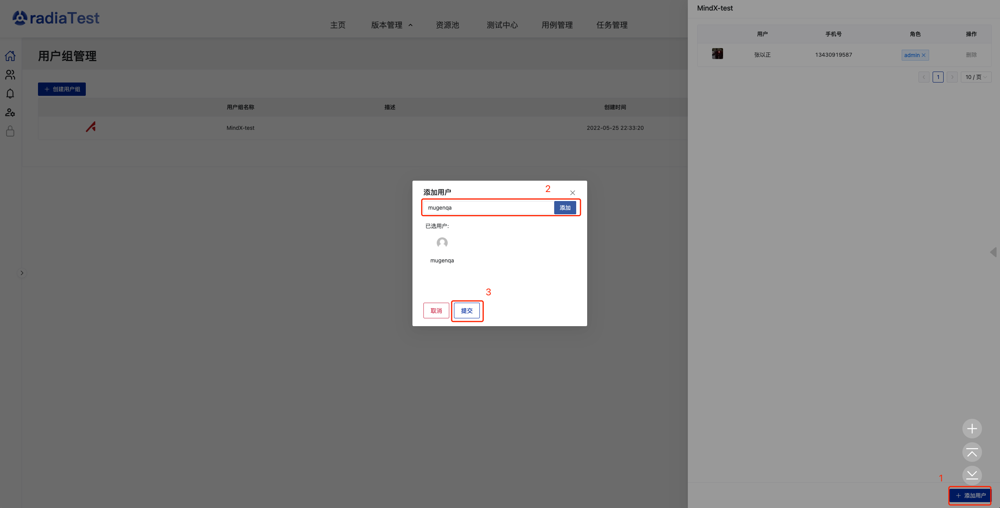

#### 4.3 权限管理

##### 4.3.1 管理团队接口访问规则（默认无权限）

团队均默认无访问公共权限域（平台规则全集）的权限，作为团队管理员，仅默认有权查看团队内（与团队有关的、属性属于团队的）规则集合。若需要为团队增减规则集合，需要联系平台管理员进行处理

p.s. 未来将在前端页面提供平台各责任田人员的联系方式

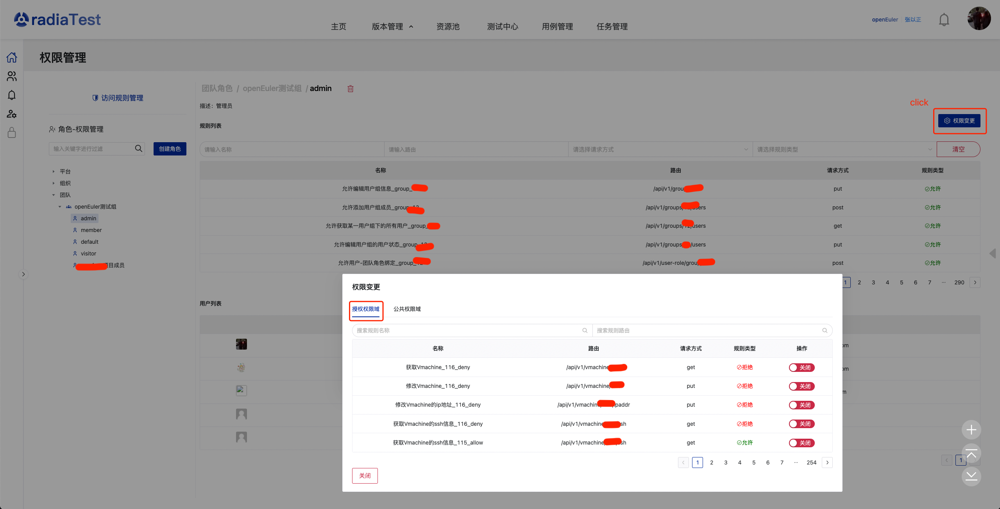

##### 4.3.2 管理团队用户角色分配

1. 删除原有角色

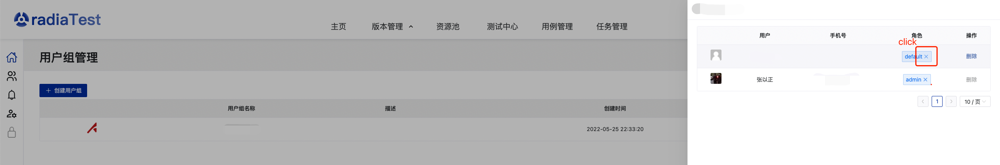

2. 配置新角色

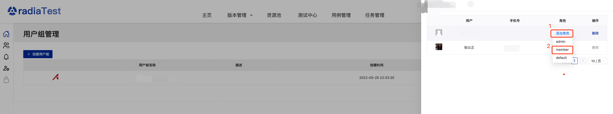

##### 4.3.3 管理团队角色-规则绑定/解绑

选择角色 => 权限变更 => 搜索规则 => 开启/关闭

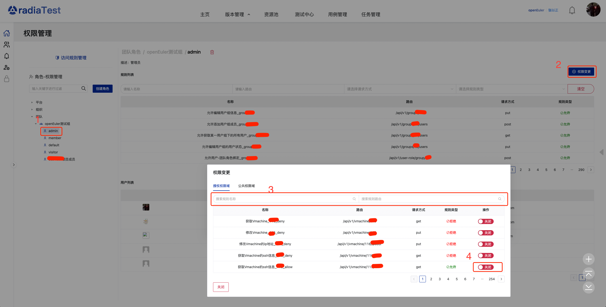

#### 4.4 解散团队

团队创建者可直接解散团队

### 5. 测试经理、测试任务管理者

#### 5.1 测试资产管理

##### 5.1.1 版本管理

###### 5.1.1.1 产品版本管理

产品版本为各组织、团队、个人的测试环境，即操作系统产品版本。

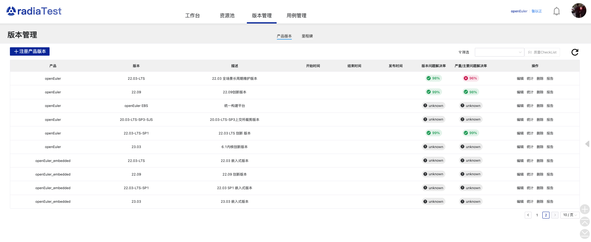

每一个设置“强管理”属性的产品版本都可以创建相关的版本质量看板，支撑发布质量可信。版本质量看板具备版本问题解决率展示、版本间软件包比对、版本测试需求展示、每日构建结果展示、rpm check结果展示、AT结果展示等功能。

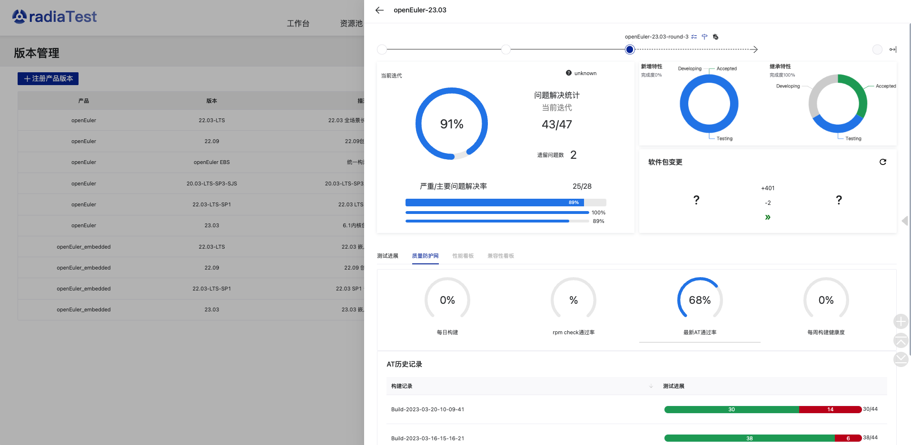

点击软件包比对卡片可以进入软件包比对详情看板，看板默认和前置迭代版本进行比对

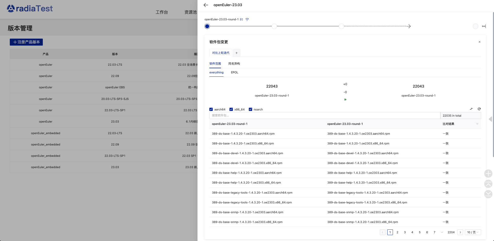

也可以通过“+”按钮与历史版本自由比对

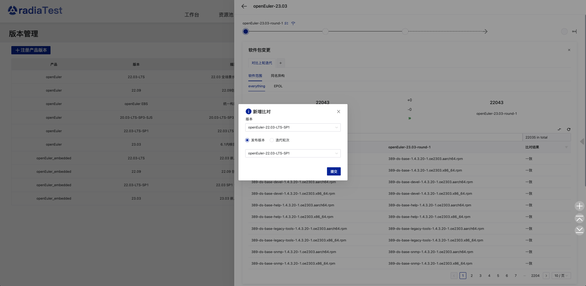

###### 5.1.1.2 里程碑管理

radiaTest里程碑的定义与openEuler社区对里程碑的定义相同。里程碑分为release（发布版本里程碑）、update（update版本里程碑）以及round（迭代版本里程碑）。因为release与round版本具备自有的iso镜像，而update版本仅扩展repo源，所以前两者可注册镜像信息，后者仅注册repo信息。里程碑的详情里记录的镜像/repo数据，将成为平台后续创建机器、自动化测试时的镜像/repo来源

- 创建里程碑

  - 选择产品版本

    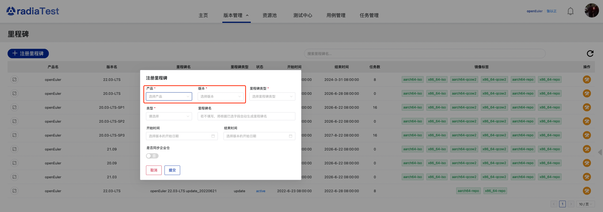

  - 选择里程碑类型

    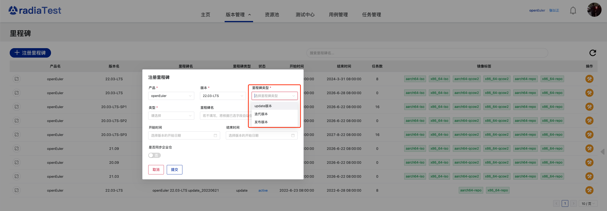

  - 选择权限属性（选择权限类型，以及权限归属）。

    p.s. 已下方场景为例，若用户不属于openEuler测试组，将查询不到对应里程碑。若创建的为个人类型，那么除了创建者其余用户均查询不到此里程碑。若为组织类型，则登入组织不一致时查询不到。若为公共类型，则均可见。此逻辑全平台共用。

    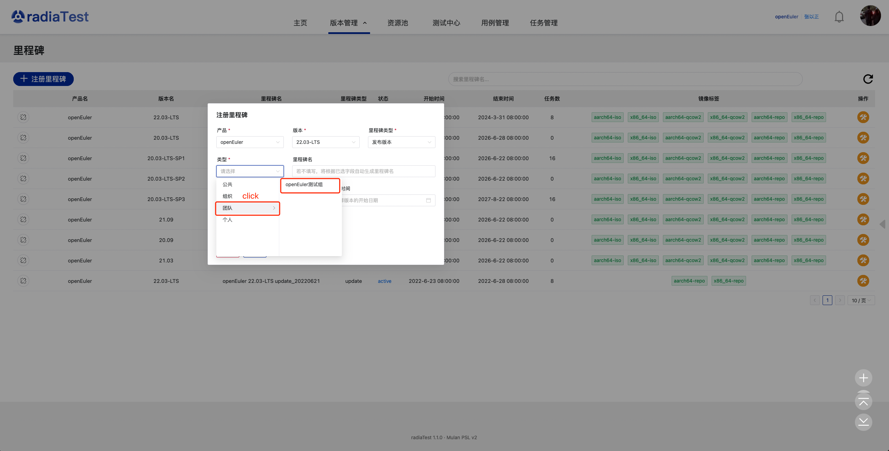

  - 填写里程碑名（可不填写，不填写时已默认命名规则，依据产品版本、类型、时间创建名字）

  - 填写里程碑开始时间与结束时间 p.s. 未来结合质量看板的基线管控，会新增转测时间字段

  - 选择是否同步企业仓（仅限注册了企业仓信息的组织），若选择同步企业仓，则此里程碑与Gitee企业仓的里程碑将会同步创建。后续对其的修改也会同步到企业仓。且同步后到里程碑详情中也可以查询到Gitee企业仓中与其关联的issue数据。此里程碑第一列图标将会是蓝色样式。

    开头的图标若为白色样式，则此里程碑未同步企业仓，未同步的里程碑无法查询issue数据，修改也不会对企业仓造成影响。

    p.s. 未来可以将未同步的里程碑修改为同步企业仓，以此解决历史里程碑未与企业仓关联导致的功能不全

    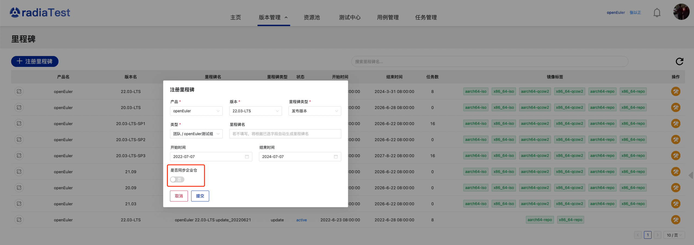

- 里程碑使用说明

  - 点击行中状态列蓝色文本按钮则可修改为active或close状态（仅限同步的里程碑，目前对于非同步里程碑此字段无意义）

  - 镜像标签代表则该里程碑是否已具备相应的镜像/repo数据（aarch64-iso代表已具备arm架构的iso镜像信息，可基于此里程碑安装系统、cdrom形式创建虚机）

  - 查看里程碑详情

    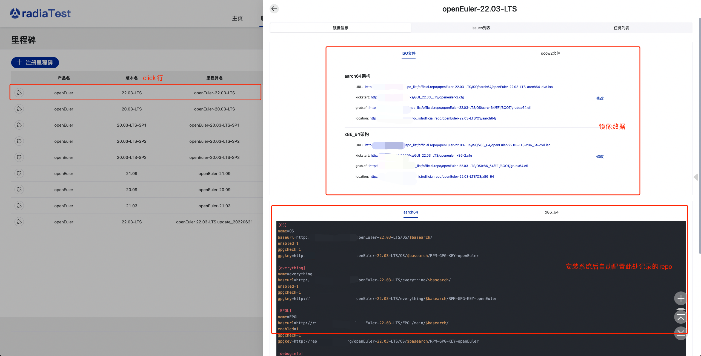

  - issue列表展示关联issue数据（仅限同步里程碑），任务列表展示关联此里程碑所有任务的数据（待优化）

    此处的任务为：radiaTest平台任务管理页面用户创建的“任务”

    p.s. 此处不会以版本级视角展示内容，版本级视角将于版本质量看板（开发中）内体现

    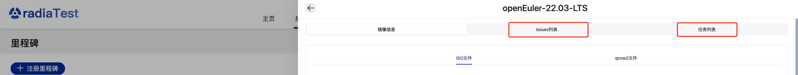

##### 5.1.2 资源管理

###### 5.1.2.1 机器组管理

- 资源池选择

  当前仅可以radiaTest自有的形式进行接入，即通过部署radiaTest-messenger服务于用户自身的机器组内，而后注册数据于平台实现接入。

  p.s. 未来可对接多种资源池，如以Compass-CI部署的资源池。即可在注册机器组数据时选择资源池，从而解耦部署机器组的过程。

- 机器组部署指导

  - 于机器组内准备一台跳板/堡垒机，确保此堡垒机可被公网访问（连接公网，或具备公网NAF映射），因当前仅确认radiaTest部署脚本于Ubuntu、CentOS、openEuler环境运行无误，建议采用安装Ubuntu或openEuler系统的物理机。

  - 下载radiaTest资源池根证书，并传入跳板/堡垒机内

    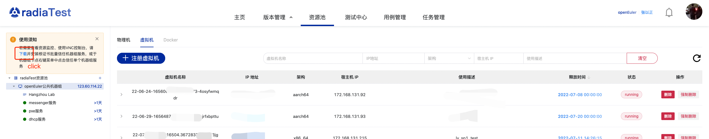

  - 在跳板/堡垒机内安装docker/docker-ce（取决于环境），以及docker-compose这两个依赖，并选择一个目录下载项目源码

    1. dnf install -y docker 或 sudo apt install -y docker-ce （可能需要配源，默认有可能无此软件包）
    2. dnf install -y docker-compose 或 sudo apt install -y docker-compose
    3. git clone https://gitee.com/openeuler/radiaTest

  - 准备配置文件

    1. 新建/etc/radiaTest/目录，并将源码中的配置文件模板复制到此目录

       1. mkdir /etc/radiaTest

       2. cp  {path_to_radiaTest}/radiaTest-messenger/conf/app/messenger.ini  /etc/radiaTest

       3. 配置项解读

          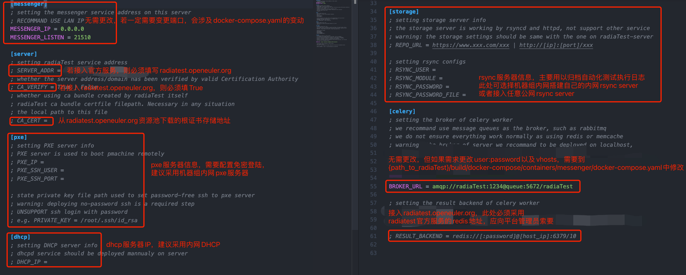

       4. docker-compose配置项解读，该配置文件处于{path_to_radiaTest}/build/docker-compose/containers/messenger/docker-compose.yml

          p.s. 不建议修改红框外的配置项，最多可以变动/var/log/开头或/root/.ssh这两种挂载卷位置

          

  - 切换到项目下的 build/docker-compose/ 目录，并启动部署

    1. cd {path_to_radiaTest}/build/docker-compose

    2. ./radiatestctl -u messenger 或 sudo ./radiatestctl -u messenger

       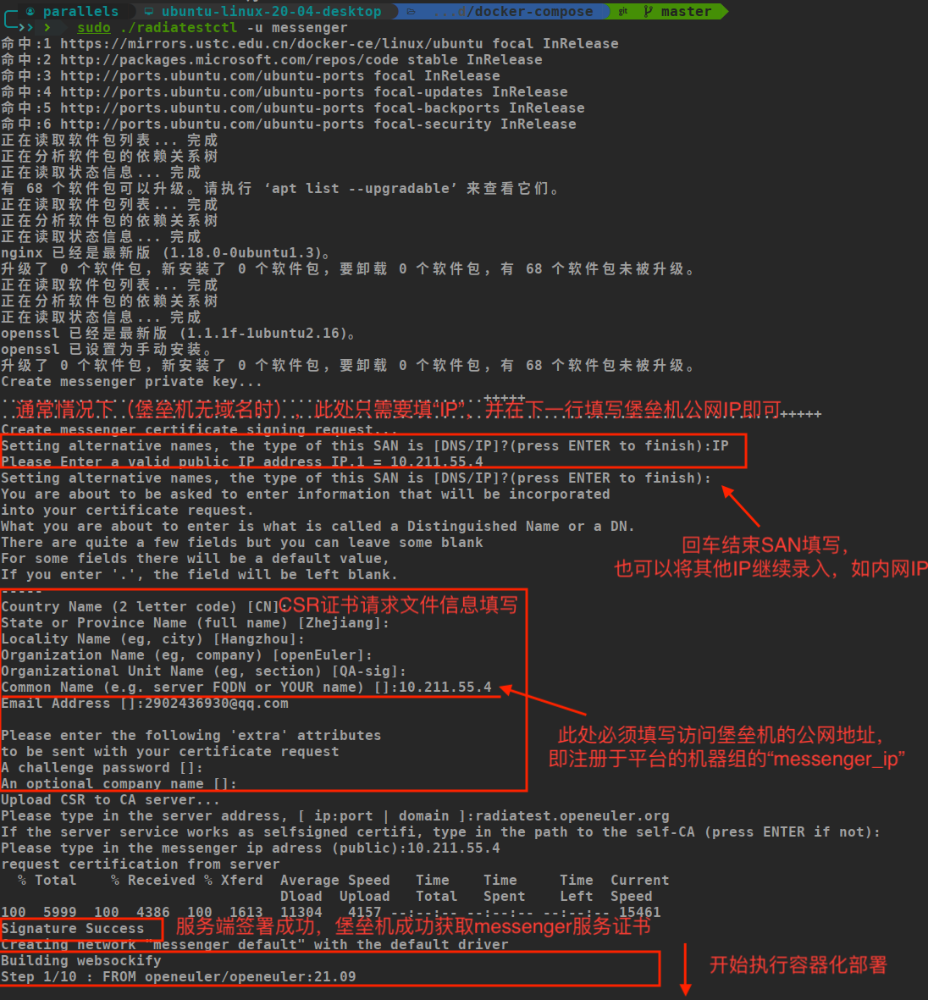

  - 部署情况检查

    1. 部署过程末尾观察容器启动情况，若一下四个容器均已启动，则构建完成

       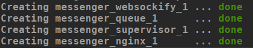

    2. 容器运行状态检查：执行docker ps -a 或 sudo docker ps -a，若四个容器STATUS均为UP状态，则启动完成

       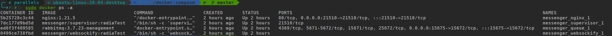

    3. 服务检查

       - telnet检查

         执行telnet [messenger_ip] [messenger_listen]查看是否可通, 若不可达，请首先检查防火墙是否开放相应端口

       - supervisor容器内部检查，是否容器内部messenger服务进程没有正常启动？有可能配置文件没配好

         若各进程皆为RUNNING，说明启动正常

         

         接下来检查messenger日志，位置位于容器工作路径的 log/messenger/stderr.log中

         如果日志打印不正常，则说明配置文件没有配对，检查/etc/radiaTest/messenger.ini是否均正确填写

         若配置均无误，但日志观察到乱码，应该是容器内未设置系统语言为zh_CN.utf8导致的

         若日志正常打印，切容器内21500端口被正常监听，则说明messenger已正确启动

       - supervisor内部运维相关命令

         进入交互前台：supervisorctl -u radiaTest -p 1234 => 用户名和密码可以在docker-compose.yaml中定义，需要在build前修改，此处为默认用户名密码。

         进入交互前台后：start [进程名] [进程名] ... / stop [进程名] [进程名] ... / restart [进程名] [进程名] ... （也可以用all）

         也可以在外部一句话启停：supervisorctl -u radiaTest -p 1234 start / stop / restart [进程名] [进程名] ...（也可以用all）

         【gunicorn.messenger】核心服务

         【celery.check_alive】机器组各服务心跳监控

         【celery.job_callback】测试执行的结果回调

         【celery.messenger.beat】定时任务发布

         【celery.run_case】用例执行（实际执行用例，结果回调的父任务）

         【celery.run_suite】测试套执行（用例执行的父任务）

         【celery.run_template】模板执行（用例执行的父任务）

       - 检查messenger_nginx容器是否正常运行（非supervisor容器内检查，而是在宿主机执行下述过程）

         查看nginx容器日志：docker log messenger_nginx_1 => 若nginx正常运作，则基本说明服务一切正常

       - 最后检查防火墙是否放行了nginx监听的端口。（iptables、ufw、firewalld等）

       - 若在上述步骤中临时关闭的防火墙服务，需要重启docker服务使能放行端口：systemctl restart docker

       - 若上述检查均通过，但仍无法telnet连上，请联系ethanzhang55@outlook.com以获取支持

- 机器组注册

  确认已部署messenger服务无误后，进入平台资源池页面注册新机器组

  1. 网络类型目前为冗余字段，没有实际意义，不会因为选了广域网还是局域网而产生影响，但为了未来扩展的考虑，此处请选择局域网（取决于机器组内机器是否均为内网IP）

  2. 公网IP地址、messenger IP、websockify IP 默认保持一致，均应该为服务端可访问的公网IP。其中公网IP作为此机器组的别名，messenger IP和websockify IP则会被实际使用

     p.s. 三者不一致的场景会出现在机器组采用复杂安全策略连接外部网络的场景。

     e.g. 机器组公网出口实际为139.159.0.1，但因为采用了额外的外部防火墙，实际外网访问时访问的是139.139.139.139，那么此处公网IP应该填写前者，而messenger IP和websockify IP填写后者（一般不会出现websockify与messenger不在一台机器的场景，但若确实不在，则填不同的值），其中websockify服务是messenger的伴生服务，承担连接虚拟机VNC端口的责任

  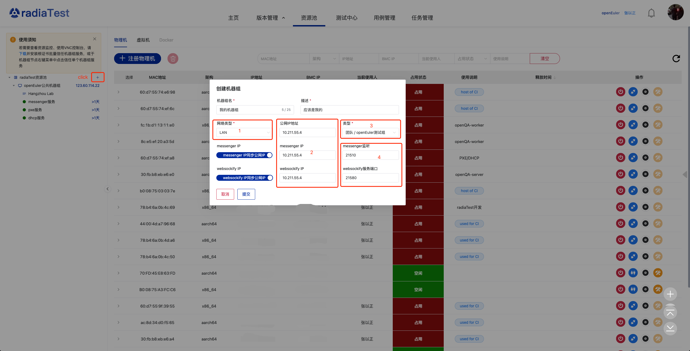

- 机器组菜单

  机器组信息修改以及机器组删除均在机器组菜单中的选项里。机器组证书检查是检查当前浏览器是否已信任机器组messenger的证书，点击会出现一个跳转页面，确认后将返回。若未信任，浏览器将提示信任。若不希望逐个确认，请按须知下载server端根证书，并安装信任。

  此信任为查看组内机器实时资源信息、web控制台的基础。

  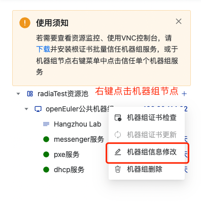

- 机器组选择

  在机器组节点左键点击则右侧会变为该机器组的内容。若没有选择任意机器组，右侧将保持无内容

  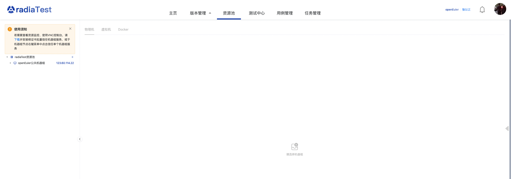

###### 5.1.2.2 静态资源管理

- 物理机
  
  - 部署radiaTest-worker（对于需要作为虚拟机宿主机用途的机器）
  
    - 在物理机内安装docker/docker-ce（取决于环境），以及docker-compose这两个依赖，并选择一个目录下载项目源码
  
      1. dnf install -y docker 或 sudo apt install -y docker-ce （可能需要配源，默认有可能无此软件包）
  
      2. dnf install -y docker-compose 或 sudo apt install -y docker-compose
  
      3. git clone https://gitee.com/openeuler/radiaTest
  
    - 准备配置文件
  
      1. 新建/etc/radiaTest/目录，并将源码中的配置文件模板复制到此目录
  
         1. mkdir /etc/radiaTest
  
         2. cp  {path_to_radiaTest}/radiaTest-worker/conf/app/worker.ini  /etc/radiaTest
  
         3. 配置项解读
  
            [server] 和 [celery] 项中的配置与messenger的配置基本一致。其中需要注意，宿主机必须配置网桥，若该物理机没有配置网桥，请在部署worker前将网桥配置妥当。
  
            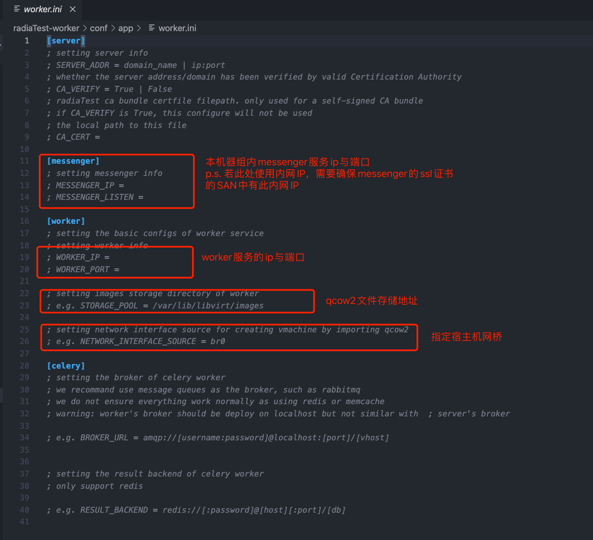
  
         4. worker的gunicorn配置
  
            radiaTest-worker的端口由 {path_to_radiaTest}/radiaTest-worker/gunicorn/gunicorn.conf.py设定，此配置文件建议只修改bind和log相关项
  
            p.s. radiaTest-worker部署在裸机上，并非完全容器化（rabbitmq队列为容器部署），请慎重考虑端口是否产生冲突
  
            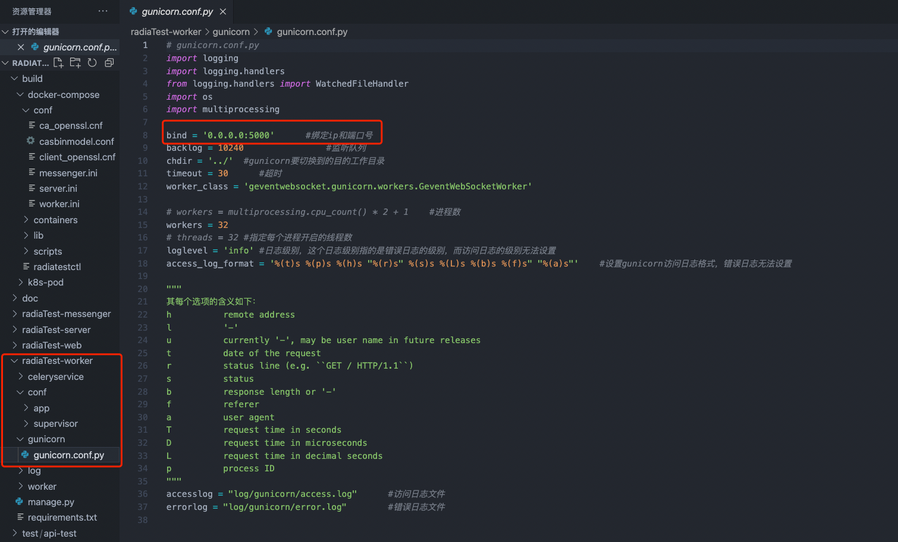
  
            supervisor配置（多进程管理服务）在 {path_to_radiaTest}/radiaTest-worker/conf/supervisor/supervisor.conf
  
            p.s. messenger的supervisor配置也同理，但因messenger纯容器部署，使用默认配置也不会出现太大问题
  
            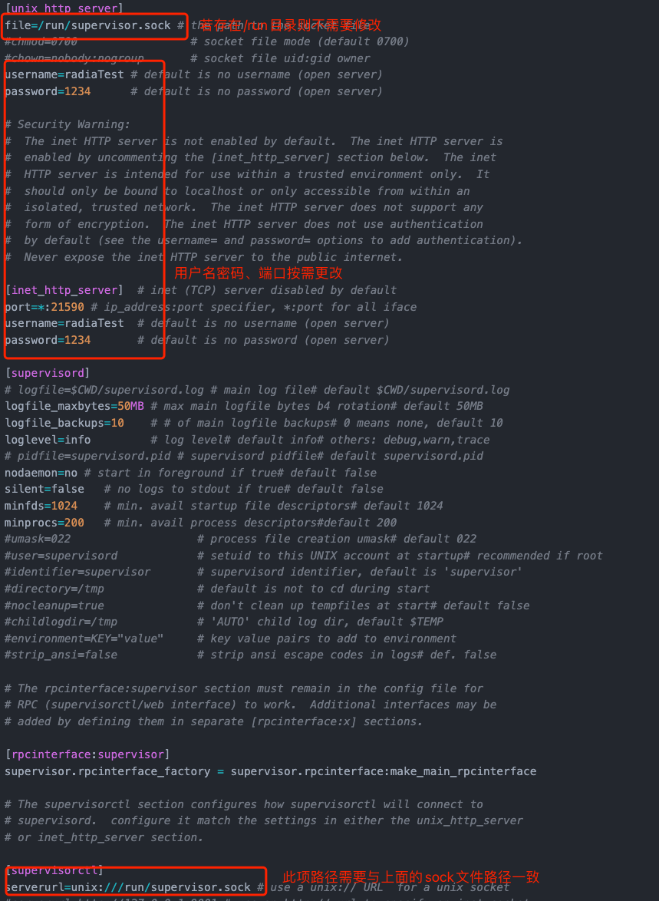
  
         5. 切换到项目下的 build/docker-compose/ 目录，并启动部署
  
            1. cd {path_to_radiaTest}/build/docker-compose
            2. ./radiatestctl -u messenger 或 sudo ./radiatestctl -u worker
  
         6. 使用与messenger服务相似的流程观察部署结果（注意supervisor是部署在裸机上的，而非容器，所以直接逻辑执行supervisor运维命令即可进入交互前台）
  
  - 注册物理机
  
    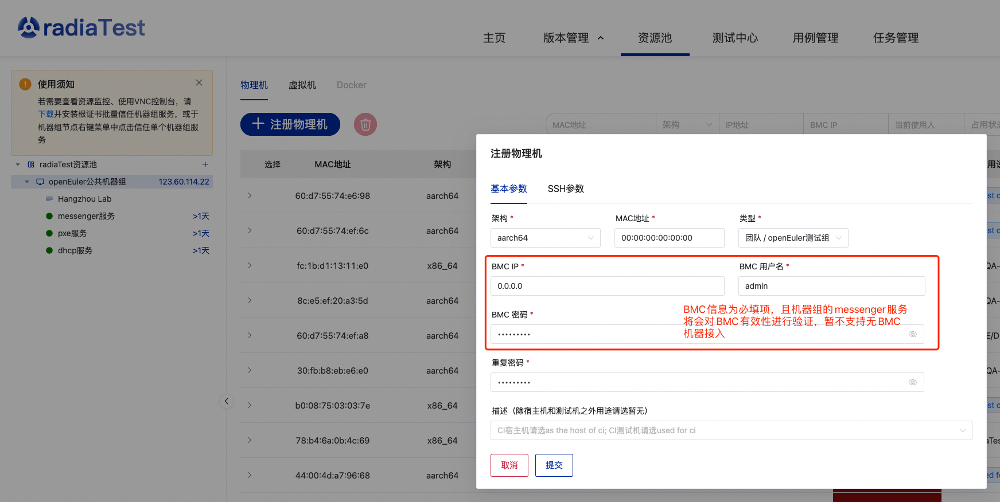
  
    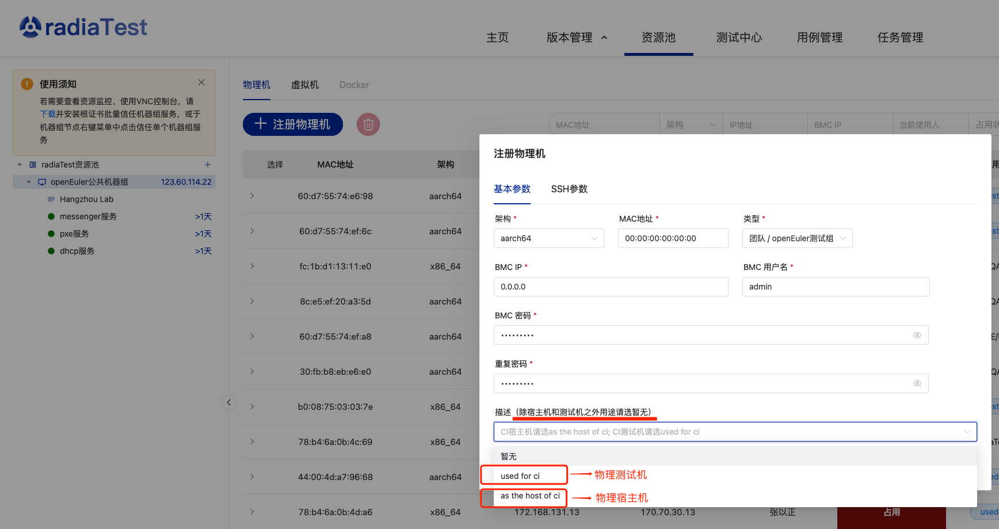
  
    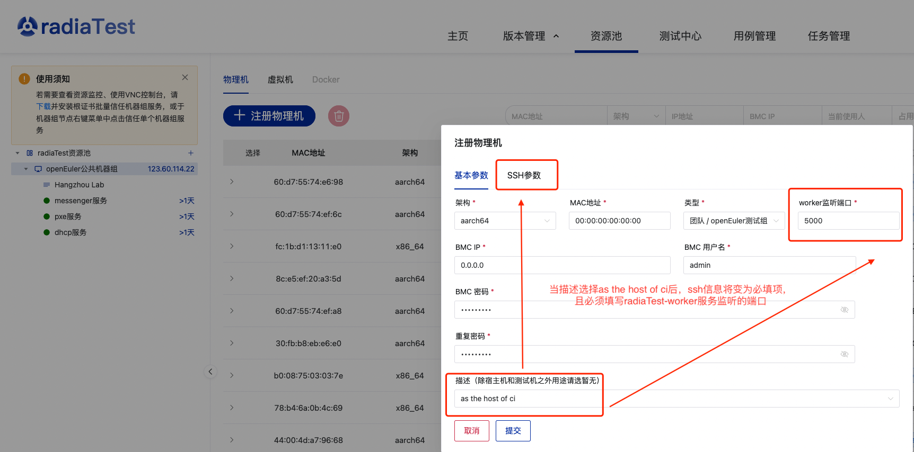
  
    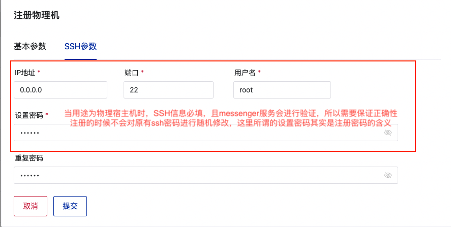
  
  - 编辑物理机（编辑走路由中含有物理机id，意味着此类接口受权限系统强管控，平台其余模块同理）
  
    当且仅当物理机为空闲状态时，才可以点击此按钮弹出编辑窗口
  
    
  
    表单与创建表单基本一致，但没有对描述、worker端口的更改入口。同样提交表单后会对bmc和ssh信息进行校验
  
    
  
  - 查看物理机详情
  
    拥有get该物理机的权限即可查看展开的信息和数据，但BMC、SSH信息受到独立的接口进行权限隔离
  
    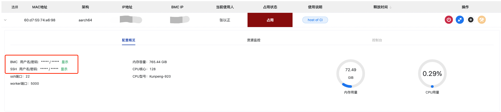
  
    资源监控页仅在物理机部署了radiaTest-worker且注册了worker监听端口时可用
  
    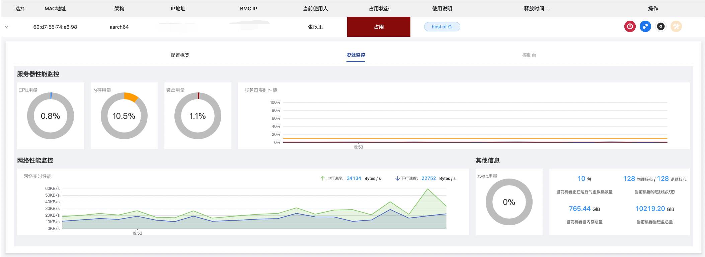
  
  - 物理机状态控制（上电与下电）
  
    当物理机为开机状态时，操作栏第一个按钮为下电按钮；反之则为上电按钮。
  
    p.s. 当前上下电没有做二次确认弹窗，请注意不要误触（如果有上下电权限的用户）
  
    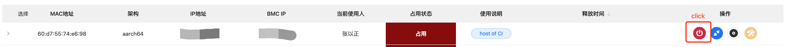
  
  - 物理机系统重装
  
    物理机所重装的系统将会是选择的里程碑所注册的镜像信息和repo信息所锚定的OS系统
  
    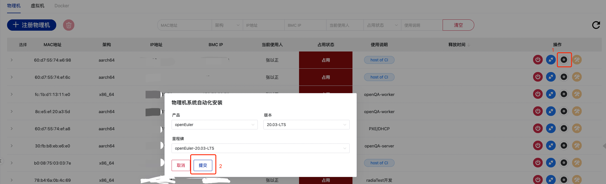
  
  - 物理机释放
  
    释放物理机后，物理机的ssh密码将会被修改为由安全随机数生成的临时密码，且释放人将丢失占用时临时获得的相关权限（上下电、重装、查看ssh密码）
  
    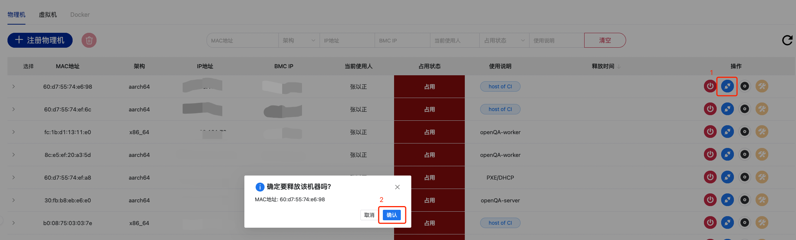
  
  - 物理机释放
  
    占用物理机时，需要填写描述/用途（若为物理测试机或物理宿主机则扔与注册时一致），如果描述为as the host of ci，则需要填写worker监听端口，若描述为其他描述，则需要填写占用时间（默认最大不超过7天）。
  
    同时，若用途为as the host of ci或used for ci时，物理机不存在释放时间，永不自动释放。这两类特殊用途含义是团队/组织内的共享资源。当创建虚拟机时，用户不必要拥有该物理机的大部分权限，as the host of ci用途的物理机组成了一个宿主机池，虚拟机将在池子里负载均衡式的创建
  
    p.s. 负载均衡处于开发中
  
    
  
  - 物理机删除
  
    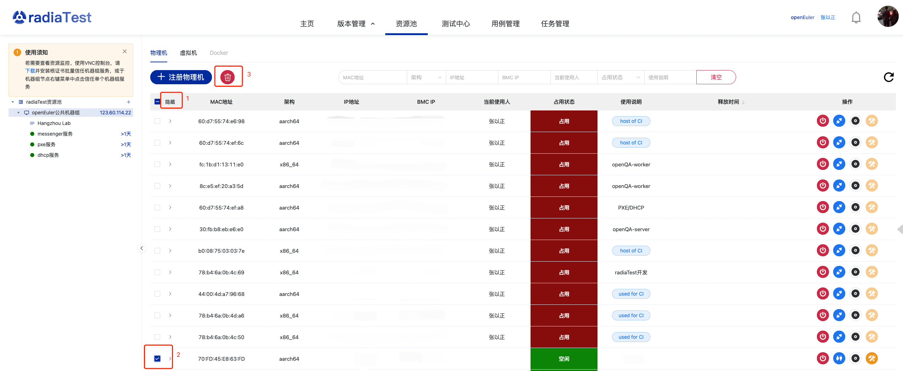
  
- Docker

###### 5.1.2.3 动态资源管理

- 新建虚拟机

  【qcow2镜像导入】使用里程碑注册的相应qcow2文件信息（下载url、ssh账号密码），由qcow2样本创建。此类方式创建无法在创建时定义磁盘大小，有磁盘大小变动需求的需要创建后修改。

  【虚拟光驱安装】利用里程碑注册的相应iso镜像信息（镜像url、efi文件url、ks文件url等），采用挂载CDROM的形式创建虚拟机，此类方式创建时，需要到虚拟机web控制台进行手动安装，安装完后虚机将会自重启以完成安装。

  【自动安装】：pxe实现的自动安装，将安装流程的交互式引导变为自动引导，此类方式创建时间一般为10-15分钟。

  

  虚拟机CPU核数 = Sockets数 * Cores数 * Threads数

  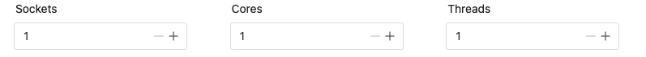

  机器调度策略分为全自动与手动选择（宿主机）两种。此两种方式涉及的权限筛选存在差异。对于全自动选择而言，相当于是在用户权限可达范围内（公共、当前组织、所属团队以及个人）在as the host of ci用途的机器池中选取机器，而手动选择则是此机器池外的，该用户所占用的机器。

  有可用机器时，右侧文本将变为蓝色“选取机器”按钮，悬浮可查机器列表并对指定机器进行勾选

  p.s. 当前全自动选取基于资源允许下的完全随机选取，基于优先队列的负载均衡选取方法尚在开发中

  

- 编辑虚拟机

  1. 点击可修改虚拟机IP地址（若虚拟机在安装过程中没有成功自动获取到IP，或者没有记录到IP），则可以由此补充
  2. 点击释放时间字段弹出延期申请窗口，提交申请后经由管理员同意则可实现延期
  3. 内存、vcpu、boot顺序修改，由修改虚拟机xml文件实现
  4. 查看SSH信息/修改SSH密码（权限隔离）
  5. 修改网卡以及磁盘配置，完成对虚拟机的网卡磁盘热插拔

  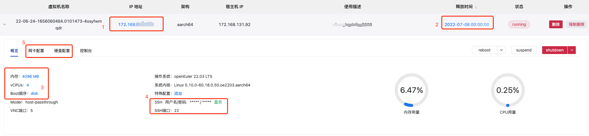

  当虚拟机需要特殊xml配置时，由此添加

  p.s. 特殊配置目前按openEuler测试组业务仅写了这两种，但后续会根据社区需求扩展

  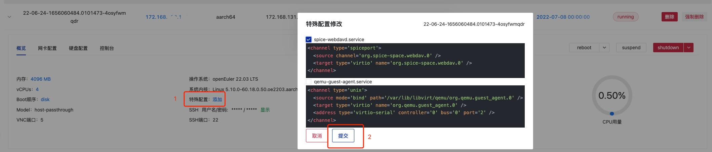

- 删除虚拟机

  删除虚拟机分为删除和强制删除两种。删除将先实现物理上删除虚拟机，然后再删除数据库中的数据。而强制删除无需与宿主机交互，将直接作用于数据库数据。若此虚拟机物理上并未被删除，此修正工作由radiaTest-worker的非法构建监控发现并进行处理。（强制删除的初衷在于处理出现异常的虚机）

- 虚拟机控制台与状态控制

  

##### 5.1.3 用例管理

p.s. 用例管理仍处于快速迭代期，细节上可能会出现频繁迭代，此标题下的使用指南暂时具备时效性

###### 5.1.3.1 【公共】测试框架注册

测试框架始终属于公共权限类型，即所有人可见，所有人可用，但是修改和删除权限默认分配于平台(public)管理员

若需要适配需要联系ethanzhang55@outlook.com（暂）

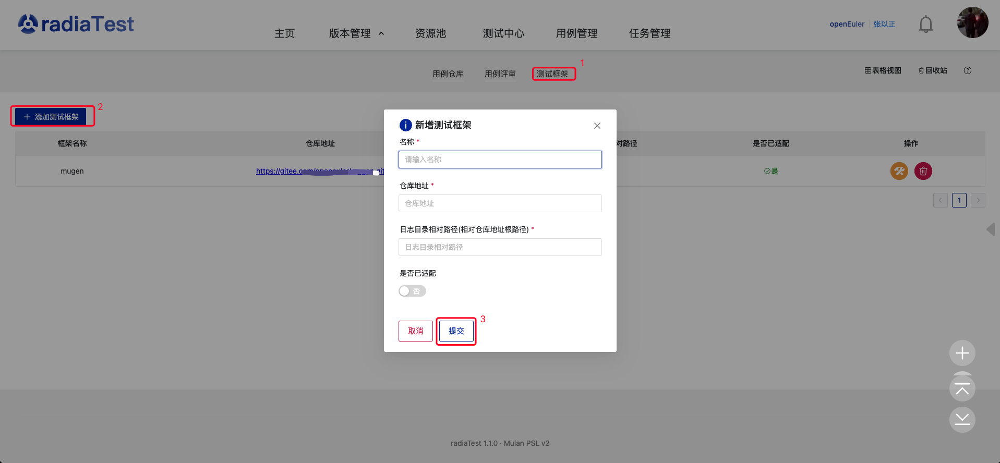

###### 5.1.3.1 【团队】代码仓注册

自动化脚本代码仓会且仅会属于团队，不存在属于组织、公共或个人权限属性的代码仓数据。代码仓注册后，若代码仓允许同步且已存在适配的解析方法，平台后台将定时依据对应解析适配器爬取代码仓数据，更新脚本代码以及环境信息到对应文本用例中。

e.g. 若文本用例集上传时，文本用例缺失了机器类型等环境信息，同时团队注册了适配的代码仓，且代码仓中有对应用例的环境需求信息记载，则此时平台后台将会自动爬取、解析、并进行数据补录，以此减轻信息补全的工作量

若代码仓允许同步但未适配或不允许同步，则平台后台将不会进行对该代码仓进行定时读取

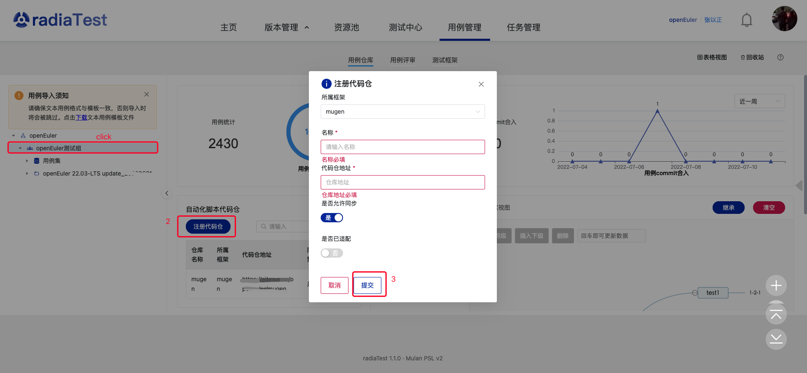

###### 5.1.3.2 用例集导入

用例集为团队的用例集，归属仅能为对应团队，导入的入口也仅存于用例管理的目录视图。

用例集的定义为：团队的文本用例结构化（分类）集合，其结构被组织的测试项基线所约束，也是后续创建版本基线的基础。用例集中的用例分类唯一，即不存在同一用例处于不同目录下，测试套与用例对应关系为实际从属关系。

导入支持常见压缩格式，如tar包、zip文件、rar文件。用例集各目录下的excel文件将会被解析（csv、xls和xlsx），将以平台指定的文本用例模板逐行读取。

导入的excel不要求单个sheet（可以多个），读取单位为每一行

用例集导入默认为管理员权限行为，所以导入的用例将不会走用例评审流程，将直接从零创建团队用例集。

若团队成员通过平台对文本用例内容进行了修改，或者通过平台进行了新建或单个用例文件导入（需求同一测试套），则必须走用例评审流程。

p.s. 当前仅有以下内容要求

1. 严格按照模板文件中的各列要求填写（如是否自动化只有是和否两个选项）
2. 测试套和用例名不为空
3. 不可以进行单元格合并
4. 测试级别和测试类型建议采用模板中的选项

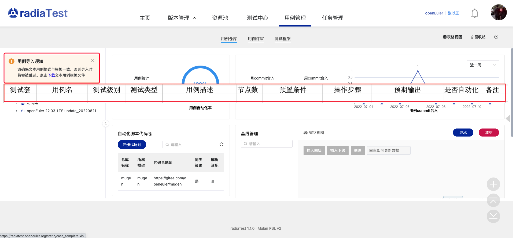

###### 5.1.3.3 用例详情查询

当用户单击左侧目录用例节点时，右侧将会如下图所示。若自动化为真，则可以点击历史执行与自动化脚本tab，可查看自动化脚本与平台对历史执行情况以及自动化脚本代码。历史版本可查询此文本用例的历史变动。

p.s. 平台对测试套的定义为，与某待测特性或待测软件包相关的全量测试用例，即软件包/特性相关用例

###### 5.1.3.4 用例新建

于测试套节点右键可选创建用例选项，选择后通过前端表单提交新文本用例各项内容，提交后将会创建个人为提交Commit。

###### 5.1.3.5 用例导入

于测试套节点右键可选导入用例选项，于用例新建同理需要评审，通过导入符合模板的既有用例跳过人工输入过程。导入的Excel文件需求于用例集导入时同等的格式要求，且需要保证导入的Excel文件有效行的测试套列均相同（于右键点击的测试套节点测试套名保持一致）

e.g. 于dnf测试套节点导入的文本用例excel时，excel文件中只有测试套列为dnf的行才会被解析

###### 5.1.3.6 用例编辑

用例编辑于新建同理，不会直接作用到原文本用例中，而是会进入个人的为提交Commit列表中，等待提交

###### 5.1.3.7 用例删除

于用例节点右键删除

###### 5.1.3.8 提交commit

修改、用例导入（非用例集）以及新建用例后，对于修改/创建者而言，会创建一个未提交的commit（用例左边会出现P标签，即pending），第一种提交commit的方法为单击标签P。单击后将弹出对话框询问是否提交，提交后P状态会变为O状态（open），于用例评审页面等待评审和合入。

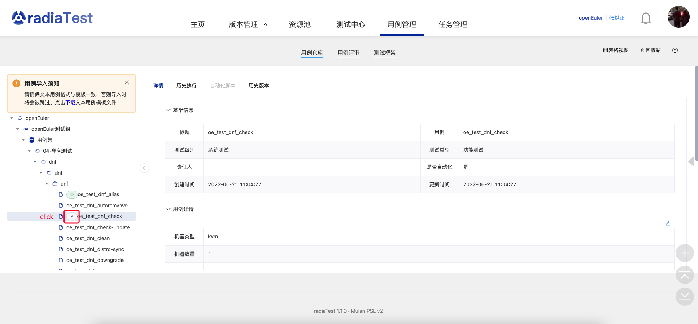

第二种方法为点击用例评审页面，点开未提交评审弹窗，选择提交。

​	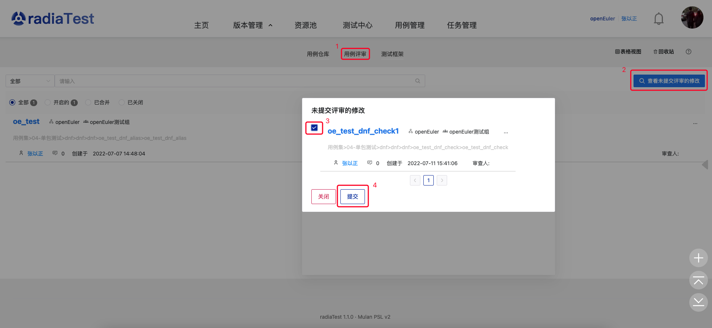

###### 5.1.3.9 用例评审

p.s. 目前用例评审前端样式与细节处于毛坯状态，当前仅作示意

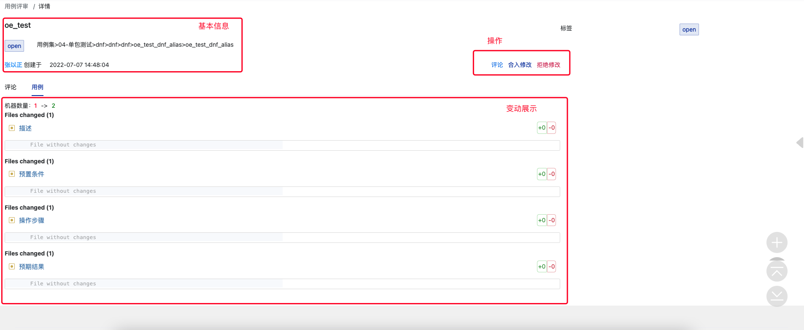

#### 5.2 测试任务管理

##### 5.2.1 任务分配

任务分配目的为简化子任务拆分和责任协助人分配的工作量，因在版本测试场景下，人员分配大多基于某种固定模式

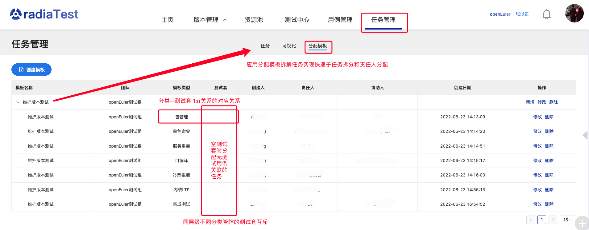

###### 5.2.1 新建任务分配模板

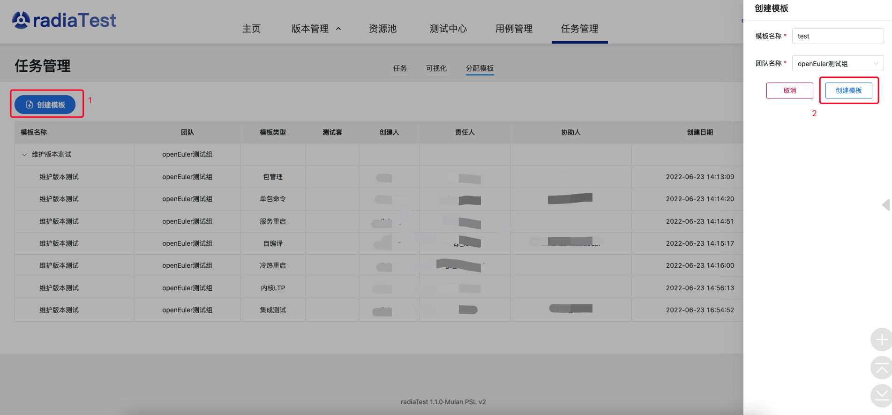

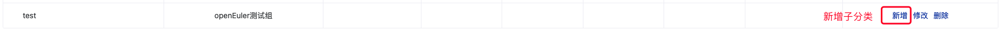

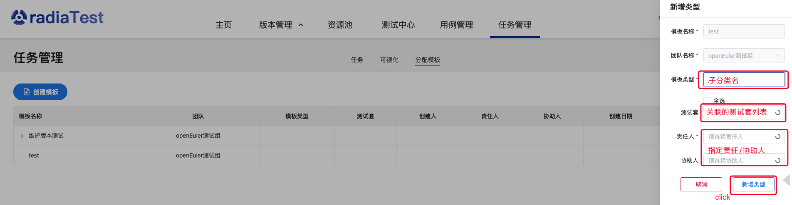

###### 5.2.2 编辑任务分配模板

修改仅可修改模板名称/分类名称（暂）

###### 5.2.3 删除任务分配模板

点击对应行删除按钮即可

###### 5.2.4 基于任务分配模板分配任务

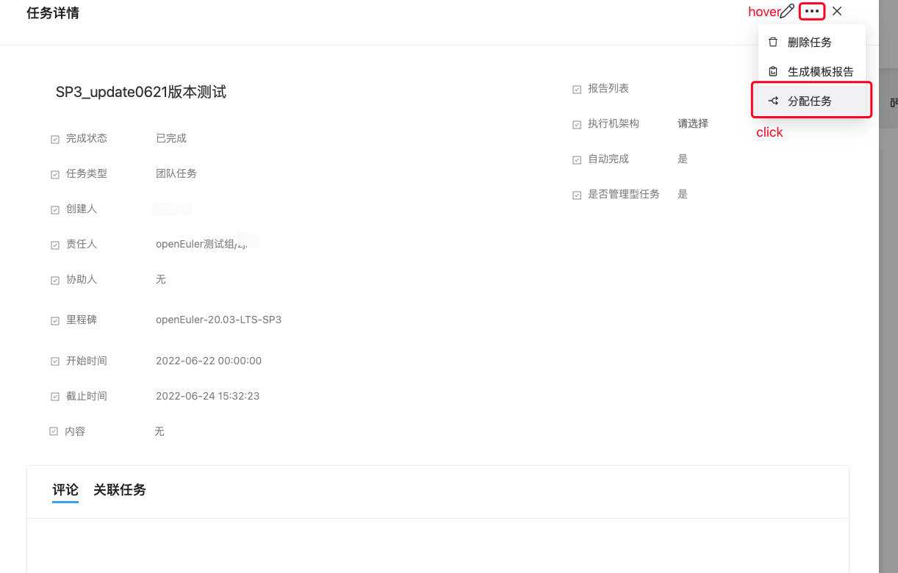

##### 5.2.2 查询可视化统计结果

p.s. 此处单纯站在任务的视角进行可视化统计，版本级任务跟踪和统计在版本管理未来的质量看板中体现。

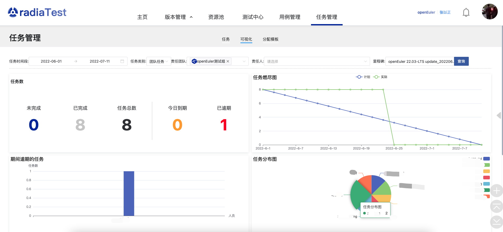

##### 5.2.3 任务泳道

当任务关联了自动化且适配可用的用例时，当其被拖动到执行中泳道时，这个任务将会暂时不可拖动，并且其中关联的自动化用例将会被打包为一个测试模板并自动触发执行。当此模板测试结束后，结果将会回写任务详情。若该任务只含有自动化用例，那么回写后任务将自动变更为已执行；若该任务既含有自动化用例也含有非自动化用例，那么回写后将停留在执行中。

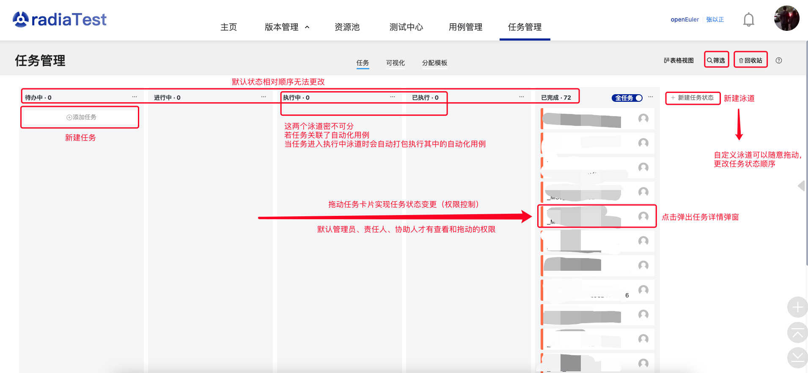

### 6. 测试人员

#### 6.2 自动化测试

##### 6.2.1 单包验证

单包验证的概念即为单独运行某测试套全量用例。因为平台对于测试套的定义为对应某一特性或某一软件包，所以单包验证的意义在于单独对某一软件包或特性进行单独测试。类型字段选择的是创建的Job归属于谁，产品版本里程碑决定的测试环境。

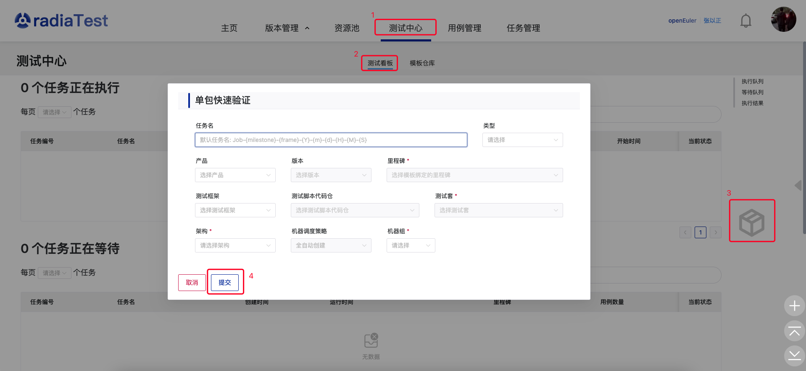

##### 6.2.2 测试模板管理

###### 6.2.2.1 新建测试模板

测试模板和单包验证类似，但不强调同一测试套，意味着用户可以按需自由组合。执行时，同一模板中环境需求一致的将分为同一组（为了平衡资源利用率）

e.g. 6个用例中，其中1个需要3台虚拟机，其中2个需求1台虚拟机，最后三个需求2台虚拟机，则该模板执行时将分为3虚拟机、1虚拟机、2虚拟机三组。

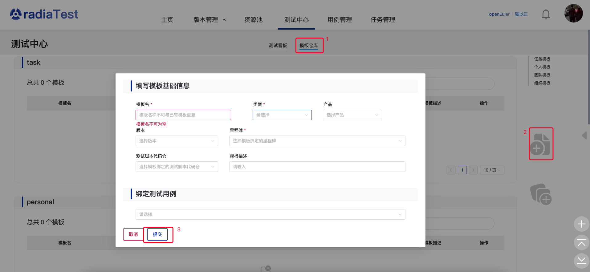

###### 6.2.2.2 克隆测试模板

通过克隆他人模板减少创建模板的工作量

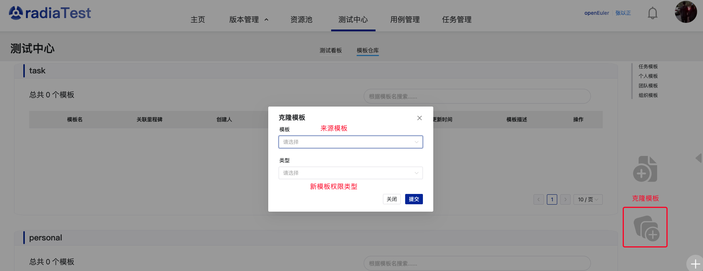

###### 6.2.2.4 执行测试模板

既有模板右侧将会有执行按钮，删除和编辑同理，不赘述

*注：以上使用指南不包含超级管理员需要关注的动作，也不包含未落地的内容，同时不包含某些细节操作。完整使用说明指南将会在未来逐步完善*

