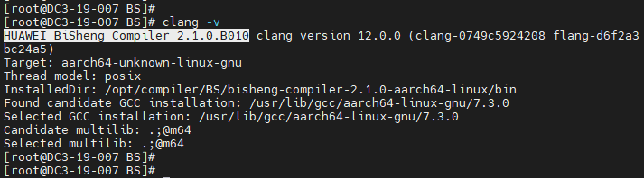
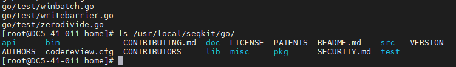
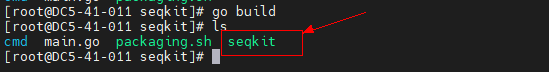
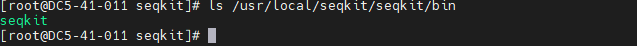
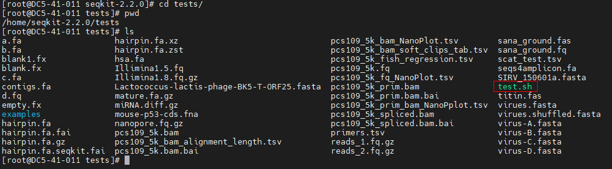
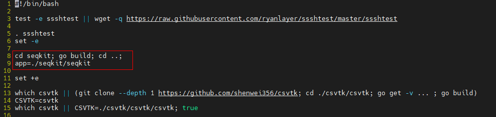
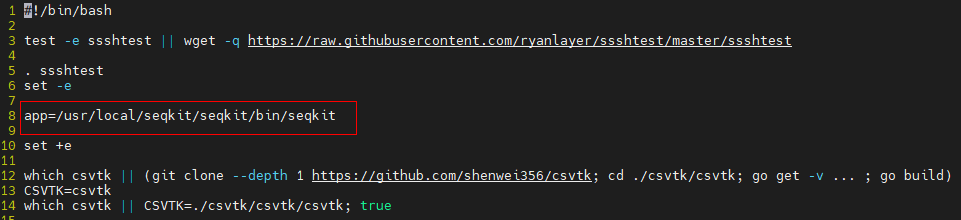
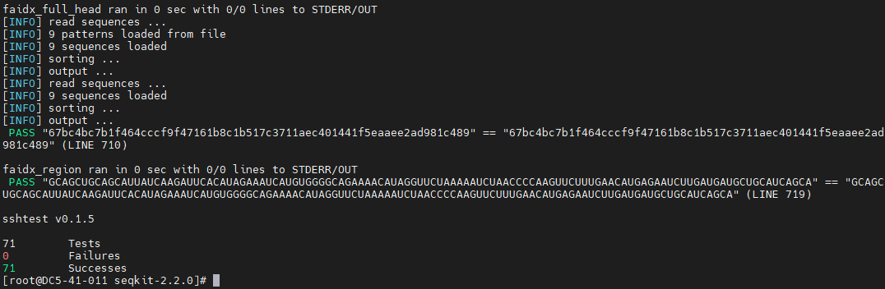

# 1.软件介绍

seqkit是一种跨平台的、极快的，全面的fasta/q处理工具。seqkit为所有的主流操作系统提供了一种可执行的双元文件，包括Windows，Linux，MacOS X，并且不依赖于任何的配置或预先配置就可以直接使用。

关于seqkit的更多信息请访问[seqkit官网](https://bioinf.shenwei.me/seqkit/)。

语言：go

一句话描述：fasta/q处理工具

开源协议：MIT License

建议版本：seqkit v2.2.0

# 2.环境要求

## 2.1. 硬件要求如下表：

| 项目     | 说明              |
| -------- | ----------------- |
| CPU      | Kunpeng 920       |
| 内存大小 | 32GB 2666MHz * 16 |
| 网卡     | 1*10GE            |

## 2.2. 软件要求如下表：

| 项目       | 版本   | 下载地址                                                                                                 |
| ---------- | ------ | -------------------------------------------------------------------------------------------------------- |
| SeqKit     | 2.2.0  | https://github.com/shenwei356/seqkit/archive/refs/tags/v2.2.0.tar.gz                                     |
| 毕昇编译器 | 2.1.0  | https://www.hikunpeng.com/zh/developer/devkit/compiler/bisheng                                           |
| go         | go1.18 | [https://dl.google.com/go/go1.18.linux-arm64.tar.gz](https://dl.google.com/go/go1.17.linux-arm64.tar.gz) |

## 2.3. 操作系统要求如下表：

| 项目      | 版本                | 下载地址                                            |
| --------- | ------------------- | --------------------------------------------------- |
| openEuler | openEuler 20.03 SP3 | https://repo.openeuler.org/openEuler-20.03-LTS-SP3/ |
| Kernel    | 4.19.90             | https://gitee.com/openeuler/kernel                  |

# 3.移植规划

本章节给出seqkit软件在移植过程中涉及到的相关软件安装规划路径的用途及详细说明。

移植路径规划：

| 序号 | 软件安装规划路径         | 用途                       | 说明                                                                                                                                                                   |
| ---- | ------------------------ | -------------------------- | ---------------------------------------------------------------------------------------------------------------------------------------------------------------------- |
| 1    | /usr/local/bisheng       | 毕昇编译器的安装规划路径。 | 这里的安装规划路径只是一个举例说明，建议部署在共享路径中。需要根据实际情况调整，后续章节凡是遇到安装路径的命令，都以现网实际规划的安装路径为准进行替换，不再单独说明。 |
| 2    | /usr/local/seqkit/go     | go环境安装规划路径。       |                                                                                                                                                                        |
| 3    | /usr/local/seqkit/seqkit | SeqKit的安装规划路径。     |                                                                                                                                                                        |

# 4.配置编译环境

前提条件：使用SFTP工具将各安装包上传至服务器对应目录下。

配置流程：

| 序号 | 配置项           | 说明                     |
| ---- | ---------------- | ------------------------ |
| 1    | 搭建鲲鹏基座软件 | 参考4.1 搭建鲲鹏基座软件 |
| 2    | 安装依赖         | 参考4.2 yum安装依赖      |
| 3    | 部署go环境       | 参考4.3 部署go环境       |

## 4.1 搭建鲲鹏基座软件

### 4.1.1 yum源安装方式

**步骤1**    在/etc/yum.repos.d/目录下增加配置文件bisheng-compiler.repo：

    cat > /etc/yum.repos.d/bisheng-compiler.repo << EOF
    
    [bisheng-compiler]
    
    name=bisheng-compiler
    
    baseurl=https://repo.oepkgs.net/bisheng/aarch64/
    
    enabled=1
    
    gpgcheck=0
    
    priority=100
    
    EOF

**步骤2**    从yum源下载和安装毕昇编译器rpm包：

    yum update
    yum install bisheng-compiler -y

**步骤3**  （可选）清空当前窗口的hash表。

如果系统中有其他版本的 LLVM 编译器，请在安装毕昇编译器之后立即运行：

    hash -r

防止clang命令被hash捕获，出现毕昇编译器或开源LLVM编译器无法使用的问题。

**步骤4**    验证安装是否成功。

安装完毕后执行如下命令验证毕昇编译器版本：

    clang -v

若返回结果已包含bisheng compiler版本信息，说明安装成功。

### 4.1.2 软件包安装方式

**步骤 1**  准备工作。

在毕昇编译器产品页选择“[毕昇编译器软件包下载](https://mirrors.huaweicloud.com/kunpeng/archive/compiler/bisheng_compiler/BiSheng-compiler-2.5.0-aarch64-linux.tar.gz)”获取毕昇编译器软件包并且上传至服务器上。

软件包下载页面：https://www.hikunpeng.com/zh/developer/devkit/compiler/bisheng

**步骤 2**  安装毕昇编译器环境依赖项：

    yum install -y gcc glibc libatomic bc tar

**步骤 3**  创建毕昇编译器安装目录:

    mkdir -p /usr/local/bisheng

**注意：**/usr/local/为举例说明路径，请根据用例存放实际路径修改。

**步骤4**  下载毕昇编译器压缩包并解压：

    cd /usr/local/bisheng
    wget https://mirrors.huaweicloud.com/kunpeng/archive/compiler/bisheng_compiler/bisheng-compiler-2.1.0-aarch64-linux.tar.gz --no-check-certificate
    tar -zxvf bisheng-compiler-2.1.0-aarch64-linux.tar.gz

解压完成后在当前目录下出现名为“bisheng-compiler-2.1.0-aarch64-linux”的目录。

**步骤 5** 安装environment-modules工具：

    yum install environment-modules -y
    source /etc/profile

**步骤6** 创建环境变量配置文件：

    vi /usr/local/bisheng/bisheng_modulefiles

新增如下内容：

    #%Module1.0
    conflict bisheng
    prepend-path PATH /usr/local/bisheng/bisheng-compiler-2.1.0-aarch64-linux/bin
    prepend-path LD_LIBRARY_PATH /usr/local/bisheng/bisheng-compiler-2.1.0-aarch64-linux/lib

**步骤7** 在当前shell中加载环境变量：

    module use /usr/local/bisheng/
    module load /usr/local/bisheng/bisheng_modulefiles

**注意**：若要避免每打开一个shell就要导入一次变量的情况，建议可将环境变量写入到系统配置文件中(可选)：

    vi /etc/profile

新增如下内容：

    module use /usr/local/bisheng/
    module load /usr/local/bisheng/bisheng_modulefiles

**步骤 8**使环境变量生效。

    source /etc/profile

**步骤 9** 清空当前窗口的hash表(可选)。

如果系统中有其他版本的 LLVM 编译器，请在安装毕昇编译器之后立即运行如下命令：

    hash -r

防止clang命令被hash捕获，出现毕昇编译器或开源LLVM编译器无法使用的问题。

**步骤 10** 验证安装是否成功。

安装完毕后执行如下命令验证毕昇编译器版本：

    clang -v

若返回结果已包含bisheng compiler版本信息，说明安装成功。

----结束

## 4.2 安装依赖

**步骤1**：yum安装依赖包:

     yum -y install git gcc gcc-c++ vim
     source /etc/profile

## 4.3 部署go环境

**步骤 1** 使用PuTTY工具，以root用户登录服务器。
**步骤 2** 进入“/home”目录:

    cd /home

**步骤 3**  获取go压缩包：

    wget https://dl.google.com/go/go1.18.linux-arm64.tar.gz

**步骤 4**  创建安装路径：

    mkdir -p /usr/local/seqkit/

**步骤 5**  解压go安装包：

    tar -zxvf go1.18.linux-arm64.tar.gz -C /usr/local/seqkit/

注：请以实际压缩包名称进行解压缩操作。
**步骤 6**  配置环境变量：

    vi /usr/local/seqkit/go/go_modulefiles

新增如下内容：

    #%Module1.0
    conflict go
    set GO /usr/local/seqkit/go
    setenv GO $GO
    prepend-path PATH $GO/bin

**步骤 7**  加载环境变量:

    module use /usr/local/seqkit/go
    module load /usr/local/seqkit/go/go_modulefiles

**步骤 8**  若要避免每打开一个shell就要导入一次变量的情况，建议可将环境变量写入到系统配置文件中(可选)：

    vi /etc/profile

新增如下内容：

    module use /usr/local/seqkit/go
    module load /usr/local/seqkit/go/go_modulefiles

**步骤 9**使环境变量生效。

    source /etc/profile

**步骤 10**  执行以下查看安装路径：

    ls /usr/local/seqkit/go/

**步骤11** 查看版本号：

    go version

**步骤 12**   将go源替换成国内源：

    go env -w GOPROXY=https://goproxy.cn

# 5.获取源码

**步骤 1** 下载seqkit安装包“v2.2.0.tar.gz”。

下载地址：https://github.com/shenwei356/seqkit/archive/refs/tags/v2.2.0.tar.gz

# 6.编译和安装

**步骤 1**  使用PuTTY工具，以root用户登录服务器。
**步骤 2**  进入“/home”目录：

    cd /home

**步骤 3**  获取源码包：

    wget https://github.com/shenwei356/seqkit/archive/refs/tags/v2.2.0.tar.gz

**步骤 4**  解压缩包：

    mv v2.2.0.tar.gz seqkit-2.2.0.tar.gz && tar -xvf seqkit-2.2.0.tar.gz

**步骤 5**  进入编译配置：

    go env -w CXX=clang++
    go env -w CC=clang
    go env

**步骤 6**  进行编译：

    cd seqkit-2.2.0/seqkit/
    go build

**步骤 7**  进行安装：

    mkdir -p /usr/local/seqkit/seqkit/bin
    cp ./seqkit /usr/local/seqkit/seqkit/bin
    ls /usr/local/seqkit/seqkit/bin

**步骤 8**  环境变量设置：

    vi /usr/local/seqkit/seqkit/seqkit_modulefiles

新增如下内容：

    #%Module1.0
    conflict seqkit 
    set SEQKIT /usr/local/seqkit/seqkit
    setenv SEQKIT $SEQKIT
    prepend-path PATH $SEQKIT/bin

**步骤 9**  加载环境变量：

    module use /usr/local/seqkit/seqkit
    module load /usr/local/seqkit/seqkit/seqkit_modulefiles

**步骤 10**  若要避免每打开一个shell就导入一次变量的情况，建议可写入到系统配置文件中(可选)：

    vi /etc/profile

新增如下内容：

    module use /usr/local/seqkit/seqkit
    module load /usr/local/seqkit/seqkit/seqkit_modulefiles

**步骤 11**  使环境变量生效。 

    source /etc/profile

----结束

# 7.运行和验证

数据来源：
测试验证数据及脚本皆来自seqkit源码包，源码包下载地址见第5章节，数据及脚本所在包中位置：

**步骤 1**  使用PuTTY工具，以root用户登录服务器。
**步骤 2**  进入源码包目录。

    cd /home/seqkit-2.2.0/

**步骤 3**  拷贝测试验证脚本到当前目录：

    cp tests/test.sh ./

**步骤 4**  编辑脚本，删除seqkit的生成命令，修改脚本中的seqkit所在路径为安装位置：

    vi test.sh

**注意**：安装路径以实际情况为准。
修改前：

修改后：

**步骤 5**  执行如下命令验证seqkit的运行：

    bash test.sh

**步骤 6**  查看seqkit工具详情
seqkit --help

----结束。

# 8.修订记录

| 发布日期       | 修订记录                                 |
| ---------- | ------------------------------------ |
| 2023-02-08 | 第一次正式发布。                             |
| 2023-02-10 | 第二次正式修订。 |
