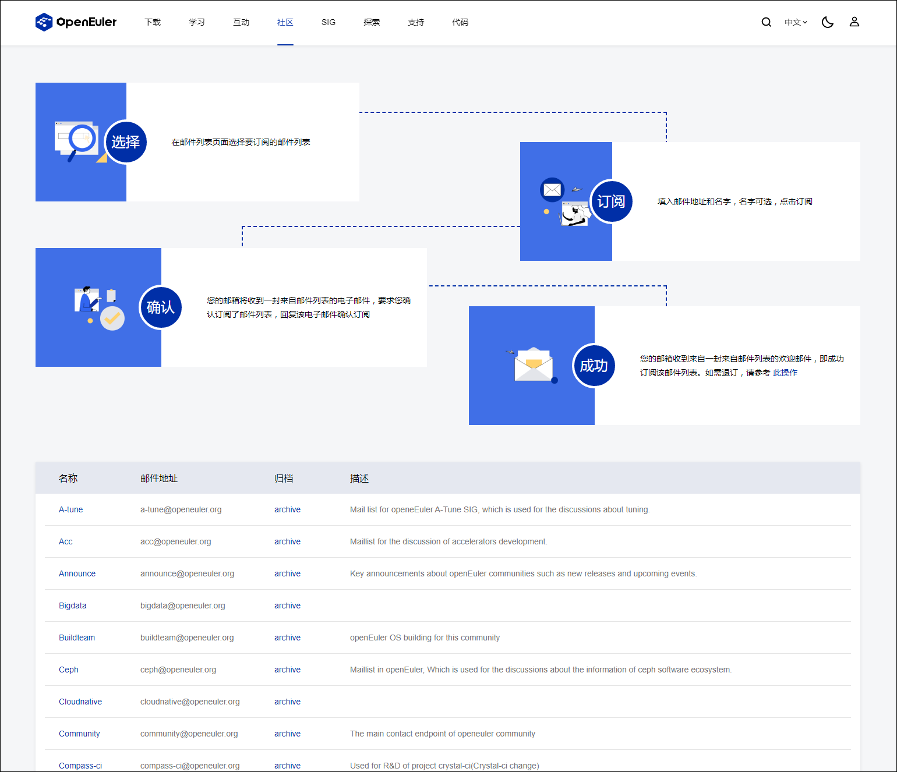
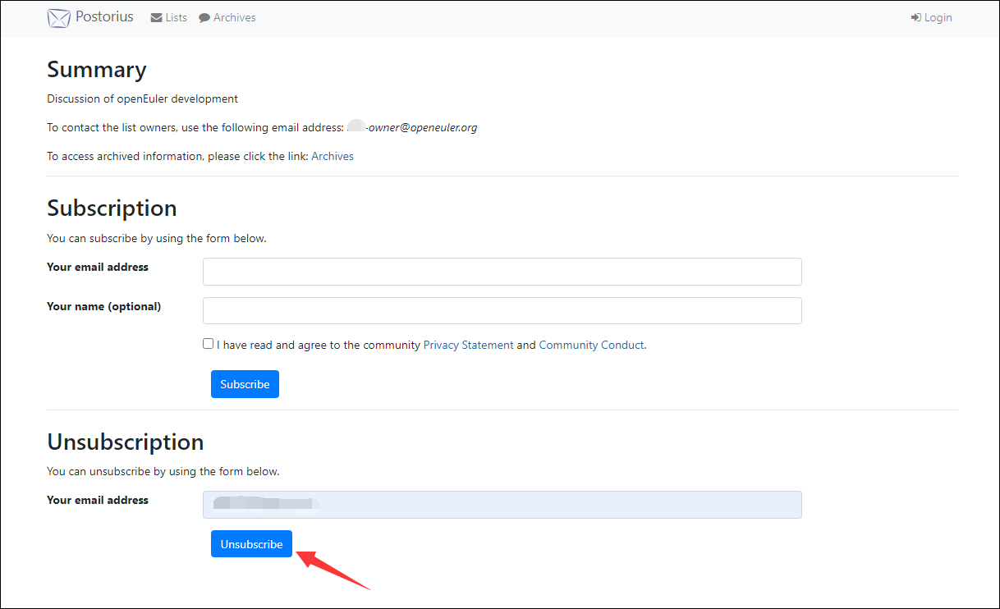
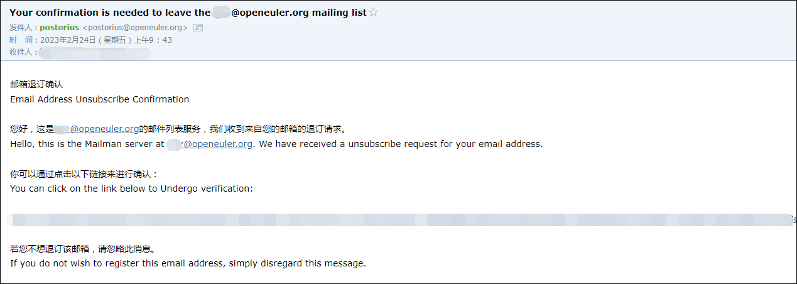
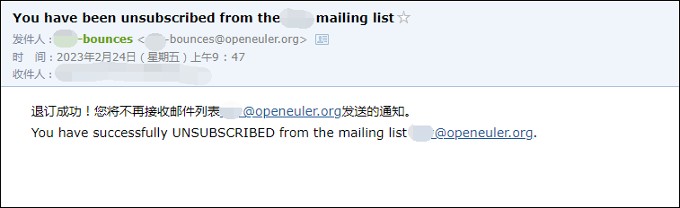
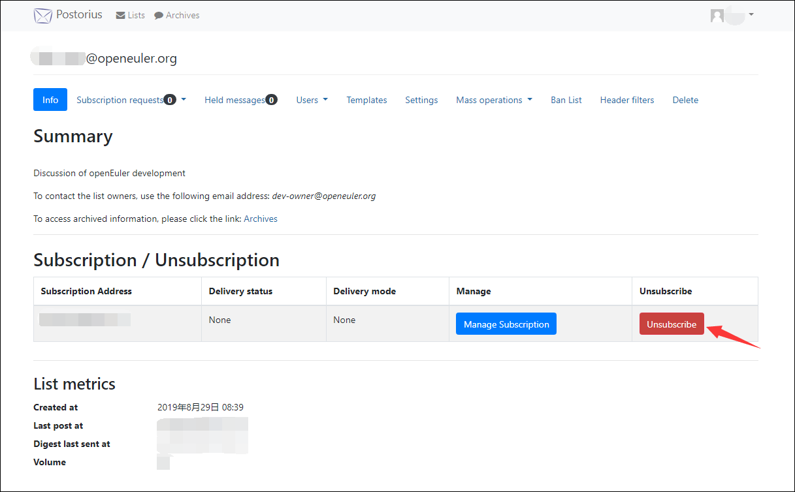
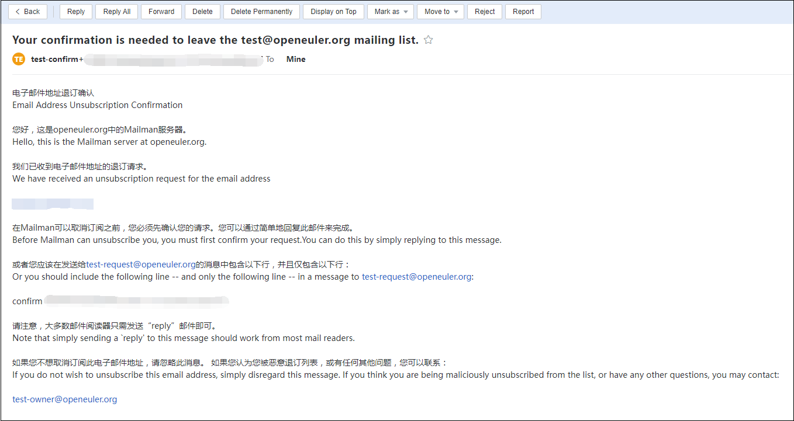
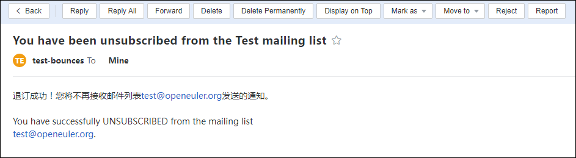

---  
title: 如何退订openEuler的邮件列表  
category: blog 
date: 2021-11-23
tags:   
    - openEuler  
    - 邮件列表  
    - 退订  
sig: sig-Gatekeeper  
archives: 2021-11  
author: liuqi<469227928@qq.com>
summary: 本博客介绍了两种退订openEuler邮件列表的方式 

---  
最近openEuler基础设施团队收到一些社区维护者与贡献者的反馈，不清楚如何退订openEuler的邮件列表。下面具体介绍两种退订方式，一种是用户界面退订，一种是发送邮件退订。
 
### 一、用户界面退订
用户界面退订分为非登录退订和登录退订两种场景。

- 
  如果你不是openEuler邮件列表的注册用户（此处的注册用户仅代表拥有openEuler邮件列表的postorius界面账号，当前注册通道未开放），可按如下流程操作：
  
  访问openEuler官网，在顶部菜单栏的**社区**中点击**邮件列表**
  
  

  选择需要退订的邮件列表，点击该行名称下对应的超链接进入需退订的邮件列表主页

  

  在 **Unsubscription** 栏目下输入需要退订的邮箱，点击 **Unsubscribe**

  

  随后，界面会弹出 **Please check your inbox for further instructions.** 的提醒，同时刚输入的邮箱会收到一封标题为 **Your confirmation is needed to leave the xxx@openeuler.org mailing list** 的确认退订邮件，点击邮件中的确认链接

  

  确认退订后，postorius界面会弹出 **Your email address has been unsubscribed from this list.** 的提醒，同时会收到一封标题为 **You have been unsubscribed from the xxx mailing list** 的成功退订通知邮件

  
-
  如果你是openEuler邮件列表的注册用户，可直接登录[**postorius**](https://mailweb.openeuler.org/postorius/lists/)，进入需要退订的邮件列表，点击 **Unsubscribe** 即可

  
 
### 二、发送邮件退订

发送邮件退订有两种场景。一种是在有退订指引页脚的邮件中，可直接点击邮件页脚的退订标识编辑发送邮件退订。另一种是直接编辑邮件发送给`**-leave@openeuler.org`退订。接下来以退订test@openeuler.org（已订阅）为例具体说明。

-
  部分邮件带有退订指引的页脚，点击页脚的`test-leave@openeuler.org`即可编辑发送退订邮件, 邮件的标题和内容不限

  

-
  也可以使用订阅邮箱给test-leave@openeuler.org发送一封邮件，标题和内容不限

  

  接下来是两种邮件退订方式的共同操作。

  在收到标题为 **Your confirmation is needed to leave the test@openeuler.org mailing list.**  的邮件后，直接回复该邮件，无需填写内容

  

  回复确认邮件后，会收到一封test-bounces发送的退订成功告知邮件

  

### 更多
更多社区邮件列表相关问题可参考[**Mailweb List FAQ**](https://osinfra.cn/faq/mailinglist.html)
