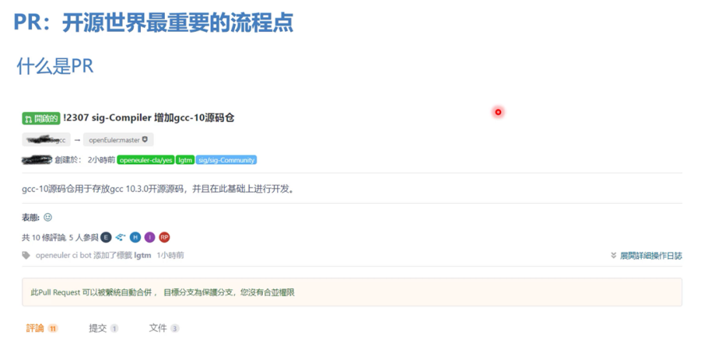
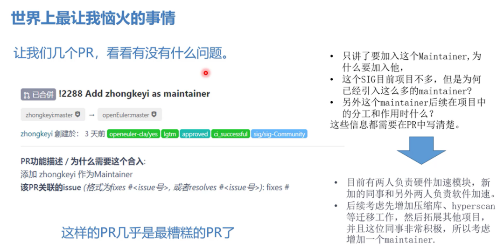
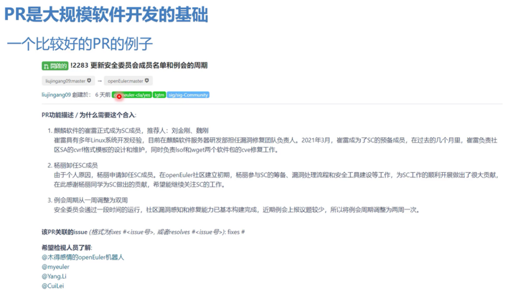

\---

title: 熊伟博士带你了解如何向 openEuler 社区提交一个好 PR

date: '2022-12-26'

category: blog

tags:

  \- openEuler

  \- PR

archives: '2022-12'

author:

  \- xiongwei

summary: 在开源的世界里，PR 是质量保证体系的基石，是大规模协作开发的基石，是社区历史的记录，因此一个好的PR是至关重要的。让我们跟随 openEuler 技术委员会委员熊伟博士，一起学习如何提交一个优秀的PR，开启成为一个成功码农的开源之旅吧。

\---

# 视频

如您喜欢观看视频，请直接浏览 [一个成功的码农从一个合格的PR开始](https://bbs.huaweicloud.com/live/kunpeng_live/202107221930.html) 。

# 文章

## 什么是PR?

什么是 PR？借用知乎上的一个回答：用类比的方法来解释一下 pull reqeust。想想我们中学考试，老师改卷的场景吧。你做的试卷就像仓库，你的试卷肯定会有很多错误，就相当于程序里的 bug。老师把你的试卷拿过来，相当于先 fork。在你的卷子上做一些修改批注，相当于 git commit。最后把改好的试卷给你，相当于发 pull request，你拿到试卷重新改正错误，相当于 merge。

pull request 简称为 PR，在不同的系统中 PR 有不同的名字，有些系统中使用 MR 即 merged request 来表示 PR。

以 Gitee 为例，一个 PR 由以下几部分：标题、内容以及其评论、提交的代码和文件组成。

## 为什么说 PR 很重要？

首先，PR 是质量保证体系的基石。因为 PR 是真正合入代码，合入更新的入口，直接影响到项目最终交付件的质量。

其次，PR 是大规模协作开发的基石。欧拉社区的协作是在一个互不相见的“虚拟世界”，PR 几乎是大家交流最重要的通道了。是一种“交流”的语言。

最后，由于社区不会删除任何的 PR，每一个 PR 都记录在历史中，是社区文化的传承载体之一。PR 的规范与否将会成为社区的一种社区文化，对社区的发展起着至关重要的作用。

## 糟糕的 PR 是什么样子?

既然 PR 如此重要，那么我们应该如何提交一个好的 PR 呢？在回答这个问题之前，先给大家看一下一个糟糕的 PR 是怎样的。

通过上面这个示例展示的是最糟糕的 PR 了，我们从 PR 标题可以看到，这是是一个要添加 zhongkeyi 作为一个 Maintainer 的 PR。PR 的内容几乎就是把标题复制了一遍，没有其他任何有效信息。

那么如何将这个非常糟糕的 PR，变成一个符合社区 PR 提交规范的 PR 呢？以下几个方面供参考：

1. 标题只讲了添加 zhongkeyi 这个 Maintainer，需要讲清楚为什么要添加这个 Maintainer。
2. 目前该 SIG 组的项目并不是很多，Maintainer 已经足够多了，为什么还要引入这个 Maintainer ？
3. 这个 Maintainer 在后续项目中的分工和工作是什么？

以上这些信息都需要在 PR 中讲清楚。我将这些信息反馈给提交的 PR 的开发者，得到了如下的回复：

1. 目前该 SIG 组有两个 Maintainer 负责硬件加速模块，新加入的 Maintainer 和 SIG 组的其他两个人负责软件加速。
2. 后续考虑增加压缩库、hyperscan 等迁移工作，然后拓展其他项目，并且这位 Maintainer 非常积极，所以申请将他增加为 Maintainer。

这是非常糟糕的一类 PR 了，开局一个标题，其他全靠猜。

接下来让我们看一下第二个例子。

上面这个 PR 的标题完整，PR 的内容也对要建仓的这个软件做了一些比较简短的描述，对于该软件的用途也做了简短的说明，看起来没有任何问题。

但是既然是要创建一个软件仓库，那么首先要回答的一个问题就是：**为什么要建立这个仓库？是对这个软件有重量级的开发需求？现在加入的是 GCC 10.3 ，那么以后的 GCC 11.3 的时候，是不是还是要建仓？是不是通过分支来进行版本控制更为稳妥，而不是一个版本建立一个仓库** 。

让我们看一下第三个例子。

这个 PR 看起来几乎是一个完美的 PR，标题描述清晰、内容描述详实，PR 关联的 issue 也都完整。

从 PR 情况来看，这个软件不错，但是需要回答另外一个问题：**为什么要引入这个软件，软件好显然不是一个理由，因为好软件成千上万，为什么我们要单单引入这个软件？**

从 PR 的提交者的回复来看，这个软件是来自于中国邮政的一个业务需求。需要欧拉操作系统合入并且做一些适配工作。把这段话加入到 PR 的开头，就是一个非常完美的 PR 了。

## 糟糕的 PR 带来的影响

一个糟糕的 PR 必然会：

1. 使工作效率降低，增加了无畏的资源消耗。
2. 延长审批的时间，增加 commiter 和 Maintainer 双向不满。
3. 会影响发行版的质量。
4. **极大增加了工程师白头、秃头和肥胖性工伤的几率**。

## 总结：如何写一个好的 PR？

总结一下，如果你想让自己提交的 PR 快速让 Maintainer 合入，以下几点你可以尝试一下：

1. 一个 PR 对应一件事儿，不要把不同的事情放在一个 PR 中，保持 PR 的总结。举个例子：你不能把增加 Maintainer 和增加软件仓这两件事儿放到一个 PR 中，这种 PR 的一定会被拒绝掉的。
2. PR 首先要说清楚“为什么”。为什么会提交这个 PR？这个 PR 解决了什么问题？
3. PR 中的描述要清晰明了，讲清楚 commit 中的要点。
4. 最好采用分行等形式将 PR 整理清楚，便于阅读。
5. 一般来说，一个 PR 必须要有一个 issue 对应。这样才能够形成需求和开发代码之间的对应关系。

下面让我们来看一个比较好的 PR 的例子。

从上面那个 PR 可以看到：

1. 标题很清晰：更新安全委员会成员名单和例会周期
2. 可读性很好：分了三段，每一部分做了什么都很清晰。
3. 需要谁来检视写得很清楚。

总的来说，一个 PR 写得好的码农未必能成长为一个伟大的码农，但是一个 PR 写不好的码农注定无法成为一个伟大的码农。

让我们从写好每一个 PR 开始。

## 参考

[GitHub 的 Pull Request 是指什么意思？](https://www.zhihu.com/question/21682976/answer/79489643)