## TL;DR
目前openEuler用户软件仓基于[copr](https://github.com/fedora-copr/copr)项目构建，如果您已经熟悉copr的使用，可以跳过本文直接开始使用[openEuler 用户软件仓](https://our.openeuler.openatom.cn/)


## 介绍
本文简单介绍openEuler用户软件仓的使用方法，更多的反馈渠道：
- 可以到gitee仓库 [提交issue](https://gitee.com/openeuler/infrastructure/issues/new?title=[About%20OUR]&issue%5Bissue_type_id%5D=382993)
- 可以到[论坛](https://forum.openeuler.org/)进行交流

## 基本概念

在使用用户软件仓前，有如下几个概念需要您了解：
1. 用户：用户是使用本系统的主体，也是所有操作的发起者
1. 项目：每个用户可以创建多个项目，项目用于组织一个或多个软件包，每个项目可以针对这组软件包生成针对各个openEuler版本的软件包仓库
1. 软件包：代表一个源码包
1. 构建：rpm包的一次构建的上下文，包括srpm包和其构建生成的一些rpm包
1. 仓库：针对特定openEuler版本构建的的软件包仓库
```
└── User
    ├── Project
    │   └── package 1
    │       ├── build 1
    │       │   └── log
    │       ├── build 2
    │       │   └── log
    │       ├── build 3
    │       │   └── log
    │       │   └── rpms
    │       │   └── src.rpm
    │   └── package 2
    │   └── repo for 22.03-x86_64
    │       ├── pkg1.noarch.rpm
    │       ├── pkg1-debuginfo.rpm
    │       ├── pkg2.x86_64.rpm
    │       ├── pkg2-debuginfo.rpm
    │   └── repo for 22.03-aarch64
```

## 如何使用
### 准备工作
只需一个openEuler账号，如果还没有账号，则可以先到[openEuler 账号中心](https://id.openeuler.org)进行注册

注册或登录您的openEuler账号
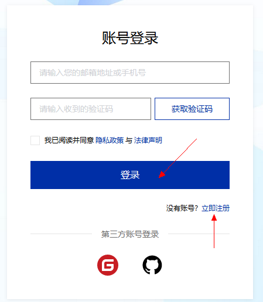

进入[用户软件仓（openEuler User Repository）](https://our.openeuler.openatom.cn/)首页
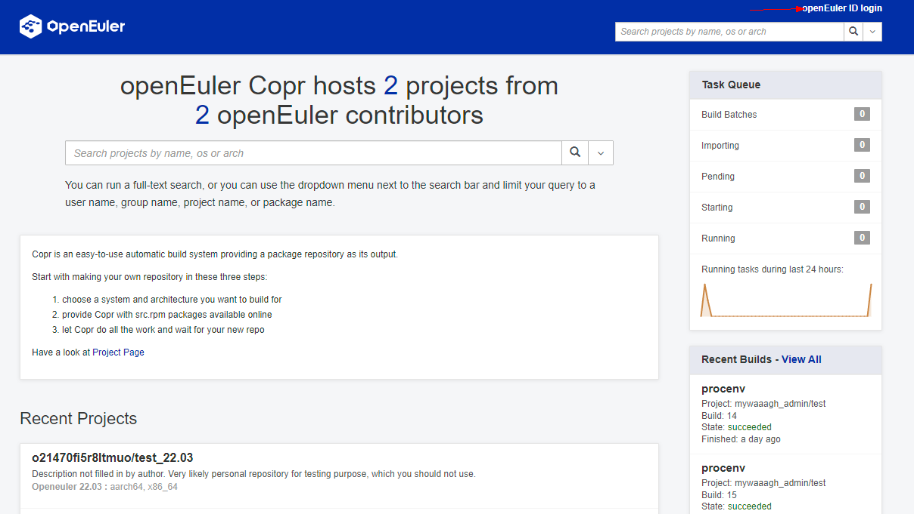

使用openEuler ID进行登录，登录成功后，可以看到一个简单的个人信息页面：
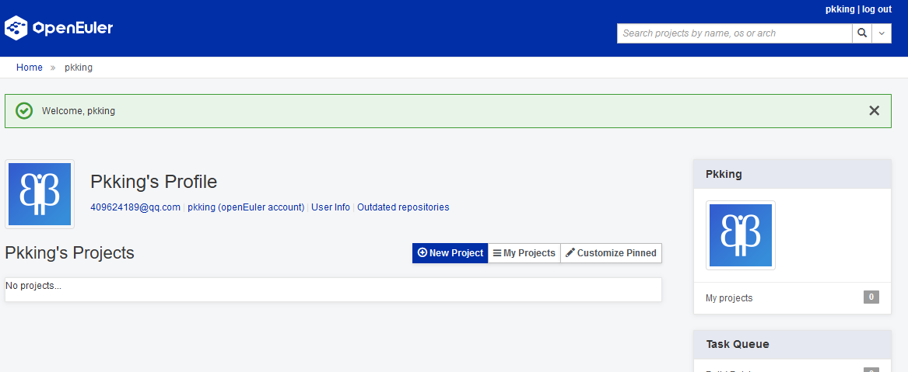

### 构建一个简单的包
点击`new project`按钮，创建一个新的项目：
- 项目名称（project name）：后续无法再修改
- 填写项目描述（description），指南（instruction），主页（homepage），联系人（contact）：可选配置，项目创建后支持修改
- Chroots：必须配置，选择需要的软件包构建环境，项目创建后支持修改
- External Repositories: 可选配置，如果构建过程中依赖其他的软件仓库，可以填写在这里，非必须
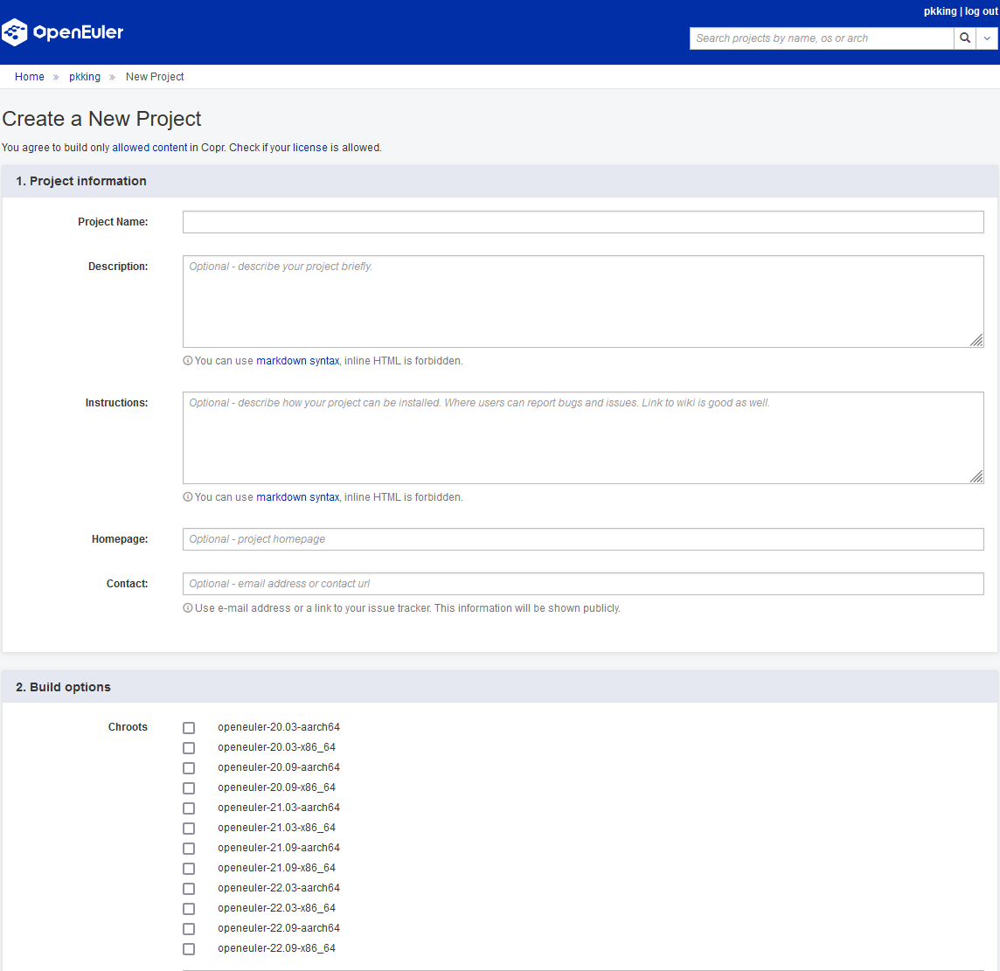
最后，点击`create`，即可创建项目
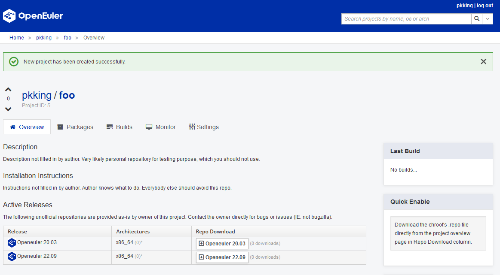
项目创建后，在`Repo Download`处，即可下载对应版本的仓库配置文件（当前仓库中还没有可用的软件包）

现在，我们来构建一个简单的软件包：）
点击`packages`标签页，创建一个新的软件包：
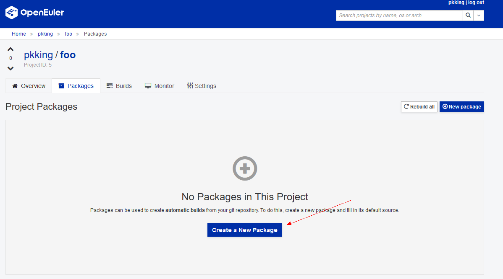
这里我们直接添加openEuler的isulad软件包，因为其已经包含构建所需要的spec和源码包
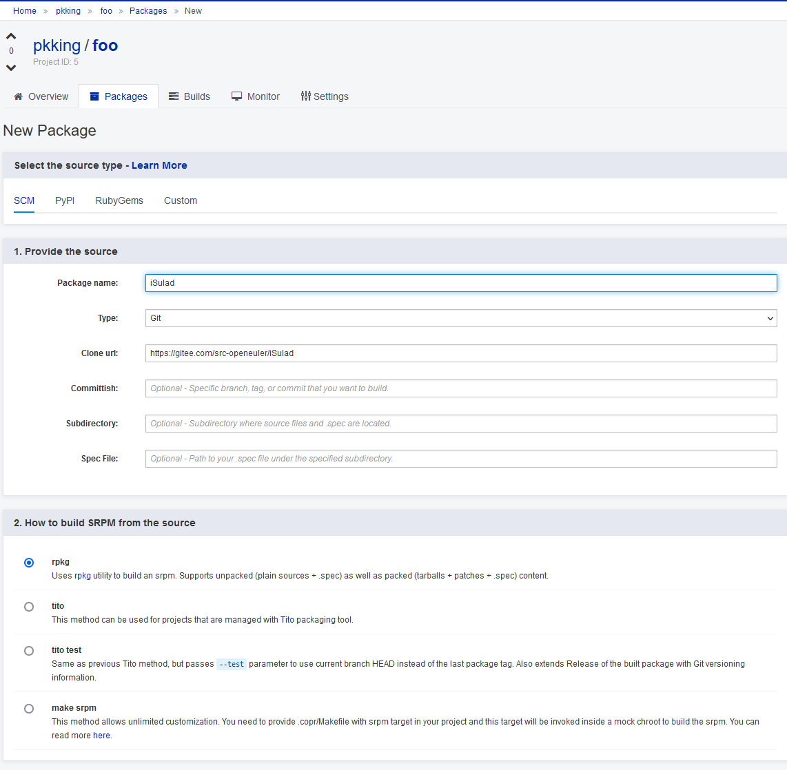
软件包创建完成后，点击`rebuild`即可触发一次构建
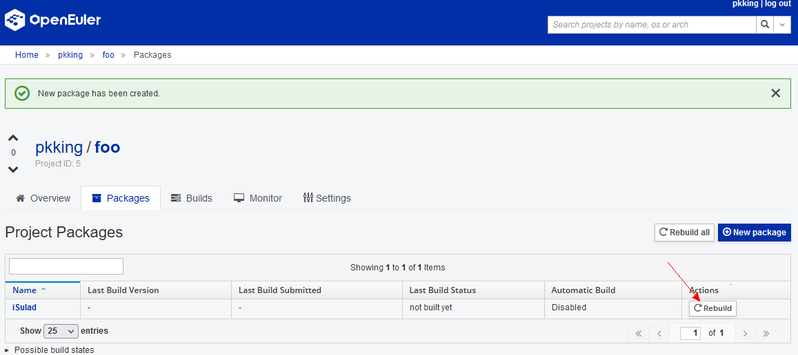
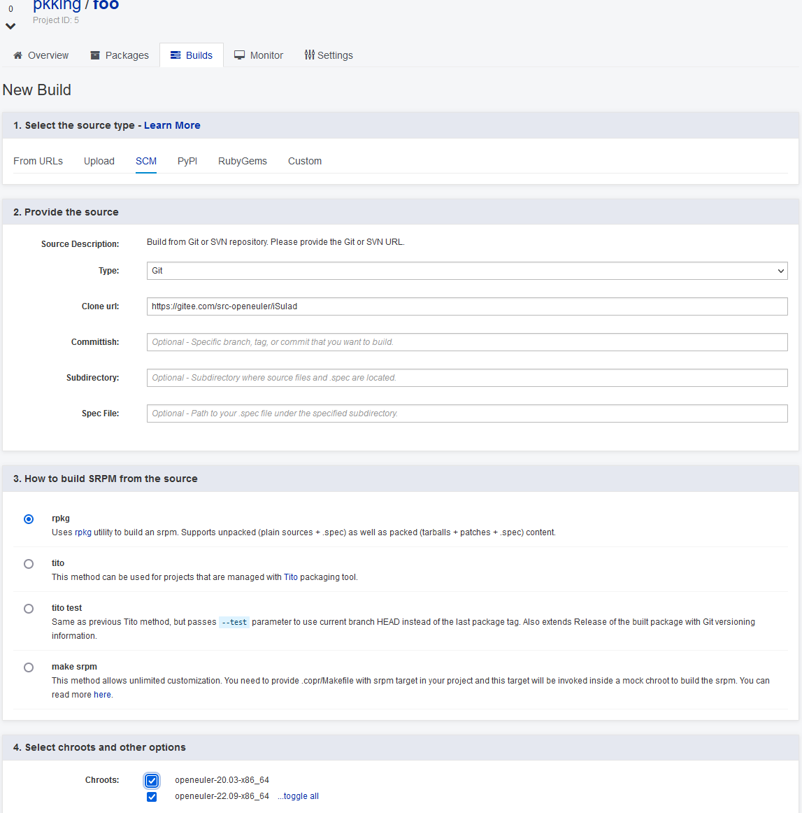
再次点击`Build`，后台构建系统就会开始构建你的软件包了
通过点击任务id，即可实时观看任务的日志
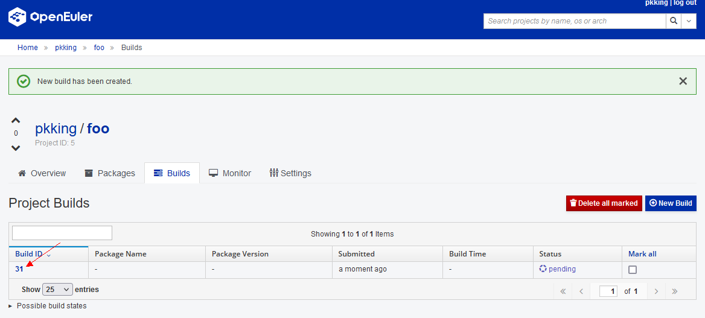
任务详情中，可以直接看到编译日志和构建出的rpm包
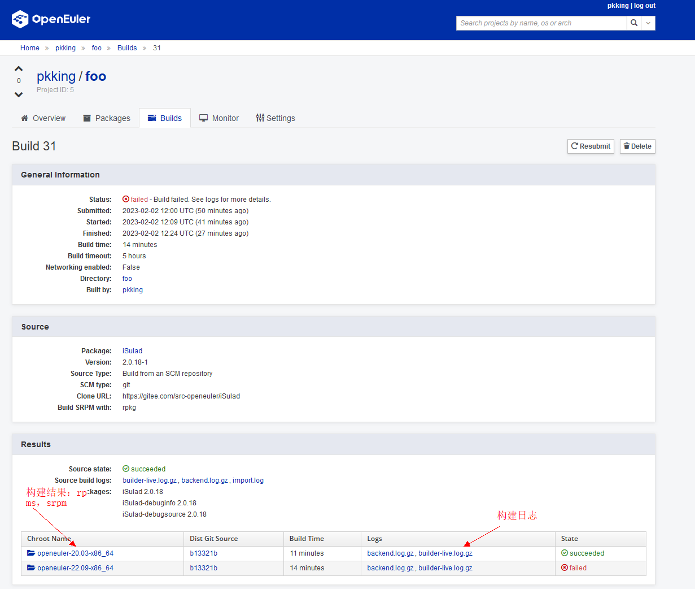
chroot中的内容


### 快速构建pypi上的软件包
个人软件仓提供了快速打包pypi上软件包的能力，在添加软件包时，可以直接根据pypi上的包名添加
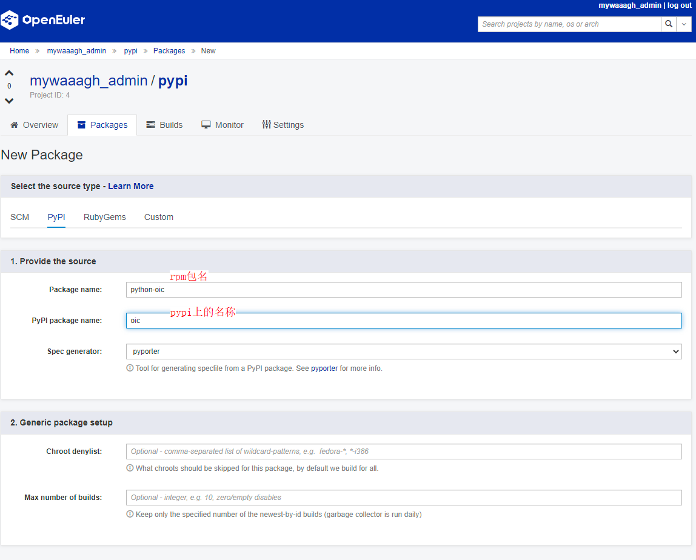
### 快速构建rubyGem上的软件包
rubygem上的软件包，可以通过`project->builds->new build`来进行构建


## 使用个人软件仓
首先到项目首页，获取对应版本的仓库配置文件
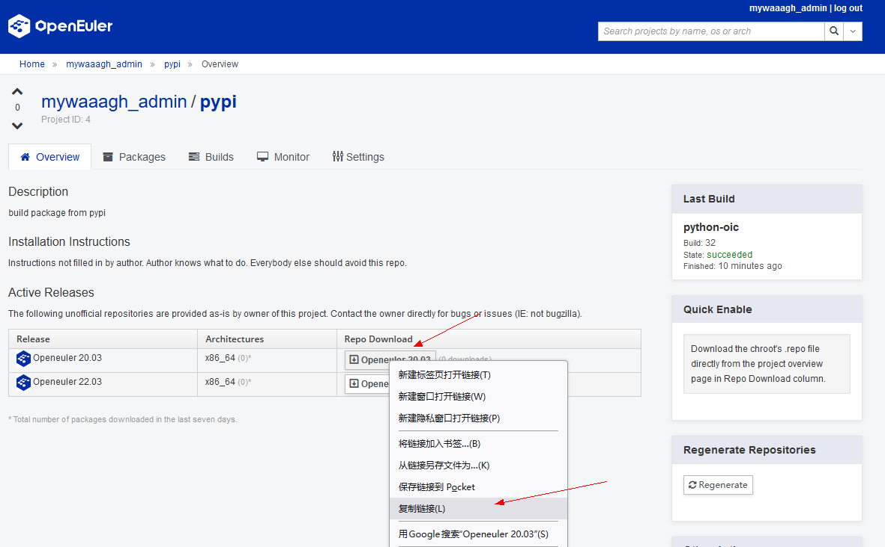
通过`cd /etc/yum.repos.d/ && curl -OL <your repo url>`直接下载对应的仓库配置
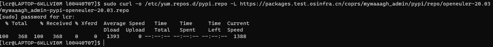
再使用`dnf in <package name>`即可安装对应仓库中的软件包了，每个project都有独立的gpg key对rpm包进行签名
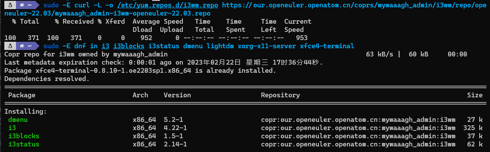

## 相关资源
1. 个人软件仓使用openEuler社区的[pyporter](https://gitee.com/openeuler/pyporter)自动打包[pypi](https://pypi.org)上的包，如果有任何问题，欢迎通过[quickissue](https://quickissue.openeuler.org/en/issues/)到`infra SIG`的`openeuler/infrastructure`反馈
1. 个人软件仓使用openEuler社区的[rubyporter](https://gitee.com/openeuler/rubyporter)自动打包[gem](https://rubygems.org/)上的包，如果有任何问题，欢迎通过[quickissue](https://quickissue.openeuler.org/en/issues/)到`infra SIG`的`openeuler/infrastructure`反馈