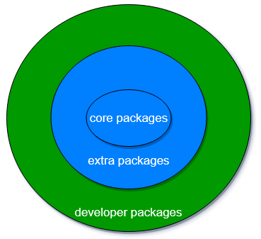

# 什么是 OUR
[OUR(openEuler User Repo)](https://our.openeuler.openatom.cn/)是openEuler社区针对开发者推出的个人软件包托管平台，目的在于为开发者提供一个易用的软件包分发平台

# 为什么我们需要 OUR

在操作系统的世界，软件包是一等公民，而围绕软件包的管理，一定程度上决定了操作系统用户和开发者的使用体验，试想：
- 开发者尚在开发中的软件，期望尽早的与openEuler社区持续的集成并发布给自己的用户进行测试
- 在引入新包时，发现其多个依赖的软件包在社区也不存在，极大增加开发者的工作量
- 用户期望在openEuler 20.03上使用/集成某个软件包的nightly或unstable版本

针对上面的场景，在当前openEuler社区的基础设施中，还没有太好的开箱即用的方案

仔细分析上面的场景，我们发现社区存在着如何平衡软件包丰富和软件包质量的问题，在和社区TC委员讨论后，我们形成了下述的软件包分层的思路：

- core packages: openEuler社区的开发者，sig组维护着的一组核心软件包
- extra packages：类似EPOL或oepkgs等尚不满足社区质量要求，但仍然处于可用阶段的软件包
- developer packages（OUR）：完全有开发者个人维护并保证质量的软件仓库，不需要遵循openEuler社区软件包的大部分约束和质量要求

# 我们需要一个什么样的 OUR
基于上述的软件包分层模型，不难看出，对于developer packages，社区需要一个 **简单轻量的对开发者友好的软件包构建分发平台**
- 对开发者和上游生态友好
- 具备为openEuler版本构建软件包的能力
- 支持用户独立发布软件包
- 和社区版本相对独立

按照以上描述，我们发现OUR 和 [copr](https://github.com/fedora-copr/copr)的功能十分类似，在和copr的开发团队进行沟通后，发现copr社区的十分open且目标和我们较为一致，因此我们打算使用copr构建我们第一版的OUR系统

# OUR与openEuler社区其他构建系统
既然OUR中也包含了一个轻量级的构建系统，有同学可能想问，它和社区其他已有的构建系统是什么样的关系

这里我们做了一个简单的功能对比：
| 特性 | OUR | oepkg | EulerMaker |
| -- | -- | -- | -- |
| 支持自动从PyPi打包 | ✅ | ❌ | ❌|
| 支持自动从RubyGem打包 | ✅ | ❌ | ❌ |
| 支持个人仓库 | ✅ | ✅ | ✅ |
| 支持公共仓库 | ❌ | ✅ | ✅ |
| 源码托管| 自行托管| [src-oepkg组织](https://gitee.com/src-oepkgs)+自行托管 | [src-openeuler组织](https://gitee.com/src-openeuler)+自行托管 |
| 支持全场景构建 | ❌ | ❌ | ✅ |
| 支持镜像构建 | ❌ | ✅ | ✅ |

如果说从功能上，这些系统还有一些重叠，那么从服务的定位上，差异则更加明显：
- EulerMaker：它是社区官方的构建系统，目标是支持全场景，多架构的软件包构建，侧重点是支撑复杂场景中的软件包构建
- oepkg：作为openEuler官方仓库的补充，其目标是尽可能大量的将现有的软件包移植到openEuler生态中
- OUR：更像是开发者的试验田，我们更专注于为开发者提供便利，OUR支持自动从pypi，rubygem（未来可以扩展更多的方式）打包软件包，支持通过webhook自动触发持续构建

# 谁适合使用OUR
如果您：
1. 想快速从pypi/rubygem上打包软件包
1. 想为已发布的openEuler版本添加最新的软件包或变体版本（例如最近在OUR上提供的[i3wm for openEuler 仓库](https://our.openeuler.openatom.cn/coprs/mywaaagh_admin/i3wm/)
1. 想为还在开发中的软件提供持续与openEuler集成的仓库

建议您使用[OUR](https://our.openeuler.openatom.cn/)，实现快速构建独立的软件包仓库，分发您的软件包
