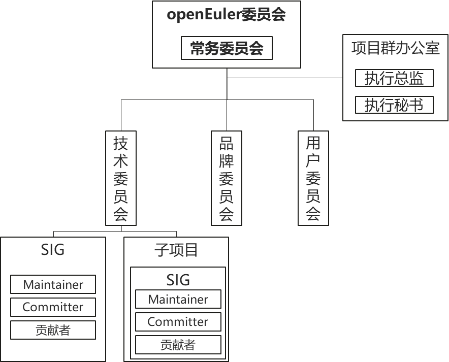

# openEuler项目群开源治理制度

## 第一章　总则

### 第一条 项目群名称

openEuler 项目群系由开放原子开源基金会（以下简称“基金会”）孵化及运营的开源项目群。

openEuler 项目群，全称为 OpenAtom openEuler 项目群，又称为 openEuler 开源社区，是一个面向数字基础设施操作系统的开源社区，简称 openEuler 或者 openEuler 社区，以下称“本项目群”。

### 第二条 项目群愿景和使命

愿景：为世界提供数字基础设施的开源操作系统。

使命：为世界提供开源软件。为开源软件提供指导、虚拟协作空间、创新平台和服务，在社区开发、管理和孵化开源软件，并且与其他许多开源社区合作。

### 第三条 项目群治理原则

本项目群以本项目群治理组织领导下的项目自治为原则，在遵守基金会章程、[《开放原子开源基金会开源项目暂行管理制度》](https://www.openatom.org/informationinfo)及基金会知识产权政策等相关制度规范的前提下进行开放治理和运营。

### 第四条 业务范围

1、探索和构建操作系统产业软件开源生态，促进面向数字基础设施的基础软件产业发展；

2、促进本项目群范围内的开源软件推广、使用、宣传、培训等；

3、提升本项目群的技术易用性和可靠性；

4、募集资金、专项资助；

5、开展开源软件生态建设、宣传推广、学术交流、教育培训等相关活动；

6、开展与其他开源项目、社区、基金会的合作；

7、开源社区 IT 基础设施开发和运维；

8、其他经基金会授权的业务范围。

### 第五条 社区行为准则

1、为建设开放友好的社区环境，本项目群贡献者和维护者承诺：不论年龄、体型、身体健全与否、民族、经验水平、受教育程度、社会地位、国籍、相貌、种族等，本项目群和社区的参与者皆免于任何骚扰。

2、有助于创造积极社区环境的行为包括但不限于：

- (1)措辞友好且包容；
- (2)尊重不同的观点和经验；
- (3)耐心接受有益批评；
- (4)关注对社区最有利的事情；
- (5)与社区其他成员友善相处。

3、本项目群和社区的参与者不应采取的行为包括但不限于：

- (1)发布与色情、暴力等有关的言论或图像；
- (2)捣乱/煽动/造谣行为、侮辱/贬损的评论、人身及政治攻击；
- (3)公开或私下骚扰本项目群和社区的其他参与者；
- (4)未经明确授权发布他人的个人信息等资料，如住址、电子邮箱等；
- (5)其他有理由认定为违反社区行为准则的不当行为。

4、社区项目维护者(Maintainer)有权利和义务诠释何谓“不当行为”，并妥善公正地纠正已发生的不当行为。社区项目维护者有权利和义务删除、编辑、拒绝违背本行为准则的评论（comments）、提交（commits）、代码、wiki 编辑、问题（issues）等任何贡献；社区项目维护者可暂时或永久地封禁任何其认为有威胁、冒犯、有害社区秩序的不当行为参与者。

5、本行为准则适用于本社区。当有人代表本社区时，本准则亦适用于此人所处的公共平台。

6、代表本社区的情形包括但不限于：使用本社区的官方电子邮件、通过本社区官方媒体账号发布消息、作为本社区指定代表参与在线或线下活动等。

7、代表本社区的行为准则可由项目群办公室进一步定义及解释，并报本项目群 openEuler 委员会审批发布。

## 第二章　项目群成员

### 第六条 项目群成员的构成

1、项目群共建方：经 openEuler 委员会认可，与基金会签署《openEuler项目群开源治理协议》的参与本项目和社区的贡献方、开放治理的自然人或法人。

2、捐赠人：从事或支持开源事业的自然人和法人，且需与基金会签署本治理制度规定的相关协议并根据相关协议享有相应权利并履行相应义务。openEuler 委员会可参照资金捐赠数目及其他重要指标确定不同捐赠人的权利和义务。

3、学术机构和非营利组织。

4、其他组织和个人：注册 openEuler 社区并使用社区资源，参与本项目贡献和社区建设但尚未成为项目共建方的广大自然人或法人。

### 第七条 项目群捐赠人的条件

本项目群捐赠人分为战略捐赠人、白金捐赠人、黄金捐赠人、白银捐赠人、青铜捐赠人。战略捐赠人最多 1 个，白金捐赠人最多 3 个，黄金捐赠人最多 20 个，白银捐赠人和青铜捐赠人额度不限。

1、战略捐赠人：与基金会签署 openEuler 项目群专项资金捐赠协议，承诺向基金会定向捐赠 500 万人民币/年用于 openEuler 项目群，并连续捐赠 2 年及以上；本项目群捐赠人换届时原战略捐赠人优选选择继续做战略捐赠人；

2、白金捐赠人：与基金会签署 openEuler 项目群专项资金捐赠协议，承诺向基金会定向捐赠 200 万人民币/年用于 openEuler 项目群，并连续捐赠 2 年及以上；本项目群捐赠人换届时原白金捐赠人优选选择继续做白金捐赠人；

3、黄金捐赠人：与基金会签署 openEuler 项目群专项资金捐赠协议，承诺向基金会定向捐赠 100 万人民币/年用于 openEuler 项目群，并连续捐赠 2 年及以上；本项目群捐赠人换届时原黄金捐赠人优选选择继续做黄金捐赠人；

4、白银捐赠人：与基金会签署 openEuler 项目群专项资金捐赠协议，承诺向基金会定向捐赠 10 万人民币/年用于 openEuler 项目群，并连续捐赠 2 年及以上；

5、青铜捐赠人：与基金会签署 openEuler 项目群专项资金捐赠协议，承诺向基金会定向捐赠 2 万人民币/年用于 openEuler 项目群。

本项目群上述捐赠人依据本治理制度及 openEuler 项目群专项资金捐赠协议仅在本项目群中享有项目群捐赠人的相应权益，但并不享有基金会章程规定的捐赠人权益，除非其根据基金会章程完成相应捐赠。

### 第八条 项目群捐赠人的权益

#### 1、战略捐赠人权益：

- (1)有权委派一名 openEuler 委员会委员，该委员同时是 openEuler 委员会常务委员会委员，可竞选 openEuler 委员会主席；
- (2)有权提名 openEuler 委员会执行总监；
- (3)有权提名一名技术委员会委员；
- (4)有权提名一名品牌委员会委员；
- (5)有权提名一名用户委员会委员；
- (6)有对 openEuler 项目群相关工作行使批评建议和监督的权利；
- (7)有权参与 openEuler 项目群组织的其他会议和活动；
- (8)有权获得 openEuler 项目群刊物和技术资料；
- (9)有权在 openEuler 项目群官网进行品牌展示。

#### 2、白金捐赠人权益：

- (1)有权委派一名 openEuler 委员会委员，该委员同时是 openEuler 委员会常务委员会委员，可竞选 openEuler 委员会主席；
- (2)有权提名一名技术委员会委员；
- (3)有权提名一名品牌委员会委员；
- (4)有权提名一名用户委员会委员；
- (5)有对 openEuler 项目群相关工作行使批评建议和监督的权利；
- (6)有权参与 openEuler 项目群组织的其他会议和活动；
- (7)有权获得 openEuler 项目群刊物和技术资料；
- (8)有权在 openEuler 项目群官网进行品牌展示。

#### 3、黄金捐赠人权益：

- (1)有权委派一名 openEuler 委员会委员；
- (2)有权提名一名品牌委员会委员；
- (3)有权提名一名用户委员会委员；
- (4)有对 openEuler 项目群相关工作行使批评建议和监督的权利；
- (5)有权参与 openEuler 项目群组织的其他会议和活动；
- (6)有权获得 openEuler 项目群刊物和技术资料；
- (7)有权在 openEuler 项目群官网进行品牌展示。

#### 4、白银捐赠人权益：

- (1)有权提名一名用户委员会委员；
- (2)有对 openEuler 项目群相关工作行使批评建议和监督的权利；
- (3)有权参与 openEuler 项目群组织的其他会议和活动；
- (4)有权获得 openEuler 项目群刊物和技术资料；
- (5)有权在 openEuler 项目群官网进行品牌展示。

#### 5、青铜捐赠人权益：

- (1)有对 openEuler 项目群相关工作行使批评建议和监督的权利；
- (2)有权参与 openEuler 项目群组织的其他会议和活动；
- (3)有权获得 openEuler 项目群刊物和技术资料；
- (4)有权在 openEuler 项目群官网进行品牌展示。

## 第三章　项目群治理架构

### 第九条 治理架构概况

本项目群治理组织中，openEuler 项目群工作委员会（简称 openEuler 委员会）为本项目群的最高决策机构，负责本项目群的重大决策。

openEuler 委员会设 openEuler 委员会主席一名，openEuler 委员会主席系 openEuler 委员会委员之一，负责指导 openEuler 委员会决策的执行，openEuler 委员会主席为本项目群的主要负责人；openEuler 委员会设常务委员会，代表 openEuler 委员会在 openEuler 委员会职责范围内行使 openEuler 委员会的职责，并定期向 openEuler 委员会汇报决策项。

openEuler 委员会设 openEuler 项目群办公室，负责执行 openEuler 委员会的各项决议，并负责本项目群例行运作和管理；在项目群办公室内，设 openEuler 委员会执行总监、openEuler 委员会执行秘书各一名，负责本项目群日常工作的执行；若本项目群未设立 openEuler 委员会执行总监，则由 openEuler 委员会主席履行执行总监的权责。

openEuler 委员会设项目群技术委员会，负责本项目群技术决策；设项目群品牌委员会，负责“openEuler”相关品牌工作和营销工作；设项目群用户委员会，负责本项目群的用户工作。openEuler 委员会、技术委员会、品牌委员会、用户委员会可以根据工作需要，任命若干名专家作为本委员会顾问，顾问可以列席该委员会会议并发表意见，但没有投票权。

本项目群组织架构如下图：

### 第十条 openEuler 委员会

#### 1、openEuler 委员会委员组成

openEuler 委员会是本项目群所有业务决策的最高决策机构，对包括但不限于制定及修改本项目群开源治理制度、决定重大业务活动计划、制定及调整项目群的重大方向、项目群的中止或终止、审定年度收支预算及决算及年度财务审计报告负全责。openEuler 委员会由成员单位委派的代表及作为委员会委员的自然人共同组成，负责处理 openEuler 委员会日常事务并对本项目群进行开放治理。openEuler 委员会的成员个人及其委派单位对 openEuler 委员会做出的业务决策承担责任。openEuler 委员会委员应具备以下条件：

- (1)具有完全民事行为能力；
- (2)遵守法律法规及基金会相关制度；
- (3)热心公益事业，自愿为本项目服务；
- (4)具有较强的公益责任意识，能够遵循公平、公正、公开的原则，独立、客观、谨慎地参与议事决策；
- (5)能够为本项目群筹划、捐款、管理做出贡献；
- (6)相关法律法规或基金会相关制度要求需满足的其他条件。

#### 2、openEuler 委员会委员任职规则

- (1)openEuler 委员会委员每届任期为两年。
- (2)openEuler 委员会委员（含 openEuler 委员会主席）所在成员单位应向基金会秘书处提交代表授权书，前述代表应向基金会提交书面任职承诺书和信息备案表，履行应尽工作职责。

#### 3、openEuler 委员会委员的管理

- **(1)openEuler 委员会委员加入：** 项目群战略、白金和黄金捐赠人各委派一名代表参加 openEuler 委员会，其委派的代表必须是该捐赠人或其关联公司雇员。如前述捐赠人存在一个或多个关联公司的，该捐赠人及其关联公司里只能有一个公司能申请成为前述三类捐赠人之一而享有 openEuler 委员会委员资格。

  本治理制度所称关联公司是指：对于本治理制度中所涉任一法律实体，直接或通过一家或多家中间机构间接控制该实体、受控于该实体、或与该实体共同被他人控制的任何公司、合伙制企业、有限责任公司、合营公司或其他法律实体。本款下的“控制”是指直接或间接拥有被控制实体百分之五十及以上的股份、股权或表决权，或足以直接或间接对股东会、股东大会的决议产生重大影响。

  学术机构和非营利组织最多一名代表代表加入 openEuler 委员会，该代表由现任 openEuler 委员会常务委员会（无 openEuler 委员会常务委员会时，由 openEuler 委员会主席和副主席代为执行）推荐，经 openEuler 委员会全体委员三分之二以上（含）表决通过后加入。

- **(2)openEuler 委员会委员退出：** 项目群捐赠人关系终止的，该捐赠人的 openEuler 委员会委员资格取消。项目群捐赠人委派的代表离职或因其他原因需更换的，由该捐赠人撤销原代表委派并重新委派代表。openEuler 委员会委员向本 openEuler 委员会全体成员提交书面通知，可以退出 openEuler 委员会，由其所在项目群捐赠人单位重新委派代表；openEuler 委员会委员连续两次无故不出席 openEuler 委员会会议的，视为自动退出 openEuler 委员会，由其所在项目群捐赠人单位重新委派代表；openEuler 委员会接受委员缺位。
- **(3)openEuler 委员会委员的罢免：** 由 openEuler 委员会委员三分之一以上（含）发起，openEuler 委员会全体委员三分之二以上（含）通过后罢免。

#### 4、openEuler 委员会职责和权利包括但不限于：

- (1)制定、修改本项目群开源治理制度，由 openEuler 委员会制定、经基金会审定的项目群管理制度是本项目群开放治理基本纲领；
- (2)决定重大业务活动计划，包括项目群资金筹集、财产管理和使用计划、项目群年度活动计划等；
- (3)制定及调整项目群的重大方向，项目群的中止或终止；
- (4)审定项目群年度收支预算及决算、年度财务审计报告；
- (5)决定项目群的知识产权授权管理，包括项目/子项目名称及品牌等；
- (6)决定聘选和任免 openEuler 委员会委员；
- (7)选举 openEuler 委员会主席；
- (8)选举 openEuler 委员会执行总监，在秘书处报备；按需聘用全职工作人员；
- (9)听取、审议 openEuler 委员会执行总监的工作报告，检查执行总监的工作；
- (10)审议项目群各下设组织的主席的选举和罢免；
- (11)审议各下设组织的工作报告和问题；
- (12)openEuler 委员会可进一步根据工作需要，经合法流程授权相关委员会、工作组和/或具体人员承担相应业务职责;
- (13)成立专家顾问委员会，任免专家顾问委员会委员。

#### 5、openEuler 委员会会议发起及召集方式

openEuler 委员会会议每年举行两次例行会议，或者依据项目群情况召开临时会议。

- (1)发起机制：openEuler 委员会例会由 openEuler 委员会执行总监发起并主持。openEuler 委员会临时会议由 openEuler 委员会主席依据项目群情况发起，或现有 openEuler 委员会委员三分之一以上（含）提议发起。
- (2)召集方式：openEuler 委员会会议由 openEuler 委员会执行总监或召集人在会议召开前 5 个工作日通过邮件通知全体委员；
- (3)openEuler 委员会会议须有现有 openEuler 委员会委员（含委托）三分之二以上（含）出席为有效会议；
- (4)不出席会议也没有委托他人代理参会的 openEuler 委员会委员视为缺席，不计入本次会议投票；
- (5)与会形式包括现场与会、线上接入等可以核实身份的多种形式。

#### 6、表决和投票

- (1)openEuler 委员会每个委员享有一票投票权。openEuler 委员会召开会议决策事项至少需由 openEuler 委员会到会委员半数以上（含）投票通过。为免疑义，若 openEuler 委员会委员同时担任 openEuler 委员会主席或副主席的，则该委员共计享有一票投票权。
- (2)投票分为赞同、反对和弃权，投票模式为公开记名投票。
- (3)openEuler 委员会委员委托他人代理参会的，该被委托人不得参与本次会议投票表决。
- (4)如果需要，openEuler 委员会会议决策也可以采用在线投票的方式进行，在投票启动后 5 个工作日内为投票时间，超过投票时间没有投票的记为弃权，投赞成票的委员需要超过 openEuler 委员会委员数量的半数方为投票通过；如果在投票启动后 5 个工作日内参与投票的委员没有超过半数的，则需要重新发起投票。
- (5)以下事项需 openEuler 委员会全体委员三分之二（含）以上投票通过方为有效：
  - a.制定、修改本项目群治理制度；
  - b.项目群中止、项目群重大方向的制定与调整及项目群终止；
  - c.openEuler 委员会执行总监的选举；
  - d.审批各下设机构成员的任命和罢免；
  - e.决定重大业务活动计划，包括项目群资金筹集、管理和使用计划、品牌授权管理制度、项目群年度活动计划。

### 第十一条 openEuler 委员会主席

1、openEuler 委员会设主席一名，副主席若干名。openEuler 委员会主席和副主席作为 openEuler 委员会委员，在 openEuler 委员会各享有投票权。

**2、openEuler 委员会主席和副主席必须符合以下条件：**

- (1)具有完全民事行为能力；
- (2)在项目群业务领域内有较大影响力；
- (3)应当遵守法律法规、基金会相关制度和本项目群治理相关规定；
- (4)openEuler 委员会主席每届任期 2 年，最多可连任两届。openEuler 委员会副主席每届任期 2 年，可连选连任。

**3、openEuler 委员会主席行使下列职权：**

- (1)在 openEuler 委员会会议上检查 openEuler 委员会决议的落实情况；
- (2)提议聘任或解聘项目群办公室下法务、财务等相关专门人员或相关负责人；
- (3)技术委员会主席、品牌委员会主席、用户委员会主席、提名委员会委员在选举过程中出现因为票数相同无法确定人选的情况，由上一届 openEuler 委员会主席裁决选举结果；
- (4)经基金会和 openEuler 委员会授权，在被授权范围内代表项目群签署文件。openEuler 委员会主席有权在被授权范围内自主决定授权方式和范围。

**4、openEuler 委员会主席的产生：** 由 openEuler 委员会从 openEuler 委员会常务委员会委员中选举产生。

**5、openEuler 委员会主席的退出：** openEuler 委员会主席如果需要在任期届满前卸任，需提前 30 个工作日通过邮件等书面方式通知基金会秘书处。新任 openEuler 委员会主席根据本条第 4 款重新选举产生。

**6、openEuler 委员会主席的罢免**（出现以下任意一种情况即可）：

- (1)openEuler 委员会提出对 openEuler 委员会主席的罢免并通过 openEuler 委员会的罢免决议；
- (2)基金会秘书处提出对 openEuler 委员会主席的罢免并通过 openEuler 委员会的罢免决议。

### 第十二条 openEuler 委员会常务委员会

**1、openEuler 委员会设常务委员会**，openEuler 委员会常务委员会由项目群战略和白金捐赠人代表，以及一名学术机构和非营利组织代表的 openEuler 委员会委员组成。openEuler 委员会常务委员会代表 openEuler 委员会行使 openEuler 委员会的职责，并定期向 openEuler 委员会汇报决策项。

**2、openEuler 委员会常务委员会委员每届任期为两年**。

**3、openEuler 委员会常务委员会委员的管理**

openEuler 委员会常务委员会委员首先必须是 openEuler 委员会委员，当其 openEuler 委员会委员资格丧失时，openEuler 委员会常务委员会委员资格也自动丧失。

openEuler 委员会常务委员会委员的退出：适用 openEuler 委员会委员的退出机制。

openEuler 委员会常务委员会委员的罢免：由 openEuler 委员会常务委员会委员三分之一以上（含）发起并报 openEuler 委员会，经 openEuler 委员会全体委员三分之二以上（含）通过后罢免。

**4、**openEuler**委员会常务委员会议发起及召集方式**

openEuler 委员会常务委员会定期召开例会，或者依据项目群情况召开临时会议。

- (1)发起机制：openEuler 委员会常务委员会例会由 openEuler 委员会执行总监发起并主持。临时会议由 openEuler 委员会主席依据项目情况发起，或现有 openEuler 委员会常务委员会委员三分之一以上（含）提议，发起并召开临时会议。
- (2)召集方式：openEuler 委员会常务委员会会议由 openEuler 委员会执行总监或召集人在会议召开前 3 个工作日通过邮件通知全体委员；
- (3)openEuler 委员会常务委员会会议须有现有 openEuler 委员会委员（含委托）三分之二以上（含）出席为有效会议；
- (4)不出席会议也没有委托他人代理参会的 openEuler 委员会常务委员会委员视为缺席，不计入本次会议投票；
- (5)与会形式包括现场与会、线上接入等可以核实身份的多种形式。

**5、表决和投票**

- (1)openEuler 委员会常务委员会每个委员享有一票投票权。openEuler 委员会常务委员会召开会议决策事项至少需由 openEuler 委员会常务委员会参会委员半数以上（含）投票通过。
- (2)投票分为赞同、反对和弃权，投票模式为公开记名投票。
- (3)openEuler 委员会常务委员会委员委托他人代理参会的，该被委托人不得参与本次会议投票表决。
- (4)如果需要，openEuler 委员会常务委员会会议决策也可以采用在线投票的方式进行，在投票启动后 5 个工作日内为投票时间，超过投票时间没有投票的记为弃权，投赞成票的委员需要超过委员会委员数量的半数方为投票通过；如果在投票启动后 5 个工作日内参与投票的委员没有超过半数的，则需要重新发起投票。

### 第十三条 openEuler 委员会执行总监

1、openEuler 委员会在其下设的项目群办公室中设执行总监一名，执行总监不属于 openEuler 委员会委员，在 openEuler 委员会不享有投票权。

**2、openEuler 委员会执行总监必须符合以下条件：**

- (1)具有完全民事行为能力；
- (2)openEuler 委员会执行总监为专职，熟悉本项目群业务领域；
- (3)openEuler 委员会执行总监每半年向 openEuler 委员会进行述职，并接受 openEuler 委员会考核。

**3、openEuler 委员会执行总监行使下列职权：**

- (1)组建 openEuler 项目群办公室，openEuler 项目群办公室由 openEuler 委员会执行总监 1 名、副总监若干人、办事员若干人组成。副总监、办事员协助 openEuler 委员会执行总监工作。openEuler 委员会副总监受执行总监的委托，可以代行 openEuler 委员会执行总监的部分职权。
- (2)开展项目群日常工作，组织实施 openEuler 委员会（含 openEuler 委员会常务委员会）决议；
- (3)组织社区制定年度规划，根据规划制定年度预算，向 openEuler 委员会汇报；
- (4)组织实施经 openEuler 委员会同意后的项目群年度活动计划；
- (5)支撑和监督社区各个组织机构完成既定年度任务；
- (6)拟定资金的筹集、管理和使用计划；
- (7)协调执行秘书、财务、法务等的日常工作；
- (8)发展项目群成员，根据本治理制度的规定支撑捐赠执行、资格注册等流程，并协助规划成员公司在本项目群发展路径，辅导其融入社区；
- (9)依据 openEuler 项目群品牌授权管理制度的规定，履行品牌授权管理职责；
- (10)审计社区各个机构和人员的日常工作，对于审计到违反本治理制度或国家法律法规的问题，应提交到 openEuler 委员会或基金会秘书处处理；监督和审计社区资产和经费的使用，对于滥用、侵吞等违反本治理制度和国家法律法规的行为，应提交到 openEuler 委员会和基金会秘书处处理；
- (11)代表项目群和其他开源组织或业务相关组织机构进行业务交流，制订合作方案并执行；
- (12)发展和协同全球的面向国家、城市、行业等维度的发展组织，帮助其与项目群各部门协同，开展生态发展活动；
- (13)收集项目群成员和开发者的满意度意见，向 openEuler 委员会及相关组织反馈，并监督投诉和反馈的处理结果；
- (14)协调项目群内其他组织机构的运作执行，维护项目群的正常运作；
- (15)openEuler 委员会赋予执行总监的其他职权。

**4、openEuler 委员会执行总监的任命：** openEuler 委员会执行总监候选人由项目群战略捐赠人代表提名，通过 openEuler 委员会评议确定后，由基金会秘书处正式任命。

**5、openEuler 委员会执行总监的退出：** openEuler 委员会执行总监如果需要在任期届满前卸任，需提前 30 个工作日通过邮件等书面方式通知 openEuler 委员会主席。新任 openEuler 委员会执行总监根据本款第 4 条重新任命。

**6、openEuler 委员会执行总监的罢免**（出现以下任意一种情况即可）：

- (1)openEuler 委员会提出对 openEuler 委员会执行总监的罢免并通过 openEuler 委员会的罢免决议；
- (2)基金会秘书处提出对 openEuler 委员会执行总监的罢免并通过 openEuler 委员会的罢免决议。

7、openEuler 委员会各下设组织(特指第十六条款所述)不受 openEuler 委员会执行总监的领导，但其负责人需要向 openEuler 委员会执行总监定期交流同步相关工作内容。

8、openEuler 委员会执行总监在工作期间需要与基金会秘书处签署任职承诺书，履行应尽工作职责。

### 第十四条 openEuler 委员会执行秘书

1、openEuler 委员会设置执行秘书一名，由基金会秘书处委派，在 openEuler 委员会的指导下开展工作。该执行秘书不属于 openEuler 委员会委员，在 openEuler 委员会不享有投票权。

2、openEuler 委员会执行秘书必须符合以下条件：

- (1)具有完全民事能力；
- (2)在本项目群业务领域内有较好执行力。

3、openEuler 委员会执行秘书职责包括：

- (1)协助 openEuler 委员会工作；
- (2)协助 openEuler 委员会与基金会秘书处的沟通与协调；
- (3)协助 openEuler 委员会向基金会理事会定期汇报项目进展，经费使用情况，协调工作组内信息互通；
- (4)协助组织 openEuler 委员会例行会议，并在会议召开前按制度要求通过邮件通知全体委员；
- (5)协助 openEuler 委员会执行总监的工作。

### 第十五条 财务与法务专职人员

项目群的财务与法务相关事务遵循基金会相关制度要求和流程管理。项目群可以设置财务和法务专职人员为项目群提供专业的财务和法务支持。财务与法务专职人员经 openEuler 委员会及基金会秘书处同意后任命，在 openEuler 委员会执行总监的指导下开展工作，向 openEuler 委员会及基金会秘书处汇报。

### 第十六条 openEuler 委员会下设组织

openEuler 委员会下设各组织的负责人（各委员会主席）任命均由下设组织选举并由 openEuler 委员会正式任命。

#### 1、技术委员会

openEuler 委员会下设唯一的技术委员会。技术委员会是本项目群的技术领导机构。技术委员会依据[《开放原子开源基金会开源项目暂行管理制度》](https://www.openatom.org/informationinfo)，独立审核准入子开源项目（简称子项目），在合法合规并严格遵循基金会相关制度规定的前提下，依照该项目群开源治理制度开展工作。

技术委员会由下列人员组成：技术委员会主席一名，由公共技术组 Maintainer 担任的委员若干名，以及其他需要选举产生的委员若干名。

技术委员会委员每届任期为两年。技术委员会主席最多可连任两届，由公共技术组 Maintainer 担任的委员及其他需要选举产生的委员无任期限制。

**(1)技术委员会委员产生**

技术委员会需要选举产生的新委员由技术委员会选举人投票选举产生。技术委员会委员对 openEuler 开源社区技术方向负责，受 openEuler 开源社区全体成员监督。

需通过选举产生的技术委员会委员候选人必须是现任 openEuler 项目群的 SIG/子项目 Maintainer，并通过以下方式产生：

- a.由项目群战略、白金捐赠人根据权益提名；
- b.或技术委员会提名；
- c.或自荐，需获得至少八名技术委员会现任委员书面推荐；

技术委员会委员在选举过程中出现因为票数相同无法确定人选的情况，由技术委员会主席裁决选举结果。

**(2)技术委员会委员退出：** 技术委员会委员向本技术委员会全体成员提交书面通知，可以退出技术委员会；技术委员会委员连续两次无故不出席技术委员会会议的，视为自动退出技术委员会。技术委员会接受委员缺位。

**(3)技术委员会委员更换：** 如主动申请退出的技术委员会委员的任期剩余 12 个月以上（含），则在退出过程中，该技术委员会委员可提名新的技术委员会委员候选人；如果主动申请退出的技术委员会委员不提名新的技术委员会委员候选人，则可由技术委员会主席提名。新任技术委员会委员按照技术委员会投票决策机制进行决策，决策通过后更换生效，任期继承主动申请退出的技术委员会委员任期。技术委员会主席可以根据 openEuler 项目群技术发展需要，新增技术委员会委员席位，按照技术委员会投票决策机制决策通过后生效。

**(4)技术委员会会议和日常工作由技术委员会主席或其授权的委员组织。**

**(5)技术委员会下设各 SIG 组/子项目组**

SIG（Special Interest Group）是指特别兴趣小组，SIG 在技术委员会指导下，负责项目群社区特定子领域及创新项目的架构设计、开源开发及项目群企业维护等工作。开发者在社区中寻找 2 个及以上有共同兴趣及目标的人，确定 SIG Maintainer，创建 SIG 提案。SIG 提案包括如下要素：创建 SIG 的背景信息；创建 SIG 的业务范围；创建 SIG 的业务目标。技术委员会对 SIG 提案进行评审，审核通过后正式批准成立 SIG 组。

一个 SIG 或者子项目组的 Maintainer 可以是一个或者多个，对 SIG 整体负责。一个 SIG 或者子项目组有多个软件仓，每个软件仓可以有一个或者多个 Committer。

**(6)技术委员会的工作如下：**

- a.讨论决策项目群技术发展方向和愿景；
- b.讨论和决策项目群的重大技术事项；
- c.决策 SIG（Special Interest Group 特别兴趣小组）的成立和撤销，审视和辅导 SIG 组的日常工作，审视 SIG 组 Maintainer 的履职情况，协调 SIG 间技术合作；
- d.决策公共技术组（支撑项目的公共技术组织）的成立和撤销，审视和辅导公共技术组的日常工作，审视公共技术组 Maintainer 的履职情况；
- e.决策子项目的准入、成立和撤销。
- f.落实社区日常开发工作，保证开源项目高质量发布；
- g.协调社区其他组织结构的共性反馈并组织技术讨论，协调项目群技术发展和用户需求的关系；
- h.孵化技术创新项目，构建项目群的技术影响力；
- i.其他对社区有重要影响的技术工作。

**(7)技术委员会工作方式**

- a.技术委员会的主要工作方式通过技术委员会会议，技术委员会每个日历年至少召开 6 次会议。具体例会频度和时间由技术委员会自行确定，所有技术事项在技术委员会会议中做出讨论和决策；
- b.技术委员会会议公开召开；
- c.技术委员会会议须有三分之二以上（含）技术委员会委员出席方能召开。当与会人数达不到前述法定人数时，按一般工作会议召开，但不得以技术委员会的名义形成决议；
  有五分之一以上的技术委员会委员提议，可以临时召集技术委员会会议，技术委员会主席必须在收到临时召集提议的二十个工作日内召集会议；
- e.技术委员会委员须按时参加技术委员会会议；
- f.技术委员会会议纪要需要存档并可供公众公开访问。

**(8)技术委员会决策机制**

- a.超过三分之二技术委员会委员与会的会议为有效会议；与会形式包括现场与会、线上接入等可以核实身份的多种形式。
- b.不可委托他人代理参会并进行表决；
- c.投票分为赞同、反对和弃权，投票模式为公开记名投票；
- d.在会议上进行投票时，与会委员过半数投赞同票则通过决议；
- e.如果需要，技术委员会会议决策也可以采用在线投票的方式进行，在投票启动后 5 个工作日内为投票时间，超过投票时间没有投票的记为弃权，投赞成票的委员需要超过技术委员会全体委员数量的半数方为投票通过；如果在投票启动后 5 个工作日内参与投票的委员没有超过半数的，则需要重新发起投票;
- f.凡需要技术委员会决议的事宜，均需要在技术委员会会议上进行投票决策；
- g.列席技术委员会的顾问，可发表意见，但无表决权。

**(10)技术委员会主席管理**

技术委员会主席的产生：技术委员会主席由技术委员会委员从技术委员会委员中投票选举，经 openEuler 委员会审议后任命。

技术委员会主席的退出：技术委员会主席如果需要在任期届满前卸任，需提前 30 个工作日通过邮件等书面方式通知 openEuler 委员会执行总监，由执行总监负责协调重新选举技术委员会主席。

技术委员会主席的罢免：由技术委员会委员三分之一以上（含）发起，技术委员会全体委员三分之二以上（含）通过后罢免。

#### 2、品牌委员会

openEuler 开源社区设品牌委员会。品牌委员会是社区的品牌营销领导机构，须严格依照《开放原子开源基金会项目群管理制度》以及 openEuler 项目群品牌管理相关制度中的项目群品牌管理规定开展工作。品牌委员会由下列人员组成：委员会主席一名，委员若干名。

品牌委员会委员每届任期为两年。品牌委员会主席最多可连任两届，委员无任期限制。

**(1)品牌委员会委员任命**

品牌委员会委员由 openEuler 委员会确定名额，由项目群战略、白金、黄金捐赠人依据权益提名，经资格审查后任命。品牌委员会委员对 openEuler 开源社区的品牌工作负责，受 openEuler 开源社区全体成员监督。

**(2)品牌委员会委员退出：** 品牌委员会委员退出：项目群捐赠人关系终止的，该捐赠人的品牌委员会委员资格取消；项目群捐赠人委派的代表离职或因其他原因需更换的，由该捐赠人撤销原代表委派并重新委派代表；品牌委员会委员向本品牌委员会全体成员提交书面通知，可以退出品牌委员会，由其所在项目群捐赠人单位重新委派代表；品牌委员会委员连续两次无故不出席品牌委员会会议的，视为自动退出品牌委员会，由其所在项目群捐赠人单位重新委派代表；品牌委员会接受委员缺位。

**(3)品牌委员会会议和日常工作由品牌委员会主席或其授权的委员组织。**

**(4)品牌委员会的工作如下：**

- a.推广 openEuler 开源社区的项目，打造 openEuler 品牌影响力；
- b.引导 openEuler 开源社区的开源项目被广泛使用，构建 openEuler 全球生态；
- c.讨论决策社区营销的方向和策略；
- d.开展形式多样的技术营销活动，组织用户案例、解决方案和开源社区的宣传活动；
- e.其他对社区有关的品牌工作。

**(5)品牌委员会工作方式**

- a.品牌委员会的主要工作方式通过品牌委员会会议，品牌委员会每个日历年至少开四次会议。具体例会频度和时间由品牌委员会自行确定；
- b.品牌委员会会议须有三分之二以上（含）委员出席方能召开。当与会人数达不到前述法定人数时，按一般工作会议召开，但不得以品牌委员会的名义形成决议；
- c.有五分之一以上的品牌委员会委员提议，可以临时召集品牌委员会会议，品牌委员会主席必须在收到临时召集提议的二十个工作日内召集会议；
- d.品牌委员会委员须按时参加品牌委员会会议；
- e.品牌委员会会议纪要需要存档。

**(6)品牌委员会决策机制**

- a.超过三分之二品牌委员会委员与会的会议为有效会议;与会形式包括现场与会、线上接入等可以核实身份的多种形式；
- b.不可委托他人代理参会并进行表决；
- c.投票分为赞同、反对和弃权，投票模式为公开记名投票；
- d.在会议上进行投票时，与会委员过半数投赞同票则通过决议;
- e.如果需要，品牌委员会会议决策也可以采用在线投票的方式进行，在投票启动后 5 个工作日内为投票时间，超过投票时间没有投票的记为弃权，投赞成票的委员需要超过品牌委员会全体委员数量的半数方为投票通过；如果在投票启动后 5 个工作日内参与投票的委员没有超过半数的，则需要重新发起投票;
- f.凡需要品牌委员会决议的事宜，均需要在委员会会议上进行投票决策；
- g.列席品牌委员会的顾问，可发表意见，但无表决权。

**(7)品牌委员会主席管理**

品牌委员会主席的产生：品牌委员会主席由品牌委员会委员从品牌委员会委员中投票选举，经 openEuler 委员会审议后任命。

品牌委员会主席的退出：品牌委员会主席如果需要在任期届满前卸任，需提前 30 个工作日通过邮件等书面方式通知 openEuler 委员会执行总监，由执行总监负责协调重新选举品牌委员会主席。

品牌委员会主席的罢免：由品牌委员会委员三分之一以上（含）发起，品牌委员会全体委员三分之二以上（含）通过后罢免。

#### 3、用户委员会

openEuler 开源社区设用户委员会。用户委员会是 openEuler 开源社区的用户发展和服务机构。用户委员会由下列人员组成：委员会主席一名，委员若干名。

用户委员会委员每届任期为两年。用户委员会主席最多可连任两届，委员无任期限制。

**(1)用户委员会委员任命**

用户委员会委员由 openEuler 委员会确定名额，由项目群战略、白金、黄金、白银捐赠人依据权益提名，经资格审查后任命。用户委员会委员对 openEuler 开源社区的用户工作负责，受 openEuler 开源社区全体成员监督。用户委员会主席由用户委员会委员投票选举，经 openEuler 委员会审议后产生。

**(2)用户委员会委员退出：** 用户委员会委员退出：项目群捐赠人关系终止的，该捐赠人的用户委员会委员资格取消；项目群捐赠人委派的代表离职或因其他原因需更换的，由该捐赠人撤销原代表委派并重新委派代表；用户委员会委员向本用户委员会全体成员提交书面通知，可以退出用户委员会，由其所在项目群捐赠人单位重新委派代表；用户委员会委员连续两次无故不出席用户委员会会议的，视为自动退出用户委员会，由其所在项目群捐赠人单位重新委派代表；用户委员会接受委员缺位。

**(3)用户委员会会议和日常工作由用户委员会主席或其授权的委员组织。**

**(4)用户委员会的工作如下：**

- a.发展用户案例，服务更多用户；
- b.引导 openEuler 开源社区的开源项目被广泛使用，构建 openEuler 开源全球生态；
- c.讨论决策服务用户的方向和策略；
- d.把用户需求带到社区，帮助社区识别发展方向。

**(5)用户委员会工作方式**

- a.用户委员会的主要工作方式通过用户委员会会议，用户委员会每个日历年至少开四次会议。具体例会频度和时间由用户委员会确定；
- b.用户委员会会议须有三分之二以上（含）用户委员会委员出席方能召开。当与会人数达不到前述法定人数时，按一般工作会议召开，但不得以用户委员会的名义形成决议。
  有五分之一以上的用户委员会委员提议，可以临时召集用户委员会会议，用户委员会主席必须在收到临时召集提议的二十个工作日内召集会议；
- c.用户委员会委员须按时参加用户委员会会议；
- d.用户委员会会议纪要需要存档。

**(6)用户委员会决策机制**

- a.超过三分之二用户委员会委员与会的会议为有效会议；与会形式包括现场与会、线上接入等可以核实身份的多种形式；
- b.不可委托他人代理参会并进行表决；
- c.投票分为赞同、反对和弃权，投票模式为公开记名投票；
- d.在会议上进行投票时，与会委员过半数投赞同票则通过决议；
- e.如果需要，用户委员会会议决策也可以采用在线投票的方式进行，在投票启动后 5 个工作日内为投票时间，超过投票时间没有投票的记为弃权，投赞成票的委员需要超过委员会全体委员数量的半数方为投票通过；如果在投票启动后 5 个工作日内参与投票的委员没有超过半数的，则需要重新发起投票；
- f.凡需要用户委员会会议决议的事宜，均需要在用户委员会委员会会议上进行投票决策；
  g.列席用户委员会的顾问，可发表意见，但无表决权。

**(7)用户委员会主席管理**

用户委员会主席的产生：用户委员会主席由用户委员会委员从用户委员会委员中投票选举，经 openEuler 委员会审议后任命。

用户委员会主席的退出：用户委员会主席如果需要在任期届满前卸任，需提前 30 个工作日通过邮件等书面方式通知 openEuler 委员会执行总监，由执行总监负责协调重新选举用户委员会主席。

用户委员会主席的罢免：由用户委员会委员三分之一以上（含）发起，用户委员会全体委员三分之二以上（含）通过后罢免。

#### 4、委员会增设

openEuler 委员会（含 openEuler 委员会常务委员会）可以就项目群实际运行情况成立新的委员会，委员会的工作规则及人员任命由 openEuler 委员会（含 openEuler 委员会常务委员会）决策，报备基金会秘书处。

## 第四章　项目群资产管理

### 第十七条 本项目群资金募集、财产管理和使用

**1、本项目群财产来源：**

- (1)自然人、法人或其他组织自愿捐赠；
- (2)承接基金会和业务主管部门的项目经费；
- (3)在核准的业务范围内开展活动或提供服务所得；
- (4)银行存款利息等合法孳息收入；
- (5)其他合法收入。

**2、本项目群财产主要用于：**

- (1)管理、运营本项目群，包括但不限于相关知识产权保护；
- (2)开展开源推广、开源合规使用宣传、培训等；
- (3)定期组织开展开源相关研讨活动；
- (4)行政办公费用支出；
- (5)IT 基础设施建设费用和运营费用；
- (6)商标注册和维护费用；
- (7)其他保障项目基本运营活动的必要费用。
- (8)营销费用：包括但不限于营销过程中对志愿者、兼职人员的劳务支出等；
- (9)对单位成员、友好基金会或者社区、开源社区分支机构等的营销活动经费；
- (10)为项目群发展对其他机构的赞助费用；
- (11)激励或者奖励金；
- (12)聘用人员的薪酬福利；
- (13)差旅及差旅补助费用；
- (14)稽查、审计等费用；
- (15)管理会议费用；
- (16)其他必要费用。

**3、本项目群财产及其他收入受法律保护，任何单位、个人不得侵占、私分、挪用。** 捐赠人有权向本项目群查询捐赠财产的使用、管理情况，并提出意见和建议。对于捐赠人的查询，本项目群应当及时如实答复。

**4、本项目群财务遵循基金会财务管理制度，根据基金会财务制度运作，并接受基金会的审计监督。**

**5、终止和剩余财产处理：**

- (1)本项目群有以下情形之一，应当终止：
  - a.完成本项目群治理制度规定的宗旨的；
  - b.无法按照本项目开源治理制度规定的宗旨继续从事公益活动的。
- (2)本项目群终止后的剩余财产，应当在基金会的监督下，通过以下方式用于其业务范围内的公益性或非营利性目的：
  - a.用于支持本项目群下已资助项目的继续开展；
  - b.用于支持基金会其他开源项目的运营（与本项目群同领域的开源项目优先）。

### 第十八条知识产权策略

1、本项目群的知识产权管理应符合基金会知识产权策略及合规要求。

2、贡献到 openEuler 项目群的项目代码，原则上应以源代码形式提供，且应采用开源许可证。对不符合前述原则的贡献，应由对应的项目管理委员会决策是否接纳。

3、代码贡献者应按照 openEuler 项目群下各项目的要求签署对应的原创声明或者贡献协议。

4、openEuler 项目群下对外许可的开源项目将以开源许可证发布，但经对应项目管理委员会决策以其他免费许可证发布的除外。

## 第五章 附则

### 第十九条 制订、修改及解释

本项目群治理制度的制订、修改及解释由 openEuler 委员会负责。

### 第二十条 生效

本项目群治理制度经 openEuler 委员会投票通过后，报基金会秘书处审查核准后生效。
