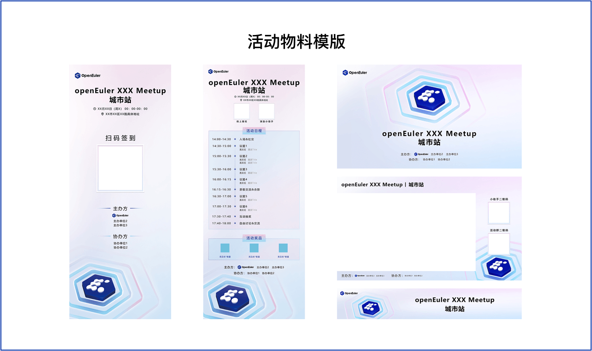
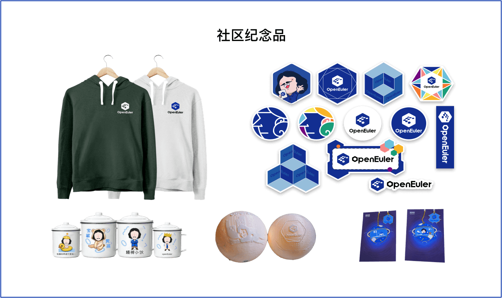

<ClientOnly>
  <BannerLevel2
  title="活动征集"
  :illustration="illustration"
  :background-image="banner"
  background-text="CONNECT"
  />
</ClientOnly>

## 如何申请

如果您有兴趣在所在城市举办 openEuler Meetup，为了保证活动顺利进行，在举办社区开发者活动前，您需要[在此处申请](/zh/interaction/event-list/meetup-form/)

## 申办审核

如果您的申请符合上述申办要求，我们会在 5 个工作日内审核并通过电子邮件[events@openeuler.sh](mailto:events@openeuler.sh)与您联系，以便提供 openEuler Meetup 赋能支持并与 OpenEuler 社区冠名联合主办单位；即便申请不合适，我们仍会通过电子邮件通知您，请确保申办表信息无误。

## 可获得哪些赋能支持

- 活动物料模板（易拉宝、宣传海报、主 KV、横幅、拍照异形牌、直播背景框等源文件）
- 宣传资源支持（报名小程序、官网、公众号、社群等渠道宣传）
- openEuler B 站直播间资源（如需直播）
- 社区纪念品（支持 100 人规模以下的实际人数申请）
- openEuler 社区介绍 PPT

  
  

## 活动举办

申办单位作为联合主办方参与筹办 Meetup，活动物料使用符合 openEuler 社区品牌规范，作为主导力量推动活动全流程，保证活动的顺利进行。

## 验收反馈

感谢 Meetup 主办方为 openEuler 社区举办精彩的开发者活动。可以更好地了解活动的情况和效果，从而不断提升 openEuler Meetup 活动的质量和影响力，在活动结束后 3 个工作日内主办方需向社区提供验收反馈资料。

<!--在此处填写[Meetup成果反馈表单](https://www.openeuler.org/) -->

