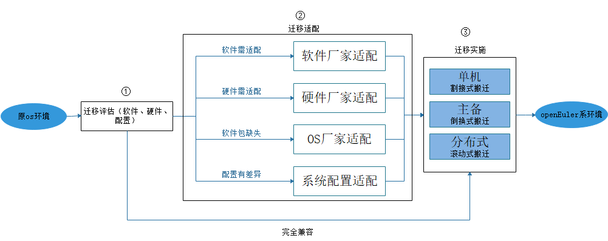

# 迁移流程

操作系统和应用软件的迁移主要包含以下三步。

1. **迁移评估**：包含对应用软件、硬性和配置的评估
2. **迁移适配**：包含软件适配、硬性适配、依赖缺失、配置差异化适配
3. **迁移实施**：面向单机、主备、分布式不同的场景实施
   具体的迁移流程如[图 1](#MigrationFlowchart)所示，迁移工具 x2openEuler 使用**① 迁移评估**的能力，根据评估结果。存在以下两种情况： - 如果存在兼容性问题，参照**② 迁移适配**指导，适配完成后开展**③ 迁移实施**。 - 如果无兼容性问题，则直接进行**③ 迁移实施**，通用方案包含新增、扩容、存量替换三种场景以及单机、主备、分布式等软件形态。

   **图 1** 迁移流程图
   
   
