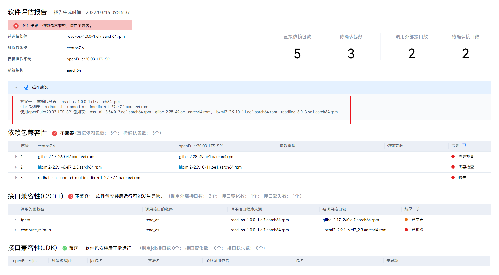
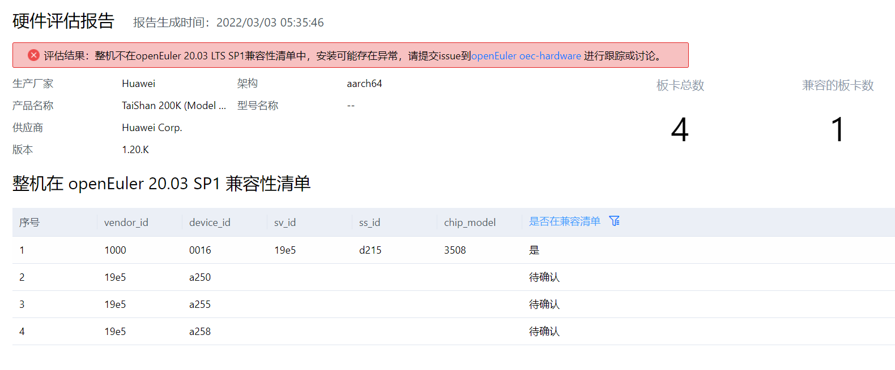

# 迁移评估

openEuler 迁移提供迁移工具 x2openEuler，可以使用该工具分析可迁移性，也可以使用该工具自动分析出需修改的内容，并指导用户如何修改。迁移工具既解决了客户软件迁移评估分析过程中人工分析投入大、准确率低、整体效率低下的痛点，通过该工具能够自动分析并输出指导报告。

- 软件评估
  通过识别应用软件依赖软件包信息清单，对**rpm/tar/zip/gzip/jar/py/pyc/sh/bin**应用进行扫描评估，并生成 **.html**评估报告。
- 配置收集与评估
  支持收集用户环境数据并生成 **.json**格式文件，支持收集硬件配置、配置接口、内核选项配置参数、系统配置参数（**sysctl/proc/sys**）、环境变量、服务、进程、端口、命令接口、系统调用项以及设备驱动接口等信息，完成配置信息分析评估。
- 硬件评估
  评估运行环境的整机（x86/AArch64）、整机板卡（RAID/NIC/FC/IB/GPU/SSD/TPM）是否在 openEuler 兼容性清单中。

## 安装迁移评估工具

1. 执行以下命令，根据当前硬件架构下载对应最新版本的 x2openEuler 工具软件包。
   ```
   wegt https://repo.oepkgs.net/openEuler/rpm/openEuler-20.03-LTS-SP1/contrib/x2openEuler/x86_64/Packages/x2openEuler-x.x-x.x86_64.rpm
   ```
2. 执行以下命令，安装 x2openEuler 工具。
   ```
   yum install x2openEuler-x.x-x.x86_64.rpm
   ```

## 兼容性评估

### 应用软件兼容性评估

此处以评估 read-os-1.0.0-1.el7.aarch64.rpm 应用包并输出软件评估报告为例，请根据实际情况选择所需参数并替换为需要扫描的软件包或软件包目录。

```
x2openEuler scan read-os-1.0.0-1.el7.aarch64.rpm
```



### 硬件兼容性评估

此处以分析本地硬件资源信息为例，请根据实际情况选择分析本地硬件资源信息或外部导入硬件信息数据。

```
x2openEuler hardware-analyse
```



### 配置兼容性评估

此处以评估本地配置信息为例，可根据实际情况选择所需参数并替换为需要进行评估的外部导入数据。

```
x2openEuler conf-analyse
```


根据报告提示，存在有变化的配置需要检查，请参考[配置适配](#配置适配) 配置适配完成配置适配。
