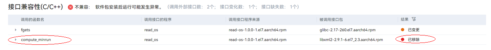
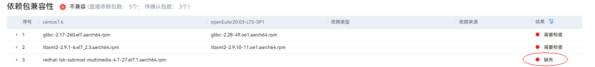

## 迁移适配

迁移适配从分析评估报告展开，针对报告中的错误详情实施不同的适配动作。

### 应用软件适配

#### 应用软件移植

以[应用软件兼容性评估](#应用软件兼容性评估)read-os-1.0.0-1.el7.aarch64.rpm 评估报告为例。
从接口层面可知，调用的接口发生了变化，经过分析后该案例显示依赖了“已移除的接口”，需联系软件厂家或者自研软件责任方进行适配。

#### OS 软件包适配

以[应用软件兼容性评估](#应用软件兼容性评估)read-os-1.0.0-1.el7.aarch64.rpm 评估报告为例。

1. 查询评估报告，并发现依赖软件包中有缺失的包，如下所示：
   
2. 引入对应缺失包，具体操作请参见[软件兼容性适配流程](https://gitee.com/openeuler/oec-application/blob/master/doc/openEuler%E7%A4%BE%E5%8C%BA%E5%BC%80%E6%BA%90%E8%BD%AF%E4%BB%B6%E9%80%82%E9%85%8D%E6%B5%81%E7%A8%8B.md)完成包引入。
3. （可选）适配完成后，将软件包引入至社区软件仓库及根据需要刷新软件兼容性清单。
   >  **说明:**
   > 对于兼容的软件可直接使用。

### 硬件适配

以[硬件兼容性评估](#硬件兼容性评估)的内容为例。

1. 在界面的“是否在兼容清单”查看是否存在状态为“待确认”的硬件类型。
   
2. 引导硬件厂家或社区开展适配，具体操作请参见[硬件兼容性测试服务](https://www.openeuler.org/zh/compatibility/hardware/)。
3. 适配完成后，将适配驱动发布至[软件所仓库](https://repo.oepkgs.net/openEuler/rpm/)，并同步刷新兼容性清单。
4. 当“是否在兼容清单”的状态变为“是”时，表示硬件已经过兼容性认证。

### 配置适配

使用 x2openEuler 的配置同步功能，工具自动分析系统的 4 种配置：服务配置，网络配置，内核配置，挂载配置。用户需结合自身实际业务诉求及调优策略不同，对各项工具展示需要同步的配置项进行分析，选择需要修改的配置，之后由工具生成自动化脚本，实现一键配置同步。
具体步骤如下：

1. 使用 x2openEuler 工具对待迁移节点进行配置分析。
2. 根据 x2openEuler 工具返回的结果，勾选需要进行配置迁移的配置（默认全部迁移）。
3. 根据勾选的结果，进行一键配置迁移，也可生成配置迁移脚本，手动迁移。
4. 如果选择生成迁移脚本，手动在目标节点上执行脚本，完成迁移，如果选择一键配置迁移，则会自动化完成配置迁移。
