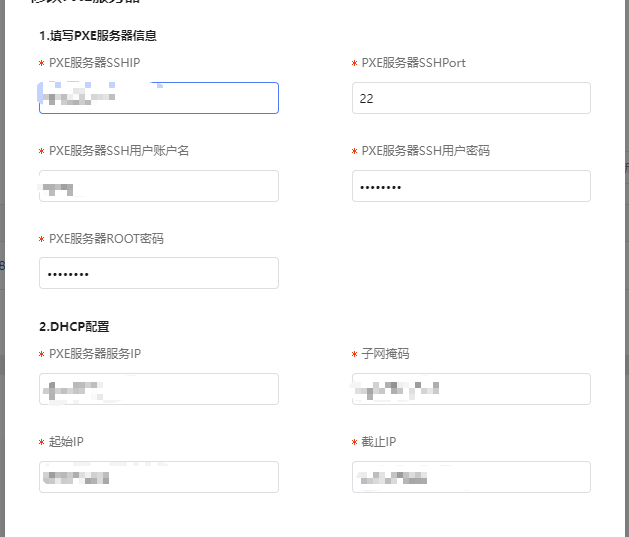
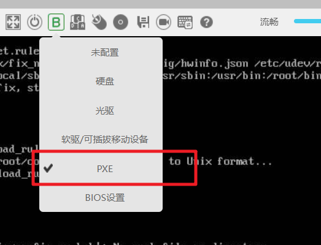

# 迁移实施（存量替换）

迁移实施前，提前熟悉软件部署架构及部署组网，针对性输出对应场景的迁移方案。
目前 openEuler 提供主流场景的迁移方案，包含大数据、分布式存储、虚拟化、容器、数据库软件，已经成功支撑多个行业用户完成迁移工作。
迁移实施过程主要包括停止业务、备份隔离、系统部署、配置同步、应用部署、业务割接核心步骤。
具体迁移项目支撑请联系 openEuler 运维人员提供技术指导。

## 停止业务

迁移实施前需申请停机窗口和准备工作，根据业务场景和割接难度评估停机维护窗口。
针对迁移实施中常见的单机、主备、分布式集群场景，不同应用软件可以做到短暂中断业务或完全不中断，具体场景需结合应用软件单独分析，常见的三种场景情况如下：

- 单机软件：业务中断，停机 x 小时。
- 主备软件：不停机。
- 分布式集群软件：不停机。

## 备份隔离

为保障搬迁过程业务应用安全性，防止搬迁过程信息的丢失，建议搬迁前做好备份，隔离是为了防止搬迁过程影响其他正常业务运行。针对不同业务场景执行容灾备份、网络隔离等可结合业务软件具体的特性进行实施，如 Mysql 数据库场景可通过 xtrabackup 等工具进行快速备份还原。

## 系统部署

系统部署可使用系统部署工具进行自动化批量部署，能够大幅提升部署效率。

- 如果客户已有 pxe 服务器，则可复用原 pxe 服务器。
- 如果客户没有 pxe 服务器，可基于 gkit 工具搭建 pxe 服务器。
  使用 pxe 服务器，同步配置文件后可快速完成 OS 安装，具体的操作如下。

1. 配置 pxe 服务器信息。
   **图 2** 配置 pxe 服务器信息
   
2. 导入配置的模板，点击安装，自动配置 pxe 服务器。
   **图 3** 自动部署
   
3. 确认“pxe 服务器状态”为绿色时，表示 pxe 服务器搭建完成。
   **图 4** pxe 服务器状态
   
4. 进入服务器 KVM，设置服务器从 pxe 启动并重启。
   **图 5** 设置服务器
   
5. 待其他步骤自动完成后，同步配置 IP，OS 安装完成（此步骤自动完成）。

## 配置同步

根据[配置适配](#配置适配)完成适配，可基于 x2openEuler 集成的配置工具，实现系统参数配置、服务状态配置等一键同步。通过该工具可确保基础运行环境及状态信息同步移植，保证业务搬迁后系统运行环境状态一致。

## 应用部署

应用部署前可将需要部署的应用打包成 RPM 包形式，通过编写应用部署安装脚本，在实验环境上进行验证，确保部署脚本的准确性。进行基础验证后，将脚本批量拷贝到待部署的服务器执行，完成自动化应用部署。
针对主流的开源软件，如大数据、数据库、虚拟化、容器等，openEuler 已提供完备的 rpm 包，可直接应用和部署。

## 业务割接

业务割接环节需要考虑应用软件自身特性，做到尽可能小的中断业务并高效的平滑搬迁。针对单机、主备、分布式集群软件，业务割接过程如下：

- 单机软件
  该类软件迁移时，涉及到操作系统切换，基本上会中断业务，需要充分考虑迁移造成的中断影响，选择合适的窗口进行迁移，可考虑借助备用服务器，割接式迁移。割接完成后保留原节点 x 天观察新节点业务运行情况，x 天后释放原节点。
- 主备软件
  该类软件迁移时，可不中断业务，先备后主，基于主备状态同步机制，平滑迁移。隔离备节点服务器，在备节点重新部署 OS 和业务，基于主备同步机制实现主备同步。然后通过主备倒换将升级 OS 后的备节点倒换成主节点，另一个节点以相同的方式进行 OS 升级。主备切换后观察新的主节点业务运行情况，x 天后替换备节点。
- 分布式集群软件
  该类软件迁移时，不中断业务，可以基于分布式软件自带的伸缩扩容机制，通过滚动替代的方式实现平滑迁移。将需要替换的节点进行隔离，然后重新部署新的 OS，再加入到原有集群中。切换 1/3 数量节点后观察新的节点业务运行情况，x 天后替换旧节点。
