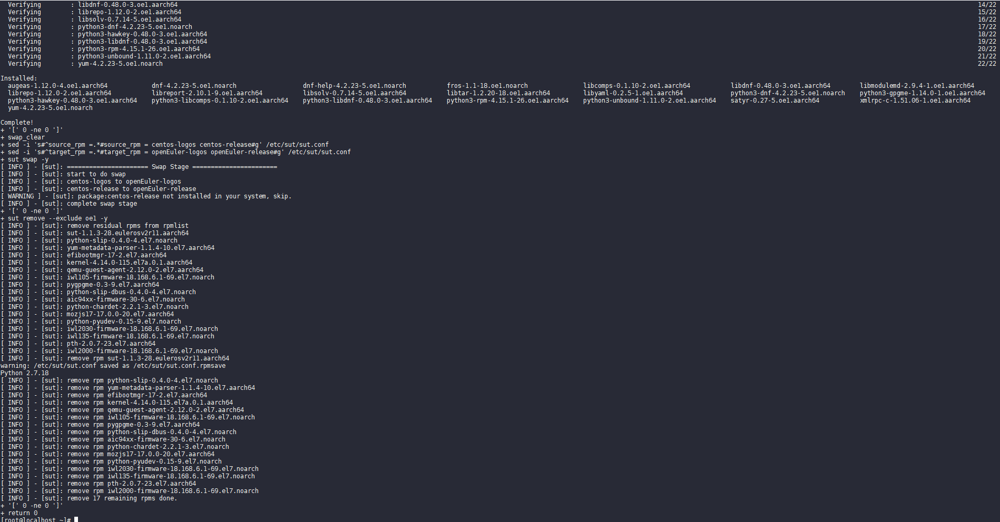
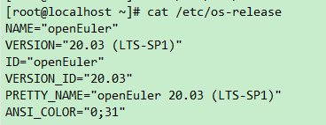

# 使用 SUT 进行升级（原地升级）

对于已经部署了业务的环境，经过升级评估后，可以使用 SUT 工具进行操作系统升级，将原操作系统升级成 openEuler 操作系统。
SUT 工具提供了自动化脚本，进行一键升级，在应用软件完成兼容性评估后，使用 SUT 进行操作系统升级可以大幅减少迁移的工作量，提升迁移效率。

## 软件上传

将 sut-\*.rpm 和 centos2openEuler.sh 脚本使用 sftp 工具上传至操作系统 root 目录下。

## 安装 SUT

将 sut-\*.rpm 放至服务器中的“/root”目录下。

```
#sut若能正常使用，请保证系统中软件包已被安装
yum install -y rsync coreutils util-linux iproute net-tools dos2unix yum-utils

#安装sut
yum install -y /root/sut-*.rpm
```

## 使用 SUT

使用 SUT 工具进行系统升级操作前，需要修改配置文件以及配置 repo 源。
以 x86_64 架构 CentOS7.6 系统最小安装情况下向 openEuler20.03 LTS SP1 进行升级为例进行相关的修改及配置。

1.  修改配置文件并配置 repo 源。
    SUT 工具的配置文件为"/etc/sut/sut.conf"，主要修改内容如下所示：

    ```
    [backup]
    store_path = /.osbak # 上述字段为设置备份目录，此目录需在执行 sut 升级命令前创建好，未创建好将会导致相关错误

        [check]
        check_level = high_impact
        # 上述字段有两种取值: low_impact与high_impact，当配置文件中[repo]字段下，repo_source = other时，取high_impact，repo_source = iso时，取low_impact

        [repo]
        repo_source = other
        # 上述字段有两种取值: iso与other
        # 当取iso时，无需手动配置repo源，只需将升级目标系统的iso文件上传至系统的/root目录下，执行升级时，使用-p参数指定即可自动创建本地源
        # 当取other时，需手动配置repo源，此源为升级目标系统的repo源，x86_64架构CentOS7.6向openEuler20.03 LTS SP1进行升级建议使用如下的源：
        # /etc/yum.repos.d/openEuler-20.03-LTS-SP1.repo:
        [openEuler-2003-lts-sp1]
        name=openEuler-2003-lts-sp1
        baseurl=http://repo.huaweicloud.com/openeuler/openEuler-20.03-LTS-SP1/everything/x86_64/
        enabled=1
        gpgcheck=0

        [openEuler-2003-lts-sp1-update]
        name=openEuler-2003-lts-sp1-update
        baseurl=http://repo.huaweicloud.com/openeuler/openEuler-20.03-LTS-SP1/update/x86_64/
        enabled=1
        gpgcheck=0
        # 建议/etc/yum.conf配置sslverify=false

        [conflict]
        conflict_rpm = libstorage-uio-static.aarch64;centos-release
        # 上述字段为配置冲突的包，当进行升级过程中报某个包有冲突的问题，需将其添加至此处进行解决

        [swap]
        source_rpm = centos-logos centos-release
        target_rpm = openEuler-logos openEuler-release
        # 上述字段为升级成功后，配置需要替换的原操作系统的某个包

    ```

    > **说明：**
    > 建议参数配置：
    >
    > - repo_source = other
    > - check_level = high_impact

    手动配置 repo 源的方式进行升级，如下为 x86_64 架构 CentOS7.6 系统最小安装情况下向 openEuler20.03 LTS SP1 进行原地升级的参考配置：

    ```
    [log]
    # Default log level is INFO
    log_level = INFO

    [backup]
    # Default backup_dir include /etc /usr
    backup_dir = /etc;/usr;/boot;/var;/run;/opt/sut/check_result
    exclude_dir =
    store_path = /.osbak

    [check]
    # Default check all items, level value: high_impact, low_impact
    # high_impact: only check important items, low_impact: check all items
    check_level = high_impact

    # skip_check only support "check_boot_avail_space" "check_memory"
    # "check_backup_avail_space" "check_root_avail_space"
    skip_check =

    [repo]
    # Default repo source is iso, value: iso, other
    repo_source = other

    [cmdline]
    # cmdline for upgrade
    cmdline_value = oops=panic softlockup_panic=1 net.ifnames=0 biosdevname=0 nmi_watchdog=1 selinux=0 console=tty0 crashkernel=256M reserve_kbox_mem=16M crash_kexec_post_notifiers panic=3 no-steal-time use-sched-idle-time rd.shell=0 console=ttyS0,115200n8 rd.md=1 rd.aut
    skip_swap = True

    [conflict]
    conflict_rpm = libstorage-uio-static.aarch64;centos-release

    [swap]
    source_rpm = centos-logos centos-release
    target_rpm = openEuler-logos openEuler-release

    ```

2.  升级前检查

    - 确保确保"/etc/yum.repos.d"下的 repo 源只有前面配置的 openEuler-2003-lts-sp1 与 openEuler-2003-lts-sp1-update 仓库为启用状态，其他需全部禁用。
    - 确保能够访问"repo.openeuler.org"。
    - 确保"/etc/sut/sut.conf"文件中 store_path 字段配置的目录存在，若不存在请使用 mkdir 命令创建。

3.  卸载有冲突的包。
    经测试评估，x86_64 架构 CentOS7.6 系统最小安装情况下向 openEuler20.03 LTS SP1 进行升级时，如下包将会导致冲突，需在升级前将其卸载才可升级成功。

    ```
    rpm -q sysvinit-tools && rpm -e sysvinit-tools --nodeps
    rpm -q iwl7265-firmware && rpm -e iwl7265-firmware --nodeps
    rpm -q ivtv-firmware && rpm -e ivtv-firmware --nodeps
    rpm -q sg3_utils-libs  && rpm -e sg3_utils-libs --nodeps

    ```

## 执行升级

操作系统升级脚本会对操作系统进行备份，配置目标版本的 repo 源，之后会将当前操作系统上的 rpm 包升级到 openEuler 上的软件包，在升级过程中需要重启一次，完成对内核升级的生效，
执行以下命令，即可开始对操作系统进行升级：

```
sh centos2openEuler.sh
```


脚本会自动安装 SUT 升级工具，并开始对操作系统进行升级。
升级完成后界面如下所示：


## 升级后检查

1. 执行**cat /etc/os-release** 命令，检查操作系统版本是否已经升级到 openEuler。
   
2. 当前操作系统内核依旧为原内核，需将内核切换至 openEuler 内核。执行**reboot**命令，然后需要重启后，内核完成切换。 3.检查业务状态是否正常
