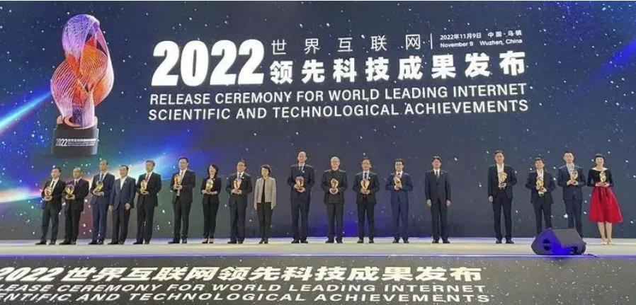
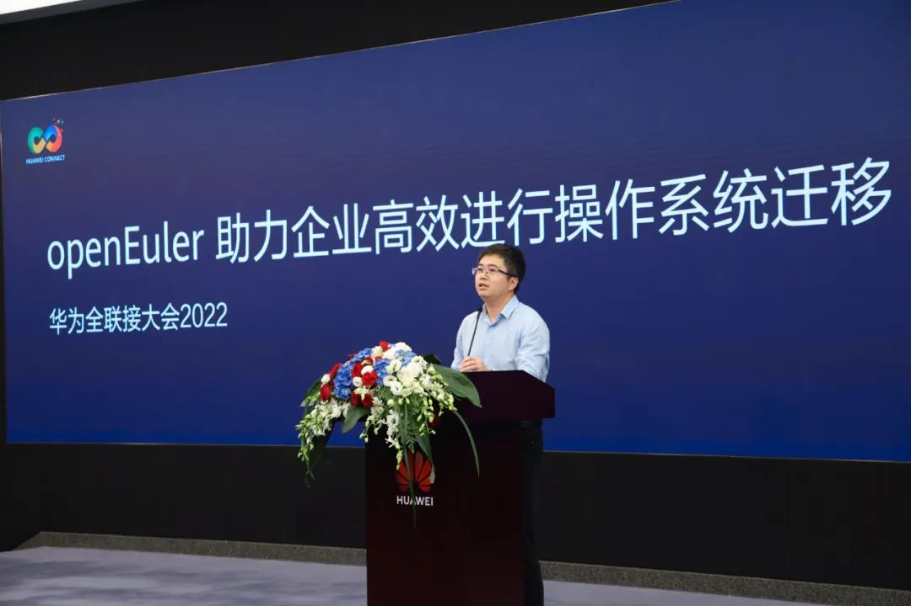
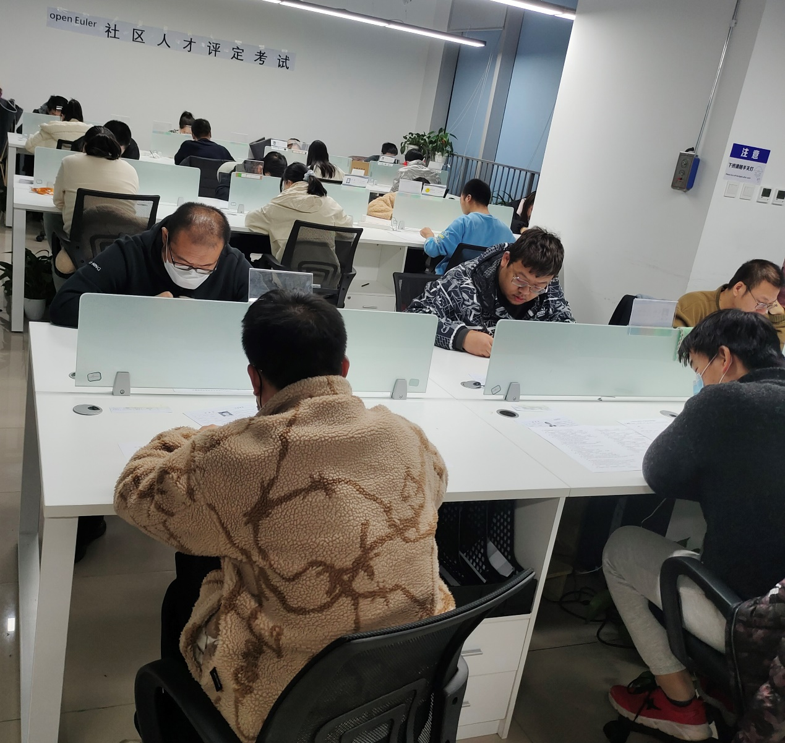
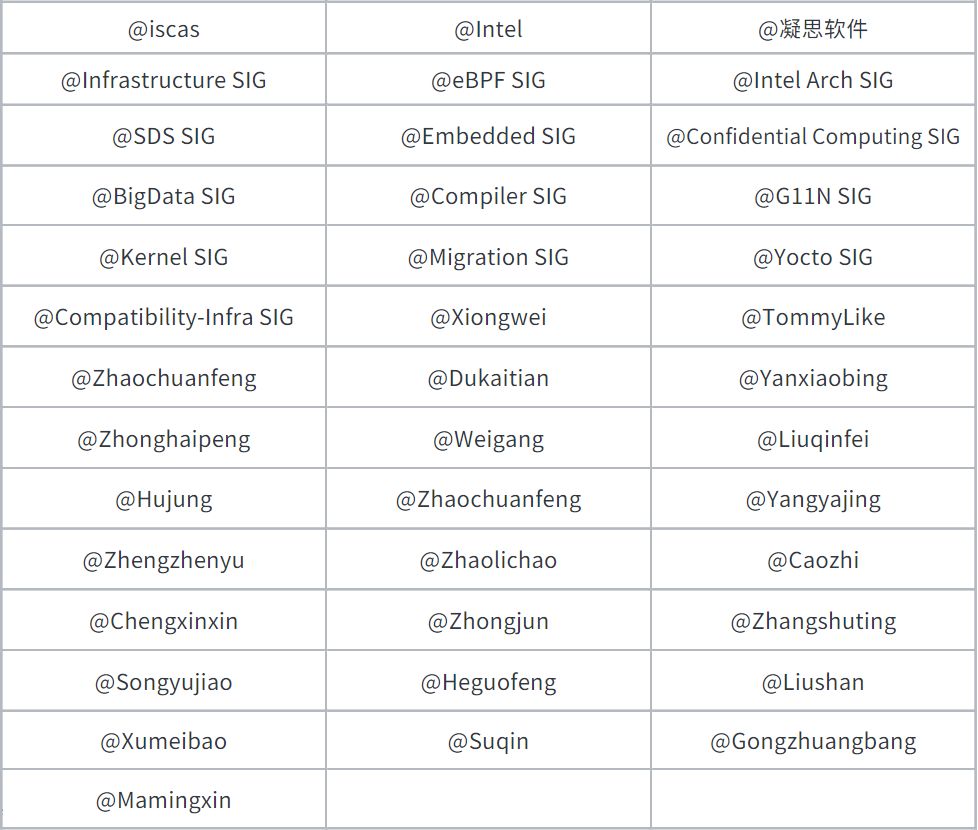

社区活跃度
==========

秉承共建、共享、共治的理念，在上万名开发者的共同
参与下，openEuler社区正以蓬勃之姿稳健发展。

截⾄11⽉30⽇，12,000+名开发者在openEuler社区的不同
SIG组内持续贡献。社区⽤⼾超过99.8万，11⽉增⻓了 4.1%，累计产⽣ 46.1K
Issue、83.2K PR。

⽬前，已超过450家单位成员加⼊openEuler社区。11⽉，
亚信科技和云数科技等30多家新伙伴加⼊社区。

社区贡献看板（截⾄2022/11/30）

社区⼤事件
==========

openEuler开源操作系统荣获2022世界互联⽹领先技成果奖
---------------------------------------------------

2022年11⽉9⽇，在第九届世界互联⽹⼤会上，openEuler
凭借在开源操作系统领域的创新成果获得⼤会评委会⼀
致认可，最终摘得“全球领先科技成果⼤奖”。这是社区
成千上万伙伴和开发者共同贡献的成果。

[*点击阅读*](https://mp.weixin.qq.com/s?__biz=MzI2NDE4OTE2Mg==&mid=2247498927&idx=1&sn=846e8a191000dde07e891b4a88fa205e&chksm=eab2d92addc5503c201da1e9f9c36e6eb9c390df5b51cdc15274c8463cbc2b21353c050e5292&token=878686554&lang=zh_CN#rd)

**openEuler Summit 2022
将在12⽉29⽇召开，欢迎申报议题、共建单位与⽅案展⽰**

openEuler Summit 2022 将于2022年12⽉29⽇在北京国家
会议中⼼举办。本次峰会旨在推动 openEuler 在多样性计
算、云计算、边缘计算、嵌⼊式、开源硬件以及安全、
迁移、运维等技术⽅向的持续探索和创新。

开源是⼀种态度，分享是⼀种精神。Call for Speaker、 Call for
Sponsor、Call for Demo 现已全⾯开放报名。

[*点击阅读*](https://mp.weixin.qq.com/s?__biz=MzI2NDE4OTE2Mg==&mid=2247499239&idx=1&sn=7e123f57662ddec0b537ad2c35cd24f6)

openEuler⽣态⼤会在⽆锡召开，探索软件信息产业蓬勃发展的新路径 
--------------------------------------------------------------

2022 年 11 ⽉ 8 ⽇，openEuler⽣态⼤会在⽆锡滨湖召
开。⼤会现场，⼀批欧拉伙伴⼊驻社区，⼀批合作协议
正式签约，⼀批欧拉社区技术测评认证伙伴获得颁证。
期间，重磅⾸发openEuler社区版本正式⽀持SW-64架构
和基于openEuler的统信服务器操作系统（申威版），为构建开源软件⽣态、提升关键软件⽀撑能⼒提供重要动能。

作为本次⼤会的重点发布成果之⼀，江苏省⼯业和信息
化厅与⽆锡市政府率先推出的《江苏（⽆锡）欧拉⽣态
发展⽩⽪书》备受现场与会嘉宾的关注。

[*点击阅读
&gt;&gt;&gt;*](https://mp.weixin.qq.com/s/YjZe7NzLpB5lDt4RuZ_DPQ)

四川开源操作系统⽣态⼤会召开，四川欧拉⽣态 创新中⼼揭牌成⽴ 
------------------------------------------------------------

2022 年 11 ⽉ 8
⽇，四川开源操作系统⽣态⼤会在成都召开。会上，四川欧拉⽣态创新中⼼正式揭牌成⽴并公
布了⾸批⼊驻的⽣态伙伴代表，同时⾸个区域欧拉⽣态 图谱也在本次⼤会亮相。

openEuler社区技术委员会委员熊伟博⼠在会上分享并展 ⽰ 了 openEuler ⽣ 态
的 阶 段 性 成 果 。 他 表 ⽰ “ ⽬ 前 openEuler
社区已经在⽣态构建、技术创新和商业落地全
⽅⾯加速，取得了跨越式进展，是⽬前最活跃的开源社
区，欢迎更多开发者加⼊⼀起，贡献共享，共建⽣态。”

[*点击阅读
&gt;&gt;&gt;*](https://mp.weixin.qq.com/s/YjZe7NzLpB5lDt4RuZ_DPQ)

华为全联接2022，openEuler助⼒企业⾼效进⾏操作系统迁移 
------------------------------------------------------

2022年11⽉9⽇，华为全联接2022 openEuler 技术专题论
坛——“如何⾼效帮助企业进⾏操作系统迁移”线上召
开。本次⼤会邀请到华为、天翼云、麒麟软件、统信软
件、软通动⼒、华锐技术和openEuler社区的技术专家，
分享如何根据具体业务场景，平稳⾼效的实现操作系统 迁移。

[*点击阅读
&gt;&gt;&gt;*](https://mp.weixin.qq.com/s?__biz=MzI2NDE4OTE2Mg==&mid=2247498927&idx=2&sn=a8fb32bce8504aec9790622da7d419c6&chksm=eab2d92addc5503c911e9ee9779fbf6f6ee7618246f90f7cb5265e46ef8e388cd17e91bf8a7b&token=960972242&lang=zh_CN#rd)

openEuler Meetup 
-----------------

11⽉，openEuler社区参与举办4场不同技术主题的专场 Meetup，分别为

### 分布式存储与⼤数据专场Meetup 

11⽉10⽇，openEuler SDS SIG和bigdata SIG开
展的“分布式存储与⼤数据”于线上举办，活动
吸引了来⾃ISV、互联⽹、运营商等30+企业近
两百名专家和开发者踊跃参与。开发者在提问
环节对分布式存储及⼤数据领域关键技术与讲 师进⾏深⼊的交流互动。

[*点击阅读更多&gt;&gt;&gt;*](https://mp.weixin.qq.com/s/V1wbtaWmusOLnIICHOhMGg)

### 操作系统迁移 Meetup 

11⽉11⽇，以操作系统迁移为主题的openEuler Meetup
在南京举办，为南京地域的⽤⼾赋能如
何将OS系统顺滑地迁移到openEuler。社区⼯程
师现场演⽰，带领⽤⼾实操演练，体验迁移全
过程。在本次活动上，openEuler社区南京⽤⼾
组成⽴，正式在江苏地域构建⼀个⽤⼾交流圈 和本地欧拉⽣态拓展平台。

[*点击阅读更多&gt;&gt;&gt;*](https://mp.weixin.qq.com/s?__biz=MzI2NDE4OTE2Mg==&mid=2247499232&idx=2&sn=ea4dc418a5c4ff538ef7c47bb52a8cd5&chksm=eab2d865ddc551733b9f3790671f9bec1e0af44dc46d481eb26665ceb0708edd01a2794dcf0c&token=878686554&lang=zh_CN#rd)

### 互联⽹⽤⼾专场 

Meetup 11⽉18⽇，由 openEuler 社区和英特尔联合举办 的 openEuler Meetup
互联⽹⽤⼾和云⼚商专场 在北京举⾏。来⾃百度 、美团、新浪、京东、
360、快⼿、搜狐、中国联通、中国电信、华为 云等公司的技术专家，并与 Intel
Arch SIG的 Maintainer 深⼊交流 x86 架构在欧拉开源操作
系统的深度兼容与性能调优情况。

[*点击阅读更多&gt;&gt;&gt;*](https://mp.weixin.qq.com/s/dZzPnlFLin1UMvPdeV1Epw)

### DPU实践经验与应⽤探索 

Meetup 11⽉26⽇，openEuler DPU Meetup线上举办，
会议邀请了投⼊到openEuler DPU SIG的伙伴百
度太⾏、天翼云、中科驭数、新浪云、云豹智
能来分享他们当前在DPU的实践经验、应⽤案 例以及总结思考。

[*点击阅读更多&gt;&gt;&gt;*](https://mp.weixin.qq.com/s/g20-VK_nYY01-on3adJDVQ)

###  openEuler Techday 第⼆期开播 

11⽉29⽇，⾯向英语开发者栏⽬openEuler TechDay第⼆
期在YouTube平台直播，节⽬邀请到openEuler技术委员
会成员，操作系统⾏业专家熊伟博⼠参加访谈，解答了
海外开发者对openEuler社区及openEuler操作系统的问
题，从技术创新，社区合作，以及商业发展三⽅⾯全⽅
位剖析了欧拉社区的设计与⽣态。欢迎⼤家参与讨论， 共话欧拉社区发展。

回看地址：*https://weixin.qq.com/sph/AXzstj*

Twitter：*https://twitter.com/openEuler*

LlinkedIn：
[*https://www.linkedin.com/company/86315548/admin/*](https://www.linkedin.com/company/86315548/admin/)

Reddit：
[*https://www.reddit.com/user/openEuler*](https://www.reddit.com/user/openEuler)

Youtube： https://www.youtube.com/channel/UCPzSqXqCgmJmdIicbY7 GAeA

**社区治理** ·

社区理事会 
-----------

### 欧拉开源社区第⼆届理事会第三次会议召开 

2022年11⽉10⽇，欧拉开源社区第⼆届理事会第三次会
议线上召开。本次会上，理事会评审通过2022年操作系 统产业峰会和openEuler
Summit 2022 举办⽅案，评审通 过openEuler社区新章程及换届选举⼯作⽅案。 ·

[*点击阅读*](https://mp.weixin.qq.com/s/EgKMDCvA_--syOXe5u4jlQ)

openEuler 技术委员会 
---------------------

### openEuler年度TC委员述职演讲 

本⽉，openEuler技术委员会委员完成了年度TC委员的
述职。委员们各⾃对过去⼀年中在社区的⼯作做了总结
与分析，并对下⼀年的⼯作提出了⼀些规划与要求，未
来他们将持续为社区服务，繁荣社区⽣态。

### 凝思软件贡献了容器故障检测项⽬CPDS和主机管理软件HMIR 

容 器 故障 检 测 系 统 CPDS (Container Problem Detect System)
是由北京凝思软件股份有限公司设计并开发的
容器集群故障检测系统，该软件系统实现了对容器TOP
故障、亚健康状态的监测与识别。

相关链接
[*https://gitee.com/openeuler/community/pulls/4257*](https://gitee.com/openeuler/community/pulls/4257)

HMIR(Host Management In Rust)，是⼀组基于jsonrpc的
restful接⼝，⽤于提供主机管理服务，⽬的是⽤于云计
算、云桌⾯、虚拟化等主机管理，其功能包括主机服务
管理、软件包管理、主机⾃启动管理、⽹络管理、FC存
储管理、分布式存储管理等，提供安全可靠的RESTful API以⽅便使⽤和集成。

相关链接
[*https://gitee.com/openeuler/community/pulls/4249*](https://gitee.com/openeuler/community/pulls/4249)

### Infrastructure SIG 孵化OmniVirt跨平台开发资 源(虚拟机、容器)管理⼯具 

openEuler 社区 Maintainer 郑振宇在TC例会上分享了
OmniVirt跨平台开发资源(虚拟机、容器)管理⼯具。

OmniVirt是由openEuler社区技术运营团队及基础设施团
队孵化的开发者⼯具集，通过对主流桌⾯操作系统中的
虚拟化技术(LXD、HyperV、Virtualization framework)等
技术进⾏有机整合，使⽤openEuler社区官⽅发布的虚拟
机、容器镜像，为开发者在Windows、MacOS、Linux上
提供统⼀的开发资源(虚拟机、容器)发放和管理体验，提
升主流桌⾯操作系统上openEuler开发环境使⽤的便利性
和稳定性，有效提升开发者体验。

相关链接
[*https://gitee.com/openeuler/community/pulls/4297*](https://gitee.com/openeuler/community/pulls/4297)

### Compiler SIG汇报Clang+LLVM构建openEuler ⼯作建议 

LLVM项⽬凭借其良好的架构、友好的License，近⼏年
社区活跃度增加明显，业界组织也积极推进Clang+LLVM
来构建更多的C/C++软件项⽬，TC委员兼Compiler SIG
maintainer赵川峰在技术委员会分享了Clang+LLVM构建
openEuler的可⾏性和执⾏规划：

⾸先从嵌⼊式场景开始，验证Clang+LLVM构建的 技术难点和优势；

然后在服务器重点场景开始逐步⽀持Clang+LLVM
构建，为开发者提供另⼀个选择；

最后争取把Clang+LLVM做成原⽣/默认构建编译 器⼯具链。

### openEuler倡议建⽴eBPF软件发布标准 

eBPF作为内核运⾏沙箱程序的技术，提供了⼀种在内核
事件和⽤⼾程序事件发⽣时安全注⼊代码的机制，使得
⾮内核开发⼈员也可以对内核进⾏控制。

随着内核的发展，eBPF 逐步从最初的数据包过滤扩展到
了⽹络、内核、安全、跟踪等，⽽且它的功能特性还在 快速发展中，早期的 BPF
被称为经典 BPF，简称cBPF，
正是这种功能扩展，使得现在的BPF被称为扩展BPF，简 称eBPF。

**openEuler
可编程内核SIG愿景旨在催熟eBPF技术在各⾏业、场景的应⽤，并希望基于eBPF技术将内核能⼒服
务化，由eBPF来承载内核能⼒（eBPF as Service）。**

当前eBPF的开发框架、发布形式发展迅速，但也存在⼀
些问题，包括跨版本移植能⼒、多场景⽀持能⼒、开发
易⽤性、服务可获得性等问题。为此，**多家企业/⾼校在
openEuler社区倡议建⽴⾏业标准，通过标准化发布将内
核定制能⼒、硬件卸载能⼒向社区⽤⼾提供性能加速、
安全加固、智能观测等服务。**

我们预计在12⽉份组织⼀次线上闭⻔会议，当前参与企
业/组织包括天翼云、深信服、华为、西邮、中⼭⼤学、
中科驭数、信通院、锐捷等。同时我们希望国内对eBPF
技术有诉求、规划的⼚商加⼊本次讨论会议，建⽴eBPF
技术相关标准，为eBPF技术应⽤、科研提供较好的基础平台。

详细讨论范围请关注openEuler公众号。

联系⽅式
[*https://etherpad.openeuler.org/p/sig-ebpf-meetings*](https://etherpad.openeuler.org/p/sig-ebpf-meetings)

技术进展 
=========

openEuler Intel Arch SIG 
-------------------------

在openEuler 22.09创新版对Intel的Sapphire Rapids平台有
了较为完整的⽀持后，本⽉Intel Arch SIG的主要⼯作是 协同openEuler Kernel
SIG将已经合并到22.09的特性逐步 合并到22.03 LTS SP1中。借22.03 LTS
Kernel在SPR上部 分特性引⼊了KABI变化的兼容性问题，社区也⼀起对
KABI修改的⽅法和规范进⾏了探索。

到本⽉底，除22.09已经合并的特性外，22.03 LTS SP1中 新引⼊了Intel DSA/IAA
driver (IDXD driver), Intel AIA ENQCMD的Kernel本地⽀持，

以及引⼊了AMX虚拟化包 括KVM和QEMU的⽀持。 到⽬前为⽌，Intel Arch
SIG已经完成了已经被Kernel.org ⽀持的所有对Intel Sapphire
Rapids的⽀持以及主要的各 类⼦系统的bug
fix的部分。与此同时，在openEuler对 Intel oneAPI的⽀持上，Intel Arch
SIG已经在22.03 LTS SP1中升级合并了oneDNN-2.6，其中包含了SPR
AMX特性的加速。另外Intel Arch SIG和openEuler AI SIG也共同
升级了tensorflow-2.10.0及其依赖的软件包。这样⽤⼾已经可以在openEuler的TensorFlow中通过混合精度的⽅式
使⽤AMX加速相关的AI场景应⽤。

openEuler SDS SIG 
------------------

近期，SDS SIG的⼯作主要集中在以下⼏个⽅⾯：

1.  开展分布式存储组件的性能优化、ARM使能实践等⼯作，发布了如下多篇实践指南：

> 发布《鲲鹏硬件加速器ceph使能指南》
>
> 发布《openEuler DAOS出包指导⽂档》
>
> 发布《Ceph编译速度提升总结》
>
> 发布《Lustre arm64初探》
>
> 技术⽂档：
> [*https://gitee.com/src-openeuler/ceph/wikis/*](https://gitee.com/src-openeuler/ceph/wikis/)

1.  在openEuler ceph\_dev孵化和开发了如下的新特性：

> uadk压缩插件，⽀持块与对象压缩处理加速:
> [*https://gitee.com/openeuler/ceph\_dev/pulls/6*](https://gitee.com/openeuler/ceph_dev/pulls/6)
>
> rgw SSE-C和SSE-KMS⽀持SM4国密算法:
> https://gitee.com/openeuler/ceph\_dev/pulls/10
>
> 消息线程间负载均衡优化，实现性能提升，4K随 机写性能提升9%:
> [*https://gitee.com/openeuler/ceph\_dev/pulls/9*](https://gitee.com/openeuler/ceph_dev/pulls/9)

1.  ceph作为⼀种为优秀的性能、可靠性和可扩展性⽽设
    计的统⼀的、分布式⽂件系统软件，已在申威3231服务
    器平台上⽀持使⽤。⽬前申威已经实现ceph v16.2在 openEuler22.03
    LTS操作系统上的移植和适配，满⾜各项
    基础功能的运⾏。ceph为申威提供⽂件系统、块存储和 对 象 存 储 ， 分
    布 式 动 态 扩 展 ， 在 后 续 开 发 中 可 作 为 penstack
    的后端存储来提⾼数据转发效率。

openEuler Embedded SIG 
-----------------------

> 本⽉，Embedded SIG的⼯作主要集中在以下⼏个⽅⾯：
>
> 1\. openEuler Embedded 的 构 建 系 统 核 ⼼ yoct-metaopeneuler ， 引 ⼊
> 了 meta-openembedded 和 metaROS，以实现更多软件包⽀持，特别是为了在
> openEuler Embedded 实 现 ROS2 的 ⽀ 持 奠 定 了 基 础。
>
> 2\. openEuler Embedded关键特性之⼀的多OS混合关
> 键部署中Linux侧相关代码已经单独成仓发展，具
> 体可⻅：https://gitee.com/openeuler/mcs 同时在openEuler
> Embedded的构建系统中开始了对 RTOS的集成。
>
> 3\. 新增了对x86-64的⽀持，能够以iso的⽅式在x86虚
> 拟机或物理机上安装openEuler Embedded。
>
> 4\. 来源于开源之夏成果的嵌⼊式图形⽀持已经合⼊，
> 实现了QT5+Wayland+Mesa的⽀持，可以在树莓派 4B上实现基本的图形功能。
>
> 上述3、4的细节可以参考：
>
> https://www.bilibili.com/video/BV14G4y1o7ME/?
> spm\_id\_from=333.999.0.0

### openEuler Confidential Computing SIG 持续完善secGear开发框架和推进机密计算⽣态建 设 

> 机密计算保护数据“可⽤不可⻅”的同时，业界种类繁多
> 的TEE也为应⽤开发者带来了较⼤的开发维护成本以及
> 性能影响，让很多应⽤开发者望⽽⽣畏，影响机密计算
> ⽣态的发展。secGear机密计算统⼀开发框架，致⼒于兼
> 容业界主流TEE，屏蔽TEE差异，对开发者提供统⼀、简
> 易的编程接⼝，实现不同架构共源码，降低机密计算应
> ⽤开发维护成本，打通各TEE应⽤⽣态，助⼒机密计算 ⽣态建设。
>
> 1\. 在openEuler 22.09版本的secGear，基于共享内存
> 推出零切换(switchless)特性，对应⽤拆分带来的性
> 能下降进⾏优化，实现⾮安全侧与安全侧频繁交互 场景性能倍增。
>
> 2\. 北京CA的密码模块基于22.09 secGear 零切换特性
> 实现性能倍增，将国密SM2签名性能从最初的2万
> 次/秒提升⾄22万次/秒，达到业界领先⽔平。
>
> 3\. MindSpore发布了基于secGear的纵向联邦特征保护
> 的安全特性，保护各参与⽅的特征数据安全，不被 恶意利⽤反推⽤⼾信息。
>
> 4\. 华为牵头的《机密计算通⽤框架》国标正式⽴项成
> 功，推进机密计算标准发展。
>
> 未来，Confidential Computing SIG会持续完善secGear开
> 发框架，同时也会探索机密计算与虚拟化的结合。希望更多伙伴加⼊Confidential
> Computing SIG，共同推进机 密计算⽣态建设。
>
> Confidential Computing SIG
>
> https://gitee.com/openeuler/community/tree/master/sig/sigconfidential-computing
>
> 北京CA与华为共推密码鲲鹏⾃主创新⽣态发展
>
> [*https://mp.weixin.qq.com/s/idYZlFDKoF\_pEiEQgEbZHw*](https://mp.weixin.qq.com/s/idYZlFDKoF_pEiEQgEbZHw)
>
> MindSpore 纵向联邦基于可信执⾏环境的特征保护
>
> https://www.mindspore.cn/federated/docs/zhCN/master/secure\_vertical\_federated\_learn

ing\_with\_TEE.ht ml

《机密计算通⽤框架》国标⽴项通知

https://www.tc260.org.cn/front/postDetail.html? id=20221101160109

### openEuler Compiler SIG 

openJDK完成基线升级，包括CVE修复和社区最新版本 同步，涉及：

openjdk-1.8.0、openjdk-1、openjdk-17、opendjklatest等版本

master 、 openEuler-22.03-LTS-Next 、
openEuler22.03-LTS-SP1、openEuler-22.03-LTS、openEuler20.03-LTS-SP1、openEuler-20.03-LTS-SP3等分⽀

openjdk-1.8.0： jdk8u342-b07 -&gt; jdk8u352-b08

openjdk-11： jdk-11.0.17-6 -&gt; jdk-11.0.17-ga

openjdk-17：jdk17.0.4-ga -&gt; jdk17.0.5-ga

opendjk-latest： jdk-18.0.2+9 -&gt; jdk-19.0.0.0+36

### openEuler 可编程内核 SIG（eBPF SIG） 

近期，eBPF SIG 22\~23年路线图发布，感兴趣的朋友可以关注。

**eBPF&内核基础： **

22.03 SP1 （ 22.12 ） : 轻 量 级 eBPF 开 发 框 架 （eunomia-bpf）

22.03 SP1 （ 22.12 ） : 内 核 可 编 程 调 度 框 架 （kernel内发布）

**运维&调优&安全： **

22.09创新版本（22.09）： 基于eBPF进⾏Redis加 速（bmctool）

22.03 SP1（22.12）：基于eBPF的全栈&全链路观测平台（gala-gopher）

22.03 SP3（23.12）：基于eBPF的配置变更影响分析⼯具（Agith)

22.03 SP3（23.12）：基于eBPF的内核漏洞检测分析⼯具（eArmor）

23.03创新版本（23.03）：基于eBPF的OVS流表运 维⼯具（天翼云）

**云原⽣&⽹络： **

23.03创新版本（23.03）：下⼀代ServiceMesh数据
⾯（性能10倍提升）（kmesh）

23.03创新版本（23.03）：基于eBPF的服务⽹格加速、观测能⼒（天翼云）

23.09创新版本（23.09）：基于eBPF的云原⽣安全
规则定义能⼒，性能10倍于现有安全能⼒。（天翼云）

### G11N SIG和Kernel SIG联合推出openEuler 迷你 课程3、4期 

openEuler G11N SIG 和 Kernel SIG 正联合制作⼀系列迷
你课程，以通俗易懂的语⾔呈现内核相关的技术知识，
以便让⼤家更好地了解openEuler OS。该系列已更新⾄第 3、4期，主要介绍crash
utility基础知识。

如果您对这⼀系列感兴趣，可以关注 G11N 与 Kernel 两
个SIG组，⼀起交流讨论。

第1期：Kdump的⼯作原理和操作

https://www.openeuler.org/en/blog/zhangweiyu/2022-07-13-
openEuler-Mini-Video-Courses-Kdump.html

第2期：Linux PCI⼦系统的基础认知

https://www.openeuler.org/en/blog/zhangweiyu/2022-07-13-
openEuler-Mini-Video-CoursesLinux%20PCI%20subsystem.html

第3期：

Crash Utility 1/2
https://www.openeuler.org/en/blog/zhangweiyu/2022-11-14-
openEuler-Mini-Video-Courses-03%E2%80%93Crash-Utility1.html

第4期：

Crash Utility 2/2
https://www.openeuler.org/en/blog/zhangweiyu/2022-11-14-
openEuler-Mini-Video-Courses-04%E2%80%93Crash-Utility2.html

基础设施 
=========

openEuler社区账号服务上线 
--------------------------

11⽉，openEuler社区账号服务上线，⽤⼾可通过Gitee、
Github、邮箱等任⼀⽅式登陆官⽹或⽂档服务，通过个
⼈中⼼可实现绑定多个平台（Gitee、Github等）账号。
后续，基础设施团队将对其进⼀步优化，打通各个服
务，实现⼀个账号即可体验社区所有服务。

欢迎⼤家注册：https://id.openeuler.org/login，通过Gitee
账号登录还可以保留openEuler贡献⽤⼾名。

您也可以通过社区官⽹右上⻆进⼊注册⽹址，如下图⽰意：

新增⾼校镜像源： 
-----------------

社区镜像仓列表新增北京⼤学镜像源：

[*https://mirrors.pku.edu.cn/openeuler/*](https://mirrors.pku.edu.cn/openeuler/)

openEuler WSL应⽤上架微软应⽤商店 
----------------------------------

现 在 通 过 微 软 应 ⽤ 商 店 ， ⽤ ⼾ 已 经 可 以 下 载 ⽀ 持 Windows
Subsystem for Linux (WSL) 的 openEuler 应 ⽤
了，当前可以体验的版本为：openEuler 22.03 LTS， openEuler 20.03 LTS
SP3，欢迎⼤家使⽤体验，欢迎通过
QuickIssue将您的建议与疑问反馈给基础设施SIG组。

QuickIssue

[*https://quickissue.openeuler.org/zh/issues/*](https://quickissue.openeuler.org/zh/issues/)

### 软硬件兼容性清单 

⾃2022年6⽉以来，经开放原⼦开源基⾦会的批准，在社
区建⽴发⾏版的欧拉技术测评，⽬前已经成⽴江苏/湖北/
湖南/四川四个测评中⼼。截⽌ 2022年11⽉份，当前兼容 性⽅案332个，其中北向
207个，南向 86个，OS 39个； 11⽉新增北向 54个，南向 16个，OS 14个。

社区兼容性清单

[*https://www.openeuler.org/zh/compatibility/*](https://www.openeuler.org/zh/compatibility/)

安全公告 
=========

11⽉份发布安全公告75个，修复CVE漏洞165个（其中 Critical 21个，High
60个，其它 76个），openEuler 不受影响的CVE 143个。

openEuler安全公告

[*https://www.openeuler.org/zh/security/safety-bulletin/*](https://www.openeuler.org/zh/security/safety-bulletin/)

⼈才培养 
=========

第三届开源之夏已完成结项评审 
-----------------------------

由中国科学院软件研究所与openEuler共同主办的开源之
夏活动于2022于11⽉中旬完成结项评审，共计350个项⽬
成功结项，其中openEuler社区成功结项的为56个， 为
openEuler社区内核、虚拟化、编译器、嵌⼊式、智能运
维、⼤数据、openstack、基础设施等多个⽅向SIG贡献出
了有价值的代码，10位同学的代码在9⽉份之前成功随 22.09版本发布。

地址：

https://summer-ospp.ac.cn/\#/finaltermdata

开源实习持续开放报名 
---------------------

openEuler开源实习常态化开放给学⽣持续报名和参与，
截⾄当前签约实习⽣154⼈，在openEuler社区完成任务
166个，40+个任务正在开发中，共向社区提交了613个
PR，其中430个已被合⼊社区仓库，产⽣issue28条，
comments1708条，为40+个SIG带来贡献值。

地址：

[*https://openeuler.test.osinfra.cn/zh/internship/*](https://openeuler.test.osinfra.cn/zh/internship/)

openEuler社区⼈才评定考试 
--------------------------

2022年11⽉，openEuler社区⼈才与服务SIG组，联合东
软集团、神州新桥、软通动⼒、中软国际、江苏润和组
织了5场线下openEuler社区⼈才评定考试，共有241⼈参
加考试，最终140⼈通过评定考试。

图为各地域openEuler⼈才 评定考试现场

感谢每⼀位朋友、开发者的⽀持 
=============================

openEuler的发展离不开每⼀位贡献者的⾟勤付出。可以说每⼀天，openEuler社区都发⽣着好的事情，那些
熠熠⽣辉的时刻，是⼤家努⼒的成果。

⼩编限于视野和能⼒，难免有所遗漏，在此表⽰歉意。
同时，衷⼼感谢以下社区朋友、openEuler SIG组成员
以及开发者们对本⽉⽉报的贡献：

\* 以上不分先后顺序

如果您希望在⽉报中增加您的⼯作内容，或对内容有任
何改进建议，[*请联系wengqiaozhen@openeuler.sh*](mailto:请联系wengqiaozhen@openeuler.sh)。

- END -
