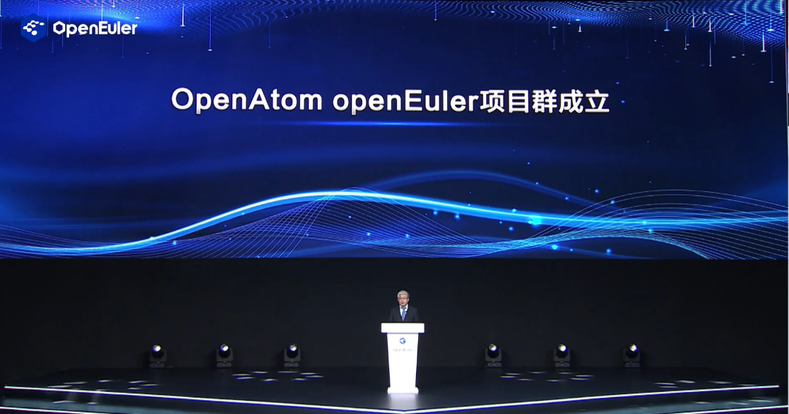
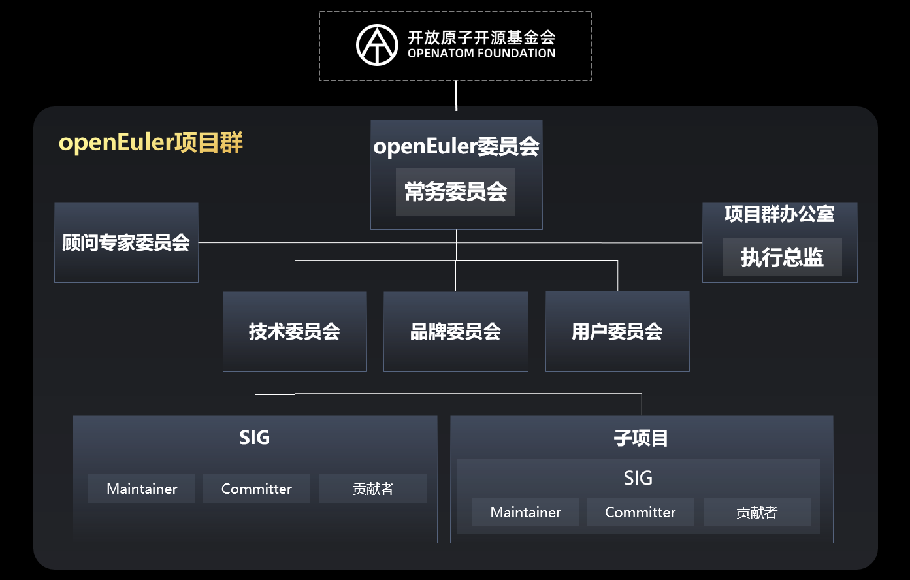
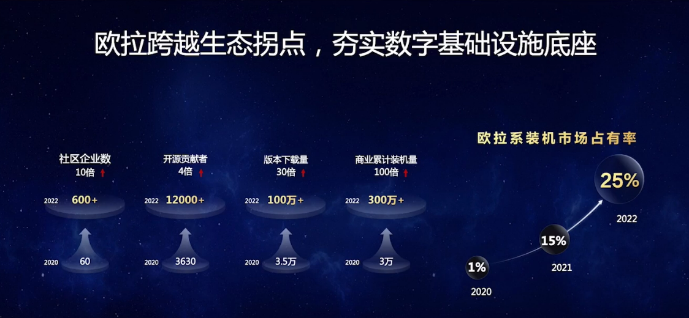
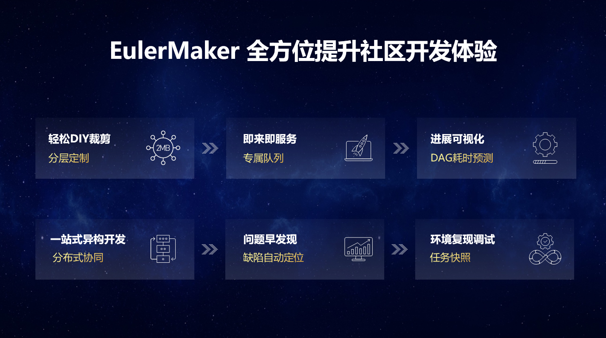
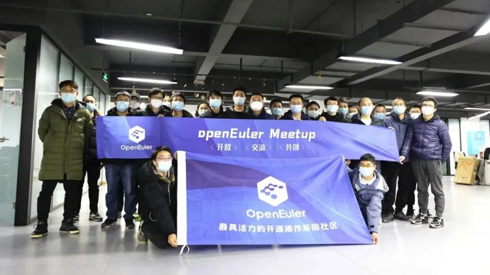
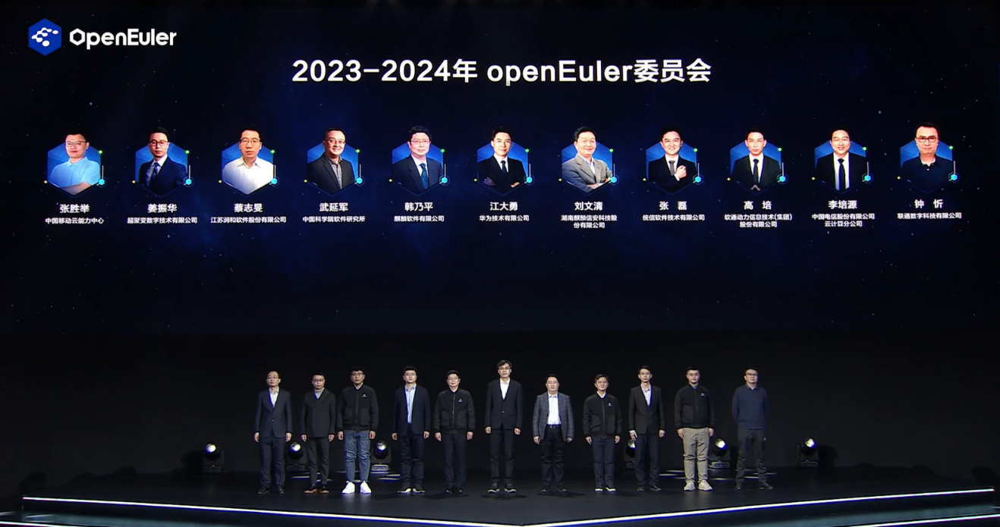
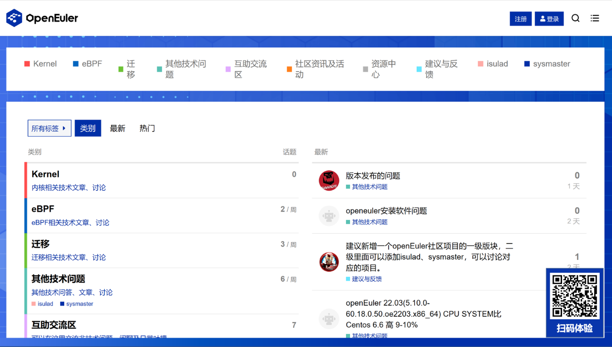
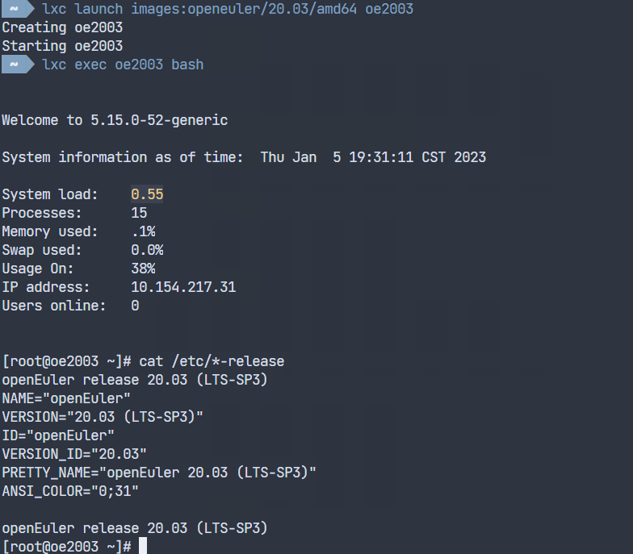
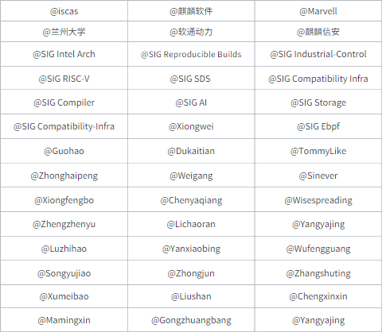

社区活跃度 
==========

在社区所有开发者和用户的共同参与下，openEuler的3年持续并发活力！从0到超过1.27万名开发者，从0到超过100万的社区用户，从0到超过750家企业伙伴加入社区……截至目前，在大家的持续贡献下，openEuler累计产生
48.8K 条Issue、89.6K 个PR。

社区贡献看板（截至2023/1/06）

社区大事件 {#社区大事件 .ListParagraph}
==========

### 操作系统产业峰会 & openEuler Summit 2022 {#操作系统产业峰会-openeuler-summit-2022 .ListParagraph}

2022年12月28-29日，操作系统产业峰会 & openEuler Summit 2022
于线上举行。大会以“立根铸魂，崛起数智时代”为主题，汇聚全产业链力量，聚焦基础软件核心能力构建，引领基础软件持续创新。

**openEuler项目群成立，进一步接轨国际开源社区**

2022年12月29日，在openEuler Summit
2022上，**开放原子开源基金会孙文龙理事长宣布openEuler项目群成立**。

2021年11月9日，openEuler正式贡献给开放原子开源基金会，在基金会的治理框架下，openEuler作为运作最为规范和成熟的项目，首批批准成立项目群，项目群的成立标志着**openEuler达到正循环自加速的开源项目治理水平，进一步接轨国际开源社区**。

项目群更加有利于引进、孵化新项目，并促进这些项目之间的相互融合和协同发展，成为全球操作系统领域一支重要的创新力量。

### openEuler商业装机量破300万套，跨越生态拐点 {#openeuler商业装机量破300万套跨越生态拐点 .ListParagraph}

在Summit 2022上，openEuler 展示了开源3年的跨越式发展。

截至目前，openEuler累计装机量超过300万套，中国服务器操作系统新增市场份额超过25%；**openEuler已构筑了关键的技术根基和创新机制，并实现规模部署在各行各业核心系统，形成商业的正循环**；打通了从处理器、整机、OSV、ISV的完整产业链生态，充分激发产业链活力。从技术创新，到加速用户规模部署，伙伴商业成功反哺社区贡献，加大技术创新投入，从而形成一个**正循环，自加速的生态发展体系**。

*立根铸魂，崛起数智时代，openEuler部署超300万套*

### 操作系统产业年度盛会，多重系列内容亮相 {#操作系统产业年度盛会多重系列内容亮相 .ListParagraph}

在本次操作系统产业峰会上，**2022年度openEuler领先商业实践奖项揭晓**、**中国科学院软件研究所联合多家机构和厂商发布基于openEuler的RISC-V商业发行版“傲来2.0-RV”**、**《中国软件根技术白皮书（操作系统册）》发布**、**openEuler&openGauss人才发展加速计划2022年度奖项公布**等系列重磅内容一一亮相。来自金融、运营商、能源、互联网等行业代表带来了精彩的openEuler商用案例实践分享。

*回顾 |  操作系统产业峰会 2022*

### openEuler & Friends 3.0 全场景联合创新 

开源以来，openEuler持续围绕用户实际使用场景进行全流程、全场景的技术创新。

峰会上，来自数据中心、云计算、边缘计算、嵌入式等主流场景的用户和开发者为大家带来了**openEuler
& Friends 3.0 Demo
Show**，**围绕上(高效迁移)、用(安全、稳定、高效的使用)、管(便捷运维)等全流程为观众们呈现了10场Live
Demo
Show**。他们通过展示openEuler创新技术项目在各领域中的实际使用效果，展现了openEuler的多样性算力支持、丰富的软硬件生态、强大的协同能力，以及openEuler社区与各伙伴的深度合作和繁荣的开发者生态。

*openEuler & Friends 3.0 全场景联合创新*

### 面向全场景的操作系统构建服务发布，共同建设全场景OS生态

海量的多样性设备与场景，带来了总体成本线性增加等挑战，要求解决各场景OS生态碎片化、烟囱化问题，使能OS社区伙伴有效协同，形成合力。

2022年12月29日，在2022峰会上，openEuler技术委员会委员吴峰光发布**面向全场景的操作系统构建服务EulerMaker**，可根据不同业务场景，像搭积木一样快速构建定制化操作系统，减少重复适配，提高构建效率。在共享openEuler统一技术基座的基础上，实现社区多方协同演进，聚合全场景OS生态。

### 年度“欧拉之星”颁发，携手开启openEuler新征程 

openEuler社区的发展，离不开每一位贡献者在社区的专业和辛勤付出。为感谢和激励更多个人和团队开发者参与到社区贡献，设立致敬数学家欧拉的“欧拉之星”奖项。2022峰会上，社区向突出贡献者及团队颁发2022年度“欧拉之星”个人奖、团队奖。

### openEuler 3周云生日会，14个城市分会场与海内外开发者连线发起祝福 

2022年12月31日，openEuler
3周年生辰，社区收获了来自世界各地开发者的祝福。北京、深圳、南京、成都、西安、杭州、长沙、东莞等14个城市分会场共同连线，上千名海内外开发者同时为openEuler庆生，感谢大家对openEuler支持与热爱！

### openEuler Meetup 长沙站 

2022年12月23日，由openEuler社区和湖南欧拉生态创新中心主办，麒麟信安和湖南省鲲鹏生态创新中心协办的openEuler Meetup 在长沙举行。活动集聚社区开发者、用户、企业伙伴、操作系统爱好者，围绕操作系统搬迁进行交流和实践，并正式发布《湖南欧拉生态发展白皮书》；同时，openEuler长沙用户组成立。

社区治理
========

### 新一届 openEuler 委员会亮相，社区进入开源治理新阶段 {#新一届-openeuler-委员会亮相社区进入开源治理新阶段 .ListParagraph}

在基金会指导下，openEuler项目群完成治理章程，启动定向捐赠，并成立了新一届openEuler委员会，新一届委员会成员在openEuler
Summit2022上正式亮相。openEuler社区委员会将严格履行职责，制定社区发展战略和目标，为实现全球领先的操作系统愿景，共启openEuler新征程。

2023-2024 年 openEuler 委员会

https://www.openeuler.org/zh/community/organization/

### 廖湘科院士、王怀民院士正式接受openEuler社区的邀请，成为openEuler社区顾问专家委员会成员 

openEuler社区顾问专家委员会旨在邀请产、学、研、用专家。为欧拉的发展出谋划策，不断提高欧拉技术的领先性，加速欧拉社区与全球开源界的融入与协同。**廖湘科院士将推动基础软件根技术的研究**，**王怀民院士将推动“开源基础设施”的发展**，未来这些研究成果也将落地openEuler社区。欢迎越来越多的专家加入到openEuler社区的大家庭，共同为操作系统创新贡献智慧。

openEuler 技术委员会 {#openeuler-技术委员会 .ListParagraph}
--------------------

### 2023年openEuler社区技术委员会新增2位委员 

2022年12 月 4 日，openEuler 技术委员会举行 2023
年技术委员会增选。社区通过推举产生了候选人，在选举过程中，经过候选人自我陈述、提问答辩、现任委员投票等环节，**来自
Intel 的田俊和来自 天翼云 的
胡亚弟成为新的技术委员会委员**。经过这次增选后，openEuler
社区技术委员会已经达到 21 人。

2023 年，技术委员会仍将坚持初心，为 openEuler
社区的进一步发展贡献力量，也欢迎社区全体开发者的关注和监督。

### SIG Industrial-Control提出将嵌入式虚拟化方案Jailhouse引入到openEuler社区 

2022年12月， SIG Industrial-Control
Maintainer郭皓在TC例会上提出了嵌入式虚拟化方案Jailhouse引入到openEuler社区的观点，并由麒麟软件和菁蓉联创科技共同维护。

Jailhouse 是西门子开发的一个基于 Linux
系统的以静态分区技术为方案的开源虚拟机监视程序。它不仅能够运行包含
Linux、RTOS在内操作系统，还能运行Baremetal应用程序。它与Xen和KVM虚拟化管理软件不同，不支持硬件资源超售，而是通过配置文件对硬件平台的
CPU
、RAM和外设进行静态划分，使这些OS（域）以相互独立的方式运行。Jailhouse借助于Host
OS（Linux）系统对硬件资源进行初始化，从而省去设备虚拟化的支持代码。Jailhouse一旦被激活，就会以Firmware的形态裸机运行在ARM架构下的EL2态，通过ARM架构特性对内存、中断等资源进行预干涉。

在TC会议上郭皓对Jailhouse引入openEuler社区进行了规划：在嵌入式场景中引入Jailhouse，形成meta-Jailhouse仓，与此同时引入meta-FreeRTOS、meta-Zephyr、meta-Industrial（工控协议），基于上述特性，并以Embedded
SIG和Yocto
SIG为基础，对面向工控OS的GearOS进行重构，使之能够运行在鲲鹏920、飞腾、瑞芯微RK3399等主流国产平台和树莓派4B、NXP等国外主流平台。

技术进展 {#技术进展 .ListParagraph}
========

### SIG Reproducible Builds 

目前，软件供应链安全被提到了前所未有的高度，可重复构建（Reproducible
Builds）是证明软件供应链安全的必要手段。

SIG Reproducible
Builds主要工作在于持续使openEuler构建的软件能达到可重复构建的目标。为此，我们通过一系列开源工具，构建包含了差异消除、结果对比、整体看板的完整工具链。

-   libfaketime：差异消除工具,将环境变量LD\_PRELOAD设置为在编译之前预加载\`差异消除库文件\`之后，该库将拦截系统时间的调用以确保编译状态的一致性。

-   Unpacker：对比二进制checksum，在不一致时，解压软件包。

-   diffoscope：以html格式输出差异报告。

当前，SIG Reproducible Builds完成openEuler22版本
Level0.5\~3，在OBS上成功编译1848软件仓，其中1816仓可重复，重复率98.3%，SIG将讲持续投入openEuler可重复构建。

openEuler SIG Reproducible Builds
工作已获得国际可重复构建组织（https://reproducible-builds.org/）认可，于2022年11月正式加入组织：https://reproducible-builds.org/citests/

详细技术方案请关注我们的项目地址，我们也欢迎有兴趣的小伙伴加入：

https://gitee.com/openeuler/reproducible-builds

### Marvell 发布了对openEuler 20.03 LTS SP3/22.03 LTS版本的驱动 

Marvell
作为一家业界领先的半导体解决方案厂商，加入openEuler社区后，Marvell深度参与了社区兼容性SIG和存储SIG的工作，积极推动Fibre
Channel HBA
、NVMe/SATA/SAS控制器驱动等方向的技术创新及适配。Marvell目前完成了Fibre
Channel HBA 驱动建仓，并合入了Marvell USCM 特性、FPIN
拥塞控制协议优化等，发布了针对openEuler 20.03 LTS SP3/22.03
LTS版本的驱动。

**SIG Compatibility Infra **

https://www.openeuler.org/zh/sig/sig-detail/?name=sig-Compatibility-Infra

**qlogic FC 芯片驱动仓库**

https://gitee.com/src-openeuler/qla2xxx

### SIG RISC-V桌面软件性能获得大幅优化 

SIG RISC-V择日即将发布 openEuler RISC-V 22.03 V2
版本镜像。据悉本次发版会提供带有 Spidermonkey JIT 编译支持的 Firefox
最新版本供使用者选装测试，并且将支持新的开发板荔枝派 Lichee
RV。新镜像也为依赖软件渲染的设备和系统测试性引入图形性能修复。

-   SIG RISC-V提前将软件所 PLCT 实验室开发的 Spidermonkey 的 JIT
    补丁合并在本次升级的 108.0.1 版本 Firefox 中。 经过 Kraken benchmark
    测试，开启 JIT 之后，JavaScript
    程序的运行速度提升最高达到解释执行的40倍，是目前 “ RISC-V 领域最快的
    Firefox ”。

-   Lichee RV 搭载全志 D1 主控芯片（平头哥玄铁 C906 单核
    1GHz），根据种类不同拥有 512\~2G 内存和 HDMI、2.4G
    WiFi&BT、SPI、USB、GPIO 等多种外设。Lichee RV 和全志 D1
    基于同一种内核，采用了二合一镜像。

-   目前常用的 RISC-V 开发环境 QEMU
    与市面上各种开发板图形设备或能力，经常需要依靠 LLVMpipe
    进行软件渲染，桌面的整体流畅度受图形性能掣肘停留在一个比较低的水准。22.03
    V2 版本的软件源中测试性引入了 PLCT 实验室基于 LLVM OrcJIT 开发的
    Mesa LLVMpipe 修复补丁，解决了这个长期的性能短板。

### 软通动力贡献了基于Ceph的ISCSI接口支持 

软通动力贡献了基于Ceph的ISCSI接口支持，通过引入ceph-iscsi和tcmu-runner，使ceph支持原生iscsi接口,同时也支持iscsi高级功能，比如多路径（A/A,P/A），VAAI接口等，可以兼容基于IP/FC-SAN的遗留应用程序场景需要，同时也扩展了ceph的应用场景，比如支持作为传统视频监控存储后端、裸机挂载、替换IP-SAN存储,多路径等。

近期，软通动力推出的企业版服务器操作系统通过openEuler社区OSV技术认证，成为社区当前18家商业发行版厂商之一。

**相关链接：**

\[1\]https://gitee.com/src-openeuler/ceph-iscsi/pulls/1

\[2\]https://gitee.com/src-openeuler/tcmu-runner/pulls

\[3\]https://gitee.com/openeuler/community/pulls/4172

### SIG AI tensorflow 支持 Intel AMX 

AMX 指令的全称是 Advanced Matrix
Extensions，是英特尔的第四代英特尔至强可扩展处理器上引入的全新的加速引擎，通过指令集层面的支持来加速深度学习算法中的张量计算。

AMX支持的基本数据类型是Bfloat16和INT8，理论上AMX-INT8的峰值性能相比AVX512-VNNI有8倍的提升，AMX-BF16的峰值性能相比AVX512-FP32（AMX暂未支持FP32数据类型）有高达16倍的提升。

由于AMX是针对低精度的数据类型进行加速，需要通过AI框架（如Tensorflow）打开混合精度，才能调用到oneDNN中AMX指令加速的算子。

目前的openEuler-22.03-LTS-SP1中，
AMX相关的内核补丁已经后向移植到openEuler的5.10内核。AI相关软件oneDNN和Tensorflow已经升级到支持AMX的版本，可以有效帮助用户在AI相关的工作负载中使能AMX指令集加速性能。

**相关链接：**

\[1\]https://gitee.com/openeuler/release-management/issues/I609I2

\[2\]https://gitee.com/src-openeuler/tensorflow/pulls/63

\[3\]https://gitee.com/openeuler/QA/pulls/332

### openEuler 引入 eunomia-bpf 项目 

自openEuler SIG
eBPF成立以来，SIG组的开发者们一直积极推进该技术的应用和发展。2022年12月，openEuler引入eunomia-bpf
项目，进一步促进社区技术生态的繁荣。\
eunomia-bpf 由一个编译工具链和一个运行时库组成, 对比传统的 BCC、原生
libbpf 等框架，它大幅简化了 eBPF
程序的开发流程。在大多数时候，开发者只需编写内核态代码，即可轻松构建、打包、发布完整的
eBPF 应用，同时内核态 eBPF 代码保证和 libbpf, libbpfgo, libbpf-rs
等主流开发框架的 100% 兼容性。需要编写用户态代码的时候，开发者也可以借助
Webassembly 实现通过多种语言进行用户态开发。

和 bpftrace 等脚本工具相比, eunomia-bpf 保留了类似的便捷性,
同时不仅局限于 trace 方面, 可以用于更多的场景, 如网络、安全等等。

**相关链接：**

https://gitee.com/openeuler/community/pulls/4357

### 兰州大学NSG实验室向社区贡献安全技术科研项目 

兰州大学NSG实验室在openEuler社区创建“lzu-icc-nsg”仓库，该实验室团队致力于安全技术科学研究与实现，已在本仓库贡献了团队在使用secGear面向openGauss安全性开展的研究成果，未来将继续结合自身针对secGear的科研，完善相关项目的同时，继续将项目发布到本仓库。同时也会积极引导本校学生对开源的兴趣，共同投入到该项目的研究创新。

**相关链接：**

https://gitee.com/openeuler/community/pulls/4360

基础设施 {#基础设施 .ListParagraph}
========

### openEuler社区论坛公测 

近期，社区基础设施团队上线openEuler社区论坛服务 https://forum.openeuler.org/ ，社区用户、开发者均可以在论坛上发表相关的技术话题、博客、社区活动、文档资源等，感兴趣的朋友也可以在相关的帖子下发表意见与看法，参与话题讨论。欢迎大家试用。

**openEuler社区论坛**

### openEuler 22.09的WSL上架Windows应用商店 

openEuler最新创新版本22.09的WSL已经上架Windows应用商店，欢迎大家前往使用。有任何建议或疑问，可以通过
QuickIssue 或 社区论坛服务 反馈。

**QucikIssue**

https://quickissue.openeuler.org/zh/issues/

### openEuler LXC镜像 

openEuler
LXC镜像现已上架LXD社区官方镜像仓库，用户和开发者通过LXC命令即可快速体验openEuler。

LXD用于管理和分发Linux系统容器的工具，通过LXD工具，可以快速启动一个openEuler系统容器，提供完整的体验openEuler使用体验。

https://linuxcontainers.org/lxd/introduction/

软硬件兼容性清单 
================

截止 2022年12月份，当前兼容性方案**454**个，其中北向 **313**个，南向
**93**个，OS **48** 个；12月新增北向 **106**个，南向 **7**个，OS
**9**个。

**社区兼容性清单**

https://www.openeuler.org/zh/compatibility/

安全公告 
========

2022年12月共发布安全公告**47**个，修复CVE漏洞**71**个（其中 Critical
**6**个，High **27**个，其它 **38**个），公告不受影响CVE **24**个。

**openEuler安全公告**

https://www.openeuler.org/zh/security/safety-bulletin/

感谢每一位朋友、开发者的支持 
============================

openEuler的发展离不开每⼀位贡献者的辛勤付出。可以说每一天，openEuler社区都发生着好的事情，那些熠熠生辉的时刻，是大家努力的成果。

小编限于视野和能力，难免有所遗漏，在此表示歉意。同时，衷心感谢以下社区朋友、openEuler
SIG组成员以及开发者们对本月月报的贡献：

\* 以上不分先后顺序

如果您希望在月报中增加您的工作内容，或对内容有任何改进建议，[*请联系wengqiaozhen@openeuler.sh*](mailto:请联系wengqiaozhen@openeuler.sh)。

**- END -**

