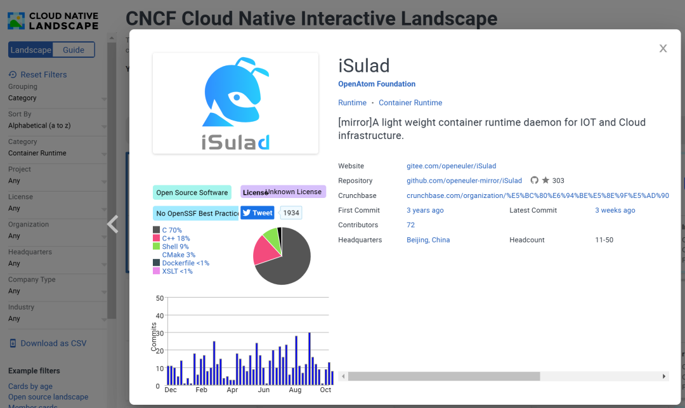
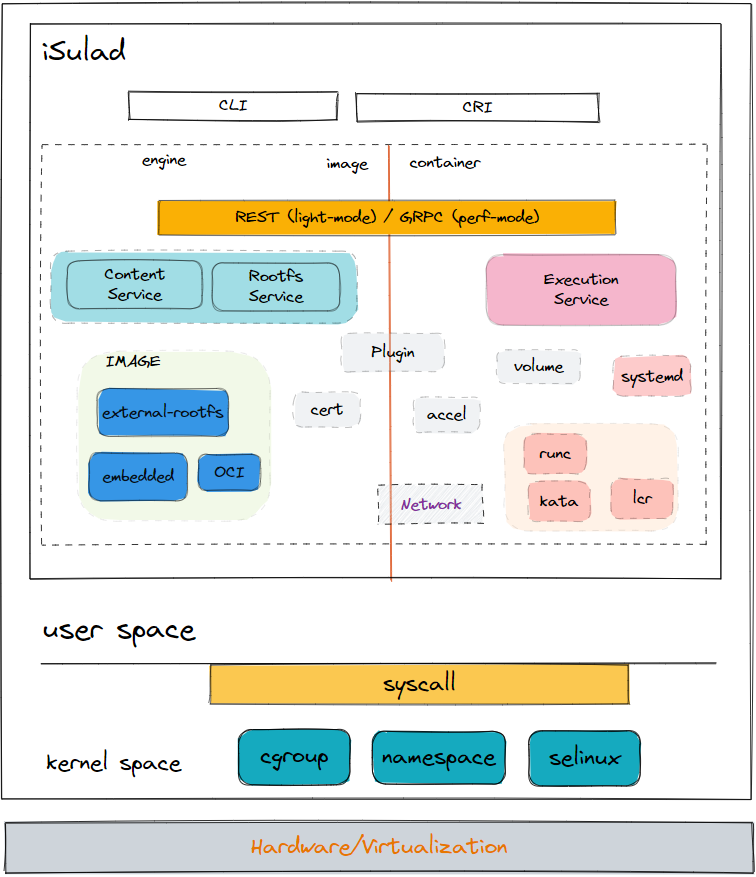

北京时间2022年12月5日，iSulad 加入 CNCF
Landscape，从属于 container-runtime 分类：

[*https://landscape.cncf.io/card-mode?category=container-runtime&grouping=category&selected=i-sulad*](https://landscape.cncf.io/card-mode?category=container-runtime&grouping=category&selected=i-sulad)

iSulad是开放原子开源基金会旗下容器引擎项目，由华为庞加莱实验室发起，
于2019年在 openEuler
社区开源。相比之前的容器引擎方案，iSulad具备高性能、低开销、多场景支持等优点。为了更好地丰富云原生生态、以及打通开放原子基金会和
CNCF 基金会的联系，开放原子基金会推动 iSulad 加入 CNCF Landscape。

**iSulad 简介**

iSulad 是 openEuler
开源的新一代容器引擎解决方案，相比其他解决方案，具有如下特点：

-   iSulad 使用 C/C++ 语言实现；

-   具备**轻、灵、巧、快**等特点；

-   不受硬件规格和架构限制；

-   应用**场景更为广泛**（云、终端、嵌入式等）

**CNCF Landscape 是什么**

CNCF 是 "Cloud Native Computing Foundation" 的缩写，中文译为
“云原生计算基金会”，是Linux基金会下的基金会。该基金会致力于推动云原生计算技术和生态的发展，其愿景为**MAKE
CLOUD NATIVE UBIQUITOUS**。

为了更好的管理和推广云原生生态，CNCF 成立 Landscape
项目，旨在成为**云原生技术**未知领域的**全景图和路线图**，尝试对云原生相关项目和产品进行**分类**。进而为云原生应用开发、部署，提供一条较优的**路线图**。

截至2022年12月5日，CNCF Landscape
汇集了 **1187** 个项目， **3476757** 个
stars，市值 **20.5万亿** 美金，资金** 553亿 **美金。

**生态合作**

iSulad是开放原子开源基金会旗下项目，该项目由华为庞加莱实验室发起，麒麟软件等多家社区伙伴共同参与。同时融入了中国移动IT等不同行业客户在容器引擎方面的经验，可以为各企业提供有效的落地指导与帮助，企业通过iSulad有效提高集群的容器管理性能、以及提高集群容器密度，同时可以满足多场景的使用。

—— openEuler技术委员会主席 胡欣蔚

iSulad相较行业内其它容器引擎，具有性能更好，底噪更低的特点，为我们磐基PaaS平台双平面建设提供了新的方式。中国移动将持续参与iSulad社区的开发和管理工作，结合自身在运营商行业经验，在功能性、稳定性上输出自己的研究成果，贡献到开源社区，与业界一起，推动自主创新发展。

—— 中国移动信息技术中心 平台能力中心总经理 白国涛

麒麟软件一直保持与多方开源社区的紧密合作，并乐见在与openEuler这一优秀社区的合作当中应用并商业落地多种新型技术。其中iSulad作为openEuler推出的云原生场景轻量化容器运行时优秀代表，麒麟OS深入理解云原生技术背景，参与iSulad项目开发，打磨其技术核心，将iSulad成熟技术融入商业版服务器OS中，并在机密计算，安全容器，轻量化容器解决方案当中丰富和加强落地场景和价值。未来麒麟软件将持续参与以isulad为代表的openEuler社区云原生技术孵化，丰富整个云原生开源社区生态，积极推进商业落地，扩大中国操作系统基础软件核心技术的影响力。

—— 服务器研发部技术总监  侯健

**未来可期**

目前，iSulad
已在华为内部多个产品线商用，并依托openEuler社区在多家来自航空、电信、云、金融企业落地。

此次加入 CNCF Landscape，将极大促进 iSulad
社区的推广及合作，吸引广大云原生企业用户深度参与，iSulad
将持续在容器引擎领域发挥越来越重要的作用，openEuler
也将在云原生领域持续耕耘、持续引领创新、繁荣生态，助力各行业走向快速智能发展之路。
