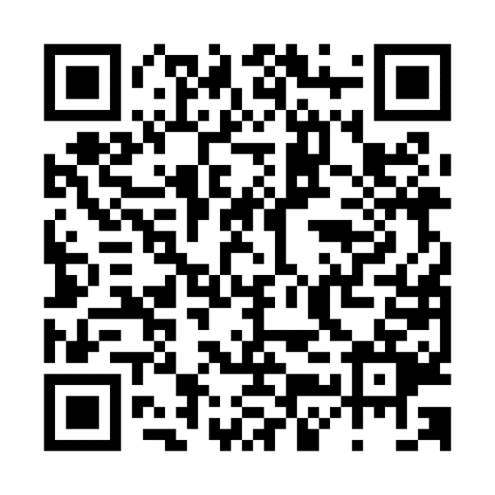
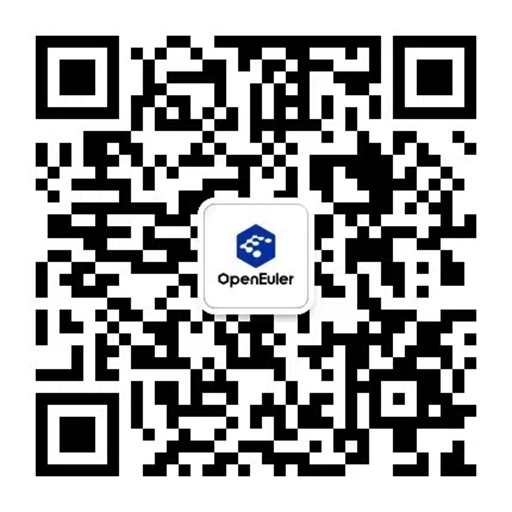

亲爱的openEuler社区SIG组贡献成员们，你们好！

在Celebrating 3 years of openEuler
云上生日会上，openEuler年度开发者贡献报告新鲜出炉，我们收到了社区开发者们大量的正能量分享截图反馈，那些一点一滴的细节，编织出了我们在openEuler的美好回忆。

这份与openEuler的年度独家记忆，也少不了openEuler社区SIG组成员们，开源3周年，开发者们已在openEuler社区成立了近百个SIG组。在SIG组中，各个成员分工管理和工作，让社区小伙伴们能够更好地交流，参与社区贡献，感谢openEuler
SIG组成员们的辛勤付出，社区特开展了面向SIG组的三周年回馈礼。

 让我们来看看今年的三周年定制礼包都有什么吧～

，时长00:39

**活动对象：**

1\. openEuler社区SIG组贡献成员（Maintainer、Committer、Contributor）

2\. 参加社区贡献的开发者

**活动时间：**

2023年1月11日-2023年1月15日

**领取方式：**

1、扫描二维码生成贡献者报告并分享到朋友圈或开发者交流群。

2、**每个SIG派1位申领代表**收集该SIG贡献成员的【年度贡献报告】朋友圈/开发者社区交流群分享截图，将截图文件压缩发送至openEuler小助手微信（微信号：openeuler123），同时扫描下方二维码填写收件信息，小助手验收通过后将在2023年1月19日之前安排寄送给该SIG的申领代表。

3、由SIG的申领代表安排给组内符合活动对象条件的成员分别寄送礼包。SIG组内贡献成员请发送【年度贡献报告】朋友圈/开发者社区交流群分享截图给该SIG的申领代表领取礼包。

有申领疑问的请咨询openEuler 小助手：

 openEuler 小助手微信
