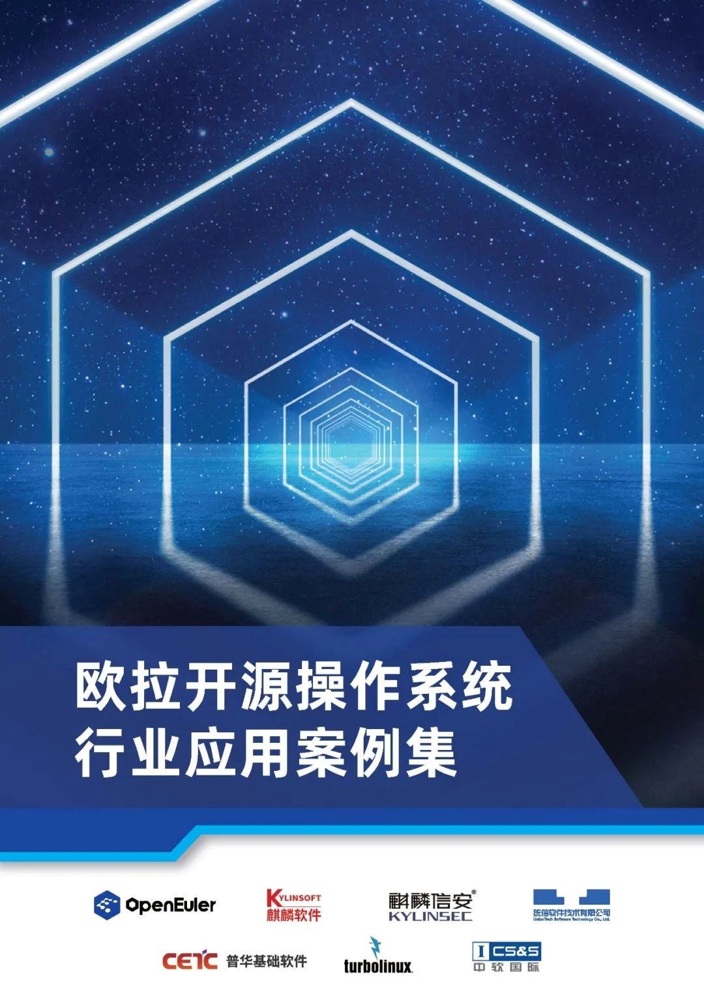
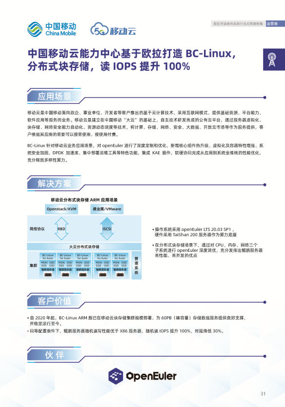
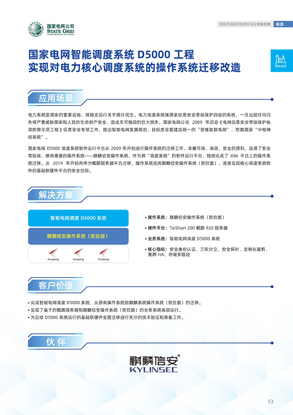
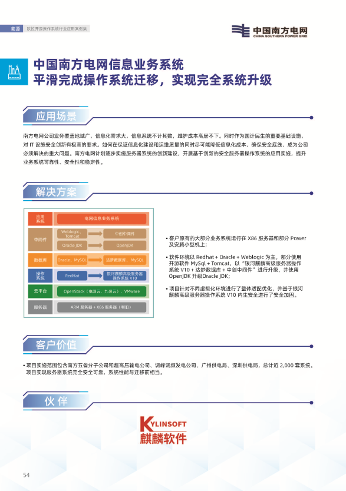
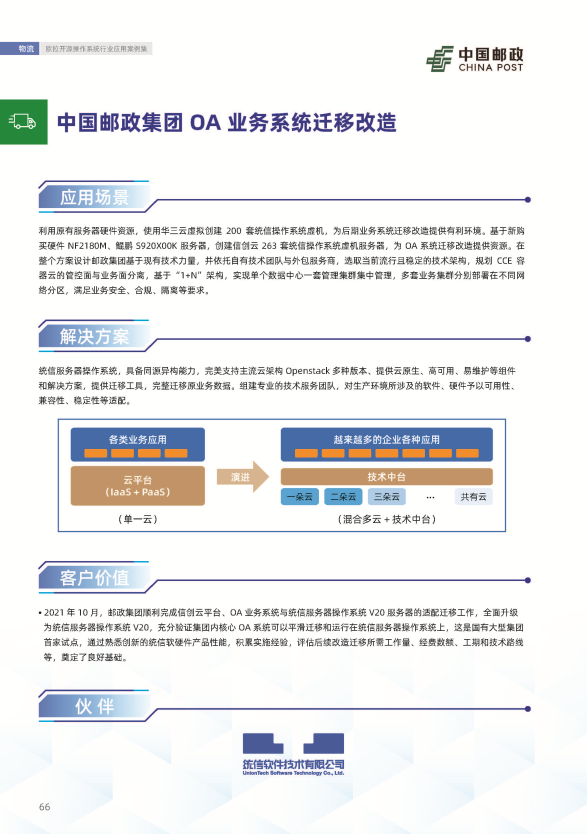
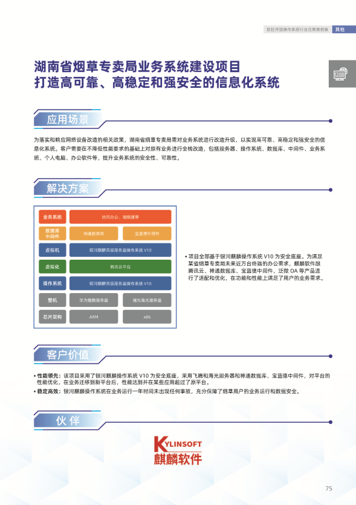

2022 年，openEuler 累计装机量超过 300 万套，服务器操作系统新增市场份额超过 25%，进入第一梯队，跨越生态拐点。openEuler 取得这样的成果，离不开规模部署 openEuler 的用户。为了展示 openEuler 在千行百业中的最佳实践，openEuler 社区正式发布《欧拉开源操作系统行业应用案例集》2022 第四季度刊。

扫码下载

精选案例截图

欢迎大家申报 openEuler 用户案例，要求如下：

1.	《欧拉开源操作系统行业应用案例集》是公开发布材料，openEuler 社区中的企业可以在任何会议中使用该案例集中的内容。

2.	《欧拉开源操作系统行业应用案例集》每个季度收集一次，采用增量更新的方式，下一季度的第一个月发布上一个季度的案例，例如：2022 年 Q4 的案例会在 2023 年 1 月份发布。

3.	提交案例即视为获得客户授权。案例要求有明确的客户名称和使用场景。

4.	《欧拉开源操作系统行业应用案例集》申请表请发邮件到 chengxinxin@openeuler.sh 获取。

