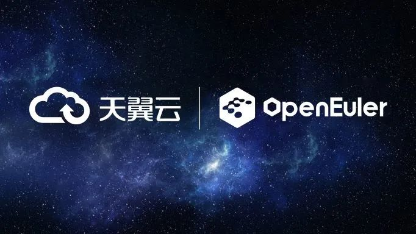

在近日举行的2022年操作系统产业峰会上，由国家工业信息安全发展研究中心、OpenAtom
openEuler社区发起的"2022年度openEuler领先商业实践"大奖公布了评选结果，中国电信天翼云基于openEuler自研的操作系统CTyunOS在应用规模、示范推广价值、技术领先性三个维度上表现突出，成功入选十大"2022年度openEuler领先商业实践"。

CTyunOS是在2021年操作系统产业峰会上正式发布的。\
这款操作系统采用了欧拉内核，中国电信天翼云自主开发了虚拟化增强组件、云平台组件、编译器工具链和开发环境等，是针对云计算场景进行深度优化的定制增强版。CTyunOS充分融入了欧拉内核以及openEuler社区的优势，具有高性能，高可靠，强安全和易扩展的特点。\
近年来，中国电信积极打造自主创新的云基础设施，自主研发并规模部署基于openEuler的CTyunOS就是一个重要的努力方向。\
为加快CTyunOS的部署进展，中国电信通过与openEuler社区联创的方式，在2022年提供了完备的迁移方案，包括成立迁移保障组织、迁移分析、方案设计、移植适配、搬迁实施和测试上线六个阶段，同时借助x2CTyunOS迁移评估和原地升级技术，实现了全场景业务的"简单、平稳、高效"替换。\
通过x2CTyunOS迁移评估技术，对软件、硬件、配置的兼容性情况给出全方位的分析，保证业务的平滑迁移。通过x2CTyunOS的原地升级技术，一键式将存量CentOS升级到CTyunOS，升级前后上层业务无需重新部署，参数无需重新配置，大大降低了升级时长。原地升级技术将单节点的升级时长控制在2小时以内，最大程度的减少升级对业务的影响。\
完全自主研发的CTyunOS不仅可以为中国电信云网边端各个环节提供稳定、安全可靠的技术支持、漏洞修复等服务，还通过持续投入内核、核心编译工具链等开发，迭代支持国产化芯片及硬件，有力促进基于openEuler的操作系统成长壮大。\
中国电信天翼云多年来一直在与openEuler社区围绕关键技术开展联合创新。比如CTyunOS紧跟社区版本节奏，每六个月发布一个正式版本；中国电信天翼云参与了社区超过5个技术工作组，累计提交关键需求200余条。\
此外，中国电信天翼云还在系统内核、云关键技术、热补丁等方面自主研发了一些关键成果。比如经过中国电信天翼云技术团队的改进，CTyunOS内核多个关键性能指标全面提升，相比CentOS7.6的CPU调度时延降低了约5%，存储关键路径每秒读写次数提升了约3%，容器部署密度也提升了约3%等。\
中国电信团队还在openEuler社区内首发内存分级功能，可以有效降低云业务场景下服务器的成本；首创bond6增强特性，第一次解决了IPV6
无法正常使用bond6的行业难题。\
在安全方面，CTyunOS联合openEuler社区发布行业首个支持鲲鹏芯片的用户态热补丁工具，也是首个支持g++18特性的补丁工具，并贡献给openEuler社区，当前已实现线上20000+热补丁修复。此外，中国电信天翼云还与国内主流服务器厂商联合开展适配工作，为openEuler技术的大规模普及应用打通了道路。\
目前CTyunOS已适配了天翼云基础设施服务(IaaS)云平台的计算、存储、网络、管理等节点，可作为服务器操作系统、虚拟化云主机操作系统使用，能够支持大数据，数据库、web服务等场景。在部署了全栈端到端优化的CTyunOS系统之后，中国电信天翼云综合业务性能提升了10%以上。\
中国电信介绍，自CTyunOS发布以来，在全国已上线部署5万余套，支撑了公有云、私有云、IT上云和一城一池等多种业务场景，运行稳定可靠，实现了云网全场景覆盖。\
未来中国电信会进一步扩大CTyunOS的部署规模。中国电信一方面会在未来两年将天翼云全场景迁移至CTyunOS，形成全栈技术自主掌控云网基础设施；另一方面，将继续携手openEuler社区，在云原生、云网安全以及CDN等方面，深入开展研发创新合作，协同推进基础软件产业发展、生态繁荣，也促使天翼云技术体系加快成长，更加丰满、茁壮。
