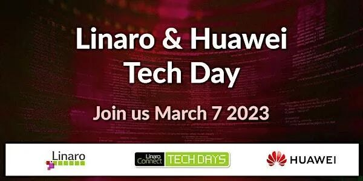

欢迎来参加华为和 Linaro 共同举办的最新开源技术日活动。

华为是全球领先的智能设备和信息通信技术供应商之一。华为和 Linaro
在开源项目上密切合作，行业涵盖广泛-从客户端设备到汽车、边缘计算和云计算等领域。

我们将于 2023 年 3 月 7 日星期二和华为一起谈论华为 & Linaro
合作的一些最新开源项目的进展和计划，欢迎加入我们的会议！

此线上活动的议程将包括有关 **「BigTop、Arm
CCA、Oniro、SVE、UADK、openEuler、Linaro Ecosystem Dashboard、Trusted
Reference Stack」** 等议题。

具体日程和注册网站信息如下：

## 演讲议题1：Introduction to the Tech Day

-   **「演讲嘉宾」**

    -   Grant Likely: CTO，Linaro

    -   Leonardo Garcia：Principal engineer，Linaro

    -   Jonathan Cameron: Huawei

-   **「演讲时间」**：2023 年 3 月 7 日 星期二，北京时间 16:00-16:15

## 演讲议题2：BigTop on openEuler

我们如何通过加入 Apache Bigtop 开源社区来提高 openEuler
的大数据覆盖率以及项目的进展报告

-   **「演讲嘉宾」**

    -   Guodong Xu：Tech Lead， Linaro

    -   Qiang Chen：Huawei software development engineer, openEuler sig
        sds maintainer

-   **「演讲时间」**：2023 年 3 月 7 日 星期二 北京时间 16:20-16:45

## 演讲议题3：Storage on Arm

**「BeeFGS 在 Arm AArch64 上的性能评估（Qinfei Liu）」**

BeeGFS 是业界领先的高性能并行文件系统，但是随着越来越多的服务器采用 Arm
SoC，必须要实现对 Arm 架构的支持。作者在 Arm 上实现了
BeeFGS，并推动本地社区来解决 Arm 上的问题，发布了支持 Arm 的 7.3.0
版本。另外，还在 Arm 集群上部署 BeeFGS 并完成性能优化。并证明可以达到
InfiniBand NICs 和 NVMe SSDs 的性能极限。

**「Lustre on Arm and openEuler ( Kevin Zhao/Xinliang Liu)」**

Lustre 是最受欢迎的 HPC 存储框架。对于 Arm64 企业市场来说，使 Lustre 在
Arm64 上可用和优化是不可避免的。通过与上游社区的合作，我们做了很多
Lustre on Arm64 的 bug 修复，建立了 Lustre CI 并维护 Lustre Arm64
版本。此外，我们还与 OpenEuler Sig-SDS 合作，在 openEuler 推出 Lustre
版本，这将使终端用户更容易获得 Lustre 支持。

-   演讲嘉宾

    -   Kevin Zhao：Tech Lead， Linaro

    -   Qinfei Liu：Senior development Engineer，openEuler sig sds
        maintainer Huawei

    -   Xinliang Liu：Senior Engineer，Linaro

-   **「演讲时间」**：2023 年 3 月 7 日 星期二 北京时间 16:50-17:30

## 演讲议题4：SVE Optimization on xxHash, Performance boost and Lessons learned

Scalable Vector Extension (SVE) 是 Armv8-A 架构的 A64
指令集的矢量扩展。Linaro 使用 SVE
提升了许多算法的性能。在这个演示中，我们解释了在 xxHash 和 ISA-L
上所做的优化。并列出了性能的提升。我们还进一步介绍了在开发过程中学到的经验教训，包括在不同的微架构上的调优。

-   **「演讲嘉宾」**

    -   Haojian Zhuang：Senior Engineer，Linaro

    -   Guodong Xu：Tech Lead，Linaro

-   **「演讲时间」**：2023 年 3 月 7 日 星期二 北京时间 17:40-18:05

## 演讲议题5：A Software Framework for Hardware Accelerators (UADK) and Status Update in 2022/2023

UADK（用户态加速器开发套件）是一套开源和免费的用户空间硬件加速器开发套件。旨在利用
SVA（Shared Virtual
Addressing）技术下的硬件加速器能力，对数据进行压缩解压、加密解密以及加速软件处理库。

SVA 技术可以在 mmu 和 iommu
之间共享页表，用户驱动直接使用虚拟地址为加速器使用 DMA，实现零拷贝。

-   **「演讲嘉宾」**

    -   Fei Zhang：Senior Engineer，Linaro

-   **「演讲时间」**：2023 年 3 月 7 日 星期二 北京时间 18:10-18:35

## 演讲议题6：QEMU-based Simulation Platform for ARM CCA

ARM CCA 代表了 ARM 在从事通用机密计算方面的最新工作。虽然 ARM
已经提供了一个 FSV 仿真平台来帮助在 ARMv9
平台上开发和测试应用程序，但还是缺乏一个基于 QEMU
的仿真平台来更好地调试。根据这一要求，我们开发了基于 QEMU 的 CCA
仿真平台。通过这个平台的支持，我们可以轻松的识别 Realm
应用程序中的设计错误。源代码也已向公众发布。

-   **「演讲嘉宾」**

    -   Yongzheng Wu，Senior Researcher Huawei

-   **「演讲时间」**：2023 年 3 月 7 日 星期二 北京时间 18:40-19:05

## 演讲议题7：Oniro and LAVA integration for the next level of CI/Testing

-   **「演讲嘉宾」**

    -   Davide Ricci，Director Open Source Technology Center，Huawei

    -   Stevan Radakovic：Senior engineer，Linaro

-   **「演讲时间」**：2023 年 3 月 7 日 北京时间 19:10-19:35

## 演讲议题8：Trusted Reference Stack

Trusted Reference Stack (TRS)
是一个云原生、组件化的通用平台，支持完全隔离和证明的工作负载。我们计划用简短的会议（约
30 分钟）对 TRS
做一个简要概述（包括其特性、合规性、测试等）。最后，本会议将提供 TRS
系统的 OpenAD 套件演示。

-   **「演讲嘉宾」**

    -   Leo Yan：Senior Engineer，Linaro

-   **「演讲时间」**：2023 年 3 月 7 日星期二 北京时间 19:40-20:05

## 演讲议题9：Linaro Ecosystem Dashboard（LED）: A Centralised Infomation Hub For All Arm Developers

Linaro Ecosystem Dashboard 是由华为和 Linaro 共同发起的 Arm
生态平台。为全球 Arm
开发者提供一站式信息展示，包括各领域开源社区的项目、Arm
生态适配状态、进度、补丁适配等信息。该项目旨在帮助 Arm 开发者和用户了解
Arm 生态的进展，并提高适应性和协作效率。Ecosystem Dashboard 目前涵盖了
130 多种软件产品，期待更多的开发者能够从中受益，并加入 Dashboard 对 Arm
生态系统做出贡献。

-   **「演讲嘉宾」**

    -   Jiawei Li: Senior Software Engineer Huawei

    -   Zhenyu Zheng：Senior Software Engineer Huawei

-   **「演讲时间」**：2023 年 3 月 7 日星期二 北京时间 20:10-20:35

微信长按识别二维码，进行注册！
