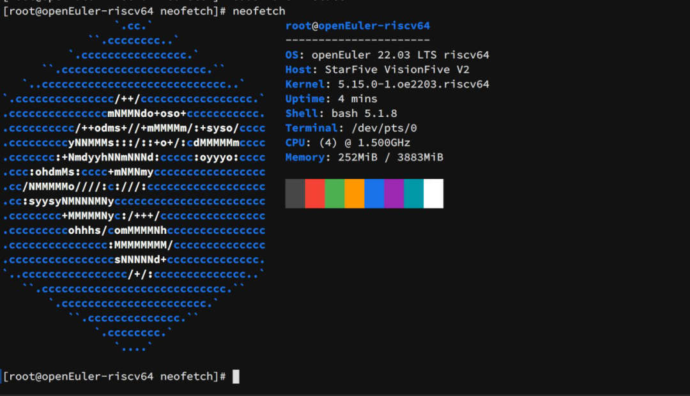
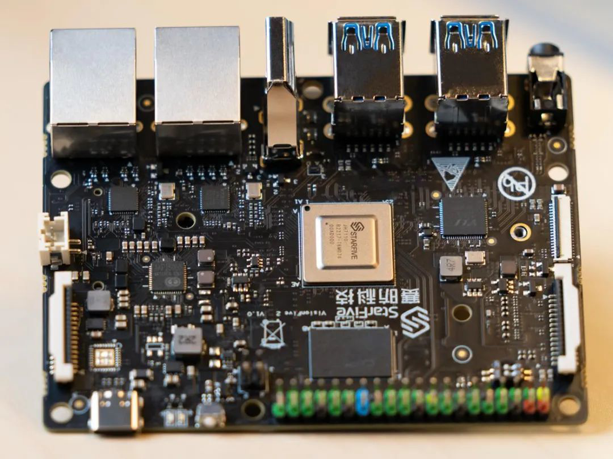

近日，RISC-V SIG 成功在 VisionFive 2
开发板上适配欧拉操作系统，目前最新版本的 openEuler RISC-V 22.03 V2
镜像已在 VisionFive 2 开发板上可用，这是 openEuler 推动 RISC-V
生态演进的又一新进展。

**下载链接**

https://mirror.iscas.ac.cn/openeuler-sig-riscv/openEuler-RISC-V/testing/visionfive2_20230209/

## VisionFive 2 已适配 openEuler 

openEuler RISC-V 面向 VisionFive 2
开发板的早期测试版镜像已经推出，当前可下载试用。测试镜像基于早先发布的
22.03 V2 版本，采用厂商开源固件与内核分支。经 RISC-V SIG
测试，基础系统、有线网络及其他几个部分目前已经可用，可以支持命令行系统基本功能，运行整体较为流畅。

目前也发现不少问题，需要注意的已知问题有：GPU 上游支持尚不完善，HDMI
输出与系统图形化界面暂不可用。目前只支持从 microSD 卡启动，eMMC 与 SSD
等启动方式亟待后续改进。部分外设可用性未知。

我们将继续完善系统功能，修复已知问题，计划在 V3 版本中提供更加完善的
VisionFive 2
镜像。感兴趣的伙伴和测试志愿者当前可以下载开发版镜像，帮助发现更多缺陷。有桌面显示等更高需求的用户可以等待
V3 版本。下方提供了 2 个版本的镜像下载地址，希望当前有 VisionFive 2
的小伙伴可以下载开发板镜像体验和测试，提供测试评论，共同助力提升 RISC-V
开发生态！

新鲜出炉的 VisionFive 2 的开发版镜像由此获取：

https://mirror.iscas.ac.cn/openeuler-sig-riscv/openEuler-RISC-V/testing/visionfive2_20230209/

未来的修订版本 V3 版本后续可以访问下面路径获取镜像更新：

https://mirror.iscas.ac.cn/openeuler-sig-riscv/openEuler-RISC-V/preview/

## VisionFive 2：集成3D GPU的 RISC-V SBC

VisionFive 2 是全球第一款集成 3D GPU 的高性能量产 RISC-V
单板计算机，它优越的性能与合理的价格使其成为更加普惠的 RISC-V
开发板。与上一代相比，VisionFive 2 在细节上进行了全面升级：

-   处理器配备赛昉科技推出的 JH7110，具有更加强大的 GPU
    处理能力和多媒体支持能力，搭载 64 位高性能四核 RISC-V
    CPU，稳定工作频率可高达 1.5GHz。板载的 Imagination BXE-4-32
    GPU，支持 OpenGL ES、OpenCL、Vulkan 等。

-   拥有丰富的外设接口，包括 HDMI，MIPI，USB3.0/2.0，两个 GbE
    以太网接口等，同时还提供 M.2 连接器、eMMC 插座、40 针 GPIO
    头等丰富的 I/O 外围设备，Type-C 接口支持 USB PD 供电。

**VisionFive 2：集成了 3D GPU 的 RISC-V SBC**

## 后续规划：推动 RISC-V 高性能应用持续落地

目前，VisionFive 2 的各项适配正在积极进行中，赛昉科技是 openEuler
社区成员，后续会继续紧密合作。随着欧拉开源操作系统与 VisionFive 2
的成功适配，RISC-V Lab 的基础设施将继续扩大和完善，服务于全球的 RISC-V
开发者，我们也将开发更多新功能以及移植最新的 openEuler RISC-V 版本镜像。

## 联系我们

如果您对 RISC-V 感兴趣，欢迎加入 RISC-V SIG 交流群，讨论更多关于 RISC-V
的更多内容，为推动 openEuler & RISC-V 生态贡献力量

**中科院软件所吴伟微信**

**添加请备注 oerv**

## 关于作者

杨延玲，中科院软件所 PLCT 实验室实习生，欧拉开源社区 RISC-V SIG
成员，目前在温州大学读研二，负责协助 RISC-V SIG 和 ROS SIG 的日常运营。

