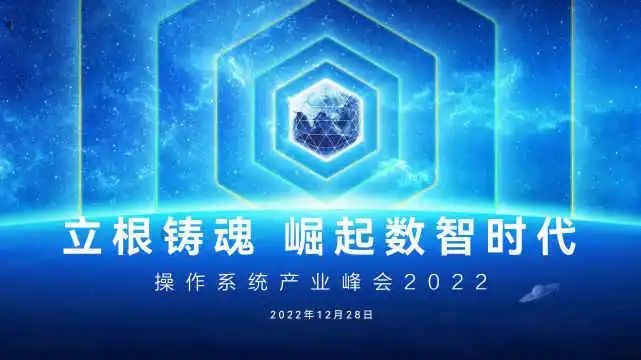

随着全社会数字化转型的加速，数字经济已经成为社会发展的主引擎，以原生自主操作系统为代表的软件根技术作为数字基础设施的核心组成部分，是技术创新和数智化发展的基石，与此同时，开源和生态建设正成为国产操作系统创新发展的主流模式。

2022 年 12 月 28 日，操作系统产业峰会 2022 正式召开，大会以"立根铸魂
崛起数智时代"为主题，邀请了来自联盟协会单位成员、院士和专家学者、操作系统领军企业、电信、金融等行业用户、开源社区代表等齐聚一堂，共同探讨操作系统、数据库发展趋势、分享商用案例实践、社区创新成果等，旨在聚集全产业链力量，聚焦基础软件核心能力构建，引领基础软件持续创新，加快实现高水平科技自立自强。

其中，作为运营商的代表，中国移动通信集团有限公司副总经理高同庆在主旨报告中不仅介绍了中国移动锚定世界一流信息服务科技创新公司的目标定位，更着重分享了大云天元操作系统自启动研发到以国内
openEuler
社区为基础的重要转变。演讲背后，以中国移动为代表的电信运营商正推动欧拉跨越生态拐点。

## 移动信息产业链"链长"下的"新目标"

当前，我们正处于信息文明时代，信息基础设施已成为信息传递的底座、能量转变的支撑、文明发展的载体，是新一轮科技革命的竞争高地与数字经济的核心引擎。

党和国家高度重视信息基础设施建设，提出加快建设高速泛在、云网融合、智能敏捷、绿色低碳、安全可控的智能化综合性数字信息基础设施。

作为运营商的排头兵，自 2016
年实施"大连接"战略以来,中国移动坚持"移动市场、家庭市场、政企市场、新业务市场"四轮驱动融合发展,其中政企市场保持高速增长,驱动作用愈发明显,不仅取得了丰硕成果,还在在垂直行业领域打造了一批解决方案,支撑全网行业市场拓展，成绩背后，移动云功不可没。

据中国移动年报显示，2021 年，移动云收入达到 242 亿元，同比大涨
114%，而移动云业务中，面向 B 端市场的行业云业务收入则达 192
亿元，同比增长 110%，较 2018 年同期更是增长了 13.8 倍。

无疑，信息网络正从以网络为核心的信息交换，逐步向以算力为核心的信息数据处理演进升级。汇聚全社会泛在算力资源推动网络与算力融合已是大势所趋，在新兴技术加速向传统行业融合渗透、数字经济发展的关键期，运营商更需持续不断释放自身价值，推动产业链快速实现数字化转型，共赢高质量发展。

对此，在锚定世界一流信息服务科技创新公司的新目标、移动信息现代产业链"链长"的新定位下，中国移动创新构建了"连接+算力+能力"新型信息服务体系，移动云大云天元操作系统作为针对移动云基础设施深度优化的企业级操作系统，成为构建"连接+算力+能力"新型信息服务体系的关键环节，迎来新一轮发展。

## 释放多样性算力下的"新发展"

操作系统是数字基础设施"定魂筑基"的关键，对于推动产业数字化、智能化转型发挥重要的基础支撑作用。

长期以来，在操作系统产业之中，服务器操作系统、云操作系统、面向通信和工业的嵌入式操作系统，云管边端由不同的操作系统构成了一个又一个的软烟囱，导致生态割裂、难以实现统一管理、融合调度、有效协同。

同时，随着数字孪生的发展，对于多样性算力的支持成为普遍需求，云、管、边、端数字全场景的打通成为数字基础设施操作系统的刚性需求，跨场景、跨终端、云驱动成为发展新趋势，产业对操作系统技术发展提出了新的挑战，需要操作系统实现多样性算力、全场景支持，使能数字世界全场景无缝协同。

作为面向数字基础设施的开源操作系统，欧拉通过一套操作系统架构，南向一套架构支持多样性设备，实现全量组件原子化可以根据设备不同的资源能力和业务需求，灵活构建不同的操作系统版本，来满足不同设备对于操作系统的要求;北向通过一套标准
API，支持 ICT 和
OT，实现操作系统与应用之间交互语言的统一，支持应用一次开发，覆盖全场景。

也正因这些优势，作为中国移动自主研发的企业级 Linux
操作系统，大云天元操作系统自 2015 年启动研发，在 2021 年完成以国内
openEuler 社区为基础的重要转变。

据中国移动云能力中心 IaaS 产品部副总经理张胜举介绍，
移动云操作系统团队与欧拉社区在内核、虚拟化、安全、容器等领域开展联合创新，进行了多项新技术的研究，开发了基于
openEuler 社区的 BC-Linux 欧拉版操作系统，BC-Linux
欧拉版针对移动云业务应用场景提供了多项功能增强和性能优化。

性能方面，大云天元操作系统与 openEuler
社区合作研发多个内核功能和性能优化，持续优化移动云性能体验。发布内存分级扩展特性，从迁移路径、冷热页等方面扩展主机内存、降低内存成本;业务混合部署，提升资源利用率，保障在线业务服务质量，同时最大化离线的吞吐率;存储分级加速，根据存储介质的不同时延提供多级存储，实现分级的
IO 淘汰和预取，提升 IO 性能。

虚拟化上，大云天元操作系统增强了虚拟化层能力，针对 KVM
进行了深度增强和优化，通过热迁移脏页率预测提升云主机热迁移成功率，研发
IO
悬挂功能减少云主机故障率，提升移动云用户体验，为移动云提供稳定、可靠、高性能的虚拟化运行环境。

安全可信上，围绕大云天元操作系统双方构建了国密技术栈，从底层固件，内核，到基础密码学库、应用，在主要链路上做国密支持改造，实现全栈国密解决方案;基于国产
CPU
架构平台，改造可信计算软件栈，推出云主机可信计算解决方案，提升虚拟化安全可信能力。协助移动云为
100 多万位移动云用户提供专业的安全防护能力，客户信息安全事件 0
发生，为用户提供灵活弹性、稳定可靠、安全可控、性能强劲、类型多样的算力服务。

据悉，张胜举长期从事基础软件和云计算技术研究，牵头中国移动操作系统和虚拟化产品研发工作，带领团队向
Kernel、Qemu、Libvirt
等开源软件社区贡献了大量代码，同时，作为负责人承担过国家重大科技专项、中国移动集团重大战略类研发项目等众多科研项目，担任中国移动云能力中心技术咨询委员会委员，openEuler
委员会委员，openAnolis
社区理事会理事，也正因丰富的工作经历，张胜举深知操作系统生态建设的重要。

张胜举指出，在加速技术攻关与产品研发同时，中国移动也高度关注操作系统开源生态建设，与
openEuler
社区一道，聚焦大数据、数据库、分布式存储等领域，赋能上下游业务产品创新，服务千行百业客户。

目前，大云天元操作系统以内核创新、安全可信、性能革新、自主开放等特点，支持龙芯、飞腾、鲲鹏、海光、兆芯等
6 大国产 CPU 平台的优势，在核心业务系统装机容量超过 13 万套，累计部署超
28 万套，对外订购超 7 万套，商用项目超 130
个，覆盖政府、金融、教育、医疗、工业、能源、交通、IT
制造等领域，主流场景实现了
100%的覆盖，以安全稳定的能力赋能数字经济，助力网络强国、数字中国战略建设。

## 开源下的操作系统"新拐点"

操作系统是软件技术体系中最核心、最关键的基础软件，是所有软件的基础，只有建立起强大的基础软件体系，才能满足数字经济发展的需要。

在笔者看来，开放开源是软件根技术创新，特别是发展操作系统基础软件的重要途径，充分利用开源，联合开发者、社区、软硬件上下游产业链企业，共同发展壮大国产操作系统产业是当前最为行之有效的路径。

自 openEuler
社区创立以来，中国移动一直积极与社区开展合作，深度参与社区建设，累计贡献补丁超过
130
个，同时承担社区理事会理事等重要任职。还与社区在内核、虚拟化、安全、容器等领域开展联合创新，进行了多项新技术的研究与开发，包括内存分级扩展、存储分级加速、业务混合部署、全链安全可信等技术。

目前，openEuler
在中国移动实现了业务全场景覆盖，包括网络云、IT、公有云、营销服务中心等，其中，在营销服务中心
openEuler 占比超 50%，综合性能提升 5%，成为 openEuler 全栈创新标杆。。

得益于中国移动的积极贡献，openEuler 在运营商行业实现了规模部署超 33
万套，在运营商行业操作系统新增市场份额第一，成为运营商行业操作系统首选技术路线。

值得关注的是，在 openEuler
社区全体成员单位和全体开发者的努力下，截至当前，欧拉共有
650+个企业加入，有 12000+名贡献者，组建了 99 个 SIG 组，装机量累计超过
300 万套，在中国服务器操作系统领域新增市场份额超过 25%，三年从零到
25%，欧拉正在成为中国操作系统的共同选择，成为中国数字基础设施坚实底座。

事实上，当前国内开源社区的基础设施仍面临开源社区基础设施碎片化、技术体系空白、缺乏行业标准等挑战，从参与融入到蓄势引领，崛起的开源产业需要强大的基础设施平台支持。

而开源的欧拉走出了一条既符合国际开源规则，又具备我国国情特色的基础软件发展道路，依托中国企业带头创建的开源社区，通过对众多根技术作出重要贡献，打造在世界市场份额位居前列的生态体系。

可以预见，面对数字化经济发展大潮，以中国移动为代表的产业链将携手
openEuler
社区一道，共同打造合作共赢的操作系统开放生态，推动国产操作系统蓬勃发展，促进欧拉操作系统在更广范围、更深程度、更多领域应用，不断助力全社会千行百业数智化转型升级。
