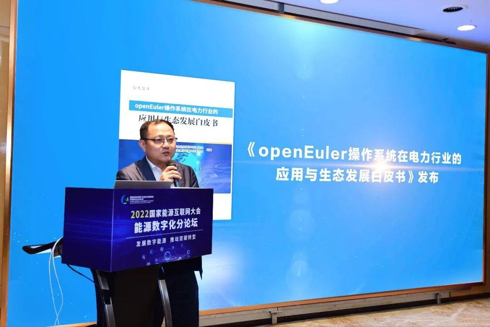

\[中国，广州，2023 年 2 月 17
日\]为积极应对能源互联网在新形势下的机遇与挑战，清华大学、中国南方电网有限责任公司、国家能源互联网产业及技术创新联盟盛大召开"2022
国家能源互联网大会"。大会现场《openEuler
在电力行业应用和生态白皮书》正式发布。

《openEuler
在电力行业应用和生态白皮书》是由中国能源研究会信息通信专业委员会组织，华为技术有限公司发起，哈工大电力系统研究所牵头主编，国网智研院、广东电网、中电普华、南瑞系统集成等行业单位，包括麒麟信安、麒麟软件、统信软件、凝思等在内的上下游龙头企业参与，共同编写。旨在促进电力行业的深化应用，赋能电力行业的安全与可持续发展。

**华为企业 BG
电力数字化军团副总裁、首席数字化转型官------夏文波**openEuler操作系统是面向数字基础设施的开源操作系统，支持服务器、云计算、边缘计算、嵌入式等应用场景，支持多样性计算，致力于提供安全、稳定、易用的操作系统。通过为应用提供确定性保障能力，支持OT领域应用及OT与ICT的融合。openEuler
基于稳定的 Linux
内核，支持鲲鹏、英特尔、AMD、飞腾、申威、龙芯、兆芯等主流芯片和容器虚拟化技术，是一个面向企业级的通用操作系统架构平台。除了
Linux
内核自身的特性之外，在内核中还做了十余处创新增强，主要包括用来提升性能的进程调度优化、大页内存性能优化、
OOM 内存回收优化、XDP 网络性能优化等。openEuler
在系统高性能、高可靠、高安全等方面积累了一系列的关键技术，提供了一个稳定安全的基础软件平台，截至
2022 年底，累计装机量超 300 万套，新增市场份额从 15%增长到 25%，
按照此趋势，openEuler
在三到五年之内有望成为中国存量市场份额第一。白皮书指出：为进一步实现电力系统自主创新发展，全面启动并加强对电力系统的自主创新建设要求，需要对发电、变电、电力营销、电力装置等领域进行全覆盖

-   在发电领域，openEuler 为整套火力发电的核心控制系统 DCS
    > 系统提供稳定的运行环境，DCS
    > 平台智能分散控制系统应用在新能源能量管理系统中，实现风电场有功功率精准控制。

-   在电网调度领域，基于 openEuler
    > 技术的操作系统，结合集中运维管控平台软件，给用户提供一个集中、统一、可视化的主机运维管控平台帮助用户更加高效地批量管理所有的主机。作为电网调度系统中的关键部分，凭借高安全性、高可用性、工业互联性等优势，openEuler
    > 安全可信地承担了软硬件的稳定运行，为智能互联网业务的全面展开提供了以自主创新软件为主的基础软件平台，实现了多个行业关键业务系统自主产品突破性应用。

-   在电网输电领域，在视觉传输可靠、高效的基础上，操作系统提供远程操作实时联动能力，提高巡线效率和安全水平。

-   在电网变电领域，变电站自动化系统，通过 openEuler
    > 以及软、硬件加密技术，满足变电站自动化系统的入侵检测与漏洞发现的需求；满足自动检测系统中的异常运行情况，根据系统异常危害的不同程度自动控制系统的运行模式的需求；满足通过软硬件可靠性技术，保证变电站自动化系统软硬件在变电站复杂电磁环境运行中的长期可靠性、稳定性等需求。

-   在电网配用电领域，openEuler
    > 为新一代配电自动化系统，提供内生本质安全、云原生支持、自主平台深入优化、高性能、易管理的新一代自主服务器操作系统。

白皮书最后指出：为进一步实现电力系统自主创新发展，全面启动并加强对电力系统的自主创新建设要求，需要对电、输、变、配、调度等领域进行全覆盖。**「建议通过遵循统筹规划、分类突破、融合发展的原则，有序推进电力行业的自主创新；并建立自主创新，安全创新的行业标准，持续开发产品迭代，支持产品深度定制；鼓励建立地方性开源支持政策，政府牵头设立开源基金会制度，鼓励社会力量与政府共建公益性开源创新生态环境。通过资金补贴、包容性对创新技术进行扶植等，深化行业应用；充分发挥产学研的协同价值，共同打造
openEuler 产业人才高地。」**

**点击下载《openEuler 在电力行业应用和生态白皮书》**
