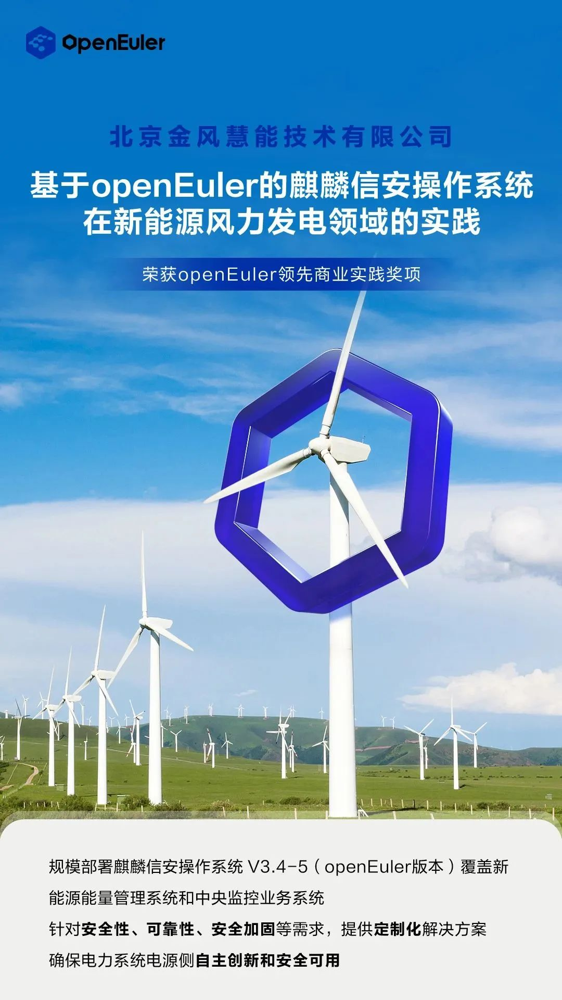

能源安全与信息安全，是国家安全的重要组成部分。在构建以新能源为主体的新型电力系统中，从软件层面保障能源安全是重要课题。

2017
年，为防止有黑客或恶意代码对包括风电、光伏在内的电场能量管理系统和中央监控系统进行攻击，以至引发电网波动和能源安全问题，相关部门发出政策要求，凡是新并网的电场，必须使用自主创新的操作系统。

由此，我国电力系统应用自主创新操作系统的时代全面到来，基于 openEuler
研发的麒麟信安操作系统开始在风电行业得到广泛应用。凭借麒麟信安操作系统安全、稳定、可定制、兼容多样性计算硬件等优点，麒麟信安在风电行业率先布局并快速占领市场。

中国风电龙头金风科技旗下全资子公司------北京金风慧能技术有限公司（以下简称"金风慧能"）是新能源后市场服务完整解决方案提供商，其所建设的
SOAM 智慧运营系统，管理着全球超过 120GW
新能源资产。金风通过调研测试，选择麒麟信安成为其自主创新操作系统采购的首选供应商。

麒麟信安之所以能够取得这般成绩，作为数字基础设施开源操作系统的 openEuler
提供的支持功不可没。

"我们从 2019 年起以 openEuler
作为根社区，推出商业化产品，如今已取得了非常好的成绩，后续我们将继续携手
openEuler，一同建立更加繁荣的生态。"麒麟信安电力技术解决方案部总经理杨振午对华夏能源网（公众号
hxny3060）说道。

## 自主创新的操作系统标杆

基于 openEuler
开发的麒麟信安操作系统在风电行业大受欢迎，与其优秀的综合实力密不可分。

在相关方面明确要求电力系统全面使用自主创新的操作系统之前，我国风电行业使用的操作系统所适配的一般都是国外的生态环境。在此背景下，我国风电运营商想要实现自主创新，便产生了三个大难题。

首先是市面上存在的操作系统是否能够满足国家对于安全的要求；其次是能否兼容多样性的服务器硬件以及应用软件；最后是稳定性是否不比从前差甚至要更好。

金风慧能在使用欧拉操作系统前，同样遇到了这三个问题。为此，金风慧能对当时主流的国内操作系统厂家进行了大量调研与产品测试，最终选择了基于
openEuler 开发的麒麟信安操作系统。

"选择麒麟信安主要有两方面原因，首先是自主创新的操作系统安全层面能够得到保障，其次是服务体验比较好。我们花了很少的精力和代价，就完成了切换操作系统的兼容适配工作，这方面我们特别满意。截止到现在，我们部署基于
openEuler 的麒麟信安操作系统超 6000
套，覆盖新能源能量管理系统、中央监控、功率预测、集控等业务系统。"金风慧能解决方案中心副总经理马辉对华夏能源网（公众号
hxny3060）说道。

正如马辉所言，基于 openEuler
的麒麟信安操作系统最大的特点便是安全、兼容性高以及稳定、可定制，这是使用了该操作系统的风电运营商都可以感受到的。

在安全方面，麒麟信安支持可信计算技术，结合 TCM
可信芯片，实现了软硬一体可信度量，同时以等保 2.0
和四级安全技术要求为标准，实现了三权分离机制和安全策略，对每个管理员的权限进行了细粒度划分和严格的访问控制，提高了系统的安全性。

"国家能源局、电网、发电企业，一直不断提高对于信息安全的要求，电网每年也会举行攻防演练，麒麟信安这套系统可以针对满足国内电力系统的要求，以及安全性、可靠性、安全加固等需求，持续提供定制化解决方案，始终经得起考验。"马辉表示。

在兼容性方面，目前基于 openEuler
的麒麟信安操作系统已适配完成飞腾、鲲鹏、兆芯等多款国内主流芯片，同时与主流的服务器硬件厂商皆建立了互认证兼容适配途径，并已在部分新能源风电场站验证推行了软硬件全自主创新的项目方案，助力电力行业的数字化转型和生态繁荣。

在稳定可靠方面，基于 openEuler
的麒麟信安操作系统提供了掉电保护、备份与还原等可靠性技术手段。帮助硬件设备实现免维护，提高风场运营效率，即使遭遇病毒攻击或人为破坏（包括误操作）造成系统损坏，都可以通过重启选择一键还原，快速恢复。

在可定制方面，麒麟信安操作系统除了可以根据客户实际业务需求进行应用层面的定制以外，还可根据特殊硬件外设进行驱动定制、根据业务要求进行裁剪定制、根据安防要求进行安全加固定制、根据图像
UI 要求进行人机界面定制、根据业务代码接口需求进行 API 及 ABI
接口定制等。

正是凭借这几大优势，基于 openEuler
的麒麟信安操作系统让包括金风慧能在内的风电运营商从"必须用"变成了"愿意用"，麒麟信安操作系统在风电领域累计部署装机量超过
2 万套的非凡成绩。

## 幕后功臣 openEuler

如果问麒麟信安操作系统为何能够如此安全，并具备诸多优势特点？就不得不提幕后功臣------面向数字基础设施的开源操作系统
openEuler。

openEuler 最早诞生于 2010
年，华为开始研发自己的操作系统，主要用于内部的产品和服务。2019 年 12 月
31 日，华为作为创始企业发起了 openEuler
开源社区，将自己在操作系统上积累了十余年的能力全部开放。至此，openEuler
便成为了操作系统领域知名的根社区之一。

所谓根社区，指的是从 Linux kernel
和其他开源组件构建，不依赖上游发行版，有大量的外部个人贡献者与企业参与共建的开源社区。国内的操作系统厂商加入
openEuler
根社区，能够有效推出自主创新，且持续演进的操作系统，解决"卡脖子"问题，进而在信息安全层面获得更好的保障。

2019 年开始，麒麟信安以 openEuler
为根社区，开始研发国内风电操作系统商业化版本。其结合新能源风电监控管理等方面的国产化要求，进行了深度定制开发，适配了各类国内的硬件平台和应用开发平台，并进行了针对安全性、可靠性、安全加固等一系列精细化定制工作。

最终，麒麟信安实现了电力系统电源侧的操作系统自主创新和安全可用等建设目标，进而成为了风电行业进行安全可靠操作系统整改的最佳选择，广泛应用于风电领域的新能源能量管理系统、新能源中央监控系统等核心生产系统。

在此基础上，如今麒麟信安仍在对 openEuler
进行深入挖潜，不断推出更多功能与版本的操作系统。

"麒麟信安操作系统已将供应链切换到 openEuler，共享 openEuler
生态。"杨振午对华夏能源网说道。

值得一提的是，在与 openEuler
根社区进行密切合作并不断取得成果后，当前无论金风慧能还是麒麟信安，都非常热衷于普及和推广
openEuler 这一坚持根技术创新的开源操作系统。

两家公司积极参与欧拉商业发行版组织的各项品牌及推广活动，为操作系统产业峰会、openEuler
meetup、openEuler Developer
Day、湖南欧拉生态大会等活动贡献案例及使用体会。

"我很看好 openEuler 的未来。openEuler
一开始推出的时候，定位是服务器操作系统，如今 openEuler
已从服务器操作系统升级为数字基础设施的操作系统，这意味着它拥有了两个特性，一是支持多样性计算，二是支持数字化全场景。就此而言，openEuler
的想象空间变得更大了，可以为更多行业带来更多价值。"杨振午表示道。
