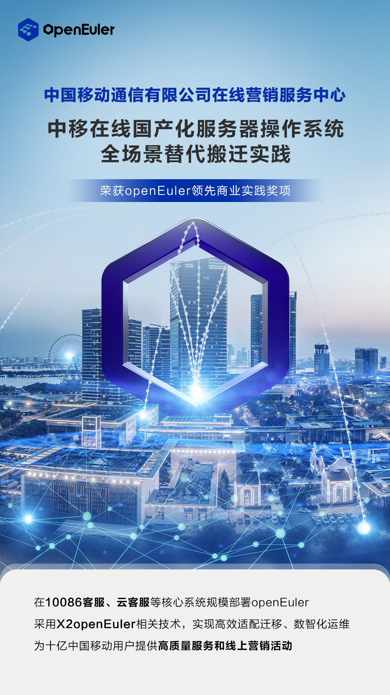

中移在线携手openEuler，斩获"2022年度十大openEuler领先商业实践"奖

2022 年 12 月 28-29 日，以"立根铸魂
崛起数智时代"为主题的操作系统产业峰会在线上举行。本次大会评选出"2022
年度十大 openEuler
领先商业实践"奖，中国移动在线营销服务中心的"中移在线国产化服务器操作系统全场景替代搬迁实践"获奖，展示了中国移动基于
openEuler 的国产化操作系统的领先性。

## 中移在线数智化转型为何首选 openEuler

中国移动在线营销服务中心中国移动通信集团公司的专业机构，近两年围绕中国移动"5G+算力网络"能力升级总体要求，立足"线上渠道的生产运营者、在线服务的全网提供者、全网生态合作运营的支撑者、智能化营销服务能力的构建者"等新四者的定位，积极开展数智化转型升级，推动中国移动营销服务体系改革开启新征程。依托数字化、云化、智能化的服务营销能力，中移在线实现热线与互联网融通，多媒体智能交互应用；构建起全国一体化线上运营能力，支持数万客服云上生产。已将数智化的营销服务能力产品化，赋能社会千行百业助力经济社会发展。

在数智化转型的同时，为了保障业务安全和可持续性，中移在线持续开展软硬件的全栈自主可控创新。硬件方面，开展多样性算力创新部署，当前生产环境已经部署鲲鹏服务器
1000
余台；软件方面，操作系统作为基础软件是业务系统的底层核心，需要首先保障安全可靠和自主可控，确保遇到风险时，关键信息不泄露、实时数据服务不中断。国内软件系统经过几年的发展，不仅在技术上不逊于国外软件，而且已形成了相对成熟的产业生态。中移在线结合自身需求和外部环境变化，选择了国内根社区操作系统
openEuler 构筑业务底座，以保障业务的安全可靠。

---

## 成功规模迁移，成为行业创新实践新标杆

自 openEuler 社区创立以来，中国移动深度参与社区建设，累计贡献补丁超过
130
个，同时与社区在内核、虚拟化、安全、容器等领域开展联合创新，进行了多项新技术的研究与开发。

2021 年，中移在线就以 openEuler
作为主要技术路线，与社区联合创新，开展操作系统自主可控迁移试点工作。中移在线成立操作系统自主推进联合项目组，基于
openEuler 操作系统+鲲鹏 ARM 服务器+openGauss
数据库，以在线营服数据处理平台为试点业务开展全栈自主可控落地实践。经过 3
个月的联合攻关，解决问题 20
余项，最终在业务无中断的情况下完成在线营服数据处理平台 230
台服务器的操作系统试点搬迁。试点成功后，中移在线以"全面适配、有序迁移、随时切换"为原则全面启动业务系统
openEuler 适配迁移工作。自 2022 年 10 月份起，新建业务已全部使用
openEuler 操作系统，并完成 214
个应用的适配和部分搬迁，期间各系统均未出现因迁移导致的系统故障。并积极参与欧拉社区迁移工具套件共建，实现了软件、硬件、操作系统配置一键兼容性评估，实现迁移工具
x2openEuler、智能调优引擎、内核热补丁技术等技术在中移在线的落地应用，提升迁移效率
50%。openEuler 适配迁移后，大数据、容器云等业务迁移后性能整体提升约
5%，稳定运行 300 余天，目前中移在线的 10086
客服系统、智能化应用、众包外呼系统和互联网营销系统等核心业务均已在使用
openEuler 承载，截止 2022 年 12 月底累计部署超 18000
套，为十亿移动用户提供高质量服务。

通过 openEuler
的应用落地，中移在线初步实现了核心服务器操作系统的自主可控应用能力，避免服务器操作系统停服带来的供应链风险和网络安全风险的能力，搬迁实践也在中国移动集团内部和行业中成为创新标杆，获得了《人民邮电报》强基铸魂卓越创新
2021 年度"ICT 优秀案例"、中国软件测评中心"2021
年服务器操作系统创新应用卓越奖"和操作系统产业峰会"2022 年度十大
openEuler 领先商业实践"奖。

---

## 携手 openEuler 共赢合作，未来可期

基于目前成功的实践经验，按照"全面适配、能替尽替"的原则，中移在线计划持续开展操作系统自主可控替代搬迁工作，2023
年全年计划完成 75%存量业务的服务器操作系统的迁移，2024 年二季度
100%迁移替换。鉴于在 openEuler
上的成功实践，中移在线更是坚定了拥抱开源的决心，后续将与欧拉社区展开全面深入合作。

一是在全栈自主创新方面，将打造基于鲲鹏+openEuler+自研的 5G
视频客服、云客服，夯实客服系统自主创新基础，从硬件到操作系统、应用软件，做到全栈最优。

二是在多场景创新方面，将与社区开展深度合作，在基础软硬件高效适配、业务高质量搬迁、操作系统智能运维等方面开展联合创新，助力行业内规模应用。

三是在开源合作方面，坚持开源理念，结合业务场景持续引入开源，积极加入开源社区，反哺开源，共同提升行业技术水平。

中移在线与 openEuler
的成功合作，不仅为自己成功升级在线系统，更是在业界起到良好的示范作用。正如中国移动副总经理高同庆在
2022 年 12 月 28
日操作系统产业峰会上所指出的，中国移动选择欧拉技术路线，与 openEuler
社区共同开展全场景联合创新，共同打造合作共赢的操作系统开放生态，推动国产操作系统蓬勃发展，促进欧拉操作系统在更广范围、更深程度、更多领域应用，以安全稳定的能力赋能数字经济，助力网络强国、数字中国战略建设。
