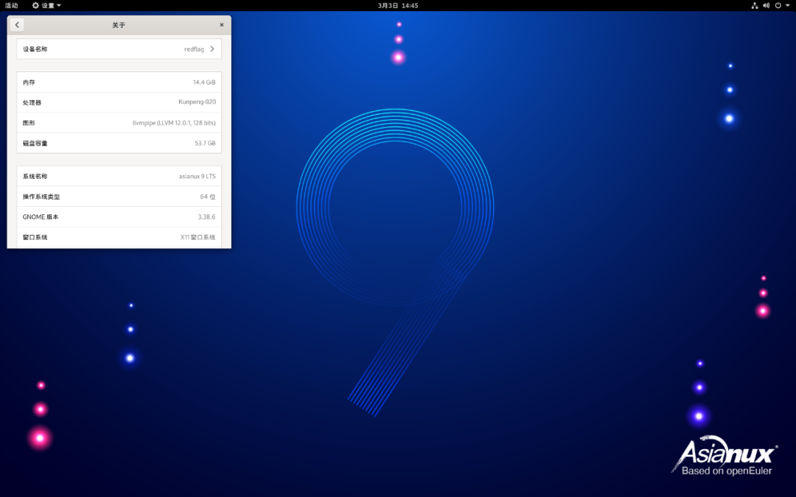

近日，中科红旗（北京）信息科技有限公司正式发布基于openEuler 22.03
的红旗Asianux服务器操作系统9.0商业发行版。该版本支持支持
AArch64、X86_64等国际国内主流处理器架构，能够充分释放计算芯片的潜能，适用于数据库、大数据、云计算、人工智能等应用场景。

**红旗Asianux服务器操作系统9.0预览图**

红旗Asianux服务器操作系统9.0在openEuler
22.03基础上，集成了包括红旗Asianux软件包安装器、红旗系统组件管理、系统任务计划管理工具、日志浏览和管理、系统服务管理及系统性能优化和监控等在内的红旗Asianux服务器操作系统前序版本的有益特性及创新组件，在保证服务器操作系统稳定、安全的使用前提下，全面提升系统效能。**关键特性包括**：

-   国密全栈支持：支持SM2、SM3、SM4国密算法；

-   Linux Kernel
    5.10内核：深度优化调度、IO、内存管理，提供Arm64、x86更多算力支持。允许内核动态切换抢占，降低大页管理自身内存占用，加速映射大块内存的速度，减少云原生容器实例锁竞争，提升系统性能；

-   内存分级扩展：支持多种内存、存储介质扩展系统内存容量，降低内存使用成本；

-   secPaver安全策略开发工具：根据策略配置文件内容生成SElinux策略文件；

-   QEMU热补丁机制：支持libcareplus热补丁机制，提供一种在线修复进程bug的技术；

-   用户态协议栈：实现支持无锁、多线程的高性能用户态协议栈，加速应用程序的网络性能；

中科红旗积极践行党和国家对切实加强基础研究，夯实科技自立自强根基的要求，以构建良好的自主操作系统软硬件生态体系为目标，将中科红旗及openEuler等重要社区的软硬件技术有机地、系统地、全面地整合在一起，为国产化替换过程中的企业级客户多场景需求提供一体化的自主数字化转型解决方案。

openEuler 是由开放原子开源基金会（OpenAtom
Foundation）孵化及运营的开源项目，主要参与方包括华为、中科院软件所及以中科红旗为代表的自主软硬件厂商和全球开源贡献者。

更多信息请访问openEuler官网：

https://openeuler.org/zh/
