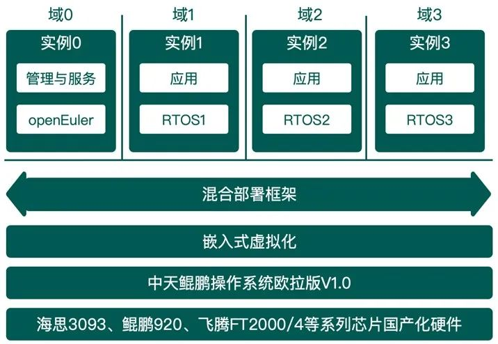

近日，成都菁蓉创联科技有限公司（简称"菁蓉联创"）正式发布了中天鲲鹏操作系统欧拉版。它基于openEuler开源操作系统，并在其基础上增加自主创新特性和嵌入式场景优化，相较于传统的桌面操作系统，中天鲲鹏操作系统欧拉版广泛应用在远程通信、工业控制、物联网、航空航天等嵌入式领域，为企业级用户构建基于openEuler的基础软件数字底座。

# 产品介绍

中天鲲鹏操作系统欧拉版是一款适用于多种处理器架构和硬件平台的嵌入式操作系统，可以在海思3093系列、鲲鹏920系列、飞腾FT2000/4等国产芯片上运行，并提供良好的性能和功能支持。

中天鲲鹏操作系统欧拉版的嵌入式应用场景

**在嵌入式系统中的优势**

中天鲲鹏操作系统欧拉版具备实时性、安全性、可靠性、易用性等产品特性，在嵌入式应用场景中具备如下优势：

-   **实时性**：通过实时调度技术，通过混合部署方式实现内核实时域扩展，保证嵌入式场景的实时性。

-   **安全性**：提供多层次的安全机制，包括堆栈保护、进程隔离、文件系统加密等，可以有效保护嵌入式系统的安全性。

-   **可靠性**：支持面向业务的冗余部署，在线更新，健康监控、虚拟化隔离技术等功能。

-   **易用性**：基于openEuler操作系统构建，紧跟社区不断优化与升级，具备良好的中间件和业务软件的兼容性，已经适配多款国产化硬件平台，并提供集成开发环境及配套研发工具支撑，提供智能化基础库平台。

# 典型场景

-   **IoT设备互联**：支持在低功耗的嵌入式设备上运行，例如无人机、无人狗、无人车、轻量化终端等，可以通过中天鲲鹏操作系统欧拉版的物联网协议栈，实现设备之间的通信与数据传输。

-   **控制及通信系统**：支持多种硬件平台和处理器架构，可以应用于控制系统与通信系统中。通过实时调度技术及虚拟化混合部署技术，保证系统的稳定性和实时性，支持轻量化容器部署、网络协议组件等。

-   **航天载荷系统**：在卫星载荷中，保证系统的安全性和可靠性，同时需要支持抗辐照硬件平台和处理器架构，具备可移植性、遥测遥感、软件动态重构、可靠启动等功能。

-   **智能终端系统**：与国产GPU、NPU厂商协同，在嵌入式显示类终端、机器视觉（CV）、AI推理、边缘计算等场景提供深度学习与智能决策的基础平台。

# 商用案例

**某通信设备模块**：用于嵌入式通信场景，CPU采用国产化芯片，搭载openEuler定制版，配合国产化FPGA的高速处理能力，实现通信数据的高速转发处理，为特种装备提供高速稳定的国产化数据传输链路平台。

本项目采用"中天鲲鹏操作系统欧拉版V1.0"方案，实现全国产化通信模块平台，在openEuler上部署高速DPDK转发协议，并适配到国产飞腾处理器，以及打通国产FPGA的PCIE数据通道。是openEuler又一个典型商用示范，实现商用规模发货。

# 关于菁蓉创联

菁蓉联创是一家以国产基础软硬件定制开发为核心技术的高科技企业。公司研发团队具备核心竞争力，主要成员具有十年以上操作系统研发经历，团队专注国产基础软硬件研发，已针对不同架构的国产芯片形成完整、稳定的系统解决方案，产品性能优异，极具竞争优势，可实现对国外同类产品的替代。

公司产品已应用在国防信息化、国家电网、商业航天等国家核心领域，产品安全性、可靠性、稳定性、兼容性获得实践检验。公司是全国信创工委、WG27嵌入式操作系统组、全国信标委操作系统标准工作组成员单位，软件定义卫星联盟理事单位，华为欧拉生态伙伴企业。通过了高新技术、专精特新等企业认证，是四川省科技厅操作系统方向重大专项牵头单位，公司被评为"四川省最具核心竞争力软件企业"，嵌入式操作系统产品被评为"成都软件20年影响力优秀软件"，公司积极参与基础软件生态共建，努力成为基础软件生态发展的积极推动者和重要的贡献者，将持续保持openEuler开源社区贡献建设。

