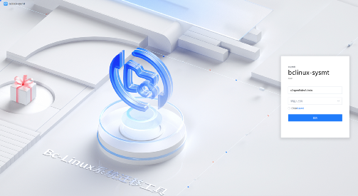
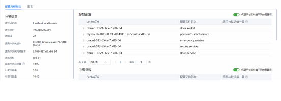
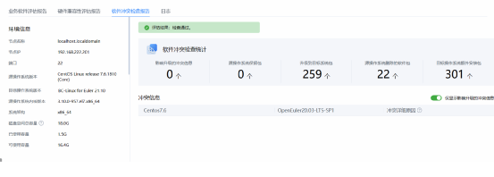
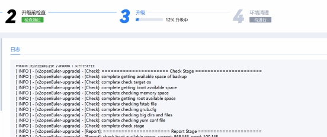
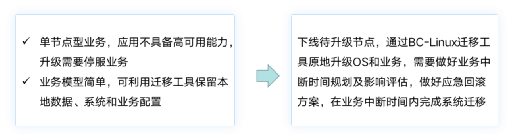
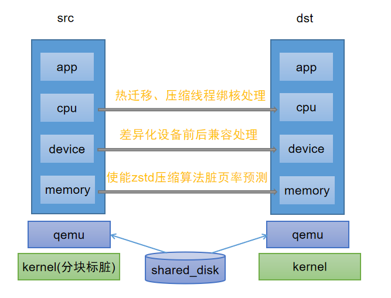
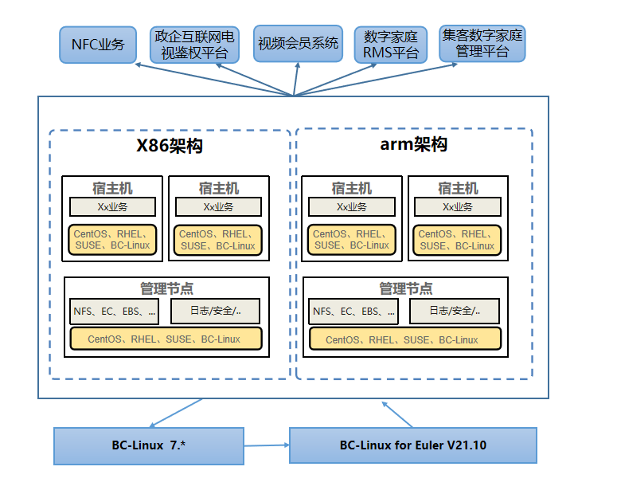

## 背景

随着 CentOS 系列版本停服时间临近，现有 CentOS
以及衍生版用户面临业务中断、安全漏洞等诸多安全风险，此外随着软硬件产品的更新换代、操作系统版本生命周期演进，操作系统迁移替换也将成为一项常态化工作，如何高效将非自主可信操作系统平滑迁移至安全稳定、自主可靠的操作系统，且最大程度降低迁移对于业务的影响，是当前用户面临的一大难题。

## BC-Linux 迁移工具

为应对 CentOS
停服带来的安全风险和降低系统迁移成本，解决客户升级操作系统过程中人工投入大、准确率低、无法批量化处理导致整体效率低下的痛点，移动云操作系统研发团队正式推出了
BC-Linux 迁移工具，助力用户业务实现端到端的一站式迁移。

BC-Linux 迁移工具是一款基于欧拉社区 x2openEuler
工具深度定制开发的迁移工具套件，具有批量化原地升级能力，当前支持将
BC-Linux、CentOS 和 RHEL 7 全系列升级至 BC-Linux for Euler
版本，支持命令行和图形化两种操作模式，提供迁移原子化能力，支持容器、虚拟化及大数据等复杂应用场景。

BC-Linux
迁移工具提供简单易用的操作界面，可以批量添加待升级节点进行迁移分析，对已适配的待升级节点批量升级，将繁琐的搬迁迁移过程简化，实现业务"便捷、平稳、高效"的迁移。

### 特性介绍

BC-Linux
迁移工具可以最大程度保留原有业务和配置不变，相比重新安装模式在小版本迭代时升级耗时较低，自动化程度高，可应用于多版本内核并存场景，兼容性和可靠性更强，主要提供如下特性：

信息收集：支持收集用户环境数据并生成配置文件，支持收集 systemd
服务、内核参数、网络配置和磁盘挂载配置等信息。

迁移评估：对待升级节点进行硬件，软件兼容性评估，分析待升级节点硬件与目标系统的兼容性的同时，也会对当前系统内的所有软件进行分析评估，并输出整体评估报告。

迁移实施：经过迁移工具评估兼容的节点，可以在原有环境下使用工具进行原地升级，完成
    BC-Linux、CentOS、RHEL 操作系统迁移到 BC-Linux for Euler 版本。

结果报告：给出整个迁移过程中，系统信息、软件包对比、系统配置修改等信息。

### 应用场景

BC-Linux 迁移工具在原地迁移和滚动迁移场景中均可使用，用户可使用 BC-Linux
迁移工具对业务软件兼容性进行评估，根据业务需求选择不同的搬迁策略：

原地迁移

滚动迁移

## 最佳实践

当前 BC-Linux
迁移工具已适配移动云弹性计算、裸金属、块存储、文件存储、容器服务等核心产品，并完成在移动云现网成功试点，此外也在省节点资源池上规模应用，**「迁移工具累计通过了数十个系统版本和上百个业务模拟场景下的测试」**，保障全场景业务"便捷、平稳、高效"的迁移：

-   通过 BC-Linux
    迁移工具迁移评估功能，**「对待升级节点的硬件、软件、配置信息进行「全方位的」分析」**，具体包括业务软件接口变化、业务软件包依赖关系变化、硬件兼容性、系统配置差异等信息，保障业务平滑迁移。

-   将 BC-Linux
    迁移工具命令行版与现网运维作业平台的深度集成，利用迁移工具的升级、备份、恢复、配置迁移等原子化能力，**「实现原地升级过程中「自动化编排流程」，助力上层业务平稳高效迁移」**。

-   通过 BC-Linux
    迁移工具迁移实施功能，实现操作系统一键式原地升级，最大程度地保留了原有业务和系统的配置，**「业务无需重新部署，迁移时间控制在
    1 小时内，提高迁移效率
    300%以上」**。无需扩容更多备机，直接利用现有服务器资源，大幅降低了迁移成本。

其中，在移动云业务迁移工作开展过程中，移动云操作系统研发团队针对云主机热迁移成功率进行了专项攻关，解决了多项虚拟化热迁移难题，**「提升热迁移效率
30%「，迁移成功率达到」95%以上」**：

-   **「热迁移效率提升」**：通过并发迁移提升整体迁移速度，使用 zstd
    压缩算法，减少数据传输量，缩短单个虚机迁移时间，有效提升热迁移效率。

-   **「热迁移线程绑核」**：将迁移和压缩线程绑定至空闲物理核，保证迁移和压缩线程不会和
    vcpu 线程争抢 cpu
    资源。降低数据传输的带宽抖动，使得迁移和压缩线程能高效平稳运行。

-   **「热迁移脏页率预测」**：对于高脏页率的虚机，根据内存监控的脏页率预测数据，可在脏页率预测值不高时再迁移，进一步提升了热迁移成功率。

2022 年 12
月中国移动某省节点资源池开展操作系统迁移替换工作，部署的原操作系统为
BC-Linux V7，覆盖中国移动
NFC、视频会员、数字家庭等业务，目标是全部迁移至 BC-Linux for Euler
版本。自迁移实施工作开展 2
个月以来，移动云操作系统研发团队与省公司业务团队、运维团队紧密配合，先后解决驱动适配、内核异常报错、系统无法启动等多个技术难题，并通过
BC-Linux 迁移工具成功迁移
2k+节点。本次迁移后业务稳定运行，为后续大规模迁移奠定了坚实的基础。

## 未来规划

移动云自加入 openEuler
社区以来，移动云操作系统研发团队一直积极与社区进行合作，先后加入虚拟化、内核、兼容性等多个
SIG 组，收获核心 SIG 组 2 位 Maintainer，贡献补丁
130+，未来移动云将继续携手 openEuler 社区，共同完善 BC-Linux
迁移工具能力，丰富健康巡检模块和性能基线检查能力，完善支持更多源 OS
升级功能，打造具备更多迁移路径迁移、易用性更强的迁移工具，同时，围绕虚拟化、内核、安全、迁移等维度，深化联合创新，共筑移动云新一代算网基座。
